# HOWTO Basic Setup Guide

-----

**NOTE:** This guide follows KB article -- First Steps with IGEL OS 11 and adds optional IGEL Cloud Gateway (ICG) setup.

[IGEL KB - Overview: First Steps with IGEL OS](https://kb.igel.com/igelos-11.08/en/overview-first-steps-with-igel-os-11-63802221.html)

-----

## Your setup can be divided into five sections:

1. Install IGEL OS on an Endpoint
2. Install the Universal Management Suite (UMS)
3. Register Your Endpoints with the UMS Server
4. License Your Endpoints
5. Optional: Setup IGEL Cloud Gateway for Managing External Endpoints

-----

## Install IGEL OS on an Endpoint

Before you install IGEL OS, you must choose the hardware endpoint IGEL will install/run on. You can do this in one of four ways:

1. Repurpose your existing hardware. IGEL can convert x86 CPU endpoints you already own.
2. Purchase new 3rd-party hardware and install IGEL OS on it. Some hardware vendors can install IGEL OS at factory for you.
3. Purchase IGEL hardware. We offer endpoints for a variety of use cases.
4. Purchase a UD Pocket from IGEL. These keychain-sized USB sticks can be plugged into an x86 computer and booted straight to IGEL OS.

**NOTE:** Regardless of which hardware you choose, you will need to place a demo license on the endpoint once IGEL OS is installed! The last step of this guide will tell you how!

### Option 1: Repurposing Existing Hardware with IGEL OS

If you have old hardware that still has life in it, and it has an x86 architecture CPU, you can likely repurpose it by installing IGEL OS over the top of whatever OS it’s currently using. Here’s how you do it:

-	Create an IGEL OS-formatted USB stick to convert your endpoint.
-	Convert the target endpoint

### Create an IGEL OS formatted USB stick to convert your endpoint

- [OS 11 - Download the OSC (OS Converter) software here. (Choose the latest version)](https://www.igel.com/software-downloads/workspace-edition/)
- [OS 12 - Download the OSC (OS Converter) software here. (Choose the latest version)](https://www.igel.com/software-downloads/cosmos/)
- Insert a spare USB stick. We recommend 4GB or larger.
- Unzip the OSC file you downloaded and run Preparestick.exe.

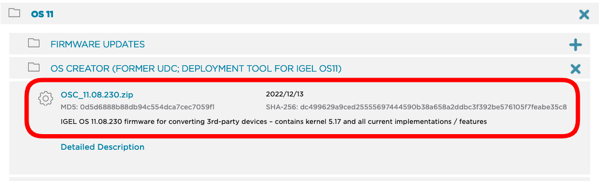

**NOTE:** Target only the drive where the USB stick is mounted. This will destroy all data on the USB stick!

**ADDITIONAL NOTE:** Some USB sticks may conflict with the preparestick.exe utility. If this happens, we recommend using Balena Etcher to format the USB stick instead of Preparestick. [You can download Etcher here](https://www.balena.io/etcher/). When you run it, choose the .iso file from the unzipped OSC download folder and target your USB stick.

-	Allow the wizard to format the USB stick, following the prompts.
-	You can also [watch this tutorial video on how to create an OSC USB](https://www.youtube.com/watch?v=4hEokxorLUQ).

### Convert the target endpoint

#### Common Boot Keys

| Vendor | Boot Key |
|--------|----------|
| Dell   | ++f12++     |
| Dynabook   | ++f2++     |
| HP     | ++f9++      |
| IGEL   | ++delete++     |
| LG     | ++f10++      |
| Lenovo | ++fn+f12++ |
| Microsoft | [Steps to setup](https://kb.igel.com/igelos-11.08/en/ud-pocket-breaks-microsoft-surface-63804118.html) |

-	Plug the formatted USB stick into the target endpoint to be converted. Boot from USB and follow the prompts. 
-	[OS 11 - A full walkthrough of the installation options can be viewed on the IGEL KB here](https://kb.igel.com/igelos-11.08/en/installation-procedure-63805133.html)
-	[OS 12 - A full walkthrough of the installation options can be viewed on the IGEL KB here](https://kb.igel.com/howtocosmos/en/installing-the-base-system-via-igel-os-creator-osc-77865870.html). Choose the options best for you.
-	Once completed, remove the USB stick and reboot. IGEL OS should launch to the Setup Assistant wizard. [See a tutorial video for installing IGEL OS here](https://www.youtube.com/watch?v=w-EMUDS5Tb0).

### Option 2: Purchase New 3rd-Party Hardware and Install IGEL OS 

If you don’t have existing hardware you want to convert, and you’re looking for something new, IGEL can install on most x86 architecture hardware in the market. There are two principal ways to approach the purchase of new hardware to run with IGEL OS:

1. Purchase hardware listed on the IGEL Ready Showcase.
2. Purchase untested x86 hardware and test it.

[The IGEL Ready Showcase](https://www.igel.com/ready/showcase-categories/endpoints/) is a listing of 3rd party OEM devices which have been formally tested to run IGEL OS. It provides you with a level of assurance that the device you order is going to work well with IGEL software. Most IGEL Ready hardware can also be ordered from factory with IGEL OS preinstalled.

You can also visit the IGEL website to see [a list of common endpoints](https://kb.igel.com/hardware/en/supported-devices) which have been qualified by IGEL.

If a device does not appear on either the IGEL Ready Showcase or the IGEL list of approved devices, that does not mean it won’t work with IGEL - it just means you should test it first. IGEL will run fine on most x86 devices that meet the [minimum requirements](https://kb.igel.com/hardware/en/devices-officially-supported-by-igel-os-12-81496425.html)

### Option 3: Purchase a UD Pocket from IGEL

The [UD Pocket (UDP)](https://kb.igel.com/hardware/en/ud-pocket) is a keychain-sized USB drive that comes preloaded with IGEL OS. You can plug it into an x86 device that meets the minimum requirements and boot from USB to access the same IGEL OS experience you’d get if you converted the device. The difference? The UD Pocket is portable and preserves the underlying OS on the hardware you plug it into, making it the perfect BYOD solution.

Once you’ve chosen your hardware and installed or booted IGEL OS on it, you are now ready to install the UMS server and put a Demo License on your IGEL endpoints!

-----

## Install the Universal Management Suite (UMS)

To get the UMS up and running, you can divide the work into these main sections:

1. Prepare the Server
2. Install the UMS Software
3. Configure UMS Network Ports

#### UMS Supported Environments (64 bit)

- Windows Server (2012, 2016, 2019, 2022)
- Ubuntu (16.04, 18.04, 20.04, 22.04)
- Oracle Linux 7
- Red Hat Enterprise Linux (RHEL) (7, 8)
- Amazon Linux 2

### Prepare the Server

- UMS can install on several 64-bit Windows and Linux operating systems.
- Ensure you’ve configured the server to meet the [minimum requirements for UMS](https://kb.igel.com/endpointmgmt-12.01/en/installation-requirements-for-the-igel-ums-77864394.html). A typical build would include 2 CPU Cores, 12 GB of vRAM, and 80+ GB of disk space.
- The UMS can be installed on-prem or in the cloud (Azure, AWS, Hosting Providers, etc.) on a physical or virtual machine.

### Install the UMS Software

[Download the latest UMS software here](https://www.igel.com/software-downloads/workspace-edition/). Go to Universal Management Suite > Windows or Linux and download the latest release. Copy the setup file to your prepared UMS server. 
Execute the setup file and follow the installation wizard. The default settings should be fine.

The Installation Wizard will cover the following setup items:

-	End User License Agreement
-	Target directory for installation (default recommended)
-	Select Components (defaults recommended – this will install the UMS software, embedded database, Java console and web console)
-	Superuser account creation (This is the default administrative account to UMS – please save it somewhere safe! You will be able to add your AD accounts to UMS later. [You can also change the superuser credentials via UMS Administrator](https://kb.igel.com/endpointmgmt-12.01/en/changing-the-ums-superuser-77865352.html), which is a separate application from the UMS Console.)
-	UMS data directory (default recommended)
-	Start menu folder (default recommended)
-	Network Ports (UMS will do a port check and open required network ports on the local server for you if you allow it)

Expect the installation to take about 5 minutes to finish. When the installation is done, the default option to start the web console will appear.

Because the web console is still an early feature set, we recommend you uncheck the box to launch the web console and instead use the Java console, which will show up as an icon on the desktop. The web console will be covered in another document. 

### Configure UMS Network Ports

The UMS Installation Wizard will give you the option to open required [network ports](https://kb.igel.com/endpointmgmt-12.01/en/igel-ums-communication-ports-77869550.html) on the virtual machine where the UMS is installed. You may also need to allow exceptions if you are running any network security software. Below is a diagram and explanation of the basic ports you need to open to ensure all UMS components can communicate properly:

- Legend

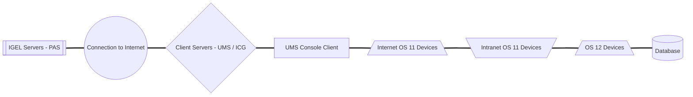

- OS 11 and OS 12

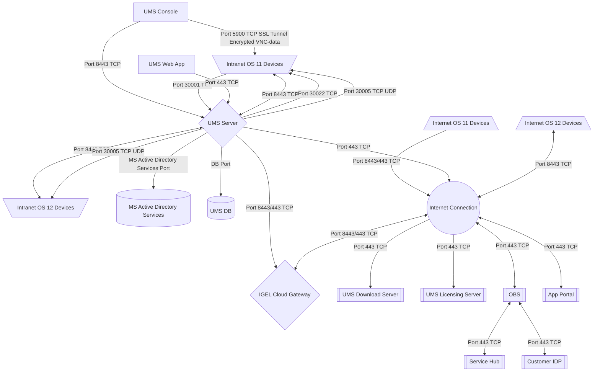

- OS 12 (No OS 11; No ICG; No OBS)

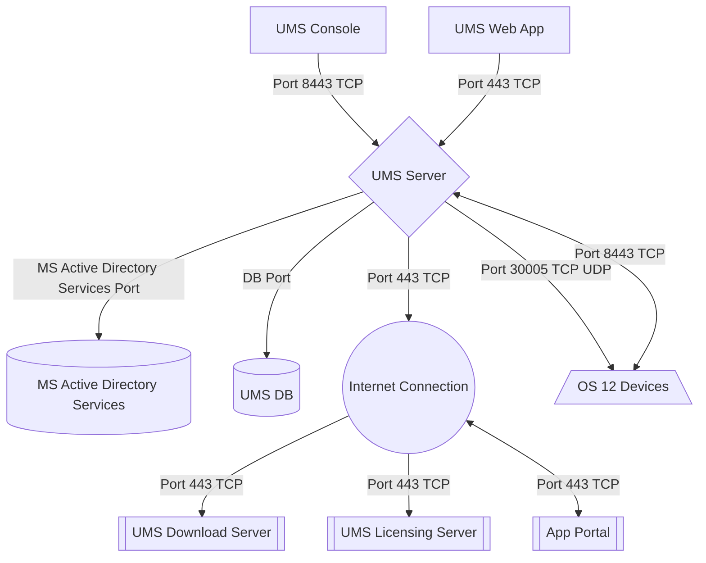

- OS 12 (No OS 11; No ICG; OBS; IDP)

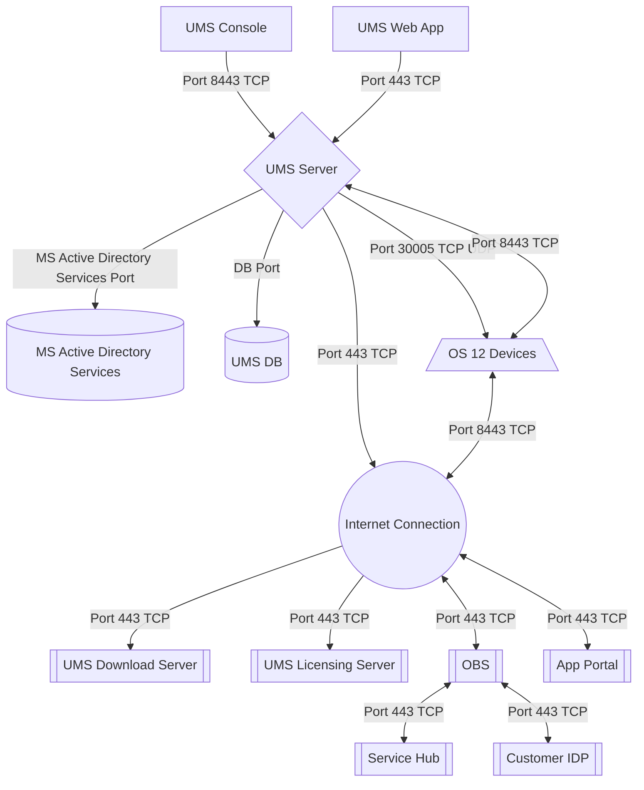

<!---
- OBS sequence for registering an OS 12 device

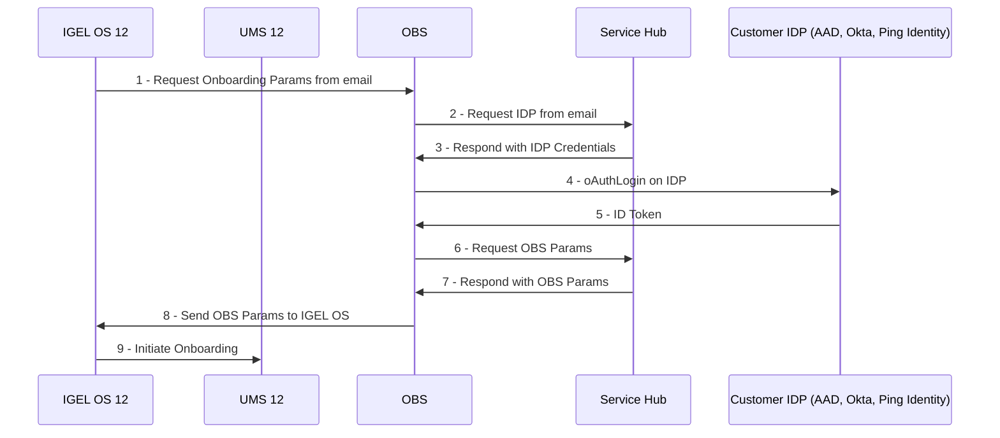
-->

#### IGEL OS 12 Devices

- Port 8443 (TCP) Incoming / Outgoing
- Port 30005 (TCP/UDP) Incoming (Intranet discovery)

-----

**NOTE:** The Unified Protocol is used for all communication between the UMS and OS 12 devices. This single path of communication is now accomplished with a WebSocket connection, enabling persistent, bi-directional, full-duplex TCP connectivity between UMS 12 and OS 12 devices.

-----

#### IGEL OS 11 Devices

- Port 5900 (TCP) Incoming
- Port 30005 (TCP/UDP) Incoming
- Port 30001 (TCP) Outgoing
- Port 8443 (TCP) Incoming / Outgoing
- Port 30022 (TCP) Incoming

#### UMS Console

- Port 5900 (TCP) Outgoing for invoking VNC session
- Port 8443 (TCP) Outgoing

#### UMS Server

- Port 443 (TCP) Outgoing
- Port 8443 (TCP) Incoming / Outgoing
- Port 30001 (TCP) Incoming

#### UMS Server 1+n with Loadbalancer on same server

- Port 30002 (TCP)

#### Microsoft Active Directory Services

- Active Directory Kerberos: Port 88 (TCP/UDP) Outgoing
- LDAP: Port 389 (TCP) Outgoing
- LDAPS: Port 636 (TCP) Outgoing

#### UMS DB

- Microsoft SQL: Port 1433 (TCP) Incoming
- Oracle: Port 1521 (TCP) Incoming
- Apache Derby: Port 1527 (TCP) Incoming
- PostgreSQL: Port 5432 (TCP) Incoming

#### UMS Licensing Server

- fwus.igel.com
- susi.igel.com
- Port 443 TCP Incoming

#### UMS Download Server

- fwus.igel.com
- Port 443 TCP Incoming

#### IGEL App Portal

- [app.igel.com](https://kb.igel.com/howtocosmos/en/igel-app-portal-77865794.html)
- Port 443

#### IGEL Onboarding Service (OBS)

- obs.services.igel.com
- Port 443

#### [How to check communication ports](../HOWTO-Setup-Lab-Sandbox-Environment/#ums-tofrom-igel-os-11-communication-ports-no-icg)

-----

## Register Your Endpoints with the UMS Server

There are multiple ways to register your IGEL endpoints with UMS:

1. Manually Scan for your IGEL Endpoints.
2. Set up a DNS Record or DHCP Tag for automatic registration.

### Manually Scan for your IGEL Endpoints

A manual scan is an easy way to register up to a handful of IGEL endpoints.

-	Click the Scan for Devices button at the top of the UMS window.

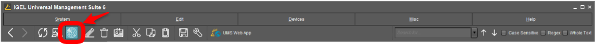

-	Choose whether to scan for devices on the same subnet as UMS, a custom IP range, or a targeted IP list. The option to use TCP scanning will use TCP instead of UDP and generally takes longer to scan. 

-	Available IGEL endpoints will show up in the “Found Devices” results. Select the units to join by checking the “include” box and click OK.

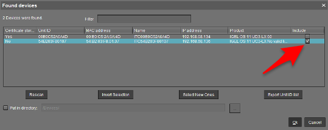

-	The device(s) will show up in UMS under the Devices section of the left-hand object menu.

### Set up a DNS Record or DHCP Tag for Automatic Registration

For production rollouts, you may find it more convenient to automate the process of registering IGEL endpoints.

First, enable Automatic Registration in your UMS settings.

#### Enable Automatic Registration in UMS

-	In the left-hand UMS menu, select UMS Administration at the bottom.

-	Go to Global Configuration > Device Network Settings and check the box for Automatic Registration.

Finally, choose one of these two methods to complete automatic registration setup:

#### Creating a DNS Record

-	Open DNS Manager and select the appropriate zone.

-	Add a new Host (A) record with the name `igelrmserver` and resolve it to the IP address where the UMS server was installed.

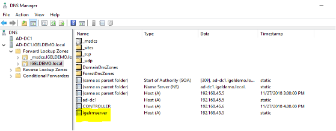

#### Creating a DHCP Tag

-	Open DHCP and add a new option using tag 224 under the appropriate Scope. 

-	Ensure your value is set as a string (not a DWORD) to the IP address of the UMS Server.

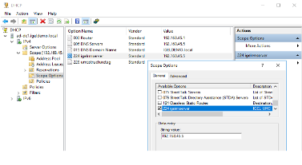
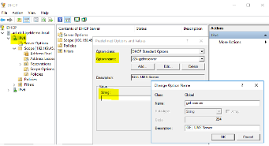

Devices that boot up on your LAN should now be automatically discovered and registered by the UMS Server.

#### IGEL UMS Device Icons

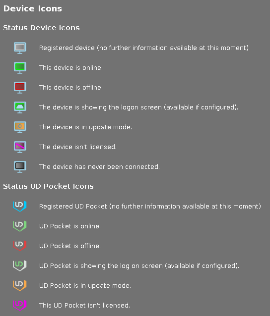

-----

## License Your Endpoints

We recommend you download a 90-day full-evaluation license to open all features. You can do this in one of two ways:

### Option 1: Fetch a License Directly from the Endpoint

**NOTE:** This method requires an internet connection on the endpoint and is preferred for UD Pockets and under 10 devices.

From the endpoint running IGEL OS (not from the UMS):

-	Complete the Setup Assistant Wizard until you get to the option to license your device (2nd to last option), then choose the option for “Full 90-day Evaluation License” OR

-	Click “License/Licensing” from the desktop OR

-	Click the orange “Application Launcher” icon from the taskbar and go to “System” (the gear icon), then “License/Licensing”

-	A button should appear in the middle of the License window that says “90-day Full Evaluation License” – click it. 

-	Choose to request a license for your own company.

-	Fill out the required fields. This information goes back to your Sales Rep at IGEL.

**NOTE:** The UD Pocket will show additional drop-down questions. If you are unsure how to answer one of the fields, make the best choice you can. You cannot proceed without filling in all the required fields.

-	Click “Activate My OS” once – then wait for the “Your license has been fetched” confirmation screen to appear.

-	Reboot the endpoint.

### Option 2: Obtain a Delivery Token from Your IGEL Rep.

**NOTE:** This method requires you to sign up for an account at activation.igel.com PRIOR to using your demo licenses. It is also preferred for 10 devices or more.

-	Register for an account with the IGEL Licensing Portal (ILP) at [activation.igel.com](https://activation.igel.com). Approval may take up to 24 hours. 

-	In UMS, go to “UMS Administration” and click on Global Configuration > Licenses > UMS Licensing ID. Then click “Export UMS Licensing ID” and save the .cert file to a place where you can easily get it later.

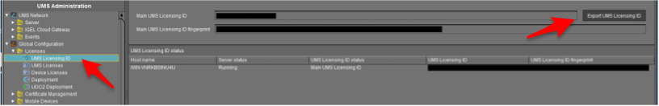

-	When you can access your ILP account, choose “UMS Licensing ID” from the left-hand menu. Then click “Register UMS Licensing ID.”

-	Give your UMS a name and upload the .cert file you exported from the UMS, then click “OK.”

-	You may get prompted to add future product packs to your UMS instance – click “OK.”

-	On the left-hand menu, click on “Home.” Then click “Register Delivery Token.”

-	Enter the delivery token you received from IGEL.

-	The demo licenses should automatically be assigned to your UMS ID in the ILP. If not, hit the “+” button on your UMS ID and add the pack manually.

-	In UMS, go to UMS Administration > UMS Global Configuration > Licenses > Deployment and hit the refresh button in the top right menu and your licenses from the ILP should appear in the window.

-	In the UMS, you can now right click a device and choose “license manually,” choose the product pack, and send the license to the device centrally. You can also enable [Automatic License Deployment as outlined in this KB article](https://kb.igel.com/endpointmgmt-12.01/en/automatic-license-deployment-ald-77863879.html).

-----

## OPTIONAL: Setup IGEL Cloud Gateway for Managing External Endpoints

With UMS installed and configured, you are prepared to manage devices on the LAN. To manage devices which are outside the LAN, you must install and configure the IGEL Cloud Gateway (ICG) to act as a public-facing broker between the external devices and the internal UMS server.

Setup of the ICG Server can be done in four steps:

1. Prepare the Linux Machine.
2. Prepare the Network for ICG Communications
3. Choose and Prepare the ICG Certificate
4. Perform the ICG Installation 
5. Configure the External Repository

#### ICG Supported Environments (64 bit)

- Amazon Linux v2
- Debian (9, 10)
- Ubuntu (16.04, 18.04, 20.04)
- Oracle Linux (7, 8)
- Red Hat Enterprise Linux (RHEL) (7, 8)
- SUSE Enterprise Server (12, 15)

### Prepare the Linux Machine

[Here is a list of prerequisites](https://kb.igel.com/igelicg-12.01/en/prerequisites-81512147.html) for the ICG server. ICG must be installed on a Linux OS. Supported environments are listed above. Depending on the operating system you choose, you may have additional configuration steps required to get ICG to function correctly.

For example, RHEL users may find it necessary to [install Python 3](https://www.scaler.com/topics/python/install-python-on-linux/) and set [SELinux to permissive mode](https://www.thegeekdiary.com/how-to-disable-or-set-selinux-to-permissive-mode/) in order for ICG to work correctly. Ubuntu 18.04 users may not require these additional steps. Depending on your level of expertise with Linux, [you may find additional help here](https://kb.igel.com/igelicg-2.05/en/preparing-a-linux-machine-for-installing-igel-cloud-gateway-icg-57324550.html) with things like creating the root account or setting a static IP. The version of Linux you use is entirely up to you if it is supported.

Additionally, we recommend that the server/VM hosting ICG have 8GB of RAM/vRAM, 2 CPU cores, and 20GB of available disk space. 

[We also offer a guide on how to create the Linux VM in Azure here](https://kb.igel.com/igelicg-12.01/en/using-igel-cloud-gateway-on-microsoft-azure-marketplace-81512461.html).

**NOTE:** Do NOT use “icg” as the name of your account in Linux!  This name is reserved for use by IGEL!

### Prepare the Network for ICG Communications

ICG only requires a single open port (inbound) on the server: 8443. Both the UMS and the external devices will talk to ICG on that port. We also recommend temporarily opening port 22 (inbound, on the internal firewall) so that UMS can SSH to the ICG server to make the remote installation much easier. You can then close port 22 after the installation is done.

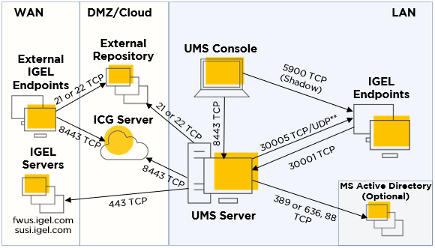

In addition to opening ports, it is necessary to give the ICG server a public IP and public DNS. Work with your network administrator to accomplish this.

**NOTE:** There should not be any software/hardware appliance that manipulates (“sniffs”) SSL traffic between the ICG and the endpoints or ICG and the UMS. Doing so will cause problems.

**NOTE:** The ICG default port can be changed from 8443 to 443 if required by your organization.

**NOTE:** For secure shadow to work over ICG, you must ensure that the ICG’s public DNS resolves to the INTERNAL IP address of the ICG server from the machine that the UMS Console is running on. A simple host file modification is an easy way to fix this problem.

### Choose and Prepare the ICG Certificate

ICG uses a certificate to authenticate any new devices connecting from outside the LAN that you wish to manage. You must choose what type of certificate to use in this workflow. The certificate is created/imported as part of the ICG installation process – but it’s important to choose which type of certificate you want to use beforehand.

Your options are:

1. Self-Signed Certificate
2. Internal/Private CA Certificate
3. Public CA Certificate

#### Self-Signed Certificate

You can create a self-signed certificate with the UMS as part of the ICG installation. This option is appropriate because it is fast and easy to configure. You can also define the validity period of a self-signed certificate.

#### Internal/Private CA Certificate

ICG supports internal CA root certificates. In addition to your root certificate, you must have ready any intermediary certificate files and an end certificate file. The end certificate must be imported into UMS in two parts: the certificate file and the private key file. You will typically extract these parts from a PFX file by using a tool like OpenSSL (instructions on how to do this are below).

#### Public CA Certificate

ICG supports public CA root certificates. The public end certificate must also be imported into the UMS in two parts: the certificate file and the private key file. You will typically extract these parts from a PFX file by using a tool like OpenSSL. As an added benefit to using a public certificate, you will not be required to type in the missing fingerprint field when authenticating a device to the ICG server. This will be fully explained under the ICG Installation section.

Extracting Parts of a PFX Certificate Using OpenSSL

You will need to follow these instructions prior to the ICG installation if you plan on using either an internal CA certificate or a public CA certificate. [Here is another guide to using OpenSSL](https://www.ibm.com/docs/en/arl/9.7?topic=certification-extracting-certificate-keys-from-pfx-file) which you may find helpful.

Here are the steps to take to extract certs and private keys from a PFX:

1. Obtain your certificate (PFX file) from your certificate authority.
2. Download OpenSSL. There are multiple sites available to download OpenSSL, and IGEL doesn’t make any recommendations on which site you use.
3. Place the certificate and the openssl.exe launcher in the same path.
4. Run openssl.exe – this will open a command prompt.
5. Extract the private key with this command (exclude brackets): `openssl pkcs12 -in [yourfile.pfx] -nocerts -out [drlive.key]`
6. Extract the certificate with this command (exclude brackets): `openssl pkcs12 -in [yourfile.pfx] -clcerts -nokeys -out [drlive.pem]`
7. Decrypt the private key file (the one you just extracted) with this command (exclude brackets): `openssl rsa -in [drlive.key] -out [drlive-decrypted.key]`

Set aside the certificate file and the decrypted private key file. You will import both files into UMS during the ICG installation.

**NOTE:** Click here to review additional recommendations regarding the ICG certificate. Please note the importance of the validity period of the certificate you use and make considerations for how you plan to update the ICG certificate in the future when it expires!

### Perform the ICG Installation

There are two methods to install ICG:

1. Remote ICG Installer via UMS
2. Manual ICG Installation via Linux Command Line

#### Remote ICG Installer via UMS

This is the preferred method of installing ICG but requires that you have port 22 open (temporarily) on the ICG server to allow UMS to SSH into it and perform the automated installation. You can also refer to our KB article here. Perform the following steps in UMS:

-	Under UMS Administration > IGEL Cloud Gateway: Click the Install Button located at the top right corner. This will bring up the “Install new IGEL Cloud Gateway” window.

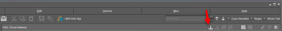

For Self-Signed Certificates:

-	Click the “Generate Root Certificate” button.

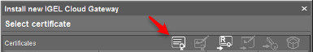

-	Fill out the organization field and confirm the validity period (default is 20 years). Click OK. Your root certificate will now show under the Certificates section.

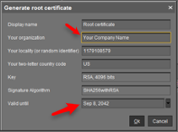

-	Highlight the root certificate you just created and click on “Create Signed Certificate.”

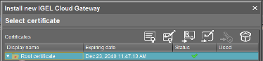

-	Fill out the missing fields with a name, the name of your organization, and most importantly, the hostname field for your ICG server. This hostname field must include ALL IP addresses and hostnames by which your ICG will be reachable BOTH from the inside and externally. Click “OK.”  Continue in this guide below to Installing ICG.

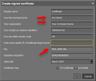

#### For Internal/Private CA Certificates:

-	Click the “Import Root Certificate” button. Choose your internal CA root certificate (in PEM/CRT/CER format) to import. It now shows up on the list of displayed certificates.

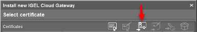

-	Highlight your internal root certificate in the list and click the “Import Private Decrypted Key” button and choose the decrypted KEY file you created earlier in the How to Extract Parts of a PFX Certificate Using OpenSSL section above.

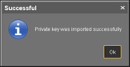

-	If you performed the task correctly, you should see a message saying you were successful. Click “OK.”

-	Back on the Install New IGEL Cloud Gateway window, create a signed certificate with your imported root certificate by highlighting the root certificate and clicking the “Create Signed Certificate” button.

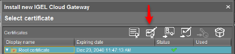

-	Fill out the missing fields with a name, the name of your organization, and most importantly, the hostname field for your ICG server. This hostname field must include ALL IP addresses and hostnames by which your ICG will be reachable BOTH from the inside and externally. Click “OK.” Continue in this guide below to Installing ICG.

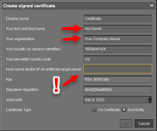

#### For Public CA Certificates:

-	Click the “Import Root Certificate” button. Choose your public CA root certificate (in PEM/CRT/CER format) to import. It now shows up on the list of displayed certificates.

-	If you have any intermediate certificates, import them now by highlighting the root CA certificate in the list and clicking on the “Import Signed Certificate” button. Choose the intermediate certificate (in PEM/CRT/CER format) and it will show up underneath the root certificate in the list.

-	To import the end certificate, highlight the intermediate certificate in the list and again click the “Import Signed Certificate” button. Choose your end certificate (in PEM/CRT/CER format).

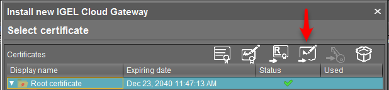

-	Highlight your end certificate in the list and click the “Import Private Decrypted Key” button and choose the decrypted KEY file you created earlier in the How to Extract Parts of a PFX Certificate Using OpenSSL section above.

-	If you performed the task correctly, you should see a message saying you were successful. Click “OK.” Continue in this guide below to Installing ICG.

#### Installing ICG

-	Your end certificate now shows up under the root certificate chain AND under the “Select Certificate” section. With the new certificate selected, click “Next.”  Accept the EULA and click “Next” again.

-	[Click here and download the latest ICG installation package (BIN file)](https://www.igel.com/software-downloads/cosmos/).  Save it where the UMS can see it.

-	On the “Enter Install Parameters” window, type in the internal address of your ICG server (reachable from the UMS) and the username and password of the account with root privilege on your ICG server. On the Path to Installer field, browse to the location of your ICG installer BIN file which you previously downloaded.

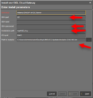

-	UMS will now attempt to SSH into the ICG server using the root credentials you provided and will run a script to install the ICG software using the BIN file you downloaded. At this point, the most likely errors you will encounter will be:
    1. Port 22 is not open from the UMS going to the ICG server.
    2. The credentials you supplied do not have root privilege or were not typed correctly. 
    3. The Linux OS you selected is missing a dependency (OpenSSH, Python3, etc.)
    4. You used “icg” as your default account name when creating the Linux server. This is a reserved name.

-	You should get a message that ICG was successfully installed. You can check in UMS under UMS Administration > UMS Network > IGEL Cloud Gateway and see your ICG instance. It should say “Gateway is fully connected.” 

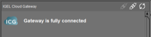

-	Now skip to the “Connecting an Endpoint to ICG” section.

You may also refer to the IGEL KB for these instructions on installing ICG.

Manual Installation via Linux Command Line

It is recommended to use the remote ICG installer. If you cannot use the remote installer via UMS for some reason, you can still install ICG manually. [Follow the steps on this KB article to install ICG manually](https://kb.igel.com/igelicg-12.01/en/installing-the-icg-without-remote-installer-81512539.html)

### Connecting an Endpoint to ICG

With ICG successfully installed, you are prepared to connect an external endpoint to the gateway. This involves two steps:
1. Prepare the First-Authentication Key in UMS.
2. Configure the First-Authentication Key on the Endpoint.

#### Prepare the First-Authentication Key in UMS

-	In the UMS, go to UMS Administration > Global Configuration > Cloud Gateway Options.
-	In the upper right corner, click the “Create New First-Authentication Key” button.

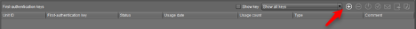

-	Choose the type of key you want to create:
    1. A One-Time Key will only be valid for the next endpoint that uses it. (more secure)
    2. A One-Time Key Associated with a Device will only be valid the next time a specific device, defined by MAC address, uses it. (most secure)
    3. A Mass-Deployment Key will be continuously valid by any device that uses it. (recommended when doing POCs and production rollouts)

-	For the mass-deployment key, choose either a random key (more secure) or uncheck the box and type in the key you want. Click “OK.”

-	Click to highlight the key (which now shows under the list of keys) and in the top right menu, click “Copy to Clipboard” and paste the information in a document so you can see it. You’ll use this information to connect an endpoint to the ICG server later.

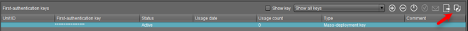

#### Configure the First-Authentication Key on the Endpoint

There are two main ways to get the first-time authentication key information on the endpoint to allow it to securely connect to the ICG server:

1. Run the ICG Agent on the Endpoint
2. Send the ICG Configuration to an Endpoint on the LAN via UMS

##### Run the ICG Agent on the Endpoint

This option involves setting up each individual endpoint one at a time to authenticate to ICG. It can be done either in a staging environment by an admin or (with clear instructions) can be done by the users.

-	On the IGEL OS, you can launch the ICG Agent either via the Setup Assistant when the device first boots, or by searching for “ICG Agent” from the start menu. In either case, ensure you have set up the correct time and date on the endpoint first. 

-	In the ICG Agent window, type the public IP address or DNS name of the ICG server in the Address field. When you connect, you will see additional fields appear for authentication.

-	If you selected a self-signed or internal CA for your certificate, you will see 3 out of 4 of the certificate fingerprint fields populate. You must fill in the random missing field with the first-time authentication information you saved from the previous section.

-	If you selected a public CA for your certificate, you will not be required to fill in any of the fingerprint fields.

-	The Structure Tag field is an optional value which can be used for placing the endpoint in a specific container. Leave it blank for now.

-	Fill in the ICG one-time password (first authentication key) field using the same information you saved from the previous section.

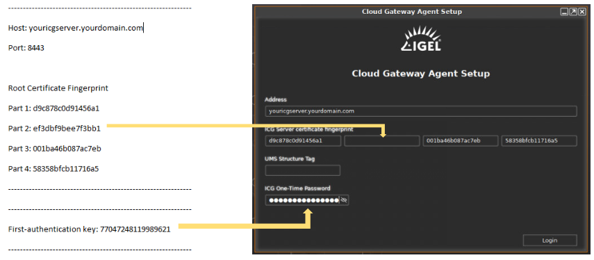

-	Hit “Login.” If everything was entered correctly you will see “ICG connection ready!” pop up at the bottom of the window.

-	Click “Finish” and as the ICG Agent window closes you should see an IGEL OS notification in the bottom right corner that says your device has successfully connected to ICG:

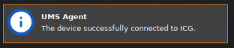

##### Send the ICG Configuration to an Endpoint on the LAN via UMS

This option is much faster for configuring lots of devices to authenticate to ICG at the same time, but it entails you having to stage the devices on the LAN prior to sending them to your external users.

-	In the UMS, discover your endpoints as normal. Once they are registered, highlight all devices to receive the ICG configuration, right click, and choose ICG Configuration > Send ICG configuration.

-	If you have generated your first authentication token and followed these steps, the ICG certificate information and password will be sent to the endpoints.

-	Last, you need to prepare the endpoints to move off the LAN and connect to ICG automatically once they are booted up at the remote location. You can do this by setting the following registry key:

-	Create a UMS profile called “ICG/UMS Switching” or something similar. Go to System > Registry and set the key “system.remotemanager.icg_try_ums_connect” to enabled (check the box called Prefer UMS over ICG).

-	Apply the profile to the staged endpoints. Now, when the units are rebooted and reconnected at the remote site/user’s home, the unit will first try UMS, realize it cannot connect to it on the LAN, and then automatically switch over to use the ICG connection with the authentication information previously sent to it. 

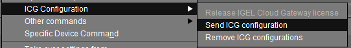

**NOTE:** For remote shadow to function across the ICG connection, the device running the CONSOLE (not the UMS Server) needs to resolve the ICG server’s PUBLIC DNS to the ICG server’s INTERNAL IP address. This can be remedied with a simple host file modification.

You now have the ICG in place and configured, with end points connecting to it. You should be able to send profiles, remotely shadow, and manage the external endpoints. There is one last step to perform to enable full management control over the devices – you must set up an external FTP for the devices to receive firmware updates.

-----

## Configure the External Repository

Larger payload files (such as firmware updates) cannot be retrieved by the endpoints via port 8443 to the ICG server. You need to configure an external (public-facing) FTP-based server in order to have a place the external endpoints can reach in order to download these larger files.

IGEL does not make recommendations on which FTP utility to use – it is completely up to you. You must ensure that the FTP utility is installed and that the correct ports are open depending on which protocol you plan to use. IGEL supports FTP, FTPS, and SFTP. 

To configure the external repository in the UMS:

-	Go to UMS Administration > Global Configuration > Universal Firmware Update and click “Edit.”

-	Fill in the Host field with the external hostname of your repository.

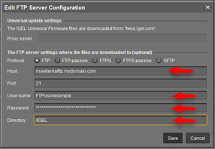

-	Fill in the User name and Password fields with an account you have configured to have read/write access to the repository.

-	Fill in the Directory (root path) where you want the files to be stored.

-	Click “Save.”

-	Click “Test Server Connection.”  The results should show a successful connection to the repository.

Now, when a universal firmware update is downloaded in UMS you will see a button in the top menu called “Set the FTP target directory.” 

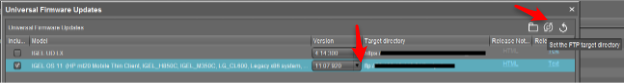

By default, the files are stored on the local WebDAV repository via HTTPS. Clicking the button will change the target location to your external FTP, and when that update object is assigned to your external devices, they will use the external repository to update the firmware. You can reset the target directory by clicking the reset button to the right.

You can now manage devices that are outside the corporate network via UMS and ICG. If you have any questions, please contact your IGEL Channel partner or IGEL Sales Rep and they can forward your request to an Engineer.

**NOTE:** You can also use [IGEL Community on Slack](https://www.igelcommunity.com/)

-----

## UMS Database Sizing

- Number of registered firmware definitions (listed in UMS Console > Misc > Firmware Statistics) have the largest impact on database size

- Number of devices or profiles have minor impact

- Log entries (event- and log messages, jobs, admin task history, ..) grow over time; make sure to use UMS admin tasks to prune them regularly

- As a Rule of Thumb:

    * ~15 MB per firmware configuration (10 max – as noted in link below)
    * ~100kB per profile (depends on how many parameter are active)
    * ~100kB per device
    * Reserve 500MB up to 1GB space for database transaction logs for excessive DB calls (e.g. ‚ Remove unused Firmware(s)‘); this depends heavily on the used DBMS
 
[Installation and Sizing Guidelines for IGEL UMS](https://kb.igel.com/endpointmgmt-12.01/en/installation-and-sizing-guidelines-for-igel-ums-77864359.html)