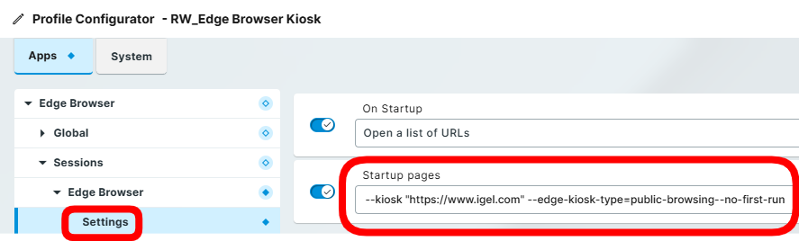

# HOWTO Browsers

IGEL OS 11 includes Chromium and Firefox browsers.

- [KB: Chromium Browser Global](https://kb.igel.com/en/igel-os/11.10/chromium-browser-global-session-in-igel-os)
- [KB: Chromium Sessions](https://kb.igel.com/en/igel-os/11.10/chromium-sessions)
- [KB Firefox Browser Global](https://kb.igel.com/en/igel-os/11.10/firefox-browser-global)
- [KB: Firefox Browser Session](https://kb.igel.com/en/igel-os/11.10/firefox-browser-session)

IGEL OS 12 has the following browsers. Other browsers are planned.

- [KB: Chromium Browser](https://kb.igel.com/en/igel-apps/current/chromium-browser)
- [Firefox Browser](https://app.igel.com/firefox)
- [Island Browser](https://app.igel.com/island)
- [KB: Microsoft Edge Browser](https://kb.igel.com/en/igel-apps/current/configuration-of-microsoft-edge-on-igel-os)
- [Palo Alto Networks - Prisma Access Browser](https://app.igel.com/prisma_access_browser)
- IGEL built in browser:

```bash linenums="1"
/usr/bin/igel-minibrowser --url https://tinyurl.com/igel-docs
```

**Q:** How to set default browser in IGEL OS 12?

**A:** [IGEL KB: How to Set the Default Browser in IGEL OS 12](https://kb.igel.com/en/igel-os-base-system/12.5/how-to-set-the-default-browser-in-igel-os-12)

**Q:** How to configure Edge Browser in Kiosk Mode

**A:** Apps -> Edge Browser > Sessions -> Settings -> Startup pages:

```bash linenums="1"
--kiosk "https://www.igel.com" --edge-kiosk-type=public-browsing--not-first-run
```



**Q:** How to configure Firefox to open Citrix ICA file?

**A** In the Firefox profile / global settings / custom setup, create a policy;

```bash linenums="1"
Policy Name: Handlers
Policy value: {"extensions":{"ica":{"action:"useSystemDefault","ask": false}}}
```

-----

## OS 12: Running Progressive Web Apps (PWA)

- [IGEL App Portal: Progressive Web App](https://app.igel.com/pwa)

- [IGEL App Portal: Microsoft Teams Progressive Web App](https://app.igel.com/pwa)

- [IGEL KB: Example: Microsoft Outlook as a Progressive Web App (PWA) on IGEL OS 12](https://kb.igel.com/en/igel-apps/current/example-microsoft-outlook-as-a-progressive-web-app)

- [IGEL KB: Example: Google Maps as a Progressive Web App (PWA) on IGEL OS 12](https://kb.igel.com/en/igel-apps/current/example-google-maps-as-a-progressive-web-app-pwa-o)

### PWA URLs

| Name | Progressive Web App Url | Icon |
|------|-------------------------|------|
| Google Drive | https://drive.google.com/?lfhs=2 | |
| Google Mail | https://mail.google.com/mail/?usp=installed_webapp | <a href="../Images/HOWTO-Browsers-gmail.svg" download>LINK to icon</a> |
| Google Maps | https://www.google.de/maps?force=tt&source=ttpwa | |
| Microsoft 365 Copilot | https://m365.cloud.microsoft | <a href="../Images/HOWTO-Browsers-copilot.svg" download>LINK to icon</a> |
| Microsoft Copilot | https://copilot.cloud.microsoft/?fromcode=cmc&ampredirectid=95DE602277C6464DA06ED6A3396BCAC8&ampauth=2 | <a href="../Images/HOWTO-Browsers-copilot.svg" download>LINK to icon</a> |
| Microsoft Excel | https://www.microsoft365.com/launch/Excel/ | <a href="../Images/HOWTO-Browsers-excel.svg" download>LINK to icon</a> |
| Microsoft Outlook | https://outlook.office365.com/mail/ | <a href="../Images/HOWTO-Browsers-outlook.svg" download>LINK to icon</a> |
| Microsoft PowerPoint | https://powerpoint.cloud.microsoft/ | <a href="../Images/HOWTO-Browsers-powerpoint.svg" download>LINK to icon</a> |
| Microsoft Word | https://word.cloud.microsoft | <a href="../Images/HOWTO-Browsers-word.svg" download>LINK to icon</a> |
| Omnissa TestDrive | https://testdrive.vidmpreview.com/authcontrol/auth/request | <a href="../Images/HOWTO-Browsers-testdrive.svg" download>LINK to icon</a> |
| YouTube | https://www.youtube.com/?feature=ytca | |

**NOTE:** After running a PWA for the first time, reboot device and the icon for the app will be updated. If issue with icon, then download icon and add to profile setting `Progressive Web App Icon (optional)`. Use UMS files to download icons and save into `/wfs`.

<!---
This is a comment section
<a href="../Images/HOWTO-Browsers-copilot.svg" download>LINK to icon</a> |
<a href="../Images/HOWTO-Browsers-excel.svg" download>LINK to icon</a> |
<a href="../Images/HOWTO-Browsers-powerpoint.svg" download>LINK to icon</a> |
<a href="../Images/HOWTO-Browsers-word.svg" download>LINK to icon</a> |
<a href="../Images/HOWTO-Browsers-testdrive.svg" download>LINK to icon</a> |

https://igeltechnologygmbh-my.sharepoint.com/
-->

-----

## [IGEL OS with Chromium – Guide](https://leon-beitsch.de/shared/IGEL_OS_with_Chromium.pdf)

## [List of Chromium Command Line Switches](https://peter.sh/experiments/chromium-command-line-switches/)

-----

## Other Browsers

Custom Partitions (CP) can be created for the following browsers:

- Google Chrome
- Microsoft Edge
- Island

### [IGEL Community GitHub CP Builders for Browsers](https://github.com/IGEL-Community/IGEL-Custom-Partitions/tree/master/CP_Source/Browsers)

-----

## [Island Enterprise Browser](https://www.island.io/)


- [Automated Application Builder for Island Enterprise Browser](https://github.com/IGEL-Community/IGEL-Custom-Partitions/tree/master/CP_Source/Browsers/Island)

-----

## Citrix Enterprise Browser

- [Take a Sneak Peak of Citrix Enterprise Browser and IGEL OS 12](https://www.igel.com/blog/take-a-sneak-peak-of-citrix-enterprise-browser-and-igel-os-12/)
