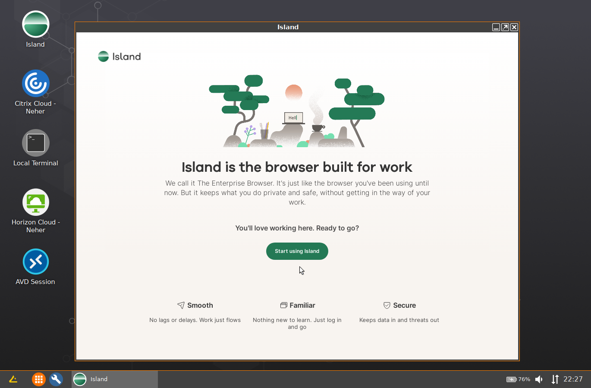

# HOWTO Browsers

IGEL OS 11 includes Chromium and Firefox browsers.

- [KB: Chromium Browser Global](https://kb.igel.com/en/igel-os/11.10/chromium-browser-global-session-in-igel-os)
- [KB: Chromium Sessions](https://kb.igel.com/en/igel-os/11.10/chromium-sessions)
- [KB Firefox Browser Global](https://kb.igel.com/en/igel-os/11.10/firefox-browser-global)
- [KB: Firefox Browser Session](https://kb.igel.com/en/igel-os/11.10/firefox-browser-session)

IGEL OS 12 has the following browsers. Other browsers are planned.

- [KB: Chromium Browser](https://kb.igel.com/en/igel-apps/current/chromium-browser)
- [App Portal: Firefox Browser](https://app.igel.com/firefox/115.12.0+1)
- [Island Browser](https://app.igel.com/island/1.50.25)
- [Microsoft Edge Browser](https://virtualbrat.com/2024/11/01/igel-makes-microsoft-edge-available-now-in-the-igel-app-portal/)

-----

## [IGEL OS with Chromium – Guide](https://leon-beitsch.de/shared/IGEL_OS_with_Chromium.pdf)

## [Running Microsoft Teams as a Progressive Web App (PWA)](https://igel-community.github.io/IGEL-Docs-v02/Docs/HOWTO-Microsoft-Teams-Optimization/#microsoft-teams-progressive-web-app-pwa-via-chromium)

## OS 12: Running Microsoft Teams as a Progressive Web App (PWA) - Coming soon to the [IGEL App Portal](https://app.igel.com)

-----

## Other Browsers

Custom Partitions (CP) can be created for the following browsers:

- Google Chrome
- Microsoft Edge
- Island

### [IGEL Community GitHub CP Builders for Browsers](https://github.com/IGEL-Community/IGEL-Custom-Partitions/tree/master/CP_Source/Browsers)

-----

## [Island Enterprise Browser](https://www.island.io/)

- [Automated Application Builder for Island Enterprise Browser](https://github.com/IGEL-Community/IGEL-Custom-Partitions/tree/master/CP_Source/Browsers/Island)

-----

## Citrix Enterprise Browser

- [Take a Sneak Peak of Citrix Enterprise Browser and IGEL OS 12](https://www.igel.com/blog/take-a-sneak-peak-of-citrix-enterprise-browser-and-igel-os-12/)
