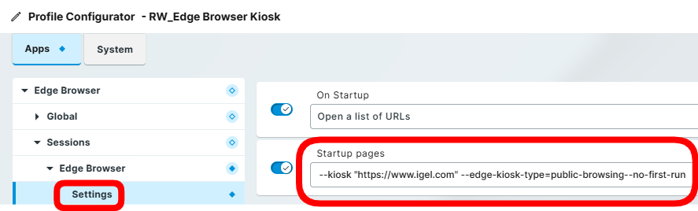
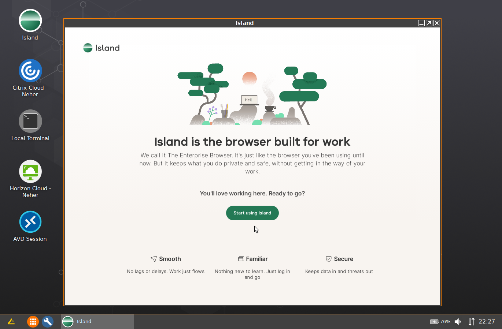

# HOWTO Browsers

IGEL OS 11 includes Chromium and Firefox browsers.

- [KB: Chromium Browser Global](https://kb.igel.com/en/igel-os/current/chromium-browser-global-session-in-igel-os)
- [KB: Chromium Sessions](https://kb.igel.com/en/igel-os/current/chromium-sessions)
- [KB Firefox Browser Global](https://kb.igel.com/en/igel-os/current/firefox-browser-global-settings-in-igel-os)
- [KB: Firefox Browser Session](https://kb.igel.com/en/igel-os/current/firefox-browser-session)

IGEL OS 12 has the following browsers. Other browsers are planned.

- [KB: Chromium Browser](https://kb.igel.com/en/igel-apps/current/chromium-browser)
- [Firefox Browser](https://app.igel.com/firefox)
- [Island Browser](https://app.igel.com/island)
- [KB: Microsoft Edge Browser](https://kb.igel.com/en/igel-apps/current/configuration-of-microsoft-edge-on-igel-os)
- [Palo Alto Networks - Prisma Access Browser](https://app.igel.com/prisma_access_browser)
- IGEL built in browser:

```bash linenums="1"
/usr/bin/igel-minibrowser --url https://tinyurl.com/igel-docs
```

**Q:** How to set default browser in IGEL OS 12?

**A:** [IGEL KB: How to Set the Default Browser in IGEL OS 12](https://kb.igel.com/en/igel-os-base-system/current/how-to-set-the-default-browser-in-igel-os-12)

**Q:** What are commands to see browsers on system and set default browser?

**A:** Here are some commands that can be used:

  - List browsers on system:

```bash linenums="1"
get-browsers --list
```

  - Options for `get-browsers`:

```bash linenums="1"
get-browsers --help
```

  - Check current default browser:

```bash linenums="1"
xdg-settings get default-web-browser
```

  - Set default (example: Firefox):

```bash linenums="1"
xdg-settings set default-web-browser firefox.desktop
```

- Open URL with the default browser

```bash linenums="1"
xdg-open https://tinyurl.com/igel-docs
```

**Q:** How to configure Edge Browser in Kiosk Mode

**A:** Apps -> Edge Browser > Sessions -> Settings -> Startup pages:

```bash linenums="1"
--kiosk "https://www.igel.com" --edge-kiosk-type=public-browsing--not-first-run
```



**Q:** How to configure Firefox to open Citrix ICA file?

**A** In the Firefox profile / global settings / custom setup, create a policy;

```bash linenums="1"
Policy Name: Handlers
Policy value: {"extensions":{"ica":{"action":"useSystemDefault","ask":false}}}
```

**Q:** How to configure Firefox to open Horizon

**A** In the Firefox profile / global settings / advanced / custom preferences.

- Mode: pref
- Custom preference: AutoLaunchProtocolsFromOrigins
- Type: String
- Value:

```bash linenums="1"
[{"allowed_origins":["https://****"],"protocol":"horizon-client"}] 
```

**Q:** How to disable sign-in option in Microsoft Edge?

**A:** Set the following in profile `Edge Browser > Global Settings > Custom Setup > Custom Policies`

```json linenums="1"
"BrowserSignin": 0,                 // disable browser sign-in
"NonRemovableProfileEnabled": false // recommended alongside BrowserSignin
```

**Q:** How to disable offering to `save password` in Microsoft Edge?

**A:** Set the following in profile `Edge Browser > Global Settings > Custom Setup > Custom Policies`

```json linenums="1"
"PasswordManagerEnabled": false // disable password manager
```

**Q:** How to disable checking for updates for Microsoft Edge?

**A:** Set the following in profile `Edge Browser > Global Settings > Custom Setup > Custom Policies`

```json linenums="1"
"UpdateDefault": 0 // disable checking for updates to edge
```

**Q:** How to control audio / microphone for Microsoft Edge?

**A:** Set the following in profile `Edge Browser > Global Settings > Custom Setup > Custom Policies`

- For all sites:

```json linenums="1"
"AudioCaptureAllowed": true // allow all sites
```

- Only for trusted sites:

```json linenums="1"
"AudioCaptureAllowed": false, // do not allow
"AudioCaptureAllowedUrls": ["https://trusted-site.example"] // exceptions
```

**Q:** How to open URL in Edge in full screen?

**A:** Here is an example:

```bash linenums="1"
microsoft-edge-stable --start-maximized "https://www.igel.com"
```

-----

## OS 12: Running Progressive Web Apps (PWA)

- [IGEL App Portal: Progressive Web App](https://app.igel.com/pwa)

- [IGEL App Portal: Microsoft Teams Progressive Web App](https://app.igel.com/pwa)

- [IGEL KB: Example: Microsoft Outlook as a Progressive Web App (PWA) on IGEL OS 12](https://kb.igel.com/en/igel-apps/current/example-microsoft-outlook-as-a-progressive-web-app)

- [IGEL KB: Example: Google Maps as a Progressive Web App (PWA) on IGEL OS 12](https://kb.igel.com/en/igel-apps/current/example-google-maps-as-a-progressive-web-app-pwa-o)

### PWA URLs

| Name | Progressive Web App Url | Icon |
|------|-------------------------|------|
| Google Drive | https://drive.google.com/?lfhs=2 | |
| Google Mail | https://mail.google.com/mail/?usp=installed_webapp | <a href="../Images/HOWTO-Browsers-gmail.svg" download>LINK to icon</a> |
| Google Maps | https://www.google.com/maps?force=tt&source=ttpwa | |
| Microsoft 365 Copilot | https://m365.cloud.microsoft | <a href="../Images/HOWTO-Browsers-copilot.svg" download>LINK to icon</a> |
| Microsoft Copilot | https://copilot.cloud.microsoft/?fromcode=cmc&ampredirectid=95DE602277C6464DA06ED6A3396BCAC8&ampauth=2 | <a href="../Images/HOWTO-Browsers-copilot.svg" download>LINK to icon</a> |
| Microsoft Excel | https://excel.cloud.microsoft | <a href="../Images/HOWTO-Browsers-excel.svg" download>LINK to icon</a> |
| Microsoft Outlook | https://outlook.cloud.microsoft | <a href="../Images/HOWTO-Browsers-outlook.svg" download>LINK to icon</a> |
| Microsoft PowerPoint | https://powerpoint.cloud.microsoft | <a href="../Images/HOWTO-Browsers-powerpoint.svg" download>LINK to icon</a> |
| Microsoft Teams | https://teams.cloud.microsoft | <a href="../Images/HOWTO-Browsers-teams.svg" download>LINK to icon</a> |
| Microsoft Word | https://word.cloud.microsoft | <a href="../Images/HOWTO-Browsers-word.svg" download>LINK to icon</a> |
| Omnissa TestDrive | https://testdrive.vidmpreview.com/authcontrol/auth/request | <a href="../Images/HOWTO-Browsers-testdrive.svg" download>LINK to icon</a> |
| YouTube | https://www.youtube.com/?feature=ytca | |

**NOTE:** After running a PWA for the first time, reboot device and the icon for the app will be updated. If issue with icon, then download icon and add to profile setting `Progressive Web App Icon (optional)`. Use UMS files to download icons and save into `/wfs`.

<!---
This is a comment section
<a href="../Images/HOWTO-Browsers-copilot.svg" download>LINK to icon</a> |
<a href="../Images/HOWTO-Browsers-excel.svg" download>LINK to icon</a> |
<a href="../Images/HOWTO-Browsers-powerpoint.svg" download>LINK to icon</a> |
<a href="../Images/HOWTO-Browsers-word.svg" download>LINK to icon</a> |
<a href="../Images/HOWTO-Browsers-testdrive.svg" download>LINK to icon</a> |

https://igeltechnologygmbh-my.sharepoint.com/
-->

-----

## [IGEL OS with Chromium – Guide](https://leon-beitsch.de/shared/IGEL_OS_with_Chromium.pdf)

## [List of Chromium Command Line Switches](https://peter.sh/experiments/chromium-command-line-switches/)

-----

## Other Browsers

Custom Partitions (CP) can be created for the following browsers:

- Google Chrome
- Microsoft Edge
- Island

### [IGEL Community GitHub CP Builders for Browsers](https://github.com/IGEL-Community/IGEL-Custom-Partitions/tree/master/CP_Source/Browsers)

-----

## [Island Enterprise Browser](https://www.island.io/)



- [Automated Application Builder for Island Enterprise Browser](https://github.com/IGEL-Community/IGEL-Custom-Partitions/tree/master/CP_Source/Browsers/Island)

-----

## Citrix Enterprise Browser

- [Take a Sneak Peak of Citrix Enterprise Browser and IGEL OS 12](https://www.igel.com/blog/take-a-sneak-peak-of-citrix-enterprise-browser-and-igel-os-12/)

-----

-----

## Create Watcher Script to Automatically Run a Downloaded Program

- Automatically running a downloaded program from browser is blocked

- Create a watcher script to look for the program type to start

- Create a custom application for this script and set it to auto start / run (System > System Customization > Custom Application)

**NOTE:** This method can be used to start Bomgar remote support session from the browser

```bash linenums="1"
#!/bin/bash
#set -x
#trap read debug

#
# Watcher script that can be setup as custom application that is
# auto started to watch the DOWNLOAD_DIR folder for file to
# execute
#

DOWNLOAD_DIR="$HOME/Downloads"

ACTION="watcher-${DOWNLOAD_DIR}"
LOGGER="logger -it ${ACTION}"

inotifywait -m -e close_write "$DOWNLOAD_DIR" | while read dir action file; do
    echo "Detected: $file" | $LOGGER

    # Run .bin automatically
    if [[ "$file" == *.bin ]]; then
        echo "Running program: $file" | $LOGGER
        chmod +x "$dir/$file"
        "$dir/$file" &
    fi

done
```

-----

## Browser Automation with Selenium

- [IGEL Community App Recipe for Selenium](https://github.com/IGEL-Community/IGEL-OS-APP-RECIPES/tree/main/APP_Source/Apps/selenium)

- Create EdgeKiosk.java

```bash linenums="1"
cat << "EOF" > EdgeKiosk.java
import org.openqa.selenium.Dimension;
import org.openqa.selenium.Point;
import org.openqa.selenium.WebDriver;
import org.openqa.selenium.edge.EdgeDriver;
import org.openqa.selenium.edge.EdgeOptions;

import java.awt.GraphicsConfiguration;
import java.awt.GraphicsDevice;
import java.awt.GraphicsEnvironment;
import java.awt.Insets;
import java.awt.Rectangle;
import java.awt.Toolkit;
import java.io.IOException;
import java.nio.file.Files;
import java.nio.file.Path;
import java.time.Duration;
import java.util.ArrayList;
import java.util.Comparator;
import java.util.List;

public class EdgeKiosk {

    // Total runtime.
    private static final int LOOP_SECONDS = 300;

    // Seconds between refreshes.
    private static final int REFRESH_INTERVAL_SECONDS = 10;

    // A separate Edge process and profile are created for every URL.
    private static final String[] URLS = {
            "https://www.igel.com",
            "https://www.hp.com",
            "https://www.lg.com",
            "https://www.lenovo.com",
            "https://getnerdio.com",
            "https://www.island.io"
    };

    /*
     * Chromium/Edge true --kiosk mode forces a full-screen window and therefore
     * conflicts with tiling several independent windows on one display.
     *
     * This program uses locked-down app mode instead. It removes the normal
     * browser toolbar, address bar, tabs, first-run UI, notifications, and most
     * keyboard/browser chrome while still allowing Selenium to position and
     * size every window.
     */

    public static void main(String[] args) {
        List<BrowserInstance> browsers = new ArrayList<>();
        Path profileRoot = null;

        try {
            Rectangle display = getPrimaryDisplayWorkArea();
            List<Rectangle> tiles = calculateTiles(display, URLS.length);

            profileRoot = Files.createTempDirectory("edge-kiosk-profiles-");

            System.out.printf(
                    "Display work area: %dx%d at (%d,%d)%n",
                    display.width,
                    display.height,
                    display.x,
                    display.y
            );

            for (int i = 0; i < URLS.length; i++) {
                String url = URLS[i];
                Rectangle tile = tiles.get(i);
                Path profile = profileRoot.resolve("edge-" + i);
                Files.createDirectories(profile);

                EdgeOptions options = createLockedDownOptions(url, profile, tile);
                WebDriver driver = new EdgeDriver(options);

                driver.manage().timeouts().pageLoadTimeout(Duration.ofSeconds(60));
                driver.manage().timeouts().implicitlyWait(Duration.ofSeconds(5));

                // Apply the bounds again after startup because some window
                // managers adjust the initial --window-position/--window-size.
                driver.manage().window().setPosition(new Point(tile.x, tile.y));
                driver.manage().window().setSize(new Dimension(tile.width, tile.height));

                // --app opens the URL during process startup. Navigate again so
                // Selenium waits for the initial document to finish loading.
                driver.get(url);

                browsers.add(new BrowserInstance(driver, url));

                System.out.printf(
                        "Opened %s at x=%d y=%d width=%d height=%d%n",
                        url,
                        tile.x,
                        tile.y,
                        tile.width,
                        tile.height
                );
            }

            refreshUntilFinished(browsers);

        } catch (Exception ex) {
            ex.printStackTrace();
        } finally {
            closeBrowsers(browsers);

            if (profileRoot != null) {
                deleteDirectoryQuietly(profileRoot);
            }

            System.out.println("Finished.");
        }
    }

    private static EdgeOptions createLockedDownOptions(
            String url,
            Path profile,
            Rectangle tile
    ) {
        EdgeOptions options = new EdgeOptions();

        options.addArguments(
                "--app=" + url,
                "--user-data-dir=" + profile.toAbsolutePath(),
                "--window-position=" + tile.x + "," + tile.y,
                "--window-size=" + tile.width + "," + tile.height,
                "--no-first-run",
                "--no-default-browser-check",
                "--disable-session-crashed-bubble",
                "--disable-infobars",
                "--disable-notifications",
                "--disable-popup-blocking",
                "--disable-translate",
                "--disable-features=msEdgeSidebarV2,msEdgeShoppingAssistant,msEdgeCollections,EdgeFollow,ReadAnything",
                "--autoplay-policy=no-user-gesture-required"
        );

        // Optional for an additional private-session boundary:
        // options.addArguments("--inprivate");

        return options;
    }

    private static void refreshUntilFinished(List<BrowserInstance> browsers)
            throws InterruptedException {

        long endTime = System.nanoTime() + Duration.ofSeconds(LOOP_SECONDS).toNanos();
        int cycle = 1;

        while (System.nanoTime() < endTime) {
            System.out.println("Refresh cycle " + cycle);

            for (BrowserInstance browser : browsers) {
                System.out.println("Refreshing: " + browser.url);

                try {
                    browser.driver.navigate().refresh();
                } catch (Exception ex) {
                    System.out.println(
                            "Refresh failed for " + browser.url + ": " + ex.getMessage()
                    );
                }
            }

            cycle++;

            long remainingNanos = endTime - System.nanoTime();
            if (remainingNanos <= 0) {
                break;
            }

            long sleepMillis = Math.min(
                    Duration.ofSeconds(REFRESH_INTERVAL_SECONDS).toMillis(),
                    Duration.ofNanos(remainingNanos).toMillis()
            );

            if (sleepMillis > 0) {
                Thread.sleep(sleepMillis);
            }
        }
    }

    private static Rectangle getPrimaryDisplayWorkArea() {
        GraphicsEnvironment environment =
                GraphicsEnvironment.getLocalGraphicsEnvironment();
        GraphicsDevice device = environment.getDefaultScreenDevice();
        GraphicsConfiguration configuration = device.getDefaultConfiguration();

        Rectangle bounds = configuration.getBounds();
        Insets insets = Toolkit.getDefaultToolkit().getScreenInsets(configuration);

        return new Rectangle(
                bounds.x + insets.left,
                bounds.y + insets.top,
                bounds.width - insets.left - insets.right,
                bounds.height - insets.top - insets.bottom
        );
    }

    private static List<Rectangle> calculateTiles(Rectangle display, int count) {
        List<Rectangle> tiles = new ArrayList<>();

        if (count <= 0) {
            return tiles;
        }

        int columns = (int) Math.ceil(Math.sqrt(count));
        int rows = (int) Math.ceil((double) count / columns);

        int baseWidth = display.width / columns;
        int baseHeight = display.height / rows;

        for (int index = 0; index < count; index++) {
            int column = index % columns;
            int row = index / columns;

            int x = display.x + (column * baseWidth);
            int y = display.y + (row * baseHeight);

            // Let the last column/row consume any remainder pixels.
            int width = (column == columns - 1)
                    ? display.x + display.width - x
                    : baseWidth;
            int height = (row == rows - 1)
                    ? display.y + display.height - y
                    : baseHeight;

            tiles.add(new Rectangle(x, y, width, height));
        }

        return tiles;
    }

    private static void closeBrowsers(List<BrowserInstance> browsers) {
        for (BrowserInstance browser : browsers) {
            try {
                browser.driver.quit();
            } catch (Exception ex) {
                System.out.println(
                        "Unable to close Edge for " + browser.url + ": " + ex.getMessage()
                );
            }
        }
    }

    private static void deleteDirectoryQuietly(Path directory) {
        try (var paths = Files.walk(directory)) {
            paths.sorted(Comparator.reverseOrder())
                    .forEach(path -> {
                        try {
                            Files.deleteIfExists(path);
                        } catch (IOException ignored) {
                            // Temporary browser profiles are best-effort cleanup.
                        }
                    });
        } catch (IOException ignored) {
            // Temporary browser profiles are best-effort cleanup.
        }
    }

    private static final class BrowserInstance {
        private final WebDriver driver;
        private final String url;

        private BrowserInstance(WebDriver driver, String url) {
            this.driver = driver;
            this.url = url;
        }
    }
}
EOF
```

- Compile and run Edge Kiosk

```bash linenums="1"
cat << "EOF" > edge-kiosk.sh
#!/bin/bash
#set -x
#trap read debug

#
# set JAVA_HOME
#
pushd .
cd /services/azul_openjdk/zulu*
eval JAVA_HOME=$(pwd)
PATH=$JAVA_HOME/bin:$PATH
popd

#
# compile EdgeKiosk.java
#

javac -cp ".:/services/selenium/*" EdgeKiosk.java

#
# run EdgeKiosk
#

java -cp ".:/services/selenium/*" EdgeKiosk
EOF
chmod a+x edge-kiosk.sh
```