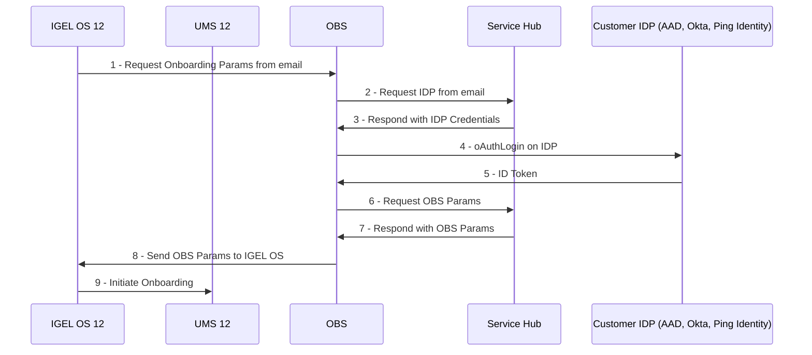
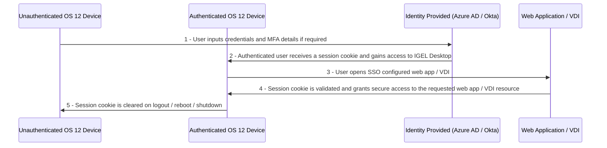

# HOWTO COSMOS

## [IGEL KB - How to Start with IGEL COSMOS](https://kb.igel.com/howtocosmos/en/how-to-start-with-igel-cosmos-77865726.html)

## [IGEL Advanced Services - IGEL COSMOS Migration Package](https://www.igel.com/wp-content/uploads/2023/06/IGEL_OS11_Migration_OS12_ew.pdf)

----------

----------

### Where Are the IGEL COSMOS Cloud Services Data Stored?

Currently, the IGEL COSMOS Cloud Services and apps available in the IGEL App Portal are stored in Azure Region West-Europe, location Amsterdam. The associated app metadata are stored in Frankfurt (Germany west central).

The Insight Service data are currently also stored in Frankfurt (Germany west central).

All data centers and their operators are fully ISO/IEC 27001 certified.


**Q:** How to manage users and roles in the IGEL Customer Portal?

**A:** [IGEL KB: Managing Users and Roles in the IGEL Customer Portal](https://kb.igel.com/howtocosmos/en/managing-users-and-roles-in-the-igel-customer-portal-77865729.html)


**NOTE:** [Minimum viable product](https://en.wikipedia.org/wiki/Minimum_viable_product)

----------

----------

## FAQ - IGEL Education

**Q:** What are the training options for IGEL COSMOS?

**A:** Please enroll in [IGEL Academy](https://www.igel.com/learn-and-connect/igel-education/) for formal training courses on IGEL products geared towards beginners and experienced users alike.

-----

## FAQ - IGEL Topology

**Q:** What has changed with IGEL network topology?

**A:** [Details on the different network topologies](https://igel-community.github.io/IGEL-Docs-v02/Docs/HOWTO-Basic-Setup-Guide/#configure-ums-network-ports).

-----

## FAQ - Time Service

**Q:** Do I really have to have the correct time / date on all my computers?

**A:** YES! In SSL, clocks are used for certificate validation. The client needs to make sure that it talks to the right server; for that, the client will validate the server's certificate. Validation implies verifying a lot of things; two of them involve clocks:

  - The server's certificate (and all involved CA certificates) must include the present time in their validity time range. Each certificate as a notBefore and a notAfter fields; the current time must fall between these two dates.
  - The client is supposed to obtain the revocation status of each certificate, by obtaining (and validating) a CRL (Certificate Revocation List) from the appropriate issuers (the CA). A CRL is deemed acceptable if (in particular) it is "not too old": again, the CRL has a thisUpdate field that says when it was produced, and a nextUpdate field that more-or-less serves as expiration date for the CRL.

If the client's clock is off, then it will break either or both of these functionalities. For instance, the server's certificate will be considered as "long expired", or "Invalid server certificate: certificate is not yet valid", leading to rejection.

  - OS 12: `Setup > System > Time and Date > Use NTP time server`
  - OS 12: `NTP time server` pool.ntp.org
  - OS 12: Check that time NTP is enabled: `get system.time.ntp_enabled`
  - OS 12: Check NTP time server: `get system.time.ntp_timeserver`

-----

## FAQ - Licensing

**Q:** What is the product lifecycle for IGEL products?

**A:** [IGEL Product Lifecycle](https://kb.igel.com/licensesmore-igelos11/en/igel-product-lifecycle-90231044.html)

**Q:** How do I convert OS 11 licenses to OS 12 licenses?

**A:** No conversion needed. Your normal WE licenses work with OS 12. There is not a specific license type for OS 12.

**Q:** What is needed for UMS 12 to support OS 11 licensing?

**A:** EMP will need to be created from WP licensing.  [Using IGEL OS 11 with Cosmos PAS: Creating an EMP Product Pack from a WE Product Pack](https://kb.igel.com/licensesmore-igelos11/en/using-igel-os-11-with-cosmos-pas-creating-an-emp-product-pack-from-a-we-product-pack-81506422.html)

  - **NOTE:** ~~This is currently only accessible by the primary account users, anyone with Service Provider access will not see this button.~~

**Q:** Can UMS 12 remove licenses in the ILP for deleted OS 12 devices?

**A:** Yes! Details can be found here - [HOWTO Remove IGEL Device License](https://igel-community.github.io/IGEL-Docs-v02/Docs/HOWTO-Remove-IGEL-Device-License/#ums-12)

**Q:** What happens when a license expires?

**A:** Details can be found here - [Entitlements that Come with an IGEL COSMOS Platform Access Subscription (PAS) and Effects of Expiry](https://kb.igel.com/licensesmore-igelos11/en/entitlements-that-come-with-an-igel-cosmos-platform-access-subscription-pas-and-effects-of-expiry-81516637.html)

**Q:** Does UMS 12 support demo license automatic deployment?

**A:** Yes! As of UMS 12, demo licenses for IGEL OS 12 and IGEL OS 11 devices are supported by Automatic License Deployment. [UMS 12 License Deployment](https://kb.igel.com/endpointmgmt-12.02/en/deployment-90236757.html).

**Q:** How to automate license renewal?

**A:** Use UMS UMS Automatic License Deployment. UMS checks registered devices every 24 hours for unlicensed devices and will issue a new license. In UMS `UMS Console > UMS Administration > Global Configuration > Licenses > Deployment` enable automatic license exchange and select `Licenses are exchanged [number] days before expiration`: Defines how many days before the expiration date a new license should be deployed. (Default: 7). [KB - License Deployment](https://kb.igel.com/endpointmgmt-12.02/en/deployment-90236757.html).

-----

## FAQ - UMS

**Q:** What Antivirus settings should be set on my Windows server prior to UMS installation?

**A:** [KB: Which UMS Directories Should Be Scanned for Viruses, Which Can Be Excluded?](https://kb.igel.com/endpointmgmt-12.02/en/which-ums-directories-should-be-scanned-for-viruses-which-can-be-excluded-90235827.html)

**Q:** What is new in UMS 12?

**A:** [KB: What Is New in IGEL UMS 12?](https://kb.igel.com/endpointmgmt-12.02/en/what-is-new-in-igel-ums-12-02-100-90238768.html). [UMS release notes](https://igel-community.github.io/IGEL-Docs-v02/Docs/ReleaseNotes/02-UMS/)

**Q:** How to check the status of UMS server?

**A:** Open browser and connect to server on installed port (8443 or 443):

```bash linenums="1"
https://UMS_SERVER_URL:8443/ums/check-status
```

```bash linenums="1"
https://UMS_SERVER_URL:443/ums/check-status
```

**Q:** Is search Broken in 12.02.100 UMS Web?

**A:** 
If you upgraded to 12.02.100 and your UMS Web search results return NOTHING, it's because you have 'UD Pockets' in your environment. (See the [KB: UMS 12.02.100 Known issues](https://kb.igel.com/endpointmgmt-12.02/en/known-issues-igel-ums-12-02-100-90237920.html)) Simply deleting all your UD Pockets from UMS, and waiting until the next index (hourly) will fix your Search. A new UMS 12.02.x version in the works to correct this issue.

**Q:** We noticed that UMS 6 is no longer listed on [IGEL download site](https://www.igel.com/software-downloads/workspace-edition/). We are not ready to move to UMS 12.

**A:** UMS 12 is the next version of UMS 6.x.x and supports OS 11 only environments as well as mixed OS 11 / OS 12 environments.

**Q:** How are OS 12 profiles created or modified?

**A:** UMS Web App `MUST` be used to create / modify OS 12 profiles.

**Q:** When will proxy mode support for UMS 12 be released?

**A:** As of 31 July, UMS 12.02.100 has proxy mode support.

**Q:** What is feature matrix between UMS Web App and UMS Console?

**A:** Here is link to [Feature Matrix: UMS Web App vs. UMS Console](https://kb.igel.com/endpointmgmt-12.02/en/overview-of-the-igel-ums-90235876.html)

**Q:** I'm able to shadow from UMS Web App but cannot shadow from UMS console running on my PC. Why?

**A:** Shadowing from UMS Web App triggers the UMS Server to initiate a VNC session for shadowing. The VNC session is routed through the UMS Server. [KB - UMS and Devices: Secure Shadowing](https://kb.igel.com/endpointmgmt-12.02/en/ums-and-devices-secure-shadowing-90235104.html).

**Q:** How to see the App Portal from Web App? I upgraded from UMS6 to UMS12 and cannot see the App Portal.

**A:** Open `UMS Console` and add `General - WebApp > App Management > Allow`  permission to account(s). Steps:

  - Start `UMS Console`
  - Select `System` > `Administrator accounts`
  - Select Administrator account
  - `Edit`
  - `General - WebApp` select `Allow`

  

**Q:** I reset / rebuilt my OS 12 device and now get error (#38) when trying to connect to UMS.

**A:** See [KB - Troubleshooting: Error 38 during the Onboarding of an IGEL OS 12 Device](https://kb.igel.com/howtocosmos/en/troubleshooting-error-38-during-the-onboarding-of-an-igel-os-12-device-90229885.html).

**Q:** Trying to connect OS 12 to UMS using the one-time password method but I get this message: `could not manage your device because of an internal error (#45)`.

**A:** You may have to create a new endpoint web certificate that has all the IP addresses, Fully Qualified Domain Names, short names, and localhost that the device can connect to. Steps:

  - Start `UMS Console`
  - Open `UMS Administration`
  - Select `Global Configuration` > `Certificate Management` > `Web`
  - Add new endpoint web certificate with all the IP addresses, fully qualified domain names (FQDN), short names, and localhost that the device can connect to

  

  **NOTE:** `Web Certificates`

  - The web certificate is used for the web server port (Default port: 8443)
  - This port is used for transferring files to the device, all WebDav actions, interserver communication, the IMI, and the `UMS Web App`.
  - Additional details [Creating the End Certificates](https://kb.igel.com/endpointmgmt-12.02/en/using-your-own-certificates-for-communication-over-the-web-port-default-8443-90235432.html#UsingYourOwnCertificatesforCommunicationovertheWebPort(Default:8443)-DeployingaCertificateChainwithaPublicRootCADeployingaCertificateChainwithaPublicRootCA)
  - [Video showing steps to create and enable a new web cert](https://raw.githubusercontent.com/IGEL-Community/IGEL-Docs-v02/main/docs/Docs/videos/HOWTO-COSMOS-New_Web_Cert.mp4)


**Q:** How do I use `rmagent-register` to register OS 12 device to my UMS?

**A:** Follow steps to test `rmagent-register`

  - Start `UMS Console`
  - Open `UMS Administration`
  - Select `Global Configuration` > `First-authentication Keys`
  - Select `(+) `
  - Create `Mass-deployment key` with `First-authentication key` TRY-IGEL

  

  - On IGEL OS 12 open a `Terminal` window as root and type

    ```bash linenums="1"
    rmagent-register -s UMS-SERVER-NAME-OR-IP -p 8443 -a TRY-IGEL
    ```

**Q:** What are the steps to upgrade distributed UMS 6.10 to 12.01 on Windows?

**A:** [Upgrade Distributed UMS from 6.10 to 12.01.110 on Windows Server](https://kb.igel.com/endpointmgmt-12.02/en/known-issues-ums-12-01-110-90237930.html)

**Q:** What can be done to increase performance for UMS?

**A:** Make sure you have met requirements for [RAM and vCPUs](https://kb.igel.com/endpointmgmt-12.02/en/installation-requirements-for-the-igel-ums-90235884.html) , [performance optimizations](https://kb.igel.com/endpointmgmt-12.02/en/performance-optimizations-90235861.html) and [Java heap size](https://kb.igel.com/endpointmgmt-12.02/en/how-to-configure-java-heap-size-for-the-ums-server-90235506.html).

**Q:** Having issues joining OS 12 devices to UMS 12 server running on Windows 11. How do I debug?

**A:** UMS server is not supported on Windows 11. Please select a supported OS and reinstall UMS. [Supported Environment UMS 12.02.100](https://kb.igel.com/endpointmgmt-12.02/en/supported-environment-igel-ums-12-02-100-90237917.html).

**Q:** How to limit bulk actions for UMS help desk users?

**A:** UMS WebApp has a layer of security to `only` allow actions on a single device - `Permission > General - WebApp > Device Bulk Action`.

  

**Q:** UMS public facing IP address changed. What needs to be updated in UMS?

**A:** Change the public address of UMS server: `UMS Administration > UMS Network > Server > Your_UMS`. Create a new endpoint web certificate that has all the IP addresses, Fully Qualified Domain Names, and short names that the device can connect to `see details above`.

**Q:** How to add Microsoft Entra ID Auth in front of the IGEL WebUMS?

**A:** [Use Microsoft Entra ID authentication and MFA in front of the WebUMS by leveraging your NetScaler capabilities](https://virtualbrat.com/2023/10/27/do-you-want-to-add-microsoft-entra-id-auth-in-front-of-the-igel-webums-console-when-accessed-from-the-internet-read-how-you-can-use-microsoft-entra-id-authentication-and-mfa-in-front-of-the-webums-by/)

-----

## FAQ - OS 12

**Q:** Is OS 12 considered an App?

**A:** Yes, OS 12 is an app like `Microsoft AVD`, `Citrix`, `VMware Horizon`, etc. [KB IGEL OS 12 Apps: IGEL OS Base System](https://kb.igel.com/basesystem-12.1/en/igel-os-base-system-90231178.html).

**Q:** What are the hardware requirements for OS 12?

**A:** [Requirements for IGEL OS 12](https://kb.igel.com/hardware/en/devices-officially-supported-by-igel-os-12-81496425.html)

**Q:** I want to quickly test out OS 12. What are the steps to test?

**A:** See the following note: [Want to test out OS 12 with App Portal without UMS 12](https://igel-community.github.io/IGEL-Docs-v02/Docs/HOWTO-Add-Applications/#want-to-test-out-os-12-with-app-portal-without-ums12)

**Q:** I'm testing OS 12 and want to reset a device and remove trial license. How do I do that?

**A:** See the following note:  [How to reset a device](https://igel-community.github.io/IGEL-Docs-v02/Docs/HOWTO-Add-Applications/#optional-how-to-reset-a-device)

**Q:** Does OS 12 support SCCM deployments?

**A:** Yes. Mass deployment of IGEL OS 12 Base System via SCCM is possible – offered via tool and corresponding image of OS 12. [Link to Download](https://www.igel.com/software-downloads/cosmos/). [KB: IGEL OS SCCM Add-On](https://kb.igel.com/igelos-11.08.330/en/igel-os-sccm-add-on-88022481.html)

**Q:** Does OS 12 support PXE boot deployments?

**A:** Yes. See the following note: [IGEL KB: How to Deploy IGEL OS 12 with PXE](https://kb.igel.com/os12-installation-pxe)

**Q:** How to enable Citrix username / password auto login support in cloud environment be supported?

**A:** Enable `HTTP Basic` in Storefront.


**Q:** When using the first-time auth key to connect OS 12 to the UMS 12 it asks for a `communication token` - where is this found? 


**A:** This is only shown if a public certificate is not used. It is the third fingerprint of the root web certificate for your UMS 12. Details can be found in [Deploying a Certificate Chain with a Public Root CA](https://kb.igel.com/endpointmgmt-12.01/en/using-your-own-certificates-for-communication-over-the-web-port-default-8443-77864040.html#UsingYourOwnCertificatesforCommunicationovertheWebPort(Default:8443)-DeployingaCertificateChainwithaPublicRootCADeployingaCertificateChainwithaPublicRootCA)


**Q:** OS 12 missing `System > System Customization > Custom Commands > Post Session`. Need to `logoff/reboot` the endpoint when a user disconnects from a Citrix Self-Service session. When will this feature be released?

**A:** For OS 12 this can be found here: `System > Registry > auth > login > autologoff > Session type`


**Q:** How to enable audio on Dell Wyse 5470 AIO?

**A:** Change value in the registry to either 1 or 8 for `system.sound_driver.snd_hda_intel.probe_mask` and reboot.

**Q:** Having issue with 802.1X authentication, what can be done?

**A**: Change the following registry key from `1` to `5`: `network.interfaces.ethernet.device%.ieee8021x.auth_attempts`

**Q:** How to automatically set timezone based on geo location the client is in?

**A:** [IGEL OS automatic Time Zone sync based on geo location detection](https://virtualbrat.com/2023/11/17/igel-os-automatic-time-zone-sync-based-on-geo-location-detection-example-of-how-igel-os-scripting-can-help/)

-----

## FAQ - OS 11 to OS 12 Upgrade

**Q:** What is required of OS 11 device to upgrade to OS 12?

**A:** At least `4GB` RAM and `8GB` Disk is needed for OS 12. [Requirements for IGEL OS 12](https://kb.igel.com/hardware/en/devices-officially-supported-by-igel-os-12-81496425.html)

**Q:** How do I upgrade an OS 11 device to OS 12?

**A:** OS 11.09.100 and UMS 12.2.0 or higher is required to upgrade to OS 12. Additional details can be found here: [KB: Upgrading from IGEL OS 11 to IGEL OS 12](https://kb.igel.com/igelos-11.09/en/upgrading-migration-from-igel-os-11-to-igel-os-12-101063106.html)

**Q:** What is required to update UD Pocket with OS 11 to OS 12 without UMS?

**A:** [Steps to install new OS on UD Pocket](https://kb.igel.com/igelos-11.09/en/how-to-reflash-your-igel-ud-pocket-101060750.html)


**Q:** How to debug OS 11 to OS 12 upgrade?

**A:** Open a terminal window as root on OS 11 device and run the following command prior to starting the upgrade: `journalctl -f`

**Q:** My device has less than `4GB` of RAM, is there a workaround for upgrading to OS 12?

**A:** Yes, open the registry (`Setup > System > Registry`) and enable `system.upgrade_igelos.ignore_memory_requirement`

**Q:** Can an OS 11 device with `Custom Partitions` be upgraded to OS 12?

**A:** Custom Paritions will need to be removed prior to the upgrade to OS 12. OS 12 supports `Custom Partitions` but they have to be created for OS 12 in the `UMS Web App`. **NOTE:** There is a registry setting that can be enabled to delete `Custom Partions` as part of the upgrade process (`system.upgrade_igelos.delete_custom_partition`).

-----

## FAQ - ICG 12

**Q:** Is ICG 12 needed with UMS 12 for OS 12 devices not on the same network as the UMS 12?

**A:** That depends on if your security team will allow UMS 12 on port 8443 to be opened to the Internet or connected to internet via load balancer with SSL pass through (such as F5 / NetScaler / ~~Azure Application Gateway~~ with end to end SSL/TLS encryption and WebSocket support) that forwards encrypted SSL traffic to the UMS without decryption. If the above options cannot be met, an ICG 12 will be needed to support OS 12 devices. Similar sizing guidelines for ICG 12 (setting connection limit to 2K / 2.5K devices). See [ICG 12 KB](https://kb.igel.com/igelicg-12.02/en/igel-cloud-gateway-icg-90238150.html) and [KB - IGEL Cloud Gateway vs. Reverse Proxy for the Communication between UMS 12 and IGEL OS Devices](https://kb.igel.com/endpointmgmt-12.02/en/igel-cloud-gateway-vs-reverse-proxy-for-the-communication-between-ums-12-and-igel-os-devices-90235862.html).

**Q:** Does ICG 12 support OS 11 devices?

**A:** Yes!

**Q:** I upgraded my UMS and ICG to 12 and I am now getting `Could not manage your device because of an internal error (#37)` when trying to connect OS 12 devices. What are the steps to fix this item?

**A:** Remove the cert chain from UMS completely, reboot the ICG's and then reconnect to them from UMS.  ~~Generate a new ICG certificate in UMS 12.~~

**Q:** IGEL OS devices are reconnecting to ICG 12.01.100 every 30 minutes. How can this be fixed?

**A:** Details on fix can be found here: [Configuration of Unlimited Session Timeout for ICG 12.01.100](https://kb.igel.com/igelicg-12.01/en/known-issues-configuration-of-unlimited-session-timeout-for-icg-12-01-100-88016384.html). Fixed in [ICG 12.02.100](https://kb.igel.com/igelicg-12.02/en/resolved-issues-icg-12-02-100-90239446.html).

**Q:** Having issues connecting to ICG. How to check ICG server status?

**A:** Make sure NTP time service is running on all devices (IGEL OS, ICG and UMS). Open a browser session to check status from IGEL OS device:

```bash linenums="1"
https://yourICG:8443/usg/server-status
```

-----

## FAQ - Onboarding Service (OBS)

**Q:** Is OBS a substitute for ICG (IGEL Cloud Gateway)? 

**A:** OBS is not an alternative for ICG or reverse proxy for secure device communication beyond your company network.

**Q:** What are the steps to setup OBS?

**A:** [Initial Configuration of the IGEL Onboarding Service (OBS)](https://kb.igel.com/howtocosmos/en/initial-configuration-of-the-igel-onboarding-service-obs-77865754.html)

**Q:** In the Customer Portal for OBS registration must the UMS hostname be entered in lowercase?

**A:** Please pay attention that hostnames should be spelled everywhere the same way (case-sensitive). The UMS hostname specified during the configuration of the IGEL Onboarding Service must be written exactly as in the UMS.

**Q:** What are the steps to onboard an OS 12 device?

**A:** [Onboarding IGEL OS 12 Devices](https://kb.igel.com/howtocosmos/en/onboarding-igel-os-12-devices-77865898.html)

**Q:** What is the OBS sequence for registering an OS 12 device?

**A:** This sequence cannot be shared to the public. 

<!---
This is a comment section

-->

**Q:** How to test OBS connection?

**A:** Open web browser and connect to `https://obs.services.igel.com/auth/user@domain.com`. Use the browser developer tools to look at returned content. Here is link to [Chrome DevTools](https://developer.chrome.com/docs/devtools/)

**Q:** What do the error codes from onboarding mean?

**A:** [Troubleshooting: Possible Error Codes During the Onboarding](https://kb.igel.com/howtocosmos/en/onboarding-igel-os-12-devices-77865898.html#OnboardingIGELOS12Devices-Troubleshooting:PossibleErrorCodesDuringtheOnboarding)

**Q:** OBS connection issue for UMS server with long server name in cloud hosted server. How can I change UMS server name?

**A:** Open `UMS Console > UMS Administration`, right click on `UMS Network > Server > your UMS server` choose edit and replace super long UMS hostname with shortened FQDN  - `Max length for FQDN is 32 characters`.

-----

## FAQ - Single Sign On (SSO)

**Q:** How IGEL SSO Work?

**A:** With IGEL single sign-on, users sign in once with a single account and get access to multiple applications. The application can be a local client (e.g., AVD), web, or single page application (on browser), regardless of platform or domain name.  When the user initially signs into the IGEL login screen, Identity Providers (Azure AD, Okta) persists a cookie-based session. Upon subsequent authentication requests, the Identity Provider reads and validates the cookie-based session and issues an access token, without prompting the user to sign in again. If the cookie-based session expires or becomes invalid, the user is prompted to sign-in again.  A web, local app, or single page application can be protected by an OAuth2 access token, ID token, or SAML token. When a user tries to access a protected resource on the app, the app checks whether there is an active session on the application side. If there is no app session or the session has expired, the app will take the user to the IdP's sign-in page.

**Q:** How to enable SSO via a cloud-based identity provider (IdP) to enable access to the local OS 12 device and applications?

**A:** With IGEL OS 12, you can use Single Sign-On (SSO) via a cloud-based identity provider (IdP) to access the local device and apps. [Configuring Single Sign-On (SSO)](https://kb.igel.com/howtocosmos/en/configuring-single-sign-on-sso-77865982.html).

**Q:** What is the process workflow for how SSO works between web apps, Azure AD / Okta and IGEL OS 12?

**A:** Here is the workflow.



-----

## FAQ - Microsoft AVD

**Q:** How to pass Microsoft Excel keyboard shortcut keys?

**A:** [Microsoft Excel keyboard shortcut keys](https://www.computerhope.com/shortcut/excel.htm) can be passed to AVD session by enabling `System > app > avd > avd% > options > remote-keymapping`. In OS 11 (11.08.330) `System > Registry > sessions.wvd%.options.remote-keymapping`

-----

## FAQ - VMware Horizon

**Q:** Having performance issues with VMware Horizon and BLAST protocol. What can be done?

**A:** Most performance issues are resolved in Horizon / BLAST with [dri3](https://en.wikipedia.org/wiki/Direct_Rendering_Infrastructure#DRI3). Enable the following in the registry:

    x.drivers.use_dri3
    x.drivers.intel.force_dri3
    x.drivers.ati.force_dri3
    x.drivers.amdgpu.force_dri3