# HOWTO IGEL

<!---
This is a comment section
-->

## [IGEL KB: How to Start with IGEL](https://kb.igel.com/en/how-to-start-with-igel/current/)

## [IGEL Advanced Services - IGEL Migration Package](https://www.igel.com/wp-content/uploads/2023/06/IGEL_OS11_Migration_OS12_ew.pdf)

----------

----------

### Where Are the IGEL Cloud Services Data Stored?

Currently, the IGEL Cloud Services and apps available in the IGEL App Portal are stored in Azure Region West-Europe, location Amsterdam. The associated app metadata are stored in Frankfurt (Germany west central).

The Insight Service data are currently also stored in Frankfurt (Germany west central).

All data centers and their operators are fully ISO/IEC 27001 certified.


**Q:** How to manage users and roles in the IGEL Customer Portal?

**A:** [IGEL KB: Managing Users and Roles in the IGEL Customer Portal](https://kb.igel.com/en/how-to-start-with-igel/current/managing-users-and-roles-in-the-igel-customer-port)

**NOTE:** [Minimum viable product](https://en.wikipedia.org/wiki/Minimum_viable_product)

----------

----------

## FAQ - IGEL Education

**Q:** What are the training options for IGEL?

**A:** Please enroll in [IGEL Academy](https://www.igel.com/learn-and-connect/igel-education/) for formal training courses on IGEL products geared towards beginners and experienced users alike.

-----

## FAQ - IGEL Topology

**Q:** What has changed with IGEL network topology?

**A:** [Details on the different network topologies](https://igel-community.github.io/IGEL-Docs-v02/Docs/HOWTO-Basic-Setup-Guide/#configure-ums-network-ports).

-----

## FAQ - Time Service

**Q:** Do I really have to have the correct time / date on all my computers?

**A:** YES! In SSL, clocks are used for certificate validation. The client needs to make sure that it talks to the right server; for that, the client will validate the server's certificate. Validation implies verifying a lot of things; two of them involve clocks:

  - The server's certificate (and all involved CA certificates) must include the present time in their validity time range. Each certificate as a notBefore and a notAfter fields; the current time must fall between these two dates.
  - The client is supposed to obtain the revocation status of each certificate, by obtaining (and validating) a CRL (Certificate Revocation List) from the appropriate issuers (the CA). A CRL is deemed acceptable if (in particular) it is "not too old": again, the CRL has a thisUpdate field that says when it was produced, and a nextUpdate field that more-or-less serves as expiration date for the CRL.

If the client's clock is off, then it will break either or both of these functionalities. For instance, the server's certificate will be considered as "long expired", or "Invalid server certificate: certificate is not yet valid", leading to rejection.

  - OS 12: `Setup > System > Time and Date > Use NTP time server`
  - OS 12: `NTP time server` pool.ntp.org
  - OS 12: Check that time NTP is enabled: `get system.time.ntp_enabled`
  - OS 12: Check NTP time server: `get system.time.ntp_timeserver`

  Additional details on setting up time and date:

  - [IGEL KB: OS 11 Time and Date](https://kb.igel.com/en/igel-os/11.10/time-and-date)
  - [IGEL KB: OS 12 Time and Date](https://kb.igel.com/en/igel-os-base-system/12.4/time-and-date-in-igel-os-12)

-----

## FAQ - Licensing and Support

**Q:** What are the IGEL OS editions and feature packs?

**A:** [IGEL Web Site: IGEL OS Editions and Feature Packs](https://www.igel.com/licensing). Existing customers will be migrated to `Standard Edition`.

**Q:** How to troubleshoot licensing problems?

**A:** [Troubleshooting Common IGEL Licensing Problems](https://kb.igel.com/en/igel-subscription-and-more/current/troubleshooting-common-igel-licensing-problems)

**Q:** What are the levels of IGEL Support Services?

**A:** IGEL offers three levels of support – Select, Priority and Plus. [IGEL Support Services](https://www.igel.com/wp-content/uploads/2023/04/IGEL_Support_EN.pdf)

**Q:** What is the product lifecycle for IGEL products?

**A:** [IGEL KB: IGEL Product Lifecycle](https://kb.igel.com/en/igel-subscription-and-more/current/igel-product-lifecycle)

**Q:** How do I convert OS 11 licenses to OS 12 licenses?

**A:** No conversion needed. Your normal WE licenses work with OS 12. There is not a specific license type for OS 12.

**Q:** What is needed for UMS 12 to support OS 11 licensing?

**A:** EMP will need to be created from WP licensing.  [IGEL KB: Using IGEL OS 11 with IGEL PAS: Creating an EMP Product Pack from a WE Product Pack](https://kb.igel.com/en/igel-subscription-and-more/current/the-igel-os-11-migration-plan)

**Q:** Can UMS 12 remove licenses in the ILP for deleted OS 12 devices?

**A:** Yes! Details can be found here - [HOWTO Remove IGEL Device License](https://igel-community.github.io/IGEL-Docs-v02/Docs/HOWTO-Remove-IGEL-Device-License/#ums-12)

**Q:** What happens when a license expires?

**A:** Details can be found here - [IGEL KB: Entitlements that Come with an IGEL Platform Access Subscription (PAS) and Effects of Expiry](https://kb.igel.com/en/igel-subscription-and-more/current/igel-subscription-entitlements-and-effects-of-expi)

**Q:** Does UMS 12 support demo license automatic deployment?

**A:** Yes! As of UMS 12, demo licenses for IGEL OS 12 and IGEL OS 11 devices are supported by Automatic License Deployment. [IGEL KB: UMS 12 License Deployment](https://kb.igel.com/en/universal-management-suite/12.04.120/deployment-deploying-licenses-through-the-igel-ums)

**Q:** How to automate license renewal?

**A:** Use UMS UMS Automatic License Deployment. UMS checks registered devices every 24 hours for unlicensed devices and will issue a new license. In UMS `UMS Console > UMS Administration > Global Configuration > Licenses > Deployment` enable automatic license exchange and select `Licenses are exchanged [number] days before expiration`: Defines how many days before the expiration date a new license should be deployed. (Default: 7). [IGEL KB - License Deployment](https://kb.igel.com/en/universal-management-suite/12.04.120/deployment-deploying-licenses-through-the-igel-ums)

**Q:** How does hardware-bundled IGEL licenses work?

**A:** Hardware-bundled IGEL license will be purchased together with hardware manufactured by an IGEL Hardware Partner. This type of license, will be a IGEL PAS (Platform Access Subscription) which is deployed based on the serial number of the device it is sold with. The license can be deployed automatically through the Universal Management Suite (UMS) or manually through the IGEL Licensing Portal (ILP). The license can be separated from its hardware and can be deployed on a different device. [IGEL KB: Hardware-Bundled IGEL License Deployment](https://kb.igel.com/en/igel-subscription-and-more/current/hardware-bundled-igel-license-deployment)

**Q:** How to remove expired / unused licenses from UMS?

**A:** There is also a new Administrative Task available in UMS 12.06 that will remove expired / unused licenses from UMS.

**Q:** We have a customer, which is migrating to another provider. How can we migrate an entire Product Pack from one licensing portal to another?

**A:** Reach out to your IGEL Sales Rep or partner. There are legalities to this that need to be confirmed, and paperwork that needs to be submitted by both sides. Once everyone approves, usually the licenses can then be transferred. If you don't have a direct IGEL Sales contact, you can try submitting a license question request via the [IGEL Customer Portal](https://support.igel.com/). There is a button for this on the landing page.

-----

## FAQ - UMS

**Q:** What steps to perform post install of UMS?

**A:** [IGEL KB: Post-Installation Configuration of the IGEL UMS Server](https://kb.igel.com/en/universal-management-suite/12.05.100/post-installation-configuration-of-the-igel-ums-se). Also make sure to create a new endpoint web certificate that has all the IP addresses, Fully Qualified Domain Names, short names, and localhost that the device can connect to. See below for steps

**Q:** UMS cannot connect to the database after the update to UMS 12.04.100

**A:** This is fixed in UMS 12.04.110. [IGEL KB: Known Issue: UMS Cannot Connect to the MS SQL Database](https://kb.igel.com/en/universal-management-suite/12.04.120/known-issue-ums-cannot-connect-to-the-ms-sql-datab)

**Q:** What Antivirus settings should be set on my Windows server prior to UMS installation?

**A:** [IGEL KB: Which UMS Directories Should Be Scanned for Viruses, Which Can Be Excluded?](https://kb.igel.com/en/universal-management-suite/12.04.120/which-ums-directories-should-be-scanned-for-viruse)

**Q:** What is new in UMS 12?

**A:** [IGEL KB: What Is New in IGEL UMS 12?](https://kb.igel.com/en/universal-management-suite/12.04.120/what-is-new-knowledge-base-updates-for-igel-ums-12)
. [UMS release notes](https://igel-community.github.io/IGEL-Docs-v02/Docs/ReleaseNotes/02-UMS/)

**Q:** How to check the status of UMS server?

**A:** Open browser and connect to server on installed port (8443 or 443):

```bash linenums="1"
https://UMS_SERVER_URL:8443/ums/check-status
```

```bash linenums="1"
https://UMS_SERVER_URL:443/ums/check-status
```

**Q:** Is search Broken in 12.02.100 UMS Web?

**A:** 
If you upgraded to 12.02.100 and your UMS Web search results return NOTHING, it's because you have 'UD Pockets' in your environment. (See the [IGEL KB: UMS 12.02.100 Known issues](https://kb.igel.com/en/universal-management-suite/12.04.120/known-issues-igel-ums-12-02-100)
Simply deleting all your UD Pockets from UMS, and waiting until the next index (hourly) will fix your Search. A new UMS 12.02.x version in the works to correct this issue.

**Q:** We noticed that UMS 6 is no longer listed on [IGEL download site](https://www.igel.com/software-downloads/workspace-edition/). We are not ready to move to UMS 12.

**A:** UMS 12 is the next version of UMS 6.x.x and supports OS 11 only environments as well as mixed OS 11 / OS 12 environments.

**Q:** How are OS 12 profiles created or modified?

**A:** UMS Web App `MUST` be used to create / modify OS 12 profiles.

**Q:** When will proxy mode support for UMS 12 be released?

**A:** As of 31 July 2023, UMS 12.02.100 has proxy mode support.

**Q:** What is feature matrix between UMS Web App and UMS Console?

**A:** Here is link to [IGEL KB: Feature Matrix: UMS Web App vs. UMS Console](https://kb.igel.com/en/universal-management-suite/12.04.120/feature-matrix-ums-web-app-vs-ums-console)

**Q:** I'm able to shadow from UMS Web App but cannot shadow from UMS console running on my PC. Why?

**A:** Shadowing from UMS Web App triggers the UMS Server to initiate a VNC session for shadowing. The VNC session is routed through the UMS Server. [IGEL KB - UMS and Devices: Secure Shadowing](https://kb.igel.com/en/universal-management-suite/12.04.120/igel-ums-and-devices-secure-shadowing-communicatio)

**Q:** How to fix Slow VNC shadowing with 4K screens?

**A:** Enable `network.vncserver.snapfb` VNC option in registry.

  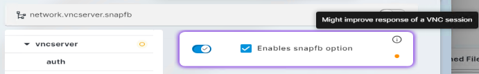

**Q:** How to see the App Portal from Web App? I upgraded from UMS6 to UMS12 and cannot see the App Portal.

**A:** Open `UMS Console` and add `General - WebApp > App Management > Allow`  permission to account(s). Steps:

  - Start `UMS Console`
  - Select `System` > `Administrator accounts`
  - Select Administrator account
  - `Edit`
  - `General - WebApp` select `Allow`

  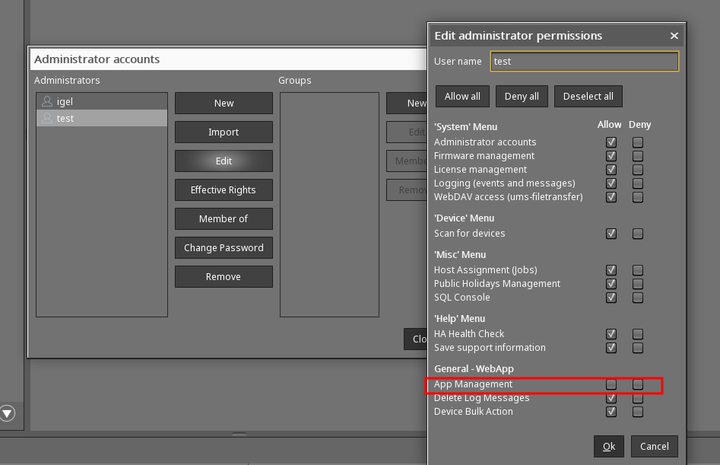

**Q:** I reset / rebuilt my OS 12 device and now get error (#38) when trying to connect to UMS.

**A:** See [IGEL KB - Troubleshooting: Error 38 during the Onboarding of an IGEL OS 12 Device](https://kb.igel.com/en/how-to-start-with-igel/current/troubleshooting-error-38-during-the-onboarding-of-)

**Q:** Trying to connect OS 12 to UMS using the one-time password method but I get this message: `could not manage your device because of an internal error (#45)`.

**A:** You may have to create a new endpoint web certificate that has all the IP addresses, Fully Qualified Domain Names, short names, and localhost that the device can connect to. Steps:

  - Start `UMS Console`
  - Open `UMS Administration`
  - Select `Global Configuration` > `Certificate Management` > `Web`
  - Add new endpoint web certificate with all the IP addresses, fully qualified domain names (FQDN), short names, and localhost that the device can connect to

  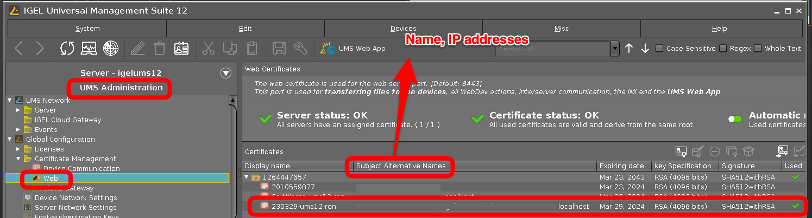

  **NOTE:** `Web Certificates`

  - The web certificate is used for the web server port (Default port: 8443)
  - This port is used for transferring files to the device, all WebDav actions, interserver communication, the IMI, and the `UMS Web App`.
  - Additional details [IGEL KB: Creating the End Certificates](https://kb.igel.com/en/universal-management-suite/12.04.120/how-to-use-your-own-certificates-for-communication)
  - [Video showing steps to create and enable a new web cert](https://raw.githubusercontent.com/IGEL-Community/IGEL-Docs-v02/main/docs/Docs/videos/HOWTO-COSMOS-New_Web_Cert.mp4)
  - Delete the obsolete (automatically created) UMS web certificates and restart the UMS server.

  <video controls>
<source src="../videos/HOWTO-COSMOS-New_Web_Cert.mp4" type="video/mp4">
</video>

**Q:** How do I use `rmagent-register` to register OS 12 device to my UMS?

**A:** Follow steps to test `rmagent-register`

  - Start `UMS Console`
  - Open `UMS Administration`
  - Select `Global Configuration` > `First-authentication Keys`
  - Select `(+) `
  - Create `Mass-deployment key` with `First-authentication key` TRY-IGEL

  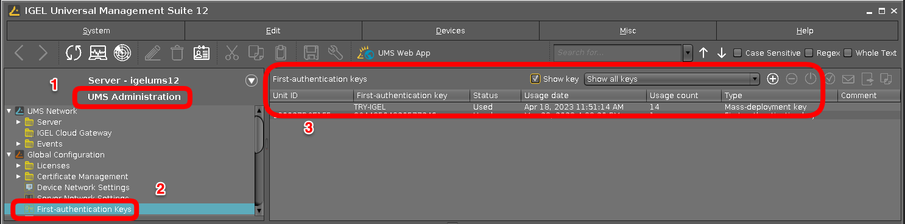

  - On IGEL OS 12 open a `Terminal` window as root and type

    ```bash linenums="1"
    rmagent-register -s UMS-SERVER-NAME-OR-IP -p 8443 -a TRY-IGEL
    ```

**Q:** What are the steps to upgrade distributed UMS 6.10 to 12.01 on Windows?

**A:** [IGEL KB: Upgrade Distributed UMS from 6.10 to 12.01.110 on Windows Server](https://kb.igel.com/en/universal-management-suite/12.04.120/known-issues-ums-12-01-110)

**Q:** What can be done to increase performance for UMS?

**A:** Make sure you have met requirements for [IGEL KB: RAM and vCPUs](https://kb.igel.com/en/universal-management-suite/12.04.120/igel-ums-sizing-guidelines-architecture-diagrams), [IGEL KB: performance optimizations](https://kb.igel.com/en/universal-management-suite/12.04.120/performance-optimizations-in-igel-ums) , and [IGEL KB: Java heap size](https://kb.igel.com/en/universal-management-suite/12.04.120/how-to-configure-java-heap-size-for-the-ums-server)

**Q:** Having issues joining OS 12 devices to UMS 12 server running on Windows 11. How do I debug?

**A:** UMS server is not supported on Windows 11. Please select a supported OS and reinstall UMS. [IGEL KB: Supported Environment UMS 12](https://kb.igel.com/en/universal-management-suite/12.04.120/supported-environment-igel-ums-12-03-100)

**Q:** How to limit bulk actions for UMS help desk users?

**A:** UMS WebApp has a layer of security to `only` allow actions on a single device - `Permission > General - WebApp > Device Bulk Action`.

  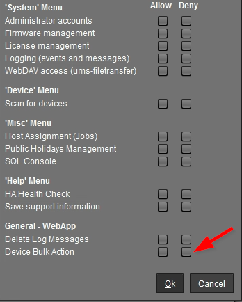

**Q:** UMS public facing IP address changed. What needs to be updated in UMS?

**A:** Change the public address of UMS server: `UMS Administration > UMS Network > Server > Your_UMS`. Create a new endpoint web certificate that has all the IP addresses, Fully Qualified Domain Names, and short names that the device can connect to `see details above`.

- Verify UMS Server settings for IP addresses and ports:

  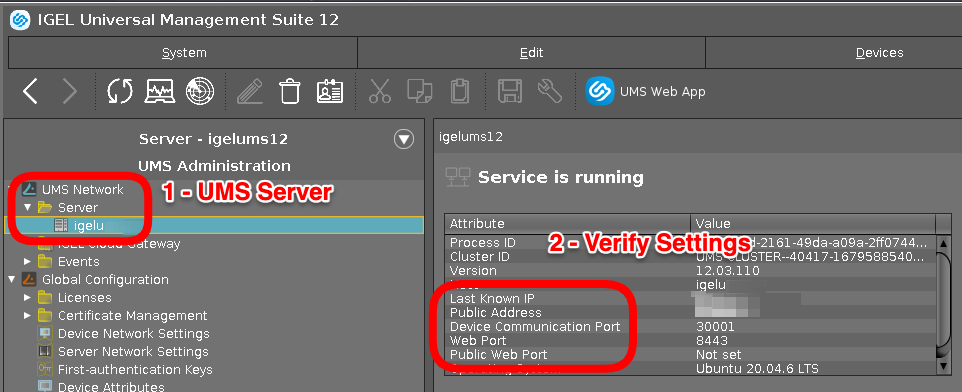

**Q:** How to add Microsoft Entra ID Auth in front of the IGEL WebUMS?

**A:** [Use Microsoft Entra ID authentication and MFA in front of the WebUMS by leveraging your NetScaler capabilities](https://virtualbrat.com/2023/10/27/do-you-want-to-add-microsoft-entra-id-auth-in-front-of-the-igel-webums-console-when-accessed-from-the-internet-read-how-you-can-use-microsoft-entra-id-authentication-and-mfa-in-front-of-the-webums-by/)

-----

## FAQ - OS 12

**Q:** Is OS 12 considered an App?

**A:** Yes, OS 12 is an app like `Microsoft AVD`, `Citrix`, `VMware Horizon`, etc. [IGEL KB: IGEL OS 12 Apps: IGEL OS Base System](https://kb.igel.com/en/igel-os-base-system/12.4/)

**Q:** What are the hardware requirements for OS 12?

**A:** [IGEL KB: Devices Supported by IGEL OS 12](https://kb.igel.com/hardware/current/devices-supported-by-igel-os-12-1)

**Q:** I want to quickly test out OS 12. What are the steps to test?

**A:** See the following note: [Want to test out OS 12 with App Portal without UMS 12](https://igel-community.github.io/IGEL-Docs-v02/Docs/HOWTO-Add-Applications/#want-to-test-out-os-12-with-app-portal-without-ums12)

**Q:** I'm testing OS 12 and want to reset a device and remove trial license. How do I do that?

**A:** See the following note:  [How to reset a device](https://igel-community.github.io/IGEL-Docs-v02/Docs/HOWTO-Add-Applications/#optional-how-to-reset-a-device)

**Q:** Does OS 12 support SCCM deployments?

**A:** Yes. Mass deployment of IGEL OS 12 Base System via SCCM is possible – offered via tool and corresponding image of OS 12. [Link to Download](https://www.igel.com/software-downloads/igel-os-12-secure-endpoint/). [IGEL KB: IGEL OS SCCM Add-On](https://kb.igel.com/en/igel-os/11.10/igel-os-sccm-add-on)

**Q:** Does OS 12 support PXE boot deployments?

**A:** Yes. See the following note: [IGEL KB: How to Deploy IGEL OS 12 with PXE](https://kb.igel.com/en/igel-os-base-system/12.4/how-to-deploy-igel-os-12-with-pxe)

**Q:** How to enable Citrix username / password auto login support in cloud environment be supported?

**A:** Enable `HTTP Basic` in Storefront.

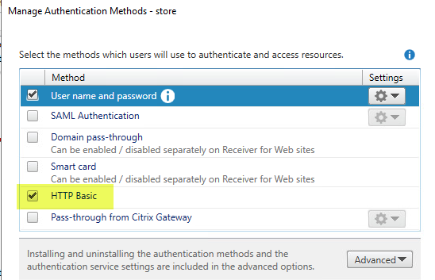

**Q:** When using the first-time auth key to connect OS 12 to the UMS 12 it asks for a `communication token` - where is this found? 

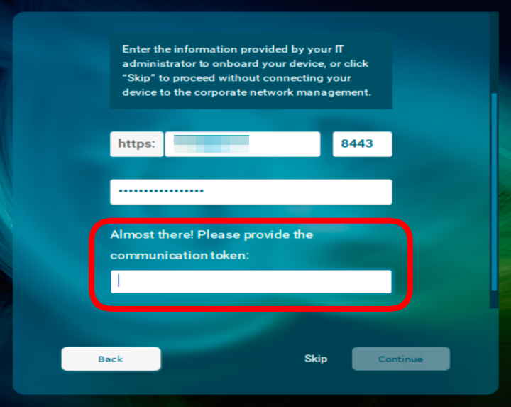

**A:** This is only shown if a public certificate is not used. It is the third fingerprint of the root web certificate for your UMS 12. Details can be found in [IGEL KB: Deploying a Certificate Chain with a Public Root CA](https://kb.igel.com/en/universal-management-suite/12.04.120/how-to-use-your-own-certificates-for-communication)

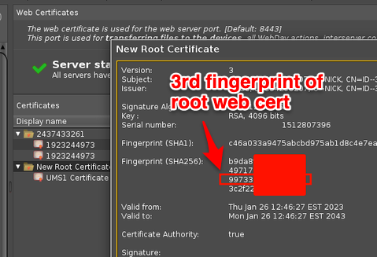

**Q:** OS 12 missing `System > System Customization > Custom Commands > Post Session`. Need to `logoff/reboot` the endpoint when a user disconnects from a Citrix Self-Service session. When will this feature be released?

**A:** For OS 12 this feature is pending release.

<!---
**A:** For OS 12 this can be found here: `System > Registry > auth > login > autologoff > Session type`

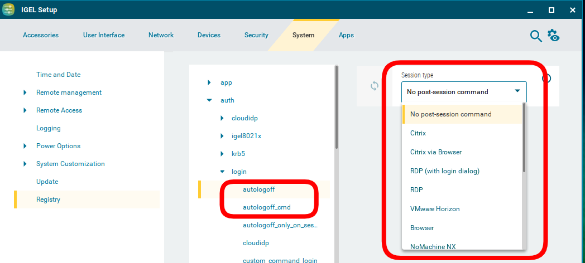
-->

**Q:** How to enable audio on Dell Wyse 5470 AIO?

**A:** Change value in the registry to either 1 or 8 for `system.sound_driver.snd_hda_intel.probe_mask` and reboot.

**Q:** Having issue with 802.1X authentication, what can be done?

**A**: Change the following registry key from `1` to `5`: `network.interfaces.ethernet.device%.ieee8021x.auth_attempts`

**Q:** How to automatically set timezone based on geo location the client is in?

**A:** [IGEL OS automatic Time Zone sync based on geo location detection](https://virtualbrat.com/2023/11/17/igel-os-automatic-time-zone-sync-based-on-geo-location-detection-example-of-how-igel-os-scripting-can-help/)

- Sample [curl](Cheatsheet-IGELOS-General.md#curl) commands

**Q:** How to reduce reduce network traffic back to UMS when WIFI roaming?

**A:** Set `network.interfaces.wirelesslan.device0.roam_refresh_dhcp` to False in the Registry to reduce connections back to the UMS servers. Without setting to false as the device travels, it may download profiles and settings from UMS every time it switches WIFI access point.

**Q:** Can the IGEL OS install from USB drive be customized with settings to speed up the imaging process?

**A:** Yes! Here are some links with steps to customize IGEL OS install from USB stick:

- [HOWTO Edit Initial Settings for OSC](https://igel-community.github.io/IGEL-Docs-v02/Docs/HOWTO-Edit-Initial-Settings-OSC/)

- [HOWTO Write Configuration Files to OSC ISO](https://igel-community.github.io/IGEL-Docs-v02/Docs/HOWTO-Write-Config-Files-OSC-ISO/)

- [HOWTO Make OSC Unattended ISO Boot](https://github.com/IGEL-Community/IGEL-Custom-Partitions/tree/master/CP_Source/Tools_Drivers/Make_OSC_Unattended_ISO_Boot)

**Q:** Having issue installing applications and getting error: `Update: Failed getting metadata from all APP Portals`

**A:** This error message typically indicates that there is something blocking access to the remote IGEL App Portal, or that there is a proxy server that is doing SSL inspection. Run the following command to check for blocking or proxy server that is doing SSL inspection (send results to your network team to review):

```bash linenums="1"
curl -v -k https://app.igel.com
```

-----

## FAQ - OS 11 to OS 12 Upgrade

**Q:** What is required of OS 11 device to upgrade to OS 12?

**A:** At least `4GB` RAM and `8GB` Disk is needed for OS 12. [IGEL KB: Requirements for IGEL OS 12](https://kb.igel.com/en/hardware/current/devices-supported-by-igel-os-12)

**Q:** How do I upgrade an OS 11 device to OS 12?

**A:** OS 11.09.260 and UMS 12.04.120 or higher is required to upgrade to OS 12. Additional details can be found here: [IGEL KB: Upgrading from IGEL OS 11 to IGEL OS 12](https://kb.igel.com/en/igel-os/11.10/upgrading-migration-from-igel-os-11-to-igel-os-12)

**Q:** What is required to update UD Pocket with OS 11 to OS 12 without UMS?

**A:** [IGEL KB: Steps to install new OS on UD Pocket](https://kb.igel.com/en/igel-os/11.10/how-to-reflash-your-igel-ud-pocket)


**Q:** How to debug OS 11 to OS 12 upgrade?

**A:** Open a terminal window as root on OS 11 device and run the following command prior to starting the upgrade: `journalctl -f`

**Q:** My device has less than `4GB` of RAM, is there a workaround for upgrading to OS 12?

**A:** Yes, open the registry (`Setup > System > Registry`) and enable `system.upgrade_igelos.ignore_memory_requirement`

**Q:** Can an OS 11 device with `Custom Partitions` be upgraded to OS 12?

**A:** Custom Paritions will need to be removed prior to the upgrade to OS 12. OS 12 supports `Custom Partitions` but they have to be created for OS 12 in the `UMS Web App`. **NOTE:** There is a registry setting that can be enabled to delete `Custom Partions` as part of the upgrade process (`system.upgrade_igelos.delete_custom_partition`).

**Q:** What is the command line used on OS 11 device to start the upgrade to OS 12?

**A:** Once you have validated, as noted above, that the system is ready for upgrade, then the following command is called: `/etc/igel/upgrade-igelos/upgrade`

-----

## FAQ - ICG 12

**Q:** Is ICG 12 needed with UMS 12 for OS 12 devices not on the same network as the UMS 12?

**NOTE:** Reverse proxy with SSL offloading is possible as of UMS 12.02. See [Configure the UMS to Integrate Reverse Proxy with SSL Offloading](https://kb.igel.com/en/universal-management-suite/12.04.120/configure-the-ums-to-integrate-reverse-proxy-with-)

**A:** That depends on if your security team will allow UMS 12 on port 8443 to be opened to the Internet or connected to internet via reverse proxy
(such as F5 / NetScaler / Azure Application Gateway). If the above options cannot be met, an ICG 12 will be needed to support OS 12 devices. Similar sizing guidelines for ICG 12 (setting connection limit to 2K / 2.5K devices). See [IGEL KB: ICG 12](https://kb.igel.com/en/igel-cloud-gateway/12.04/) and [IGEL KB - IGEL Cloud Gateway vs. Reverse Proxy for the Communication between UMS 12 and IGEL OS Devices](https://kb.igel.com/en/universal-management-suite/12.04.120/igel-cloud-gateway-vs-reverse-proxy-for-the-commun)

- Starting with UMS 12.04, IGEL is now compatible with all industry standard reverse proxies.
- [Video: Proxy vs. Reverse Proxy](https://youtu.be/4NB0NDtOwIQ?si=-vsOKKGMn6dVgqiu)
- [IGEL KB: Configure the UMS to Integrate Reverse Proxy with SSL Offloading](https://kb.igel.com/en/universal-management-suite/12.04.120/configure-the-ums-to-integrate-reverse-proxy-with-)

**Q:** To secure reverse proxy, what are the paths that need to be enabled?

**A:** UMS endpoint paths for Reverse Proxy integration. The used/required paths for OS12 and UMS Web App:

- The paths required for OS 12 device connections to the UMS (via a Reverse Proxy) are:

```bash linenums="1"
The root path is:

/device-connector/device/*

in more details it would be:

/device-connector/device/ws-connect
/device-connector/device/portforwarding
/device-connector/device/.well-known/est/*

and also the appproxy path is required:

/ums-appproxy/*

The device communication is always TLSv1.3.

In case the UMS Web App should be used via a Reverse Proxy the following paths are required:

/wums-app/*
/webapp/*

Here TLSv1.2 or TLSv1.3 is used.
```

**Q:** How is the Universal Management Suite (UMS) and IGEL Cloud Gateway (ICG) integrated with Network components like Firewalls and Reverse Proxies?

**A:** [IGEL KB: IGEL Universal Management Suite Network Configuration](https://kb.igel.com/en/universal-management-suite/12.04.120/igel-universal-management-suite-network-configurat)

**Q:** Does ICG 12 support OS 11 devices?

**A:** Yes!

**Q:** I upgraded my UMS and ICG to 12 and I am now getting `Could not manage your device because of an internal error (#37)` when trying to connect OS 12 devices. What are the steps to fix this item?

**A:** Remove the cert chain from UMS completely, reboot the ICG's and then reconnect to them from UMS.  ~~Generate a new ICG certificate in UMS 12.~~

**Q:** IGEL OS devices are reconnecting to ICG 12.01.100 every 30 minutes. How can this be fixed?

**A:** Details on fix can be found here: [IGEL KB: Configuration of Unlimited Session Timeout for ICG 12.01.100](https://kb.igel.com/en/igel-cloud-gateway/12.04/known-issues-configuration-of-unlimited-session-ti)

**Q:** Having issues connecting to ICG. How to check ICG server status?

**A:** Make sure NTP time service is running on all devices (IGEL OS, ICG and UMS). Open a browser session to check status from IGEL OS device:

```bash linenums="1"
https://yourICG:8443/usg/server-status
```

**Q:** Having issue with ICG remote installer from UMS.

**A:** Make sure that SSH is running on ICG server and that the account used from UMS has `sudo` rights. [IGEL KB: ICG How-Tos - Giving a User sudo Privileges](https://kb.igel.com/en/igel-cloud-gateway/12.05/giving-a-user-sudo-privileges). Linux setup example can be found in [IGEL Community Docs HOWTO Setup Lab Sandbox Environment - Optional - Install ICG from UMS](https://igel-community.github.io/IGEL-Docs-v02/Docs/HOWTO-Setup-Lab-Sandbox-Environment/#optional-install-icg-from-ums-os-11)

-----

## FAQ - Onboarding Service (OBS)

**Q:** Is OBS a substitute for ICG (IGEL Cloud Gateway)? 

**A:** OBS is not an alternative for ICG or reverse proxy for secure device communication beyond your company network.

**Q:** What are the steps to setup OBS?

**A:** [IGEL KB: Initial Configuration of the IGEL Onboarding Service (OBS)](https://kb.igel.com/en/how-to-start-with-igel/current/initial-configuration-of-the-igel-onboarding-servi)

**Q:** In the Customer Portal for OBS registration must the UMS hostname be entered in lowercase?

**A:** Please pay attention that hostnames should be spelled everywhere the same way (case-sensitive). The UMS hostname specified during the configuration of the IGEL Onboarding Service must be written exactly as in the UMS.

**Q:** What are the steps to onboard an OS 12 device?

**A:** [IGEL KB: Onboarding IGEL OS 12 Devices](https://kb.igel.com/en/how-to-start-with-igel/current/onboarding-igel-os-12-devices)

**Q:** What is the OBS sequence for registering an OS 12 device?

**A:** This sequence cannot be shared to the public. 

<!---
This is a comment section
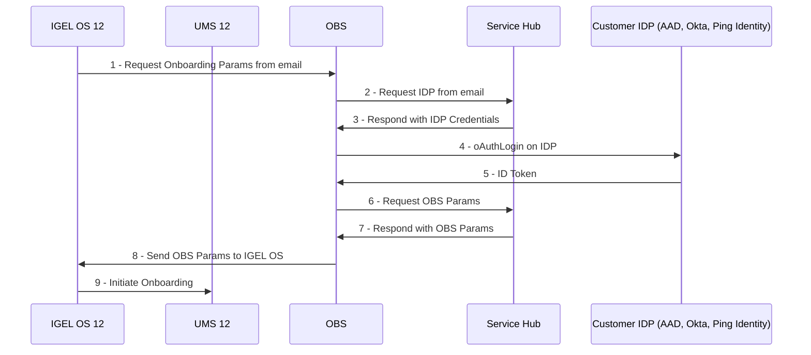
-->

**Q:** How to test OBS connection?

**A:** Open web browser and connect to `https://obs.services.igel.com/auth/user@domain.com`. Use the browser developer tools to look at returned content. Here is link to [Chrome DevTools](https://developer.chrome.com/docs/devtools/)

**Q:** What do the error codes from onboarding mean?

**A:** [IGEL KB: Troubleshooting: Possible Error Codes During the Onboarding](https://kb.igel.com/en/how-to-start-with-igel/current/troubleshooting-possible-error-codes-during-the-on)

**Q:** OBS connection issue for UMS server with long server name in cloud hosted server. How can I change UMS server name?

**A:** Open `UMS Console > UMS Administration`, right click on `UMS Network > Server > your UMS server` choose edit and replace super long UMS hostname with shortened FQDN  - `Max length for FQDN is 32 characters`.

-----

## FAQ - Single Sign On (SSO)

**Q:** Does IGEL SSO with OS 12 work with OpenID Connect?

**A:** Yes! IGEL SSO with OS 12 will work with identity provider (IdP) that supports [OpenID Connect](https://openid.net/developers/how-connect-works/). [IGEL KB: Apps and Utilities for IGEL OS 12 That Support SSO with OpenID Connect (Generic)](https://kb.igel.com/en/igel-os-base-system/12.4/how-to-configure-single-sign-on-sso-on-igel-os-12)

**Q:** How IGEL SSO Work?

**A:** With IGEL single sign-on, users sign in once with a single account and get access to multiple applications. The application can be a local client (e.g., AVD), web, or single page application (on browser), regardless of platform or domain name.  When the user initially signs into the IGEL login screen, Identity Providers:

- Microsoft Entra ID (aka Azure AD)
- OpenID Connect (Generic)
- Okta
- Ping Identity / PingOne
- VMware Workspace ONE Accesss 

 persists a cookie-based session. Upon subsequent authentication requests, the Identity Provider reads and validates the cookie-based session and issues an access token, without prompting the user to sign in again. If the cookie-based session expires or becomes invalid, the user is prompted to sign-in again.  A web, local app, or single page application can be protected by an OAuth2 access token, ID token, or [SAML](https://duo.com/blog/the-beer-drinkers-guide-to-saml) token. When a user tries to access a protected resource on the app, the app checks whether there is an active session on the application side. If there is no app session or the session has expired, the app will take the user to the IdP's sign-in page.

**Q:** How to enable SSO via a cloud-based identity provider (IdP) to enable access to the local OS 12 device and applications?

**A:** With IGEL OS 12, you can use Single Sign-On (SSO) via a cloud-based identity provider (IdP) to access the local device and apps. [IGEL KB: Configuring Single Sign-On (SSO)](https://kb.igel.com/en/igel-os-base-system/12.4/how-to-configure-single-sign-on-sso-on-igel-os-12)

**Q:** What is the process workflow for how SSO works between web apps, Microsoft Entra ID (aka Azure AD) / Okta and IGEL OS 12?

**A:** Here is the workflow.

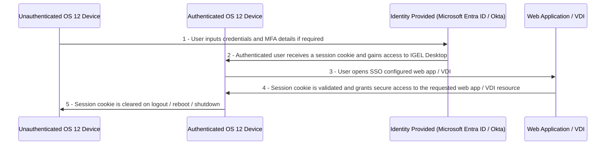

-----

## FAQ - Microsoft AVD

**Q:** How to pass Microsoft Excel keyboard shortcut keys?

**A:** [Microsoft Excel keyboard shortcut keys](https://www.computerhope.com/shortcut/excel.htm) can be passed to AVD session by enabling `System > app > avd > avd% > options > remote-keymapping`. In OS 11 `System > Registry > sessions.wvd%.options.remote-keymapping`

**Q:** How to grab keyboard?

**A:** Enable `grabkeyboard` in AVD profile `app.avd.sessions.avd0.options.grabkeyboard > Grab whole keyboard (Enabled)`

**Q:** How to restrict AVD access `ONLY` from IGEL endpoints?

**A:** [Raise the level of security for your AVD and Windows 365 access – Make sure that ONLY your managed IGEL OS endpoints can access your environment](https://virtualbrat.com/2024/04/18/raise-the-level-of-security-for-your-avd-and-windows-365-access-make-sure-that-only-your-managed-igel-os-endpoints-can-access-your-environment-this-is-the-why-and-how/)

**Q:** How to enable smart card authentication support for Azure Virtual Desktop (AVD)?

**A:** [IGEL smart card Auth to Azure Virtual Desktop](https://virtualbrat.com/2024/09/27/igel-smart-card-auth-to-azure-virtual-desktop-soon-in-the-igel-app-portal-you-can-take-it-for-a-test-drive-already-now/)

**Q:** Having issues logging into AVD and getting error code 50058

**A:** Enable the following AVD session number `%` in the registry for AVD app:
app.avd.sessions.avd%.options.compact-login-view

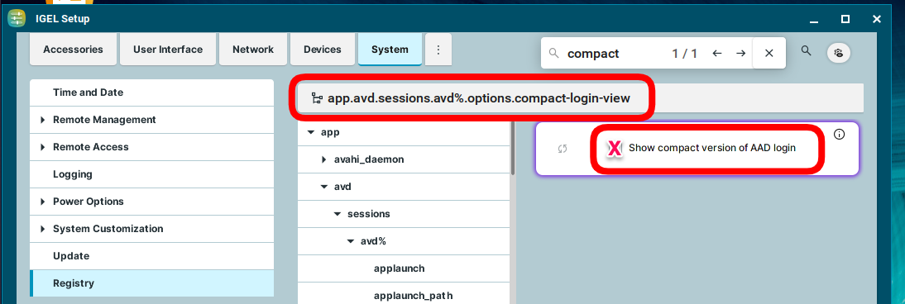

-----

## FAQ - VMware Horizon

**Q:** Having performance issues with VMware Horizon and BLAST protocol. What can be done?

**A:** Most performance issues are resolved in Horizon / BLAST with [dri3](https://en.wikipedia.org/wiki/Direct_Rendering_Infrastructure#DRI3). Enable the following in the registry:

    x.drivers.use_dri3
    x.drivers.intel.force_dri3
    x.drivers.ati.force_dri3
    x.drivers.amdgpu.force_dri3
    x.drivers.amdgpu.use_tear_free

- [Horizon Blast Protocol : Deprecation of the Switch Encoder Feature from 2312 & onwards. (96214)](https://kb.omnissa.com/s/article/96214)

-----

## FAQ - Microsoft Windows 365

**Q:** Looking for setup and notes for Microsoft Windows 365

**A:** [IGEL KB: IGEL Windows 365](https://kb.igel.com/en/igel-apps/current/igel-windows-365)

**Q:** User gets prompt "Need admin approval" on IGEL Windows 365 startup.

**A:** [IGEL KB: Steps to grant tenant-wide admin consent to the IGEL Windows 365 app](https://kb.igel.com/en/igel-apps/current/troubleshooting-user-gets-prompt-need-admin-approv)

-----

## FAQ - Networking

**Q:** How to setup Cisco ISE (IEEE 802.1x)

**A:** The setup:
 
  - The devices must meet (DHCP IGEL tag) + (Port 30001) requirements
   - Then allowed to access the UMS, SCEP, Imprivata servers for initial Imaging
   - Then, 802.1x LAN IGEL policy is applied and they Authenticate via TLS properly to LAN.
   - Then the network is open for the device.
 
Have Cisco ISE engineer use (DHCP IGEL tag) + (ITC* hostname) to fingerprint the device and apply an "IGEL Device for Imaging" ISE Policy. This allows access to SCEP, UMS, Imprivata, etc until 802.1x kicked in. Use the same certificates that is already setup for Cisco ISE Wireless. If 802.1x Auth fails, then it attempts a normal LAN connection. So it's safe to test.  You'll need a Cisco ISE engineer to see in their logs that it was successful.

- [SCEP Client (NDES)](https://kb.igel.com/en/igel-os-base-system/12.4/scep-client-ndes-in-igel-os-12)

-----

## FAQ - Device Specific Data

**Q:** How to extend UMS for device specific data like location, department, or attached hardware?

**A:** [IGEL KB: How to Manage IGEL OS Devices by Device Specific Data - What Device Attributes Can Do for You](https://kb.igel.com/en/universal-management-suite/12.04.120/how-to-manage-igel-os-devices-by-device-specific-d)

- Set UMS Structure Tag with the city the device is currently in

```bash linenums="1"
#!/bin/bash

# Get Geo Location
# Find City
# Set system.remotemanager.ums_structure_tag to City

CITY=$(curl http://ip-api.com/json/$(curl https://ipinfo.io/ip 2>/dev/null) 2>/dev/null | cut -d ":" -f 7 | cut -d "\"" -f 2)

setparam \
system.remotemanager.ums_structure_tag \
"${CITY}"
killwait_postsetupd
write_rmsettings
```

- Public facing IP

```bash linenums="1"
curl https://ipinfo.io/ip
```

- All information on device location

```bash linenums="1"
curl http://ip-api.com/json/$(curl https://ipinfo.io/ip 2>/dev/null)
```

-----

## FAQ - OS 12 App Creator Portal

**Q:** How can I create and distribute my own applications for OS 12?

**A:** The [IGEL App Creator Portal](https://igel-community.github.io/IGEL-Docs-v02/Docs/HOWTO-Add-Applications/#os-12-app-sdk-coming-soon) can be used to create OS 12 applications
