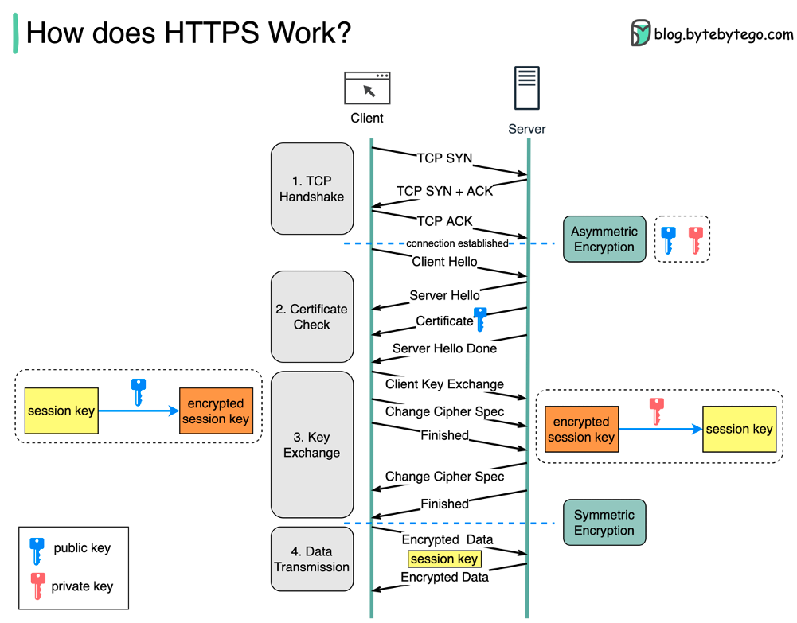
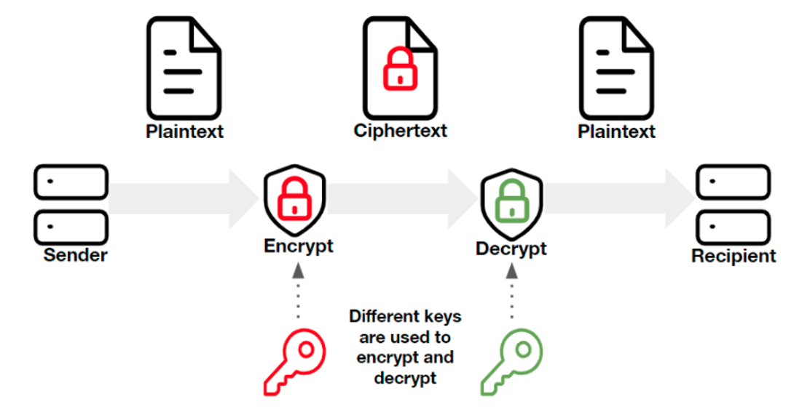
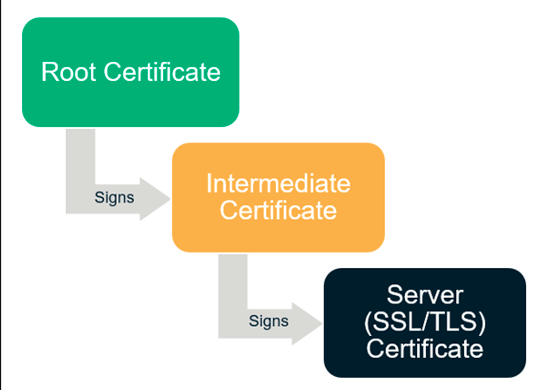
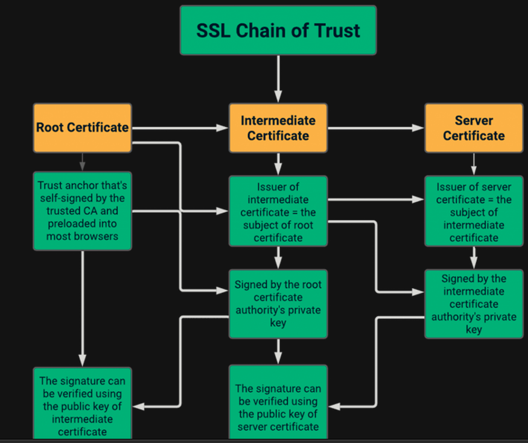
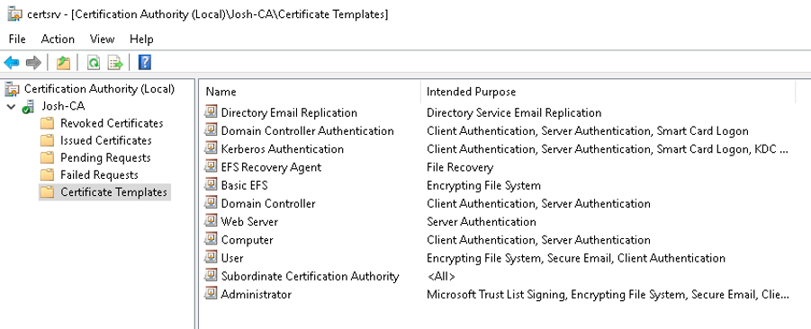
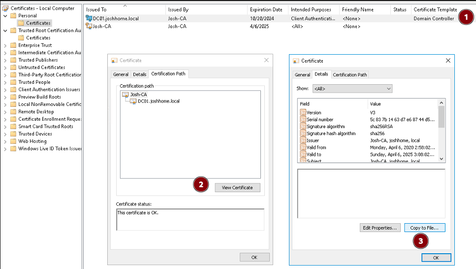
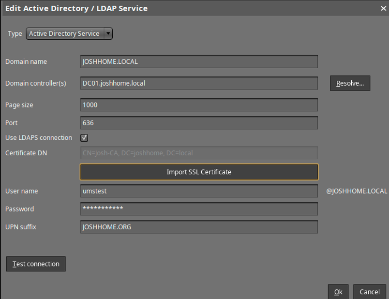
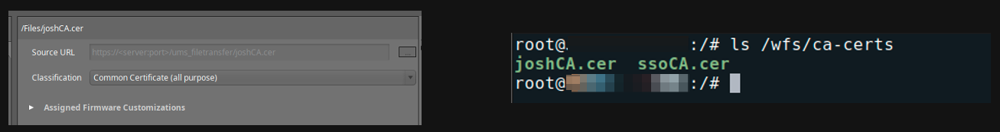
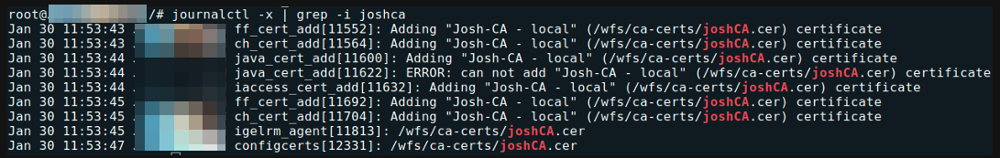

# HOWTO Certificates

-----

## Certificates/PKI Basics

### SSL/TLS Encryption

- The foundation of the modern internet – data in transport should be encrypted!

### Asymmetric vs. Symmetric Encryption

Symmetric and asymmetric encryption are two types of keys that have different features and uses:

- Symmetric encryption uses the same key to encrypt and decrypt data.
- Asymmetric encryption uses two separate keys, one for encryption (public key) and one for decryption (private key).
- Symmetric encryption is faster and uses shorter keys (usually 128 or 256 bits).
- Asymmetric encryption is more secure and uses longer keys (sometimes 2048 bits or longer).

### x.509 Certificates

- The binding of a public/private key to a specific identity
- Certificate items of note:
    - Subject DN – The entity a certificate belongs to. Contains organization name, country code, department, etc.
    - Common Name – The domain being secured. Part of the Subject DN. Can be a wildcard (*)
    - Issuer – The entity that signed and verified the certificate
    - Validity Period – Certs are only considered valid for a set period of time
    - Public Key/Public Key Algorithm
    - X.509 extensions – the most common are Subject Alternative Names (SANs)

### Certificate File Types & Encoding Formats

- PEM/Base64 - Most popular/supported encoding format, with plaintext headers at the beginning and end of the encoded data. Extensions include .crt, .cer, .pem (individual certs), .key (individual encrypted private key)
- P7B/PKCS#7 – Certificate chains/bundles encoded in Base64, can NOT contain private keys.
- DER/Binary - Encoding format that does NOT have plaintext/readable headers. Common extensions include .cer and .der
- PFX/P12/PKCS#12 – Binary format that can contain the certificate chain AND private key in a single .pfx or .p12 file. 

**NOTE:** TL;DR – Use Base64 for everything, don't rely on file extensions, .pfx files may need to be broken open using OpenSSL!

-----

## Certificate Example – IGEL.com

### Certificate Chains & Authorities

- How can we trust that the identity information within a certificate is true and accurate?
- It's impossible to verify each endpoint certificate, so modern operating systems instead rely on a trusted third party to sign these certs – a certificate authority
- Modern operating systems contain a list trusted Root CAs – from those Root CAs, trust propagates downward
    - [KB: CA Certificates in IGEL OS](https://kb.igel.com/en/igel-os/11.10/which-ca-certificates-are-contained-in-igel-os)
    - [Microsoft Trusted CAs](https://learn.microsoft.com/en-us/security/trusted-root/participants-list)

### Certificate Chains & Authorities

### PKI Basics – Microsoft Enterprise CA

- Windows server role – typically on standalone machine(s) in a multi-tiered configuration, but can be installed alongside your DC for lab purposes
- Will generate a CA certificate upon role setup – this CA certificate is used to issue endpoint certificates
- By default, domain joined Windows devices will add Enterprise CA certificates to your trust store.
- Certificate issuance is usually handled via templates

-----

## Certificates in OS 11

### Common Scenario 1 – LDAPS in UMS

- Confirm that you have an Enterprise CA and an endpoint cert bound to your domain controller
- We are looking for the ROOTMOST certificate, not an individual domain controller certificate!
- From a domain controller, we can go to certificates.mmc and follow the endpoint cert up:

### Common Scenario 2 – ICG With a Public CA

- Fill out a CSR for your CA of choice, ensuring that they have SANs for ALL ICG URLs they may be using (or a wildcard!)
- Private keys are generated alongside the CSR – save it!
- You will need:
    - The endpoint cert private key, decrypted in Base64
    - The endpoint, intermediate and root certificates, in individual files in Base64 format
- Import in order – don’t forget the private key

### Common Scenario 3 – Certificate File Objects

- Common Certificate (all purpose) will serve most of your needs – less permissions management!
- Double check your certificate under /wfs/ca-certs

- Reverse engineering – follow that file object in the journal

-----

## Troubleshooting Certificates

**NOTE:** [The Most Common OpenSSL Commands](https://www.sslshopper.com/article-most-common-openssl-commands.html)

### Command Line Tools

- Curl – a powerful command line tool for sending or transferring data to a server. When using curl in combination with HTTPS, you can see the TLS handshake in real time.
    - Useful example: `curl –vvI https://icg.domain.com:8443`
- Openssl – the Swiss Army Knife of certificate/SSL/TLS troubleshooting.
    - Check a certificate: `openssl x509 -in certificate.crt -text –noout`
    - Check an SSL Connection: `openssl s_client -connect www.paypal.com:443`
    - Extract key/cert from pfx: 
        - `openssl pkcs12 -in [yourfile.pfx] -nocerts -out [privatekey.key]`
        - `openssl pkcs12 -in [yourfile.pfx] -clcerts -nokeys -out [drlive.crt]`
        - `openssl rsa -in [privatekey.key] -out [privatekey-decrypted.key]`

### GUI Tools

- When troubleshooting SSL/certificate issues involving the ICG or UMS Web Certificate, always ask for uncropped screenshots of `Certificate Management > Web and Cloud Gateway`
- What about the Device Communication (tckey) certificate? The simple answer is ‘do not touch’ 
- The browser is a great GUI troubleshooting tool, but don’t forget that the browser may ‘complete’ the chain and show everything as good where the OpenSSL libraries or other programs may be more picky! 

-----

## Links and Resources

- [A Primer on ECC Cryptography](https://blog.cloudflare.com/a-relatively-easy-to-understand-primer-on-elliptic-curve-cryptography)
- [OpenSSL Reference](https://www.sslshopper.com/article-most-common-openssl-commands.html)
- [IGEL Community LetsEncrypt/Certbot tutorial](https://igel-community.github.io/IGEL-Docs-v02/Docs/HOWTO-ICG-Free-Signed-Certificate/?h=)
- [Building an AD CS Server in Your Lab](https://virtuallythere.blog/2018/04/24/making-things-a-bit-more-secure-part-1/)
- [KB: Configure the UMS to Integrate Reverse Proxy with SSL Offloading](https://kb.igel.com/en/universal-management-suite/12.04.120/configure-the-ums-to-integrate-reverse-proxy-with-)

-----

## Starting with UMS 12.04 - Improvements for Certificate Import

Starting with UMS 12.04, certificate management now adds sanity check to the imported chains:

- Make sure chain is complete
- Required private keys are present
- Leaves need to have valid `subject alternative names`

Will now allow the import of `jks` and `pkcs12` key stores and builds chain automatically:

- Highlight missing elements in the imported result (e.g. private keys)
- Add missing root certificates from the java trust store, if available

Can now manage certificates via the command line:

- Set chain of web certificates
- Automate process of UMS installation
- Add certificates, keypairs, or complete keystores
- Remove existing certificates, web certificates, and key stores from the database