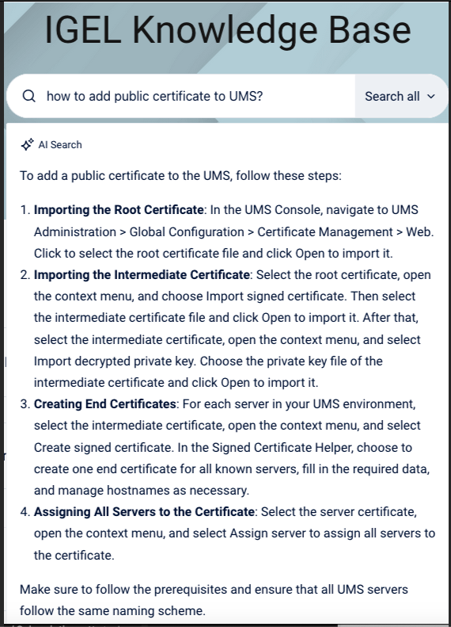

# HOWTO Certificates

-----

-----

## [SSL: Who Do You Trust?](https://datacenteroverlords.com/2011/09/25/ssl-who-do-you-trust/?utm_source=chatgpt.com)

- Let’s say you’re in the market for a starship.  You’re looking for a sporty model with warp drive, heated seats, and most importantly, a holodeck. You go to your local Starfleet dealer, and you find this guy....  Ensign Tony.

-----

-----

## Certificates/PKI Basics

### SSL/TLS Encryption

- The foundation of the modern internet – data in transport should be encrypted!


### Asymmetric vs. Symmetric Encryption

Symmetric and asymmetric encryption are two types of keys that have different features and uses:

- Symmetric encryption uses the same key to encrypt and decrypt data.
- Asymmetric encryption uses two separate keys, one for encryption (public key) and one for decryption (private key).
- Symmetric encryption is faster and uses shorter keys (usually 128 or 256 bits).
- Asymmetric encryption is more secure and uses longer keys (sometimes 2048 bits or longer).


### x.509 Certificates

- The binding of a public/private key to a specific identity
- Certificate items of note:
    - Subject DN – The entity a certificate belongs to. Contains organization name, country code, department, etc.
    - Common Name – The domain being secured. Part of the Subject DN. Can be a wildcard (*)
    - Issuer – The entity that signed and verified the certificate
    - Validity Period – Certs are only considered valid for a set period of time
    - Public Key/Public Key Algorithm
    - X.509 extensions – the most common are Subject Alternative Names (SANs)

### Certificate File Types & Encoding Formats

- PEM/Base64 - Most popular/supported encoding format, with plaintext headers at the beginning and end of the encoded data. Extensions include .crt, .cer, .pem (individual certs), .key (individual encrypted private key)
- P7B/PKCS#7 – Certificate chains/bundles encoded in Base64, can NOT contain private keys.
- DER/Binary - Encoding format that does NOT have plaintext/readable headers. Common extensions include .cer and .der
- PFX/P12/PKCS#12 – Binary format that can contain the certificate chain AND private key in a single .pfx or .p12 file. 

**NOTES:**

- Use Base64 for everything, don't rely on file extensions, .pfx files may need to be broken open using OpenSSL!

- The certificates must be available in the Base64 file format encoded with the file extension .pem, .crt or .cer.

- [IGEL KB: Upload and Assign Files in the IGEL UMS Web App](https://kb.igel.com/en/universal-management-suite/current/upload-and-assign-files-in-the-igel-ums-web-app)

    - Classification Type: SSL Certificate

-----

## Certificate Example – IGEL.com

### Certificate Chains & Authorities

- How can we trust that the identity information within a certificate is true and accurate?
- It's impossible to verify each endpoint certificate, so modern operating systems instead rely on a trusted third party to sign these certs – a certificate authority
- Modern operating systems contain a list trusted Root CAs – from those Root CAs, trust propagates downward
    - [KB: CA Certificates in IGEL OS](https://kb.igel.com/en/igel-os/current/which-ca-certificates-are-contained-in-igel-os)
    - [Microsoft Trusted CAs](https://learn.microsoft.com/en-us/security/trusted-root/participants-list)


### Certificate Chains & Authorities


### PKI Basics – Microsoft Enterprise CA

- Windows server role – typically on standalone machine(s) in a multi-tiered configuration, but can be installed alongside your DC for lab purposes
- Will generate a CA certificate upon role setup – this CA certificate is used to issue endpoint certificates
- By default, domain joined Windows devices will add Enterprise CA certificates to your trust store.
- Certificate issuance is usually handled via templates


-----

## Certificates in OS 11

### Common Scenario 1 – LDAPS in UMS

- Confirm that you have an Enterprise CA and an endpoint cert bound to your domain controller
- We are looking for the ROOTMOST certificate, not an individual domain controller certificate!
- From a domain controller, we can go to certificates.mmc and follow the endpoint cert up:


### Common Scenario 2 – ICG With a Public CA

- Fill out a CSR for your CA of choice, ensuring that they have SANs for ALL ICG URLs they may be using (or a wildcard!)
- Private keys are generated alongside the CSR – save it!
- You will need:
    - The endpoint cert private key, decrypted in Base64
    - The endpoint, intermediate and root certificates, in individual files in Base64 format
- Import in order – don’t forget the private key

### Common Scenario 3 – Certificate File Objects

- Common Certificate (all purpose) will serve most of your needs – less permissions management!
- Double check your certificate under /wfs/ca-certs


- Reverse engineering – follow that file object in the journal


-----

-----

## UMS Command Line Tool to Export UMS Web Certificate

### List Web Certs

```bash linenums="1"
umsadmin-cli web-certs list
```

```bash linenums="1"
NAME             FINGERPRINT (SHA1)                       EXPIRATION DATE USED 
230623-ums12-ron 351B4DA62D5A304C5B86401FB2C49091490EA5AE      2026-04-25 true 
1264447657       B18CB74C0CA7A54CFCB7AA162E32F2380205D111      2043-03-23 true 
230623-ums12-ron BB8F25B169B38DEE641FB160C93A303946219F41      2025-05-25 false
```

### List Assigned Server

```bash linenums="1"
umsadmin-cli web-certs list-assigned-server -f 351B4DA62D5A304C5B86401FB2C49091490EA5AE
```

```bash linenums="1"
HOST      LAST KNOWN IP PROCECSS ID                          VERSION  
igelums12 10.0.0.35     13078f0d-2161-49da-a09a-2ff074439bfe 12.09.110
```

### Export Cert Chain

```bash linenums="1"
mkdir yourkeystore.keystore
umsadmin-cli web-certs export-cert-chain -f 351B4DA62D5A304C5B86401FB2C49091490EA5AE -k yourkeystore.keystore --password:in
```

```bash linenums="1"
Password: 
Confirm: 
```

-----

-----

## Java keytool

**Note:** Install java on your device to have `keytool`. `keytool` is installed on UMS (`/opt/IGEL/RemoteManager/_jvm/bin`)

Java `keytool` command can be used to extract private key and certificate chain from the exported certificate.

Steps to extract private key and certificate chain from exported UMS Web Certificate:

- Export UMS Web Certificate Chain as `Export certificate chain to keystore`

- Run Java `keytool`:

```bash linenums="1"
keytool -v -importkeystore -srckeystore yourkeystore.keystore -srcalias ALIAS-NAME -destkeystore myp12file.pfx -deststoretype PKCS12
```

### Find Alias Name in a Keystore

```bash linenums="1"
keytool -list -v -keystore yourkeystore.keystore.jks  | grep -i alias
```

```bash linenums="1"
Alias name: 1264447657_cert
Alias name: 1264447657_key
Alias name: 727194619_cert
Alias name: 727194619_key
```

### Extract Private Key and Certificate Chain from a Keystore

```bash linenums="1"
keytool -v -importkeystore -srckeystore yourkeystore.keystore.jks -srcalias 1264447657_key -destkeystore myp12file.pfx -deststoretype PKCS12
```

```bash linenums="1"
Importing keystore yourkeystore.keystore.jks to myp12file.pfx...
Enter destination keystore password:  
Re-enter new password: 
Enter source keystore password:  
[Storing myp12file.pfx]
```

### Extract Root Certificate from a Keystore

```bash linenums="1"
keytool -exportcert -alias 1264447657_key -keystore yourkeystore.keystore.jks -file ums_cert.crt -rfc
```

```bash linenums="1"
Enter keystore password:  
Certificate stored in file <ums_cert.crt>
```

-----

-----

## Troubleshooting Certificates

**NOTE:** [The Most Common OpenSSL Commands](https://www.sslshopper.com/article-most-common-openssl-commands.html)

### Command Line Tools

- Curl – a powerful command line tool for sending or transferring data to a server. When using curl in combination with HTTPS, you can see the TLS handshake in real time.
    - Useful example: `curl –vvI https://icg.domain.com:8443`
- Openssl – the Swiss Army Knife of certificate/SSL/TLS troubleshooting.
    - Check a certificate: `openssl x509 -in certificate.crt –noout -text`
    - Check an SSL Connection: `openssl s_client -connect www.paypal.com:443`
    - Extract key/cert from pfx: 
        - `openssl pkcs12 -in [yourfile.pfx] -nocerts -out [privatekey.key]`
        - `openssl pkcs12 -in [yourfile.pfx] -clcerts -nokeys -out [drlive.crt]`
        - `openssl rsa -in [privatekey.key] -out [privatekey-decrypted.key]`

### GUI Tools

- When troubleshooting SSL/certificate issues involving the ICG or UMS Web Certificate, always ask for uncropped screenshots of `Certificate Management > Web and Cloud Gateway`
- What about the Device Communication (tckey) certificate? The simple answer is ‘do not touch’ 
- The browser is a great GUI troubleshooting tool, but don’t forget that the browser may ‘complete’ the chain and show everything as good where the OpenSSL libraries or other programs may be more picky! 

-----

## Links and Resources

- [A Primer on ECC Cryptography](https://blog.cloudflare.com/a-relatively-easy-to-understand-primer-on-elliptic-curve-cryptography)
- [OpenSSL Reference](https://www.sslshopper.com/article-most-common-openssl-commands.html)
- [IGEL Community LetsEncrypt/Certbot tutorial](https://igel-community.github.io/IGEL-Docs-v02/Docs/HOWTO-ICG-Free-Signed-Certificate/?h=)
- [Building an AD CS Server in Your Lab](https://virtuallythere.blog/2018/04/24/making-things-a-bit-more-secure-part-1/)
- [KB: Configure the UMS to Integrate Reverse Proxy with SSL Offloading](https://kb.igel.com/en/universal-management-suite/current/configure-the-ums-to-integrate-reverse-proxy-with-)
- [KB: Upload and Assign Files in the IGEL UMS Web App](https://kb.igel.com/en/universal-management-suite/current/upload-and-assign-files-in-the-igel-ums-web-app)

-----

## Starting with UMS 12.04 - Improvements for Certificate Import

Starting with UMS 12.04, certificate management now adds sanity check to the imported chains:

- Make sure chain is complete
- Required private keys are present
- Leaves need to have valid `subject alternative names`

Will now allow the import of `jks` and `pkcs12` key stores and builds chain automatically:

- Highlight missing elements in the imported result (e.g. private keys)
- Add missing root certificates from the java trust store, if available

Can now manage certificates via the command line:

- Set chain of web certificates
- Automate process of UMS installation
- Add certificates, keypairs, or complete keystores
- Remove existing certificates, web certificates, and key stores from the database

-----

## IGEL KB - Using AI Tool

**Q:** IGEL KB: AI query

```bash linenums="1"
How to add public certificate to UMS?
```

**A:** IGEL KB: AI query response



-----

## Create a List of Certificates on IGEL OS and include End Date

```bash linenums="1"
#!/bin/bash
 
# Find end date on certificates
 
cd /etc
find . -type f \( -name "*.cer" -o -name "*.crt" -o -name "*.pem" \) -exec echo "FILE NAME: ==> " {} \; -exec openssl x509 -enddate -noout -in {} \;
```

-----

## Validate Certificate Chains Supplied by the UMS Server

 ```bash linenums="1"
 echo "" | openssl s_client -showcerts UMS-SERVER-FQDN:8443 | openssl crl2pkcs7 -nocrl -certfile /dev/stdin | openssl pkcs7 -noout -print_certs -text
 ```

 -----

 -----

## Hybrid SAN (external + internal) Example

How to create a certificate / key pair that ensures the certificate contains a valid subject name matching the server’s IP address, or the server’s hostname, or a Subject Alternative Name (SAN) listing multiple IPs or hostnames?

1) Create server.cnf

```ini
# server.cnf
[ req ]
default_bits       = 2048
distinguished_name = req_dn
req_extensions     = v3_req
prompt             = no

[ req_dn ]
C  = US
ST = CA
L  = San Francisco
O  = Example Corp
OU = Production
CN = prod-web.example.com        # Primary name (CN)

[ v3_req ]
basicConstraints = CA:FALSE
keyUsage = critical, digitalSignature, keyEncipherment
extendedKeyUsage = serverAuth
subjectAltName = @alt_names

[ alt_names ]
# External hostnames
DNS.1 = prod-web.example.com
DNS.2 = api.example.com

# Internal hostnames
DNS.3 = web.internal.lan

# External public IP
IP.1  = 203.0.113.25

# Internal IPs
IP.2  = 10.0.0.5
IP.3  = 192.168.1.10
```

2) Generate key + CSR

```bash linenums="1"
# RSA (common)
openssl genrsa -out server.key 2048

# Create CSR with SANs from server.cnf
openssl req -new -key server.key -out server.csr -config server.cnf
```

3) Get a cert

  - A) Self-signed (testing/dev)

```bash linenums="1"
openssl x509 -req -in server.csr -signkey server.key \
  -out server.crt -days 365 -extensions v3_req -extfile server.cnf
```

  - B) Signed by your internal CA

```bash linenums="1"
# Assuming you have ca.crt / ca.key
openssl x509 -req -in server.csr -CA ca.crt -CAkey ca.key -CAcreateserial \
  -out server.crt -days 398 -extensions v3_req -extfile server.cnf
```


**NOTE:** (For public CAs, submit `server.csr` to the CA. They’ll embed the SANs from the CSR.)

4) Verify SANs & subject

```bash linenums="1"
openssl x509 -in server.crt -noout -text | grep -A1 "Subject:"
openssl x509 -in server.crt -noout -text | sed -n '/Subject Alternative Name/,+1p'
```

**NOTE:** You should see:

  - `Subject: CN=prod-web.example.com`

  - `X509v3 Subject Alternative Name: with DNS:prod-web.example.com, DNS:api.example.com, DNS:web.internal.lan, IP Address:203.0.113.25, IP Address:10.0.0.5, IP Address:192.168.1.10.`

- One-liner (OpenSSL ≥ 1.1.1), no config file

```bash linenums="1"
openssl req -new -x509 -nodes -days 365 \
  -out server.crt -keyout server.key \
  -subj "/C=US/ST=CA/L=San Francisco/O=Example Corp/OU=Production/CN=prod-web.example.com" \
  -addext "basicConstraints=CA:FALSE" \
  -addext "keyUsage=digitalSignature,keyEncipherment" \
  -addext "extendedKeyUsage=serverAuth" \
  -addext "subjectAltName=DNS:prod-web.example.com,DNS:api.example.com,DNS:web.internal.lan,IP:203.0.113.25,IP:10.0.0.5,IP:192.168.1.10"
```