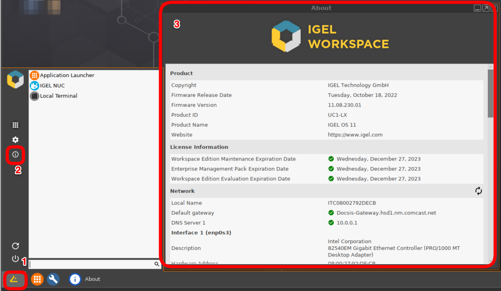

# HOWTO Channel Demo Setup Guide

<!---
----------

----------

**NOTE:** North America Channel team have UMS / ICG environment in Microsoft Azure that certified IGEL channel partners can leverage to enroll devices with configured profiles. Administrative access to UMS is limited to IGEL Channel team.

----------

----------

## Steps to follow to setup IGEL OS device

1. If device was previously in UMS, contact IGEL Channel team with the following picture from device to remove device from IGEL UMS

    

2. Once IGEL Channel team have removed device from UMS then continue to next steps
3. On IGEL OS device, open a terminal window, remove device license, and reset to factory defaults. [Reset IGEL OS device (shortcut)](https://igel-community.github.io/IGEL-Docs-v02/Docs/HOWTO-Remove-IGEL-Device-License/#reset-igel-os-device-shortcut)
4. Reboot device and reconnect to ICG (remember to enable NTP (pool.ntp.org)) – Make sure to set time / date
5. Select the 90-day eval license

[FAQ - Time Service](https://igel-community.github.io/IGEL-Docs-v02/Docs/HOWTO-COSMOS/#faq-time-service)

[IGEL KB - OS 11 - Getting a Demo License](https://kb.igel.com/en/igel-subscription-and-more/current/getting-a-demo-license)

[IGEL KB - Overview: First Steps with IGEL OS](https://kb.igel.com/en/igel-os/11.10/overview-first-steps-with-igel-os-11)

-->

----------

----------

## Steps to Test OS 12

<!---

**NOTE:** Until UMS is setup for OS 12 testing, setup OS 12 device as standalone and install apps from IGEL app portal.

-->

[Want to test out OS 12 with App Portal without UMS12?](HOWTO-Add-Applications.md#want-to-test-out-os-12-with-app-portal-without-ums12)

<!---

----------

----------

## SHI Connection Settings (IGEL Base)

| Component | Value |
|-----------|-------|
| Address | https://cosmos-icg.igelcloud.com:443 |
| UMS Structure Tag | OS11-SHI-LG-EvalCenter |
| Password | `Contact IGEL Channel for password` |

## SHI Connection Settings (IGEL Base + ControlUp)

| Component | Value |
|-----------|-------|
| Address | https://cosmos-icg.igelcloud.com:443 |
| UMS Structure Tag | OS11-SHI-LG-CUP |
| Password | `Contact IGEL Channel for password` |

----------

----------

-->