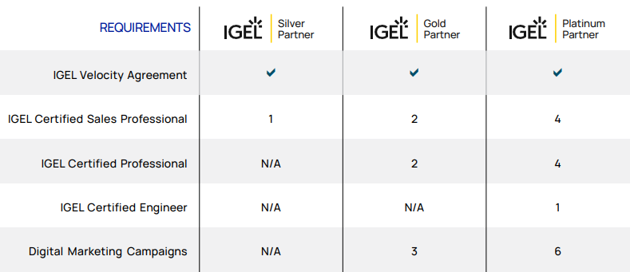
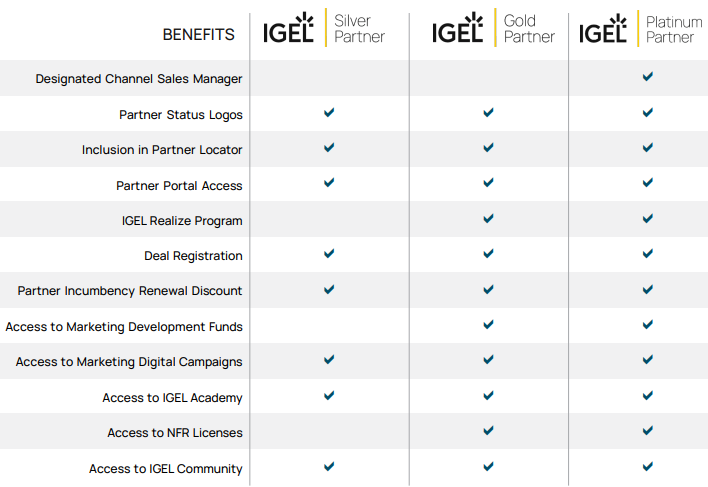

# HOWTO Channel and MSP Partners

<!---
This is a comment section
-->
## [IGEL Velocity Partner Program](https://www.igel.com/velocity-partner-program/)

## IGEL Velocity Partner Level

| Silver | Gold | Platinum |
|------------|--------|-------|
| Enter the program to be a registered IGEL partner. Obtain fundamental sales and technical proficiencies in IGEL products and solutions to develop pipeline and first sale. | Develop a dedicated IGEL practice with designated sales and technical staff, leading to new customer acquisitions, co-sell opportunities with IGEL and growing competency in providing services. | Sell the IGEL portfolio consistently, nationwide or globally, with a fully dedicated IGEL practice, driving sales, acquiring new logos, increasing wallet share, and delivering services and support. |

----------

----------

## Steps a channel partner must take to work with IGEL support for a customer support case

- Make sure the channel partner is registered on the support portal
igel academy account notes
- Have the customer open a case and provide a description

- Post a comment to the case requesting that the channel partner be added to the watch list, including the following:

    - Channel Partner Name
    - Channel Partner Contact Name
    - Channel Partner Contact Email

- IGEL Support will pick that up, and add the requested person to the watch list, and they will receive updates, and be able to respond to the case via email

----------

----------

## Channel Partner PoC steps

**NOTE:** Have the client complete the following steps ten (10) business days prior to PoC

- Register with the [IGEL License Portal](https://activation.igel.com/)

- Wait until they get an email from IGEL that says that their account has been registered and approved

- Next register in the [IGEL Customer Portal](https://support.igel.com)

- Wait until they get an email from IGEL stating that their account is ready

- Login to [IGEL Support](https://support.igel.com/)

- IGEL Trial License Activation Process – aka Delivery Tokens. Once they can log in to the ILP they can register and accept the EULA of the Delivery Token that IGEL provided

- Client request partner assistance with installing the UMS, registering it with IGEL, and next steps for the PoC

----------

----------

## IGEL Education for Partners

- [IGEL Education](https://www.igel.com/learn-and-connect/igel-education/)

- [Register Now at IGEL Academy](https://learn.igel.com)

- Contact IGEL channel team for options to access [IGEL Academy Premium](https://www.igel.com/wp-content/uploads/2023/11/IGEL_AS_IA_Premium.pdf).

### Notes for Registering with IGEL Academy

- With the new IGEL Academy, IGEL switched to using SSO (Single Sign On) and now share the same login as the IGEL Customer Portal. What this means for existing users (this is all explained on [IGEL Academy](https://learn.igel.com)):
 
    - If you have an account on the old IGEL Academy, any ACTIVE certifications and courses were migrated if they were completed on the old platform. IGEL did not migrate partially complete courses or exams.

    - Since the entire authentication process is new, you will need to re-register with the new process to regain access to your account (as long as you use the same email address. If not, IGEL will need to merge the old account with the new one after you log in).

    - There is one exception to re-registration. If you currently have a Customer Portal account (for example, you open support tickets or have used the cloud services for setting up your UMS, etc), you technically already have an account for IGEL Academy, you can just go to [IGEL Academy](https://learn.igel.com) and log in with that same account.

- There is one additional way that users can get IGEL Academy accounts. If you currently have a Custom Portal account and your account is designated as a `SuperAdmin` for your company in the Customer Portal, then you can `invite` other people from your company to have IGEL Academy accounts without them going through the registration process.
 
- You should go to [IGEL Academy](https://learn.igel.com) and then click the `Register Here` button and then fill out the requested info. You should get a verification email fairly quickly that you will need to open and click a link. Once that happens, the Customer Care team processes the registration (usually within 1 business day). If you do not get the verification email, you should check spam and if it doesn’t appear there, you can email [IGEL Registration - registration@igel.com](mailto:registration@igel.com) for help.

----------

## IGEL Academy Course Duration

### IGEL Certified Sales Professional (ICSP) (2.5 hours)

- 50 min Foundations course
- 50 min ICSP course
- 45 min for exam

**Note:** A new version of ICSP will be released in the fall of 2025. If your current certification has expired, open the ICSP Exam and select the option to `renew certification`. This will allow you to re-take the exam and renew the certification for another year.

### IGEL Certified Professional (ICP) (3 hours)

- 2 hours for course
- 60 min for the exam

### IGEL Certified Engineer (ICE) (3-4 hours)

**NOTE:** Requires IGEL Academy Premium.

- 2+ hours for course and labs
- 90 min for the exam

### IGEL Certified Architect (ICA) (2-3 hours)

**NOTE:** Requires IGEL Academy Premium.

- 2+ hours for course and labs
- 40 min for the exam

----------

## IGEL Services Specialization 

For Gold and Platinum Channel Partners who desire to deliver their own IGEL Services and Support.

**NOTE:** Duration will depend on the body of work to review and includes POC's (proof of concept) or projects worked on.

- 3-5 hours for demo session prep
- 1.5 hours for demo to IGEL channel team

### Step 1:  Presales Required Demo 

- LIVE Demo – delivered by Partner ICP/ICE certified individual(s) 

- Audience from IGEL:  

    - Channel Sales Manager / Director / VP 
    - Channel SE 
    - SE Team-Lead / VP / Field SE 

- Duration: 1 hour to 90 minutes 

    - Session will be recorded 

### Step 2: Presales Custom Demo 

- LIVE or Recorded Demo – delivered by Partner ICP/ICE certified individual(s) 

- Customer:  IGEL 

- Audience from IGEL:  

    - Channel Sales Manager / Director / VP 
    - Channel SE 
    - SE Team-Lead / VP / Field SE 

- Suggested Duration:  10-15 min 

    - Session will be recorded

----------

## IGEL Managed Service Provider (MSP)

Build and deliver valuable and secure managed endpoint services to your Customers.

- [Register for the MSP Enablement path training sessions](https://www.igel.com/learn-and-connect/webinars/igel-msp-technical-enablement-path/)

**NOTE:** MSP should already support endpoint services.

----------

## IGEL NFR Licenses and Trial Licenses

- NFR (Not for resale) licenses for internal use are available for Velocity partner level `Gold` (Qty. 15), `Platinum` (Qty. 30), `MSP Partners` (Qty. 15), and `MSP Platinum` (Qty. 30)

- Staring with UMS 12.07.100, [UMS level](https://www.igel.com/licensing/) will default to `Essential`, if a higher level is needed, IGEL Channel Presales Engineer can provide a 90 day UMS Enterprise license

    - If the UMS is registered with IGEL, then provide the IGEL Channel Presales Engineer with company name that registered the UMS and the license will be added within the IGEL License Portal (ILP)

    - If the UMS is not registered with IGEL, then provide the IGEL Channel Presales Engineer with exported UMS ID.  [IGEL KB: How to Export the UMS ID](https://kb.igel.com/en/universal-management-suite/current/how-to-export-the-ums-id). The presales engineer will create and provide a 90 day license

- `IGEL Agent for Imprivata`: 10 licenses for (30/60/90 days) can be added to IGEL registered UMS. Provide IGEL Channel Presales Engineer with company name that registered the UMS and duration of license. These will be assigned to the UMS and available for Automatic License Deployment (ALD)

- `IGEL Advanced Device Redirection (ADR)`: 10 licenses for (30/60/90 days) can be added to IGEL registered UMS. Provide IGEL Channel Presales Engineer with company name that registered the UMS and duration of license. These will be assigned to the UMS and available for Automatic License Deployment (ALD)

- For testing of IGEL OS without UMS, a 90-day license can be obtained during the setup of IGEL OS. Steps to test out your UDPocket or OS 12 installed device:

    - Boot device
    - Skip -- Let's connect to the company network
    - Skip -- Use the one-time password to onboard this device?
    - Obtain IGEL OS 12 Evaluation License -- Are you implementing as IGEL solution for your company? (This is 90 a day day evaluation license)
    - Reboot
    - Open the App Portal and install applications

### Assigning Product Packs to UMS

- Please go to your UMS ID in your ILP account and assign the Product Pack(s) to it via the + symbol:

- Perform a refresh in your UMS afterwards. The Product Pack(s) should show up in the UMS

----------

## Evaluating IGEL vs Someone Else

### Management of Devices

- Support ratio of one FTE (full time equivalent) for 20,000+ devices (1:20,000+)
- Dedicated management or management as a service

### Applications

- Module design, everything including the operating system is an application
- Distributing signed native applications (Enterprise Browsers, Imprivata, Progressive Web Apps, Linux apps) from vendor's cloud / content delivery network (CDN) or from your data centers / local sites
- Ability to create your own signed applications (IGEL App Creator Portal)

### Security and Compliance

- Chain of trust (secured boot sequence)
- Secure boot support
- FIPS 140-.2, German BSI certification, and ISO 270001
- Secure Digital Signage

### Services

- 24/7 support
- TRM (technical relationship managers)
- Advanced Services / Consulting
- Community support
- Platform as a Service for backend management servers

### Partnerships

- Defined program for working with partners
- Strong relationships with partners (Microsoft, Omnissa, Island.io, Zscaler, Palo Alto Networks, Cisco, ControlUp, eGI, Nexthink, Citrix, etc.)
- Operating system preinstalled by the vendor (HP, Lenovo, LG)

### Future-proof

- Long term vision beyond traditional products (IoT, Hypervisor, analytics, etc.)

### Updates and Architecture

- Simple to setup / maintain environment
- Module application deployment / updates (mix and match versions of apps)

### TCO

- Provides TCO calculator that can be used with actual client data for C-level discussions