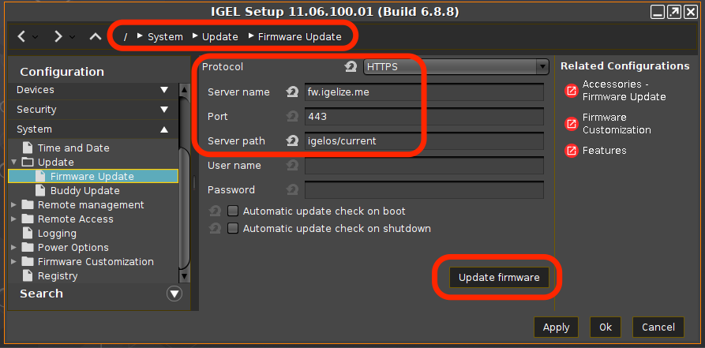

# HOWTO Collect Hardware Information for a Device

-----

## Collect Logs for IGEL Support

Command to run to collect logs, `/tmp/tclogs.zip`, for IGEL support.

```bash linenums="1"
/config/bin/create_support_information
```

**NOTE:** Details on [UMS Logs](https://igel-community.github.io/IGEL-Docs-v02/Docs/Cheatsheet-IGELCommunity/#ums-files)

-----

## Steps to collect the data

- Format a USB thumb drive on your PC (FAT or NTFS)
- Copy the collection script (see below) to USB thumb drive
- Enable Storage Hotplug (Devices > Storage Devices > Storage Hotplug)
- Plug USB thumb drive in IGEL OS device (auto mounted in /media folder)
- Open terminal window (as Root)
- Run collection script
- Safely remove USB thumb drive (Start > System > Safely Remove Hardware)
- Send zip file to your contact

-----

## Collection Script

Collection script (collect_data.sh) to copy onto thumb drive

```bash linenums="1"
#!/bin/bash
#set -x
#trap read debug

mkdir data_dump
cd data_dump

lshw > lshw_ouptut.txt
lsusb > lsusb_output.txt
lspci > lspci_output.txt
dmesg > dmesg_output.txt
alsa-info --no-upload --output alsa-infor_output.txt
rfkill list all > rfkill_list_all.txt
journalctl > journalctl_output.txt
cp /var/log/Xorg.0.log Xorg.0.log
cp /etc/os-release etc-os-release.txt
cp /wfs/group.ini wfs-group.ini
cp /wfs/setup.ini wfs-setup.ini
tar cvjf var-log.tar.bz2 /var/log

# uncomment following lines for Citrix
#mkdir citrix-logs
#cp -R /userhome/.ICAClient/logs citrix-logs

# uncomment following lines for VMware Horizon
#mkdir vmware-logs
#cp -R /tmp/vmware-user vmware-logs

# uncomment following lines for OpenSC Smart Card (scard.pkcs11.opensc.default.debug = 9 ; scard.pkcs11.opensc.default.debug_file = /tmp/opensc.log)
#mkdir opensc-logs
#cp -R /tmp/opensc.log opensc-logs

# uncomment following line if using Imprivata
#/services/imprivata/bin/fetch_support_info imprivata_logs_$(date +%y%m%d%H%M).zip

# uncomment following lines for Cisco JDVI
#/usr/bin/collect-files
#cp /tmp/VXC-* .

# run IGEL log collection
/config/bin/create_support_information
mkdir tclogs
unzip /tmp/tclogs.zip -d tclogs

# uncomment for OS 12
#igelpkgctl list installed > igelpkgctl_list_installed.txt

cd ..

zip -r data_dump.zip data_dump
```

**NOTE:** Additional logging notes:

- AVD log collection OS 11: `sessions.wvd%.options.client-log-level` set to `Debug`

- AVD log collection OS 12: `System > Registry > app > avd > sessions > avd0 > options > client-log-level` set to `Debug`

- Zoom VDI log collection: [Using the VDI log tool](https://support.zoom.us/hc/en-us/articles/360057873792-Using-the-VDI-log-tool)

-----

## Search for string (audio) in data_dump files

```bash linenums="1"
cd data_dump
find . -type f -exec echo "File NAME:  ===>> " {} \; -exec grep -i audio {} \; > /tmp/find_string_in_data_dump.txt
```

-----

## Enable Storage Hotplug (Devices > Storage Devices > Storage Hotplug)


-----

## Run Collection Script (Open Terminal Window)

```bash linenums="1"
login as "user" or "root": root
 # df -H | grep media
 /dev/sda1    17G   44M     17G   1%  /media/B2B0AB93
 # cd /media/B2B0AB93
 # ls
 collect_data.sh
 # /bin/bash collect_data.sh
 # ls
 collect_data.sh
 data_dump
 data_dump.zip
 # exit
```

-----

## Safely remove USB thumb drive (Start > System > Safely Remove Hardware)


-----

## Create Profile with all settings for a Device

These device profiles can be used to see all settings for a device and can also be used to compare two devices.

[IGEL KB - Import Devices as Profiles](https://kb.igel.com/endpointmgmt-12.01/en/import-devices-as-profiles-77864828.html)

[IGEL KB - Comparing Profiles in the IGEL UMS](https://kb.igel.com/endpointmgmt-12.01/en/comparing-profiles-in-the-igel-ums-77864660.html)

The following steps will:

- Export device settings as a profile
- Import device settings as a profile


-----

## Tips for prepping PC for IGEL OS install

- Make sure BIOS is at latest version. Check [Linux Vendor Firmware Service (LVFS)](https://fwupd.org/lvfs/docs/users). IGEL OS 11.08.XXX or newer supports [LVFS for BIOS from UMS](https://kb.igel.com/igelos-11.08/en/bios-update-for-devices-supported-by-lvfs-63806668.html).
- Make sure BIOS is set back to default settings.
- Check for and apply BIOS settings for Ubuntu 18.04.

-----

## Video driver and booting (blacklist framebuffer driver)

Framebuffer drivers are generally buggy and poorly-supported, and cause suspend failures, kernel panics and general mayhem.  For this reason we never load them automatically.

If PC firmware has a Legacy Boot option, it might interfere with the kernel’s ability to use the framebuffer during boot.

The kernel may hang on framebuffer driver. As first step in debugging, blacklist the framebuffer driver in file /etc/modprobe.d/blacklist-framebuffer.conf

 For example, add the following entry to the System/Firmware Customization/Custom Commands/Base Initialization section of IGEL Setup:

echo “blacklist efifb” >> /etc/modprobe.d/blacklist-framebuffer.conf

Save the change and reboot without the “Force VESA driver” option being set.


[IGEL OS Boot Menu Explained – Video](https://videos.igelcommunity.com/igel-os-boot-menu-explained-video/)

[IGEL KB - Boot Menu](https://kb.igel.com/igelos-11.08/en/boot-menu-63804218.html)

### Try VESA only boot

Steps:

- Reboot device
- Keep hitting ++esc++
- Select > `VESA only boot`

-----

## Improve sound quality for internal speakers or HDMI / DP

Setting to improve sound quality:

System > Registry > multimedia.pulseaudio.daemon.resample-method > speex-float-3

-----

## Touchscreen debugging

Obtain the touchscreen vendor information from the following script:

```bash linenums="1"
#!/bin/bash
tmp_dir=$(mktemp -d)
pushd $tmp_dir > /dev/null
# Export whole database
udevadm info --export-db > udevdb.txt
csplit -s udevdb.txt /^$/ {*}
FILES=./xx*
for f in $FILES
do
  if [[ ! -z $(grep ID_INPUT_TOUCHSCREEN=1 $f) ]] && [[ ! -z $(grep " NAME=*" $f) ]];
  then
        # Extract touchscreen name
        grep " NAME=*" $f | cut -d "=" -f 2
  fi
done
popd > /dev/null
rm -rf $tmp_dir
```

-----

## Access terminal console, terminal log screen, or setup

- Access to terminal console: ++ctrl+alt+f12++
- Switch back to GUI: ++ctrl+alt+f1++
- Access terminal log screen: ++ctrl+alt+f10++
- Access IGEL setup: ++ctrl+alt+s++

-----

## Extended Logging With Syslog, Tcpdump and Netlog

The IGEL Linux Registry offers a number of extended logging options that can help customers, Support and PreSales debug system and network issues.

[IGEL - KB - Extended Logging With Syslog, Tcpdump and Netlog](https://kb.igel.com/igelos-11.08/en/extended-logging-with-syslog-tcpdump-and-netlog-63803234.html)

-----

## Steps to update firmware from USB drive

- [Download OS 11 -> Firmware Updates -> lxos_[VERSION]_public.zip](https://www.igel.com/software-downloads/workspace-edition/)
- Format USB Drive on PC (FAT)
- Unzip lxos_[VERSION]_public.zip to USB drive
- Configure IGEL OS to take new firmware from USB drive
- Run update

```
1. Configure at least one hotplug USB device:
   setparam devices.hotplug.usb-storage.numdevices 1
2. Apply your changes:
   kill_postsetupd
3. Connect the USB storage device to the device.
4. Wait for the USB storage device to be mounted automatically.
5. Determine the mount point:
   ls /media/
6. Configure the update parameters:
   setparam update.protocol file
   setparam update.file.path /media/<name of USB storage device>
7. Start the update process in the / directory using the command update
   update
```

Sample script:

```bash linenums="1"
#!/bin/bash

setparam devices.hotplug.usb-storage.numdevices 1
kill_postsetupd
sleep 5
setparam update.protocol file
# next command only works if one device is mounted into /media
setparam update.file.path /media/$(ls /media)
update
```

-----

## Updating to IGEL OS - Current Version

Configure Firmware Update settings with the following parameters and then select "Update firmware":

| Parameter | Setting | Comment |
|-----------|---------|---------|
| Protocol | https | |
| Server name | fw.igelize.me | North America |
| Server name | fwemea.igelize.me | Western Europe |
| Port | 443 | |
| Server path | igelos/current | |



Sample script:

```bash linenums="1"
#!/bin/bash

# Updating to IGEL OS - Current Version

# Configure the update server
setparam update.protocol https

# North America
setparam update.https.server fw.igelize.me

# Western Europe
#setparam update.https.server fwemea.igelize.me

setparam update.https.port 443
setparam update.https.path igelos/current

#Start the update process
update
```

### North America fw.igelize.me server layout

| The layout path structure: |
|----------------------------|
| igelos/amd64 |
| igelos/arm64 |
| igelos/current |

| Under the igelos/amd64 and igelos/arm64 paths, the subpaths for the various versions of IGEL OS public and private. |
|-----------------------|
| igelos/amd64/11.08.360 |
| igelos/amd64/11.07.920 |
| igelos/amd64/11.07.170 |
| igelos/arm64/11.02.120 |

-----

## Hardware Notes

[Secured-Core PCs: Microsoft 3d-Party UEFI Certificate for Secure Boot](https://kb.igel.com/securitysafety/en/secured-core-pcs-microsoft-3d-party-uefi-certificate-for-secure-boot-70156597.html)

[Dynabook Setup TECRA A40-J (PMM10U) || Version: PMM10U-00101U](https://github.com/IGEL-Community/IGEL-Docs/blob/main/Docs/HOWTO-Dynabook-Setup.md)

[Lenovo - PSREF Product Specifications Reference](https://psref.lenovo.com/)

[Lenovo - BIOS simulator](https://download.lenovo.com/bsco/) shows how to navigate the BIOS for each hardware type.

[Laptop Docking Station - HP USB-C Dock G5](https://kb.igel.com/igelos-11.08/en/new-features-11-07-170-63805526.html). Link to HP's web site -- [LINK](https://www.hp.com/us-en/shop/pdp/hp-usb-c-dock-g5-p-5tw10aa-aba-1). This device will work for other laptops that support USB-C docks. IGEL UMS supports firmware updates to this dock.

[Microsoft Surface](https://github.com/linux-surface/linux-surface/wiki/Supported-Devices-and-Features#feature-matrix)

[How to reset USB controllers](https://unix.stackexchange.com/questions/704341/how-to-reset-usb-controllers)

```bash linenums="1"
#!/bin/#!/usr/bin/env bash
#set -x
#trap read debug
# Resets all USB host controllers of the system.
# This is useful in case one stopped working
# due to a faulty device having been connected to it.

base="/sys/bus/pci/drivers"
sleep_secs="1"

# This might find a sub-set of these:
# * 'ohci_hcd' - USB 3.0
# * 'ehci-pci' - USB 2.0
# * 'xhci_hcd' - USB 3.0
echo "Looking for USB standards ..."
for usb_std in "$base/"?hci*
do
    echo "* USB standard '$usb_std' ..."
    for dev_path in "$usb_std/"*:*
    do
        dev="$(basename "$dev_path")"
        echo "  - Resetting device '$dev' ..."
        printf '%s' "$dev" | sudo tee "$usb_std/unbind" > /dev/null
        sleep "$sleep_secs"
        printf '%s' "$dev" | sudo tee "$usb_std/bind" > /dev/null
        echo "    done."
    done
    echo "  done."
done
echo "done."
```
