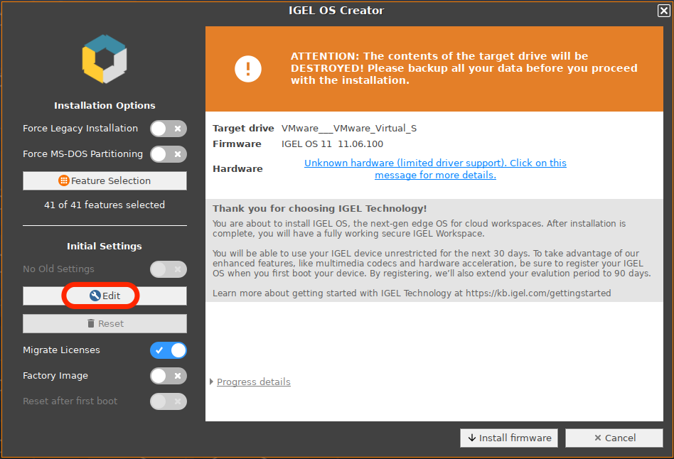
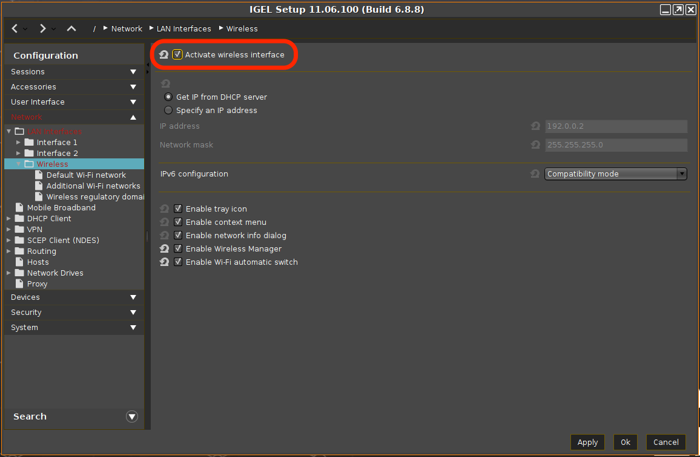

# HOWTO Edit Initial Settings Prior to OSC Install

-----

## Modify an OSC ISO image (12.9.0+) with IGEL Apps and optional additional content

- [IGEL KB: How to add Apps and other Modifcations to Your IGEL OS Installation Image](https://kb.igel.com/en/igel-os-base-system/current/how-to-add-apps-and-other-modifcations-to-your-igel-os-installation-image)

- [Use Docker to modify an OSC ISO image (12.9.0+) with IGEL Apps and optional additional content](./HOWTO-Docker.md#use-docker-to-modify-an-osc-iso-image-1290-with-igel-apps-and-optional-additional-content)

-----

## Steps to edit initial settings prior to OSC install

- Boot OSC installer
- Select "Edit" under "Initial Settings"
- Make changes, apply, and select "Ok"

-----

## Edit Initial Settings

-----

## Activate wireless interface

## Additional details can be found on IGEL KB site

[IGEL OS - IGEL OS Creator - IGEL OS Creator Manual - Installation](https://kb.igel.com/en/igel-os/current/installation-procedure)
