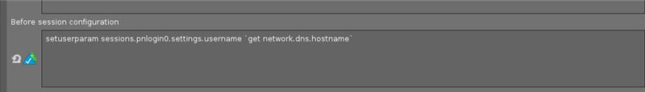
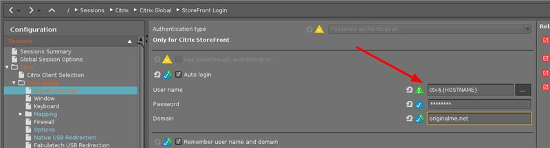
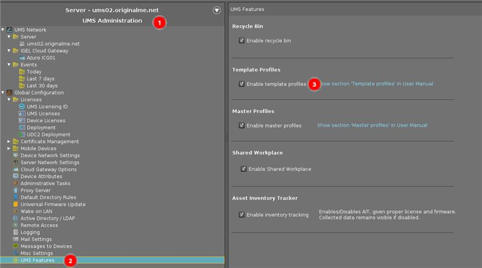

# HOWTO Use Static Template Keys

-----

## Background on why to use

Custom command could be used to set usernames for Citrix/VMWare/RDS as the "hostname" of the device, or something that contains the "hostname" of the device.

**Example:**

This may cause problems as the session sometimes starts before that command can run.

-----

## Steps to Setup Static Template Keys

Static template keys are not visible in the navigation tree; their values are received directly from the thin client. Static template keys are marked with the § symbol. The following static template keys are available:

- **MAC:** MAC address of the thin client
- **HOSTNAME:** Host name of the thin client
- **UNITID:** Unit ID of the thin client

**Example:**

Please note that you will need to enable the "template profiles" in order to see these options in UMS.

[IGEL Knowledge Base - Using Template Keys in Profiles](https://kb.igel.com/endpointmgmt-6.10/en/using-template-keys-in-profiles-57321406.html)
