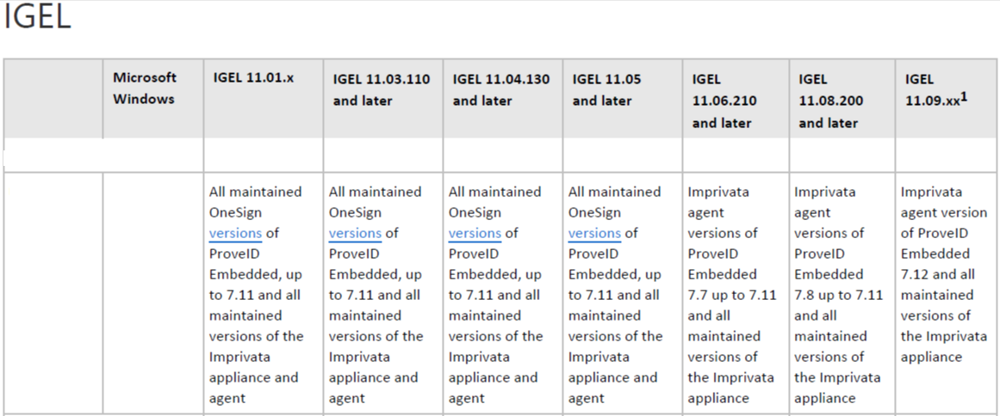

# HOWTO Imprivata Notes

## [IGEL Knowledge Base -- Configuration of the IGEL Agent for Imprivata on IGEL OS](https://kb.igel.com/en/igel-apps/current/configuration-of-the-igel-agent-for-imprivata-on-i)

## [IGEL Knowledge Base -- Imprivata](https://kb.igel.com/en/igel-os/11.10/imprivata-1)

## [IGEL Knowledge Base -- Imprivata Articles](https://kb.igel.com/en/igel-os/11.10/imprivata-1)

**Notes:**

- Certificate path for IGEL Agent for Imprivata: `/wfs/ca-certs/`
- Certificate path for PIE Imprivata: `/wfs/ca-certs/<cert>`
- Imprivata appliance needs to have constant contact with devices. Please check with your Imprivata support team for supported options for off network devices.  Off network devices may either need [VPN](HOWTO-VPN.md) or internet facing Imprivata appliance.

-----

-----

## Imprivata Versions for IGEL OS



**NOTE:** See the following Imprivata document for details: 

`Product Documentation: Supported Components - Imprivata OneSign Last Updated: December 04, 2023`

-----

## Collect Imprivata Log Files

-----

### Where are the log files?

The the log files for Imprivata ProveID Embedded agent are located in:

```
/.imprivata_data_runtime/log
```

**NOTE: Need to be root to access**  

The log files for IGEL Agent for Imprivata on IGEL OS

```
/var/log/user/IGELImprivataAgent.log
```

-----

### Steps to collect the log files (as root) for Imprivata ProveID Embedded agent

```bash linenums="1"
#!/bin/bash
# Need to be run as root

/services/imprivata/bin/fetch_support_info /tmp/imprivata_logs_$(date +%y%m%d%H%M).zip
```

-----

## 11 March 2024 - Self healing for IGEL 11.09 & Imprivata PIE 7.12

[When upgrading to IGEL 11.09 you may find Imprivata PIE 7.11 will not upgrade to 7.12](https://mwood.substack.com/p/self-healing-for-igel-1109-and-imprivata)

-----

## 8 July 2024 - Update

**Proximity Readers Become Unavailable**

Imprivata PIE 7.12 HF5 resolves issue with PIE 7.11 HF3 and above.

-----

## 7 March 2024 - Update

**IMPORTANT INFO:  IGEL Agent for Imprivata and VMWare Auth Only workflows**
 
- **Do Not Upgrade to 11.09.260**
 
- **How this works:**  In the Auth Only mode, IGEL OS receive encrypted credentials back from the Imprivata appliance (username, password, domain) and then “stuff” them into the right parameter fields for the different applications IGEL support for the Auth Only workflow (AVD, Citrix WSA, Horizon, MS RDP). 
 
- **CAUSE:**  In 11.09.260, there’s a parameter change with the Horizon Client that will likely break the “stuffing of credentials” mechanism IGEL use for Auth Only.  IGEL is looking into this and they will have additional guidance later.
 
**NOTE:** AVD, Citrix WSA and MS RDP clients are not impacted for the Auth Only workflow.
 
**GUIDANCE:** IAFI customers testing / using VMWare Auth Only should remain on 11.09.150 (or any branch based on that release).
 
**For example:**

- 11.09.210 is OK to use as it’s based off 11.09.150. 
- Any [branch](https://igel-community.github.io/IGEL-Docs-v02/Docs/ReleaseNotes/01-OS11/) based off 11.09.210 (with the exception of 11.09.260) is ok to use.

-----

## 3 February 2024 - Update

Imprivata made a change in the PIE 7.12 agent by updating their Python version which in turn required IGEL to update the PIE bootstrap loader starting in 11.09.100.

This bootstrap loader is not backwards compatible with 11.08.xx or lower and also requires the 7.12 PIE agent or higher.
 
IGEL recommends to disable appliance mode `BEFORE` upgrading to 11.09.100.

**NOTES:** 

- Imprivata’s KB article may state to disable applicance mode `AFTER` the IGEL OS upgrade.
 
- This issue does not impact the IGEL Agent.  For IGEL agent, the current IGEL OS versions to use are:
 
    - 11.09.150 (or any higher version based on this version)
    - OS 12 app 0.3.8 or higher

-----

## 20 December 2023 - Update

### TLS 1.3 with IGEL OS 11.09.xxx and PIE 7.12

When updating to IGEL OS 11.09.xxx and Prove ID Embedded 7.12 or later, ensure that TLS 1.3 is enabled on F5 or ADC/NetScaler. If it is not, then may no longer be able to connect to Citrix Virtual Apps and Desktops.

-----

## 17 November 2023 - Update

### Issue with TLS v1.3 (Windows Server 2019 and Windows 10)

**NOTE: From Imprivata Support:** For an environment Windows Server 2019 and Windows 10. The 7.12 PiE agent on 11.09.X is failing to connect to Citrix farms due to authentication failures with TLS v1.3. There seems to be some kind of PiE agent 'fallback' feature to TLS v1.2 but at least in some cases that 'fallback to TLS 1.2' doesn't work as expected. Imprivata Support linked to this article: [TLS protocol version support](https://learn.microsoft.com/en-us/windows/win32/secauthn/protocols-in-tls-ssl--schannel-ssp-#tls-protocol-version-support)

-----

## 14 November 2023 - Bad Magic number in MainLoader

### Installing PIE 7.12 on IGEL OS with firmware version 11.09.100 getting error - bad magic number in 'MainLoader'

- New G4 appliance and installed 23.2 HF2.

- PIE Version: 7.12

- IGEL environment: Current Firmware: 11.09.100 and 11.09.110

- Steps to Reproduce

```
After upgrading to OneSign G4 appliance running 23.2 HF2. PIE Agent 7.12.

IGEL OS is running 11.09.110.

We are receiving the following error message.

2023-11-08 01:06:20,255 - bootstrap - ERROR: Failed to import main loader. Reason: bad magic number in 'MainLoader': b'\x03\xf3\r\n'
2023-11-08 01:06:26,824 - PythonVersionCheck(_log,1613) - DEBUG: Check 'use python3 only' flag
2023-11-08 01:06:26,824 - PythonVersionCheck(_log,1613) - DEBUG: Use python3 only flag exists
2023-11-08 01:06:27,062 - bootstrap - Level 1000: Imprivata Bootstrap version: 7.12.0.688624 built: Thu Aug 24 01:31:37 EEST 2023
2023-11-08 01:06:27,126 - bootstrap - INFO: Trying to import main loader...
2023-11-08 01:06:27,127 - bootstrap - ERROR: Failed to import main loader. Reason: bad magic number in 'MainLoader': b'\x03\xf3\r\n'
```

Resolution

Please perform the following steps in order:

```
1. Run command to clear PIE data: ImprivataBootstrap -w

2. Delete folders if they still exist:

/.imprivata_data/runtime/lib/MainLoader
/.imprivata_data/runtime/lib/proveid-embedded

3. Go to IGEL Setup -> Sessions -> Appliance Mode -> Set Disabled for appliance mode

4. Reboot device

5. Enable Appliance Mode

6. Make sure that appliance in step 5 has PIE 7.12 version. It should not contain PIE 7.11 or older.

7. Test and see if this resolves the issue.

If this doesn't help, you can also try to remove all PIE IPMs from appliance and then upload PIE 7.12 IPM to be sure that it is uploaded without issues into appliance.
```

### Profiles to automate IGEL upgrade from 11.08.xxx or lower to 11.09.XXX

- <a href="../Profiles/HOWTO-Imprivata-Notes-Disable-Appliance-Mode-profile.xml" download>LINK to Imprivata Disable Appliance Mode Profile</a>

- <a href="../Profiles/HOWTO-Imprivata-Notes-Update-Wait-for-Network-profile.xml" download>LINK to Imprivata Update Wait for Network Profile</a>

**NOTE:** From the Imprivata Appliance side, the customer can already have 7.12 or older PIE agents installed and the Computer Policy on the 11.08.xx or 11.09.xx devices can be set to install the latest PIE version. Customers should not have to modify their computer policy settings. Disabling appliance mode needs to occur either before or after the upgrade and then reenable it on 11.09.100 or higher to install the 7.12 agent.

-----

## 28 August 2023 - Update

### Prove ID Embedded Setup notes

Prove ID Embedded needs the local windows that popup as you manage the device to show through the PIE lock screen.

Add the below  WM_Class strings in the Imprivata Admin console at "gear icon" -> ProveID Embeded -> "Add Application" (also enable allow access to all variants checkbox on each one)

- For the UMS Send message: `qt_message`
- For reboot and UMS sent new configuration dialog boxes: `Gtkmessage`
- For desktop notification in lower right (network starting): `Xfce4-notifyd`
- For the Display switcher and the confirm dialog: `igel_display_switcher`

-----

## 28 December 2022 - Update

Imprivata has finished the qualification of OS 11.08.200 and backed it up to OneSign 7.8 or higher. Any IGEL / Imprivata customer/prospect should skip over 11.07.xx versions and use 11.08.200 or later. 11.08.200 contains fixes for the Persistent App workflow. There are other fixes for the PIE vendor helper script that have had positive results in VMWare environments on older / lower performing hardware.

Combination to test with:

- IGEL OS 11.08.200 +
- Imprivata Appliance version 7.9 HF3
- Imprivata PIE Agent 7.9.003.0039

-----

## 8 September 2022 - Using default directory rules with appliance mode

An issue may occur when using default directory rules with appliance mode, where appliance mode starts, but Imprivata does not start. This also occurs with all the other appliance modes, but most frequently comes up with Imprivata. The following profile can be assigned to the default directory, and then Imprivata (or other session) will start normally. This makes the device reboot one extra time, but the reboot happens automatically. This may be resolved by IGEL in a future release of IGEL OS, but the root cause has not yet been identified.

<a href="../Profiles/HOWTO-Imprivata-Notes-Appliance-Mode-DDR-Workaround-profile.xml" download>LINK to Imprivata Appliance Mode DDR Workaround Profile</a>

-----

## 22 August 2022 - Unable to access OS feature menus after upgrading the Linux thin clients to PIE 7.7 and above

- Issue: After upgrading the IGEL clients with ProveID Embedded 7.7 we are unable to access the menus from the IGEL OS, preventing our users to accessing the Display Switch and Sound Settings functionality.

- Cause: This is caused by a security feature that has been implemented in Imprivata 7.7 that hides any application that tries to be displayed on top of the PIE lock screen if it hasn't been previously allowed.

- Resolution: In order to allow an application to be displayed on top of the PIE lock screen, some information will need to be collected previously for the PIE agent to detect this screen correctly.
    - The fastest way to collect this information is to exit the PIE agent by pressing Ctrl + Power Menu Arrow Up, this should display the option to Exit the PIE agent. Please note that the Computer Policy applied to this Linux Thin Client will need to allow the users to exit the OneSign agent.
    - Once the PIE agent has been exited, the Linux Thin Client lock screen will be shown, we should now be able to invoke the desired OS feature (Display Switch, Sound Settings), launch the desired menu that needs to be allowed and then SSH with root access to the Linux device.
    - In the SSH session, execute the following two commands to start gathering the information about the window menu that needs to be allowed, when this is executed the cursor will change to a cross symbol.

    ```bash linenums="1"
    export DISPLAY=:0
    xprop
    ```

    - Click on the desired window, and then collect the following information from the SSH session, note that many more lines will be shown.

    ```bash linenums="1"
    WM_CLASS(STRING) = "sun-awt-X11-XFramePeer", "IGEL Setup"
    WM_NAME(STRING) = "IGEL Setup 11.05.133.01 (Build 6.7.5)"
    ```

    - Please note that the above information is only an example.
    - With the information gathered, navigate to the Imprivata Admin Console, and then on the Gear icon, select the ProveID Embedded option. In this menu you will have the option to create an allowed application with the information gathered.
    - For more detailed information on the above steps or different methods to gather this information, please visit the Imprivata Documentation regarding this functionality on the page below: [Allowing an Application Window Atop the ProveID Embedded Lock Screen](https://support.imprivata.com/CommunitySecureHelpRedirect?helpLink=Topics/ImprivataPlatform/VDA/ProveIDEmbedded/App_Atop_PIE_Lock_Screen.htm)

-----

## Change Imprivata ReadTimeout and WriteTimeout

-----

### Steps to change ReadTimeout and WriteTimeout

Edit Imprivata.conf file to reduce the Failovertime from 8 minutes to one minute.

Create a profile and add the following command to custom commands - Desktop - Before desktop starts:

```bash linenums="1"
sed '/\[agent\]/i [mainloader.SSL]\nReadTimeout=15\nWriteTimeout=15\n ' /usr/lib/imprivata/runtime/etc/Imprivata.conf
```

**Note:** A reboot is required after applying profile

-----

## Allowing an Application Window Atop the ProveID Embedded Lock Screen

You may want to allow an application window to appear on top of the Imprivata ProveID Embedded lock screen on some endpoints.

For example, you may want a VNC (Virtual Network Computing) prompt used for remote control of an endpoint, or an IGEL setup menu, to be available while an endpoint is locked. To allow this, you must specify in a lock screen access list any application windows that you want to appear atop the lock screen. This requirement ensures that undesired application windows stay off the lock screen and avoid exposing Protected Health Information (PHI) or Personally Identifiable Information (PII).

**NOTE:** If you used ProveID Embedded configuration options focus-on-overlap and unmap-popup-windows to allow or to prevent application windows or pop-ups atop the lock screen in OneSignConfirm ID 7.3 through 7.6, then starting with OneSignConfirm ID 7.7, you must instead use the procedure described below. Configuration options focus-on-overlap and unmap-popup-windows are no longer supported. If they remain in the imprivata.conf configuration file on an Imprivata ProveID Embedded endpoint, they are ignored.

### Procedure Overview

To enable an application window to appear atop the Imprivata ProveID Embedded lock screen, you first get one, two, or three Windows metadata field values for that application's display window to uniquely identify that window. You then enter one or more of those values in a page of the Imprivata Admin Console and then reboot your ProveID Embedded endpoints.

There are two ways to get the metadata field values for an application window from an Imprivata ProveID Embedded endpoint: from a log file or by using the xprop utility. Read both methods described below and choose one to do.

#### Getting Metadata Field Values for an Application Window from a Log File

To get the metadata field values from a log file, follow this procedure on one Imprivata ProveID Embedded endpoint:

1. Enable logging of application window activity. Set ProveID Embedded configuration option `log-activity = True` in the [windows.monitor] section of the Imprivata.conf configuration file. Edit the Imprivata.conf file located in /imprivata folder:
```bash linenums="1"
    [windows.monitor]
    log-activity = True
```
2. Launch the application that you want to appear above the Imprivata ProveID Embedded lock screen. This launch should add entries to the Imprivata ProveID Embedded agent log for that application.
3. Get or copy the Imprivata ProveID Embedded agent log file at location `/.imprivata_data_runtime/log`
4. Idenity the metadata field values for the target application's window in the log file.
Window activity log items contain the string Agent.WindowsActivity. Look for string: Agent.WindowsActivity(_log,1277) - DEBUG: Create window call end.
A complete line will look similar to this:
2021-09-03 10:31:53,723 - Agent.WindowsActivity(_log,1277) - DEBUG: Create window call end. ID:"58720259"**;WMClass:"Vncgui";WMName:"Shadowing on";WMAppInterface:"vncgui";**
The application window's WMClass, WMName, and WMAppInterface Windows metadata attributes and values are shown here in **boldface**. Note that an app window may not have all three attributes.
5. Make note of the metadata field values and go to **Adding Metadata Field Values to the Admin Console and Rebooting Endpoints**.

### Getting Metadata Field Values for an Application Window using the xprop Utility

To get the metadata field values for an application window by using the xprop utility, follow this procedure on one Imprivata ProveID Embedded endpoint:
1. Run export DISPLAY=:0;
2. Run xprop;
A special crossed cursor will appear on the screen.
3. Select the window of the application you want to appear above the lock screen.
A full list of the window's attributes should be displayed, as shown in this example for an IGEL setup window:
```
root@ITC00E0C5217062:~# export DISPLAY=:0
root@ITC00E0C5217062:~# xprop

_NET_WM_ALLOWED_ACTIONS(ATOM) = _NET_WM_ACTION_CLOSE, _NET_WM_ACTION_ABOVE, _NET_WM_ACTION_BELOW, _NET_WM_ACTION_FULLSCREEN, _NET_WM_ACTION_MOVE, _NET_WM_ACTION_RESIZE, _NET_WM_ACTION_MAXIMIZE_HORZ, _NET_WM_ACTION_MAXIMIZE_VERT, _NET_WM_ACTION_SHADE, _NET_WM_ACTION_MINIMIZE, _NET_WM_ACTION_CHANGE_DESKTOP, _NET_WM_ACTION_STICK
WM_STATE(WM_STATE): window state: Normal

icon window: 0xcce8f200
_NET_WM_DESKTOP(CARDINAL) = 0
_NET_WM_WINDOW_TYPE(ATOM) = _NET_WM_WINDOW_TYPE_NORMAL
_MOTIF_WM_HINTS(_MOTIF_WM_HINTS) = 0x3, 0x1, 0x1, 0x0, 0x0
_MOTIF_DRAG_RECEIVER_INFO(_MOTIF_DRAG_RECEIVER_INFO) = 0x6c, 0x0, 0x5, 0x0, 0x7, 0x0, 0x20, 0x4, 0x0, 0x0, 0x0, 0x0, 0x10, 0x0, 0x0, 0x0
XdndAware(ATOM) = BITMAP
_NET_WM_STATE(ATOM) = _NET_WM_STATE_FOCUSED
WM_HINTS(WM_HINTS):
Client accepts input or input focus: False
Initial state is Normal State.
_NET_FRAME_EXTENTS(CARDINAL) = 4, 4, 25, 4
_NET_WM_ICON(CARDINAL) = Icon (32 x 32):_NET_WM_PID(CARDINAL) = 918159
WM_CLIENT_MACHINE(STRING) = "ITC00E0C5217062"
WM_PROTOCOLS(ATOM): protocols WM_DELETE_WINDOW, WM_TAKE_FOCUS
```
**WM_CLASS(STRING) = "sun-awt-X11-XFramePeer", "IGEL Setup"**
```
WM_CLIENT_LEADER(WINDOW): window id # 0x4200008
_NET_WM_ICON_NAME(UTF8_STRING) = "IGEL Setup 11.05.133.01 (Build 6.7.5)"
WM_ICON_NAME(STRING) = "IGEL Setup 11.05.133.01 (Build 6.7.5)"
_NET_WM_NAME(UTF8_STRING) = "IGEL Setup 11.05.133.01 (Build 6.7.5)"
```
**WM_NAME(STRING) = "IGEL Setup 11.05.133.01 (Build 6.7.5)"**
```
WM_NORMAL_HINTS(WM_SIZE_HINTS):
user specified location: 107, 141
program specified location: 107, 141
program specified size: 1398 by 757
window gravity: NorthWest
```
If, however, you get xprop error xprop: error: Can't grab the mouse, then the cursor is occupied by another window such as a popup menu. Free the cursor from that window and try again.
4. Identify the metadata field values for the target application’s window in the displayed list. In the example above they are shown in **boldface**.
The syntax of the boldfaced WM_Class line is: `WM_CLASS(string) = "WMAppInstance", "WMClass"`
So in the example line from above, `WM_CLASS(STRING) = "sun-awt-X11-XFramePeer", "IGEL Setup"`
the value `sun-awt-X11-XFramePeer` is a `WMAppInstance` window attribute and `IGEL Setup` is a `WMClass` window attribute. Similarly, `WM_NAME` string value `IGEL Setup 11.05.133.01 (Build 6.7.5)` is a `WMName` window attribute. Note that an app window may not have all three attributes.
5. Make note of the metadata field values and go to the next section, **Adding Metadata Field Values to the Admin Console and Rebooting Endpoints**.


### Adding Metadata Field Values to the Admin Console and Rebooting Endpoints

To add the metadata field values for the application window to the Admin Console:
1. In the Admin Console, select the gear icon and then in the drop-down menu, select **ProveID Embedded**. A **ProveID Embedded** page opens, showing **Lock screen access**.
2. Select **Add application**. A **Lock screen access: add application** page opens.
3. Enter an application name in the **Application nickname** field. This field simply identifies the entry in the lock screen access list.
4. Enter in one or more of the **Name**, **Class**, and **App instance** fields the metadata values you found using either Getting Metadata Field Values for an Application Window from a Log File or Getting Metadata Field Values for an Application Window using the xprop Utility.

  - **4a.** For the **App instance** field, enter the `WMAppInterface` or the `WMAppInstance` attribute you found, depending on which discovery method you used. Those two slightly different log entry names identify the same attribute.

  - **4b.** Entering metadata values in two or three fields, rather than in only one field, can help ensure that only the desired application window is allowed atop the lock screen.

  - **4c.** No error checking occurs for the field values. If you enter an incorrect value, the Admin Console accepts it, but the system does not allow the desired window above the lock screen.
  - **4d.** If you enable **Allow access to all variants of this application**, this implements a match to any application window on the endpoint whose Windows metadata fields contain the field values you specify. If you enable this option, be careful to ensure that you do not get undesired windows appearing atop the lock screen. If you don't enable this option, exact matches are required for the field values you specify.

`Click Save`.

5. Reboot your ProveID Embedded endpoint to cause the new configuration value to take effect for that endpoint.
6. Test viewing the application window atop the Imprivata ProveID Embedded lock screen on that endpoint:

  - **6a.** If the application is a native application, trigger the Imprivata ProveID Embedded lock screen and then launch the application using a hotkey or some other method. You cannot launch native apps from the ProveID Embedded agent interface.
  - **6b.** If your application is virtual, launch the application and then trigger the Imprivata ProveID Embedded lock screen.
The application should stay atop the lock screen.

  - **6c.** If it does not, review the metadata field values where you obtained them and in the Lock screen access list in the Admin Console. If needed, obtain fresh metadata field values. Correct any errors in the metadata values in the Admin Console. Then return to step 5. If one or more undesired application windows appear atop the lock screen, deselect checkbox **Allow access to all variants of this application** if it is checked. Then return to step 5.

7. Reboot all other Imprivata ProveID Embedded clients for which you want the new configuration value to take effect, for example, all Imprivata ProveID Embedded clients at a site or in the enterprise.

8. If you enabled logging of application window activity on one Imprivata ProveID Embedded endpoint in Getting Metadata Field Values for an Application Window from a Log File, disable that logging. Reset configuration option log-activity to false in the [windows.monitor] section of the imprivata.conf configuration file on that endpoint.

```
How to get misc apps accessible in Imprivata appliance mode (appliance mode checkbox doesn’t work anymore).

Look for the WMClass etc..

Values to add in exceptions list on the Imprivata aplliance.

Edit the Imprivata.conf file located in /imprivata folder.

[windows.monitor]
log-activity = True

Tip: use tail to look for WMCLass in the log file:

tail -f /usr/lib/imprivata/runtime/log/OneSignAgent.log | grep WMClass

The xprop method requires the following two exceptions:

Application Nickname:  IGEL Screensaver 1
Name (WMName):  screensaver
Class (WMClass):  ScreenSaverD
App instance (WMAppinstance):  screensaverd

Application Nickname:  IGEL Screensaver 2
Name (WMName):  igel_screensaver
Class (WMClass):  Igel_screensaver
App instance (WMAppinstance):  igel_screensaver
```

-----

## Sample setup of Imprivata with a screensaver that locks

The screensaver settings are in the Imprivata Appliance Computer Policy set for IGEL ProveID devices.

Steps:

- First make sure the IGEL devices have NO screensaver set (either via a Screen Saver Policy or Firmware Customization)
- Enable Imprivata Appliance Mode via a Policy
- Have Imprivata administrator edit the IGEL Computer policy to set the following in the Walk-Away Security section (see screenshots below)

**Note:** This example is a screensaver that hides the screen at 2 minutes, and locks at 15 minutes.


-----

## Getting Metadata Field Values for Conky Window using the xprop Utility


Steps:

- Open a terminal window as user and run `xprop`
- Move the mouse cursor over the `Conky` window and `click mouse button`

Output from `xprop` on `Conky` window:

```
_NET_FRAME_EXTENTS(CARDINAL) = 0, 0, 0, 0
_NET_WM_ALLOWED_ACTIONS(ATOM) = _NET_WM_ACTION_CLOSE, _NET_WM_ACTION_ABOVE, _NET_WM_ACTION_BELOW, _NET_WM_ACTION_FULLSCREEN, _NET_WM_ACTION_MOVE, _NET_WM_ACTION_RESIZE, _NET_WM_ACTION_MAXIMIZE_HORZ, _NET_WM_ACTION_MAXIMIZE_VERT, _NET_WM_ACTION_CHANGE_DESKTOP, _NET_WM_ACTION_STICK
WM_STATE(WM_STATE):
window state: Normal
icon window: 0xe1b01100
_NET_WM_DESKTOP(CARDINAL) = 0
_NET_WM_STATE(ATOM) = _NET_WM_STATE_SKIP_TASKBAR, _NET_WM_STATE_BELOW
_WIN_LAYER(CARDINAL) = 0
_MOTIF_WM_HINTS(_MOTIF_WM_HINTS) = 0x2, 0x0, 0x0, 0x0, 0x0
_NET_WM_WINDOW_TYPE(ATOM) = _NET_WM_WINDOW_TYPE_NORMAL
WM_PROTOCOLS(ATOM): protocols  
WM_NAME(STRING) = "conky (ITC6845F1391E31)"
WM_LOCALE_NAME(STRING) = "en_US.UTF-8"
```
**WM_CLASS(STRING) = "Conky", "Conky"**

```
WM_HINTS(WM_HINTS):
Client accepts input or input focus: False
Initial state is Normal State.
WM_CLIENT_MACHINE(STRING) = "ITC6845F1391E31"
WM_COMMAND(STRING) = { "/usr/bin/conky" }
```


-----

## Tips / Notes

Location of the configuration file: `/usr/lib/imprivata/runtime/etc/Imprivata.conf`

Edit the file with nano editor: `nano /usr/lib/imprivata/runtime/etc/Imprivata.conf`

```bash linenums="1"
[windows.monitor]
log-activity = True
```

Monitor the log file: `tail -f /usr/lib/imprivata/runtime/log/OneSignAgent.log`

-----

## FAQ

**Q:** What is the best method to lock display?

**A:** Use Imprivata’s fade to lock functionality rather than configuring the screensaver on the local IGEL OS - you can configure this from the IGEL computer policy OR VM computer policy

**Q:** How to verify the Imprivata Appliance Certificate

**A:** IGEL supports the Imprivata appliance cert(s) in either the .crt or .cer format.  Newer appliances often download as a .crt. When uploading the certificate to UMS, make sure to select the file as "SSL Certificate".  Once the certificate is deployed to the device, it will install in the /wfs/ca-certs directory. On the device the certificate can be verified by opening a terminal window and running the following command `cd /wfs/ca-certs; openssl verify ssoCA.crt`  or `cd /wfs/ca-certs; openssl verify ssoCA.cer`

**Q:** How to reset device in appliance mode if the agent installation is no longer working?

**A:** Steps: `(1)` In UMS, move the device to a directory where the Imprivata appliance mode is disabled; `(2)` Then reboot - The reboot makes sure the old Imprivata data partition is gone; `(3)` Move the device back into the directory to re-enable the Imprivata Appliance mode.

**Q:** When using multiple monitors with Imprivata PIE agent (appliance mode), how to keep login screen on specific monitor?

**A:** By default the login screen will show on the default display (1 if you are using a profile). You can set the default display in DisplaySwitch or by forcing 1 to be output via a specific video card / port (Card 1, HDMI 1).

**Q:** How to exit Imprivata agent to go to IGEL configuration screen?

**A:** Steps to setup

  - Login to OneSign Admin UI
  - Go to Computer Policies tab and select computer policy assigned to IGEL (ProveID Embedded) client
  - In the General section, scroll down to `Authentication`
  - Select `Yes` to `Allow Users to Exit and Disable Agent`

Once the above option is enabled in computer policy (sync and reboot IGEL device(s)) you can right click on turn off button right hand side of the screen:

  - Hold down ++ctrl++ and right click on the power button

-----

## Sample Scripts

### Reset Imprivata

```bash linenums="1"
#!/bin/bash

#view logged messages
#journalctl | reset_imprivata
#Eike Schwoeppe
#braincon GmbH
#05.09.2024
#IGEL Community rocks#

#Logging action
ACTION="reset_imprivata_${1}"
#output to systemlog with ID and tag
LOGGER="logger -it ${ACTION}"
#Starting script
$LOGGER "Starting reset imprivata Script in 5 min"
sleep 300

if [ -a /.imprivata_data/runtime/offline/Agent/FirstDomain.txt ]
then
	$LOGGER "Imprivata successfully deployed"

else
	$LOGGER "Imprivata not successfully deployed. Reset  / Update and Reboot"
	ImprivataBootstrap -w
    rm -r /.imprivata_data/runtime/lib
    update
	reboot
fi
$LOGGER "End"
exit 0
```