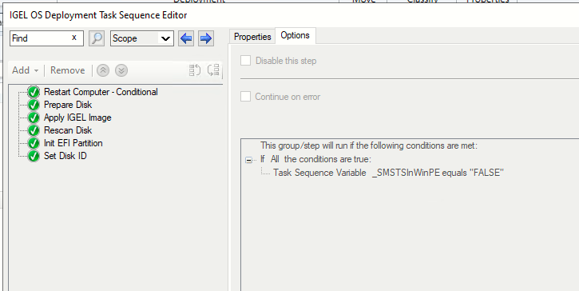
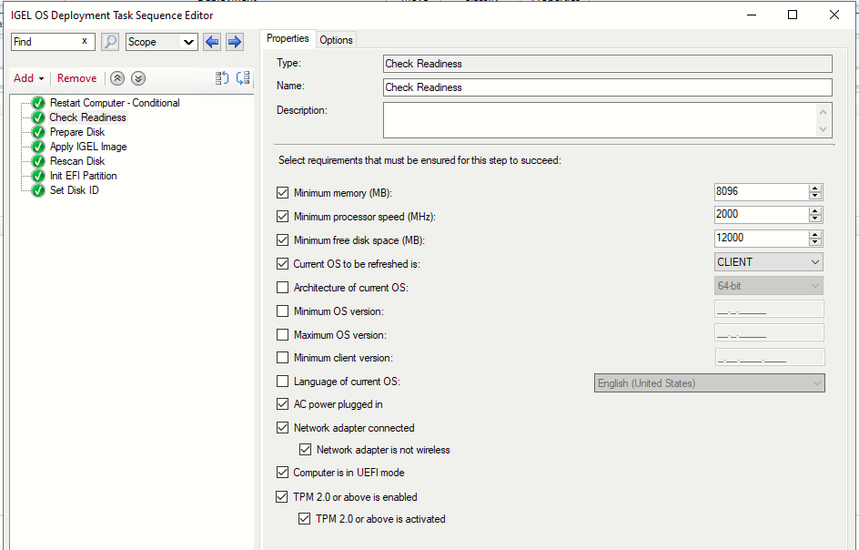
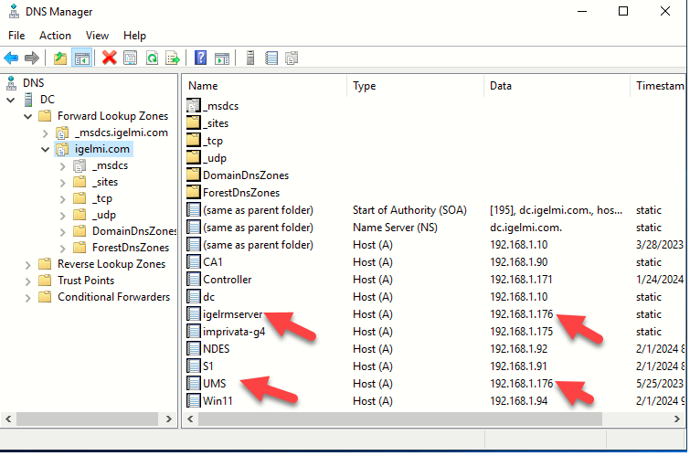
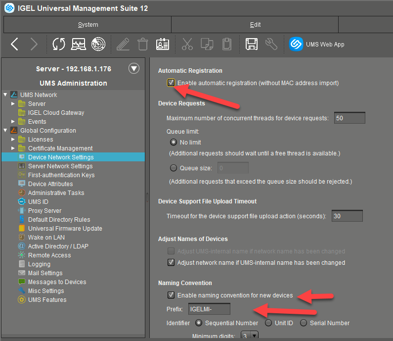
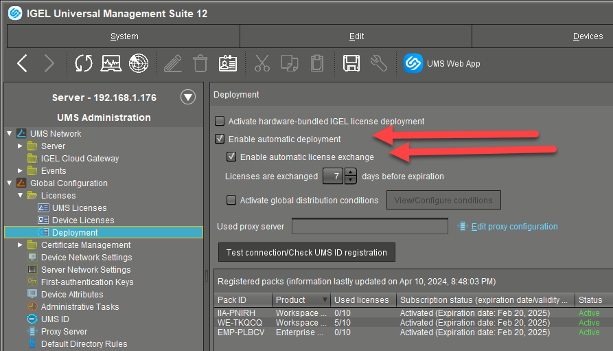
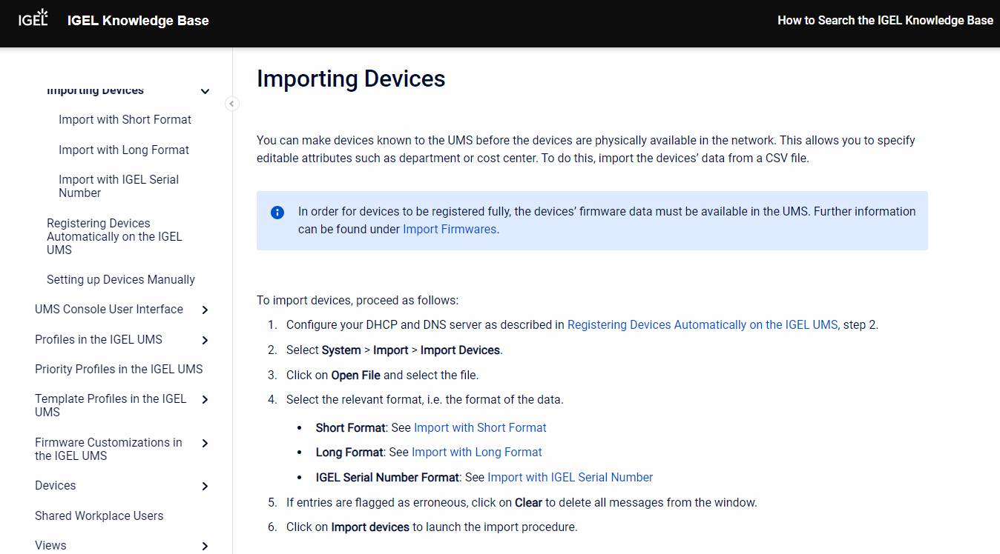
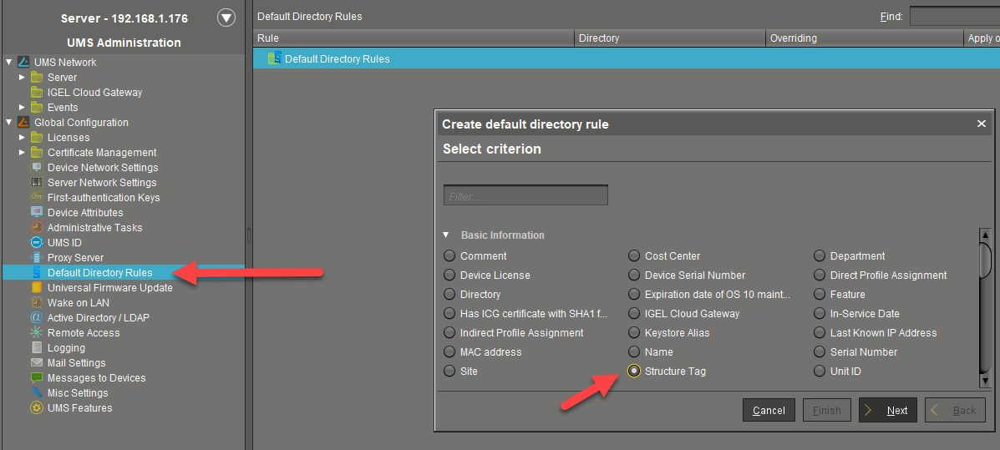
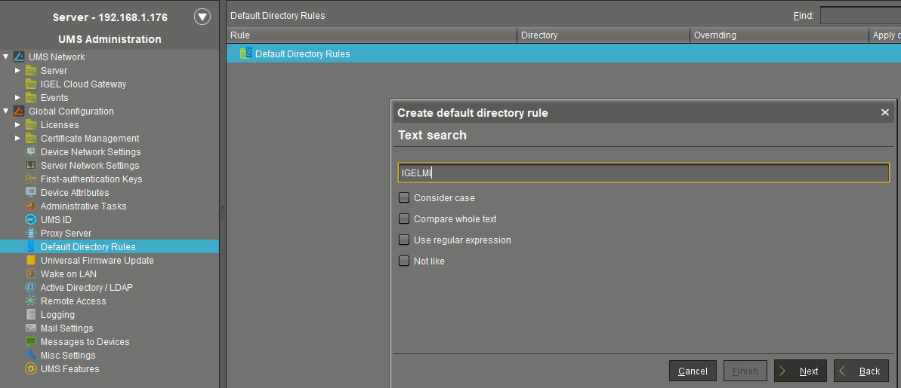
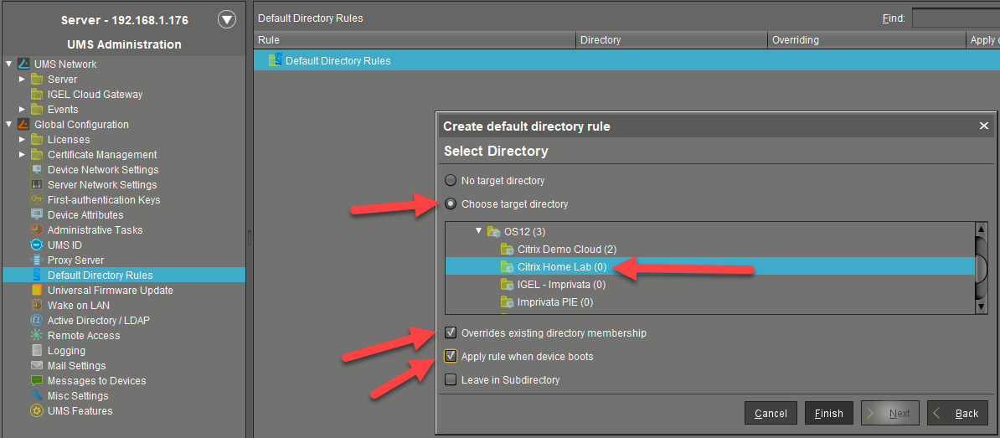
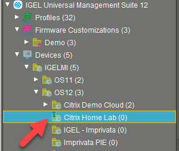

# HOWTO Light and Zero Touch Deployments of OS 12

**Note:** Options for how to deploy IGEL OS in either a light touch or zero touch manner.

-----

## OS Creator – Unattended

- [Make OSC Unattended ISO Boot](https://github.com/IGEL-Community/IGEL-Custom-Partitions/tree/master/CP_Source/Tools_Drivers/Make_OSC_Unattended_ISO_Boot)
- Great for small remote locations, repeat testing, and virtual machines
- Does not scale

<iframe width="560" height="315" src="https://www.youtube.com/embed/MTyl-E_bOUY?si=Jvn7q24AcyPIkRXn" title="YouTube video player" frameborder="0" allow="accelerometer; autoplay; clipboard-write; encrypted-media; gyroscope; picture-in-picture; web-share" referrerpolicy="strict-origin-when-cross-origin" allowfullscreen></iframe>

-----

## UMS PXE

- [How to Deploy IGEL OS 12 with PXE](https://kb.igel.com/en/igel-os-base-system/12.4.2/how-to-deploy-igel-os-12-with-pxe)
- More scalable than USB
- Zero touch after device is PXE booted
- Requires internet access
- Medium-high difficulty to setup
- Lots of moving parts. (DHCP, tftp server, web server, UMS json)

<iframe width="560" height="315" src="https://www.youtube.com/embed/3EaVaDJCrCY?si=dcd46oekodq0W2DN" title="YouTube video player" frameborder="0" allow="accelerometer; autoplay; clipboard-write; encrypted-media; gyroscope; picture-in-picture; web-share" referrerpolicy="strict-origin-when-cross-origin" allowfullscreen></iframe>

-----

## Microsoft Deployment Toolkit or MDT

- More scalable than USB - requires device to pxe boot
- Can re-use existing WDS/MDT infrastructure
- Fewer moving parts (WDS, MDT, shared folder)
- Low/Medium difficulty to setup
- Not as robust as SCCM/MECM
- Not yet a KB article or supported method

<iframe width="560" height="315" src="https://www.youtube.com/embed/rN5tEHsY7J0?si=01e5sVq1IPnkSATg" title="YouTube video player" frameborder="0" allow="accelerometer; autoplay; clipboard-write; encrypted-media; gyroscope; picture-in-picture; web-share" referrerpolicy="strict-origin-when-cross-origin" allowfullscreen></iframe>

-----

## SCCM with NO IGEL Plugin - Option 1

- You control the how and where
- The image file does not need to be in the boot media, you control where you run it from
- You keep your existing boot media, you only add files to it, if you want or need to
- If you use something like 1E Nomad or Adaptiva today, you can use it for deployment going forward
- How many packages you create is your choice	

-----

## SCCM with NO IGEL Plugin - Option 2

- Download the OS12 Base System Deployment Tool for SCCM
- Extract all the utilities and the OS image from it and put them in a folder on your network
- Inject dd.exe from the folder into your existing boot media - Optional
- Create deployment tool packages	
- Create your own task sequences
- Test the task sequences and deploy
- Not officially supported by IGEL but works incredibly well

<iframe width="560" height="315" src="https://www.youtube.com/embed/Z4Dpks2EQUg?si=G1FWBEKXjKVRMwUd" title="YouTube video player" frameborder="0" allow="accelerometer; autoplay; clipboard-write; encrypted-media; gyroscope; picture-in-picture; web-share" referrerpolicy="strict-origin-when-cross-origin" allowfullscreen></iframe>

-----

## Automatic Device Registration

- So, you deployed the OS, now what?	

-----

## Default Directory Rules

- So, your device is registered and licensed, now what?	

<iframe width="560" height="315" src="https://www.youtube.com/embed/hHQHppONuxU?si=zNoKoyBqW2Ju3lxJ" title="YouTube video player" frameborder="0" allow="accelerometer; autoplay; clipboard-write; encrypted-media; gyroscope; picture-in-picture; web-share" referrerpolicy="strict-origin-when-cross-origin" allowfullscreen></iframe>

-----

## IGEL OSCW Enhanced - Under the Hood

OSCW cannot register with UMS through ICG and so you can't do the normal OCSW procedure (register, apply profile, send conversion command).

Here is a method to use the unattended OSC .iso
 
- [IGEL OSCW Enhanced - Under the Hood](https://workspace-it.com/blog/igel-oscw-enhanced-under-the-hood/)
 
Summary of steps:

- Install OSCW
- Rename the osc-12.5.0.iso to osc.iso (Make sure this is the unattended version of the ISO you created earlier)
- Copy the osc.iso into the C:\OSC folder
- Rename grub.cfg to grub.cfg.old
- Rename osc.cfg to grub.cfg
- Restart the device

The device will boot using the GRUB boot loader which will trigger the IGEL installation from the ISO.
