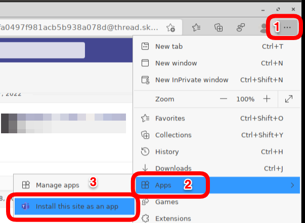
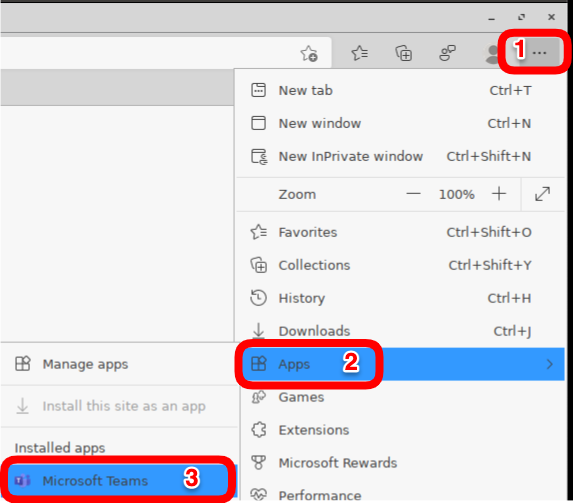
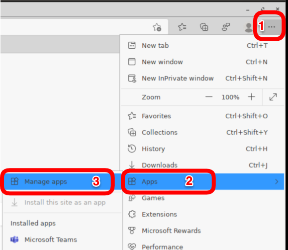
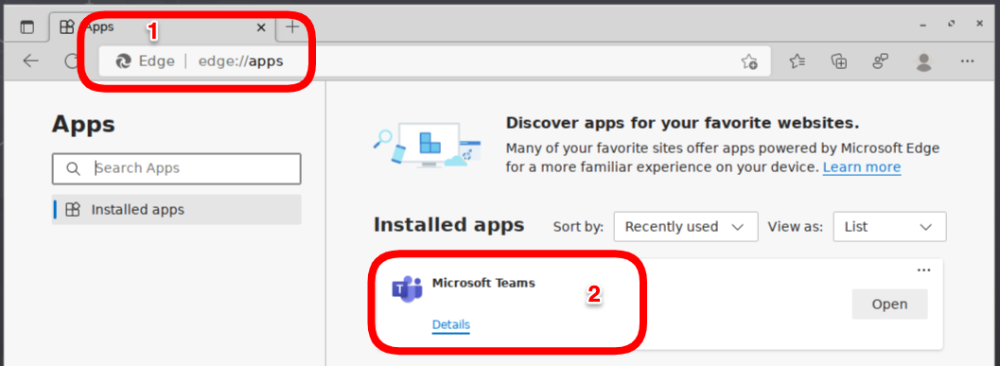

# HOWTO Microsoft Teams

## [Upgrade to new Teams for Virtualized Desktop Infrastructure (VDI)](https://learn.microsoft.com/en-us/microsoftteams/new-teams-vdi-requirements-deploy#citrix-virtual-apps-and-desktops-and-citrix-daas-requirements)

## [IGEL OS UCC Configuration Guide](HOWTO-UCC-Guide.md)

## [Teams for Virtualized Desktop Infrastructure](https://learn.microsoft.com/en-us/microsoftteams/teams-for-vdi)

## [Microsoft Teams optimization in a virtual desktop](https://www.go-euc.com/microsoft-teams-optimization-in-a-virtual-desktop/)

-----

## 28 February 2024 - Microsoft Teams Progressive Web App for OS 12

- Use [Microsoft Teams as a Progressive Web App](https://app.igel.com/#/api/ms_teams_pwa) via Chromium.
- Chromium app is required on IGEL OS
- Progressive Web Apps run in a standalone window instead of a browser tab and can be launched separately.
- For full support, the app Chromium 120.0.6099.216 BUILD 4.0 or newer must be installed (provides OpenH264).

-----

## 6 December 2023 - Upgrade to new Teams for Virtualized Desktop Infrastructure (VDI)

The new MS Teams for VDI is publicly available. If you’re using FSLogix as your profile solution, which was not supported during Teams public preview phase, you have to use the FSLogix 2210 hotfix 3 preview which is also available since 5 December 2023.

**NOTE:** The classic Teams for VDI will be supported until end of June 2024. 

- [Upgrade to new Teams for Virtualized Desktop Infrastructure (VDI)](https://learn.microsoft.com/en-us/microsoftteams/new-teams-vdi-requirements-deploy)

- Registry key to set:

```bash linenums="1"
HKLM\SOFTWARE\Microsoft\Teams:
Name: IsWVDEnvironment
Type: DWORD
Value: 1
```

-----

## 5 October 2023 - Microsoft Teams VDI 2.0

Microsoft recently released Microsoft Teams VDI 2.0 in public preview, a complete rewrite of Microsoft Teams. It offers a more streamlined interface, that requires fewer resources while used. 

Regarding IGEL and Azure Virtual Desktop / Windows 365 - Microsoft Teams VDI 2.0 still uses the WebRTC redirection service, so it is compatible with the current implementation of Microsoft Teams Offloading that IGEL already has in AVD/Windows365.

Additional details can be found here: [New Microsoft Teams for Virtualized Desktop Infrastructure (VDI)](https://learn.microsoft.com/en-us/microsoftteams/new-teams-vdi-requirements-deploy)

**NOTE:** For Citrix and VMware, the support requirements are mentioned in the above Microsoft link.

-----

## Communication one-to-one vs. three (3) or more:

- If there are two (2) participants, communication is established as peer connection between the two IGEL devices.
- If there are three (3) or more, the peer is broken and all is orchestrated through the teams servers in the cloud. So, when 3 or more, IGEL OS sends the videos stream to a server in azure, that combine all video streams and send to all participants.

-----

## How to Check communication to the Microsoft API URLs and IPs?

If Microsoft Teams is not running in optimized mode, then check that the IGEL endpoint can communicate with the Microsoft API URLs and IPs?

Run the following script in a local terminal window on IGEL endpoint:

```bash linenums="1"
#!/bin/bash

nc -u -v -z 13.107.64.21 3478-3481
nc -u -v -z 52.112.0.31 3478-3481
nc -u -v -z 52.120.0.41 3478-3481
nc -v -z teams.microsoft.com 80
nc -v -z teams.microsoft.com 443
nc -v -z compass-ssl.microsoft.com 443
nc -v -z mlccdnprod.azureedge.net 443
nc -v -z aka.ms 443
```

-----  

## Microsoft Teams progressive web app (PWA) via Chromium OS 11

The PWA provides the latest Microsoft Teams features via a native IGEL client.

The PWA offers access to more capabilities, including custom backgrounds, gallery view, reactions, the raise-a-hand feature in meetings, large gallery and Together mode views, etc..

[Steps to install the PWA into Chromium](https://www.igelcommunity.com/post/how-to-igel-os-with-teams-pwa-progressive-web-app)

-----  

## Microsoft Teams progressive web app (PWA) via Edge OS 11 / 12

The PWA provides the latest Microsoft Teams features via a native IGEL client.

The PWA offers access to more capabilities, including custom backgrounds, gallery view, reactions, the raise-a-hand feature in meetings, large gallery and Together mode views, etc..

Steps to install the PWA into Microsoft Edge:

- Deploy Microsoft Edge Browser custom partition. **Note:** Increase the CP partition size by 500MB - [Microsoft Edge CP](https://github.com/IGEL-Community/IGEL-Custom-Partitions/tree/master/CP_Source/Browsers/Microsoft_Edge_stable)
- Start up Microsoft Teams in the browser - [Microsoft Teams Login](https://teams.microsoft.com)
- In the upper right hand corner of Edge, Select `...` (Settings and more (Alt+F))
- Select `Apps > Install this site as an app`




- Run the installed Microsoft Teams PWA



- Manage installed PWA applications `edge://apps`




-----

### Create shortcut for Teams PWA application OS 11

**NOTE:** A reboot may be needed for the Teams icon to show up.

- Command Line (cmdline):

```bash linenums="1"
microsoft-edge-stable --profile-directory=Default --app-id=cifhbcnohmdccbgoicgdjpfamggdegmo "--app-url=https://teams.microsoft.com/?clientType=pwa"
```

- icon:

```bash linenums="1"
/custom/edge_stable/userhome/.config/microsoft-edge/Default/Web Applications/Manifest Resources/cifhbcnohmdccbgoicgdjpfamggdegmo/Icons/256.png
```
