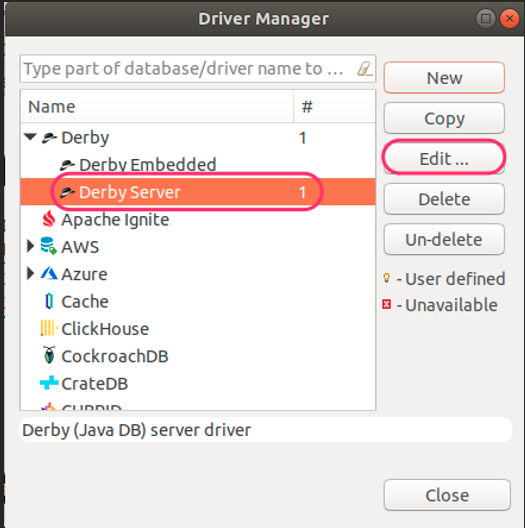
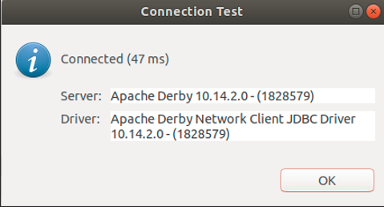

# HOWTO Setup Lab Sandbox Environment

-----

My 4+ year old home lab server: 

- Intel NUC (NUC8i3BEH) 32GB RAM and 1TB SSD (such as - Kingston SKC2500M8/1000G)

-----

## IGEL Security Ports One Pager


**NOTE:** Additional diagrams can be found in the [HOWTO Basic Setup Guide](HOWTO-Basic-Setup-Guide.md#configure-ums-network-ports).

-----

### IGEL OS 12 Devices

- Port 8443 (TCP) Incoming / Outgoing

-----

**NOTE:** The Unified Protocol is used for all communication between the UMS and OS 12 devices. This single path of communication is now accomplished with a WebSocket connection, enabling persistent, bi-directional, full-duplex TCP connectivity between UMS 12 and OS 12 devices.

-----

### IGEL Devices

- Port 5900 (TCP) Incoming
- Port 30005 (TCP/UDP) Incoming
- Port 30001 (TCP) Outgoing
- Port 8443 (TCP) Incoming / Outgoing
- Port 30022 (TCP) Incoming

### UMS Console

- Port 5900 (TCP) Outgoing for invoking VNC session
- Port 8443 (TCP) Outgoing

### UMS Server

- Port 443 (TCP) Outgoing
- Port 8443 (TCP) Incoming / Outgoing
- Port 30001 (TCP) Incoming

### UMS Server 1+n with Loadbalancer on same server

- Port 30002 (TCP)

### Microsoft Active Directory Services

- LDAP: Port 389 (TCP) Outgoing
- LDAPS: Port 636 (TCP) Outgoing

### UMS DB

- Microsoft SQL: Port 1433 (TCP) Incoming
- Oracle: Port 1521 (TCP) Incoming
- Apache Derby: Port 1527 (TCP) Incoming
- PostgreSQL: Port 5432 (TCP) Incoming

### UMS Licensing Server

- fwus.igel.com
- susi.igel.com
- Port 443 TCP Incoming

### UMS Download Server

- fwus.igel.com
- Port 443 TCP Incoming

-----

## Summary of Steps to Create Lab Sandbox Environment

-	Setup PC file system
-	Install Virtual Box
-	Install Linux and Windows virtual machines
-	Install UMS on Linux (Ubuntu 18.04)
-	Create IGEL OS clients
-	Optional install ICG from UMS (ICG runs on Linux (Ubuntu 18.04))
-	Optional – Advanced – Setting up firewall with pfSense (ICG <--> UMS)

-----

## Using other Hypervisors

IGEL OS using VMware:

- Create new Virtual Machine (select IGEL ISO image)
- Choose Operating System (Other > Other 64-bit)
- Choose Firmware Type (Legacy BIOS)
- Change memory from 256 MB to 4096 MB
- Change Network Adapter to Bridged Networking > Autodetect

IGEL OS on Hyper-V:

- Allocated at least 4GB (4096 MB) of memory
- Create Generation 1 VM
- Remove the Network adapter
- Add a Legacy Network adapter

-----

## Setup PC File System and Downloads

Create a folder called igel-lab to hold:

-	igel-download/ - `Installers (UMS, ICG, IGEL OS)`
-	igel-packages/ - `Custom partitions from` [IGEL Community GitHub](https://github.com/IGEL-Community/IGEL-Custom-Partitions)
-	guest-download/ - `Installers (Ubuntu, Windows, pfSense, Zenmap)`
-	manuals/ - `Manuals (IGEL, VirtualBox, misc. documents)`

Download software:

-	[VirtualBox](https://www.virtualbox.org/) and install. IGEL OS 11 / 12 has VirtualBox Guest Additions built in to support shared folders.
-	Linux ISO [Ubuntu Desktop 18.04]( https://releases.ubuntu.com/18.04/)
-	Linux ISO [Ubuntu Desktop 20.04]( https://releases.ubuntu.com/20.04/)
-	Linux ISO [Ubuntu Desktop 22.04]( https://releases.ubuntu.com/22.04/)
-	Optional – [Windows Server 2019 ISO - 180 day trial](https://www.microsoft.com/en-us/evalcenter/evaluate-windows-server-2019?filetype=ISO)
-	Optional – [Windows Server 2022 ISO - 180 day trial](https://www.microsoft.com/en-us/evalcenter/evaluate-windows-server-2022?filetype=ISO)
-	[IGEL Software](https://www.igel.com/software-downloads) - OS 11 / 12, UMS - Workspace Edition, ICG - Enterprise Management Pack
-	[Custom Partitions](https://github.com/IGEL-Community/IGEL-Custom-Partitions)

-----

## Create Linux VM for UMS Install

- Follow VirtualBox guide for installing ISO image (Ubuntu 64 bit; 12GB RAM; 100GB Disk, take defaults for the rest; Shared folder to mount PC file system for images and packages)
- After install then install time synchronization, update OS and upgrade OS

```bash linenums="1"
sudo apt install chrony -y
sudo apt-get update -y
sudo apt-get upgrade -y
sudo apt autoremove -y
sudo apt-get install build-essential gcc make perl dkms -y
sudo apt-get install gdebi -y
sudo reboot now
```

- Mount VirtualBox Guest Additions CD image `VitrualBox VM > Devices > Insert Guest Additions CD image...`
- Install VirtualBox Guest Additions `cd /media/.../VBox_GA...; sudo ./VBoxLinuxAdditions.run`
- Add login account to vboxfs group `sudo vi /etc/group; sudo reboot now`

-----

## Install UMS on Linux

- Follow IGEL Linux installation notes -- [LINK](https://kb.igel.com/en/universal-management-suite/12.07.100/igel-ums-installation-under-linux)
- sudo ./setup-igel-ums-linux-[version].bin

**Note** Steps to install on Windows -- [LINK](https://kb.igel.com/en/universal-management-suite/12.07.100/igel-ums-installation-under-windows)

- IGEL Community on GitHub UMS Console setup - [LINK](https://github.com/IGEL-Community/IGEL-Scripts/tree/main/Script_Source/Server/UMS_Console_Ubuntu_Build)
-----

## Create IGEL OS Clients

VirtualBox > New

- Name: `name of IGEL OS system`
- Type: `Linux`
- Version: `Ubuntu (64-bit)`
- Memory size: `4096 MB`
- `Defaults for the rest`
- `Create`
- `Settings > Network > Attached to Bridged Adapter`
- Folder Name: `igel-lab`
- `automount`
- `OK`
- Start VM
- Disk file to install from: `path to IGEL OS 11 / 12 ISO file`
- Start

Follow IGEL OS 11 installation procedures - [LINK](https://kb.igel.com/en/igel-os/11.10/installation-procedure)

Follow IGEL OS 12 installation procedures - [LINK](https://kb.igel.com/en/how-to-start-with-igel/current/installing-the-base-system-via-igel-os-creator-osc)

-----

## Registering Devices on the UMS Server

- UMS endpoint management (see searching for devices) - [LINK](https://kb.igel.com/en/universal-management-suite/12.07.100/registering-igel-os-devices-on-the-ums-server)

-----

## Run UMS Web App

- Start UMS Web App - `https://<UMS-Server>:8443/webapp/#/login`
- UMS Web App help - [LINK](https://kb.igel.com/en/universal-management-suite/12.07.100/igel-ums-web-app)

-----

## UMS to/from IGEL OS 11 Communication ports (NO ICG)

[UMS Communication Ports](https://kb.igel.com/en/universal-management-suite/12.07.100/igel-ums-communication-ports)

### Core Communication UMS / OS 11

- Core (scanning for device) : 30005 (TCP/UDP) : (UMS agent) Device : The device responds to a broadcast sent by the UMS during a scan. The port number to be used is contained in the UDP packet sent by the UMS. From UMS Server: `nc -v -z IGEL-OS-IP-ADDRESS 30005`

- Core (direct device communication) : 30001 (TCP) : UMS Server (Windows: service IGELRMGUIServer; Linux: daemon igelRMServer). From IGEL OS: `nc -v -z UMS-SERVER-IP-ADDRESS 30001`

- Core (file transfer, firmware customization, licenses, Universal Firmware Update) : 8443 (TCP) : UMS Server (Windows: service IGELRMGUIServer; Linux: daemon igelRMServer). Request for files. From IGEL OS: `nc -v -z UMS-SERVER-IP-ADDRESS 8443`

### Optional Communication UMS / OS 11

- Core (secure terminal) : 30022 (TCP) : Device (UMS agent). From UMS Server: `nc -v -z IGEL-OS-IP-ADDRESS 30022`

- Core (shadowing) via UMS Web App : 5900 (TCP) : Device (UMS agent). From UMS Server / Console: `nc -v -z IGEL-OS-IP-ADDRESS 5900`

- Core (Wake on LAN) : 9 (UDP). The UMS Server sends magic packets to the devices. From UMS Server: `nc -u -v -z IGEL-OS-IP-ADDRESS 9`

**NOTE:** Shadowing from UMS Web App triggers the UMS Server to initiate a VNC session for shadowing. The VNC session is routed through the UMS Server.

-----

## ICG to/from IGEL OS 11 Communication ports (443 or 8443)

All communication over 8443 (default) or 443 as defined during installation of ICG.

Core (with ICG) : 8443 (default) or 443. From IGEL OS: `nc -v -z ICG-SERVER-IP-ADDRESS 8443` or `nc -v -z ICG-SERVER-IP-ADDRESS 443`

**NOTES:**

- The only supported option for ICG is to have direct access to port 8443/443 over a public facing IP address. Confirm that `NOTHING (NO - load balancer, Web Application Firewall, or security appliance that is manipulating traffic)` is between the ICG and IGEL OS devices.
- Also make sure the ICG, UMS, and IGEL OS clients are using [NTP](https://en.wikipedia.org/wiki/Network_Time_Protocol) for time services.
- Connect to ICG via HTTPS URL to confirm the health of the server: `https://<icg FQDN>:port/usg/server-status` where port is either 8443 or 443.
-----

## Optional - Install ICG from UMS (OS 11)

- Follow VirtualBox guide for installing ISO image (Ubuntu 64 bit; 8GB RAM; 25GB Disk, take defaults for the rest)
- After install then install time synchronization, update OS and upgrade OS

```bash linenums="1"
sudo apt install chrony -y
sudo apt install openssh-server -y
sudo apt-get update -y
sudo apt-get upgrade -y
sudo apt autoremove -y
sudo reboot now
```

- Setup SSH sample -- `Edit for your environment`

```bash linenums="1"
#!/bin/bash

# EDIT for your values
IGEL_MASTER=IP_ADDRESS_OF_UMS
IGEL_MASTER_USER=igelums
IGEL_ICG_INSTALL=IP_ADDRESS_OF_ICG
IGEL_ICG_USER=icginstall

#
# OpenSSH
#
# Actions after install may include:
#
#   - Generate key pairs in .ssh directory -- ssh-keygen
#   - Copy public key to remote server -- ssh-copy-id username@remote_host
#   - Test connection -- ssh -l username hostname
#   - Check listing port -- sudo netstat -tulpn
# Ref: https://tinyurl.com/ssh-setup
#
echo "******* Starting -- apt install openssh-server"
sudo apt install openssh-server -y

SSHCONFIG=/etc/ssh/sshd_config

sudo sed -i "/#Port 22/ a Port 22" $SSHCONFIG
#sudo sed -i "/#PermitRootLogin/ a PermitRootLogin no" $SSHCONFIG
sudo sed -i "/#PermitEmptyPasswords no/ a PermitEmptyPasswords no" $SSHCONFIG
sudo sed -i "\$ a AllowUsers $IGEL_MASTER_USER@$IGEL_MASTER" $SSHCONFIG
sudo sed -i "\$ a AllowUsers $IGEL_ICG_USER@$IGEL_ICG_INSTALL" $SSHCONFIG

sudo systemctl stop sshd.service
sudo systemctl start sshd.service
sudo systemctl enable sshd.service
echo "******* Ending -- apt install openssh-server"
```

- Follow IGEL ICG install from UMS - [LINK](https://kb.igel.com/en/igel-cloud-gateway/12.04/installing-the-igel-cloud-gateway)
- IGEL Community GitHub ICG setup script - [LINK](https://github.com/IGEL-Community/IGEL-Scripts/tree/main/Script_Source/Server/ICG_Ubuntu_Build)

-----

## Optional - Advanced - Setting up Firewall with pfSense

The IGEL Cloud Gateway (ICG) is required if the UMS and the devices are not in the same network. The following scenarios are typical use cases for the ICG:

-	The endpoint devices (IGEL UD, UD Pocket or devices converted by UDC3/OSC) of all geographically dispersed branches of a company are to be managed by one central UMS.
-	UD Pocket or devices converted by UDC3/OSC are to be managed by the UMS which is residing on premises.

Use pfSense to create firewall (DMZ)

-	Place the ICG and IGEL OS clients outside the firewall (internet)
-	Place the UMS inside the firewall (company network)
-	Follow this guide for setting up pfSense - [LINK](https://resources.infosecinstitute.com/topic/setting-pentest-lab-pfsense-virtualbox/)
-	Setup network discovery and security auditing software (Zenmap) to probe the servers and find open ports - [LINK](https://nmap.org/zenmap/)


-----

## Optional - Setup DBeaver to Access UMS Internal DB

**NOTE:** Do `NOT` do this on your production UMS Server!!

[An Entity Relationship (ER) Diagram](https://dbeaver.com/2022/06/30/two-ways-to-use-erd-in-dbeaver/) is a type of flowchart that illustrates how entities relate to each other within a system. In terms of a database management system, an entity is a table. So by showing relationships among tables, the ER diagram represents the complete logical structure of a database.

### Entity Relationship (ER) Diagrams for UMS 12.3.0 Database


### Summary of Steps to Connect DBeaver to UMS Internal DB

-	Install DBeaver
-	Add IGEL UMS Derby client jar file to Database `->` Driver Manager
-	Make read-only connection to UMS database

### Install DBeaver (Ubuntu)

-	[Download DBeaver](https://dbeaver.io/download)
-	Install onto UMS server: `sudo dpkg -i dbeaver-<version>.deb`

**Note:** If you have errors (such as missing java), then fix `sudo apt --fix-broken install`

### Add IGEL UMS Derby Client JAR File to DBeaver Driver Manager

-	Start DBeaver
-	Add UMS Derby client jar file. If you do not add the UMS version of Derby client jar file, then an error may occur when you try to connect.
-	Find the UMS version of Derby client jar file (derbyclient.jar)

```bash linenums="1"
sudo find /opt/IGEL -name "derbyclient*.jar"
```

-	Copy file out of the UMS folder - `sudo cp file_above /tmp`
-	Add the copied file to DBeaver Driver Manager Derby Server





### Make Read-Only Connection to the IGEL UMS Database

-	Make Read-only connection to the IGEL UMS database and test connection
- Database -> New Database Connection
-	Port: 1528
-	Database/Schema: rmdb
-	User name & Password
-	Test connection




### Sample DB Query


This SQL query can be used in [UMS SQL Console](https://kb.igel.com/en/universal-management-suite/12.07.100/menu-bar-of-the-igel-ums-console)

```sql linenums="1"
SELECT THINCLIENT.TCNAME, HW.BIOS_VENDOR, HW.BIOS_VERSION, HW.BIOS_DATE, FW.VERSION, THINCLIENT.PRODUCTID, THINCLIENT.LASTKNOWNIP, THINCLIENT.LAST_INFO_UPDATETIME FROM THINCLIENT LEFT JOIN FIRMWARE FW ON THINCLIENT.FIRMWAREID=FW.FIRMWAREID LEFT JOIN HARDWARE_INFORMATION  HW ON THINCLIENT.MACADDRESS=HW.MAC ORDER BY FW.VERSION
```

-----

## Appendix - Linux Scripts

- [Linux Scripts](https://github.com/rneher-igel/Linux-Scripts/tree/master)
- [Linux UMS and X11 forwarding to IGEL OS endpoint](https://github.com/IGEL-Community/IGEL-Scripts/tree/main/Script_Source/Server/UMS_Console_Ubuntu_Build)

-----

## Appendix - Current IGEL Downloads

| Name | Description - Link |
|------|--------------------|
| UMS 12 | <a href="https://igeldownloadprod-bydsc8hmbsaegvdy.a01.azurefd.net/files/IGEL_UNIVERSAL_MANAGEMENT_SUITE/WINDOWS/setup-igel-ums-windows_12.07.100.exe" download>UMS 12 for Windows Server</a> |
| UMS 12 | <a href="https://igeldownloadprod-bydsc8hmbsaegvdy.a01.azurefd.net/files/IGEL_UNIVERSAL_MANAGEMENT_SUITE/LINUX/setup-igel-ums-linux_12.07.100.bin" download>UMS 12 for Linux Server</a> |
| UMS 6 | <a href="https://igeldownloadprod-bydsc8hmbsaegvdy.a01.azurefd.net/files/IGEL_UNIVERSAL_MANAGEMENT_SUITE/WINDOWS/setup-igel-ums-windows_6.10.140.exe" download>UMS 6 for Windows Server</a> |
| UMS 6 | <a href="https://igeldownloadprod-bydsc8hmbsaegvdy.a01.azurefd.net/files/IGEL_UNIVERSAL_MANAGEMENT_SUITE/LINUX/setup-igel-ums-linux_6.10.140.bin" download>UMS 6 for Linux Server</a> |
| OSC - OS 12 | <a href="https://igeldownloadprod-bydsc8hmbsaegvdy.a01.azurefd.net/files/IGEL_OS_12/OSC/osc-12.6.1.zip" download>OSC - OS 12</a> |
| OSC - OS 12 PXE | <a href="https://igeldownloadprod-bydsc8hmbsaegvdy.a01.azurefd.net/files/IGEL_OS_12/PXE/osc-12.6.1_pxe.zip" download>OSC - OS 12 PXE</a> |
| OSC - OS 11 | <a href="https://igeldownloadprod-bydsc8hmbsaegvdy.a01.azurefd.net/files/IGEL_OS_11/OSC/OSC_11.10.210.zip" download>OSC - OS 11</a> |
| OS Update - OS 11 | <a href="https://igeldownloadprod-bydsc8hmbsaegvdy.a01.azurefd.net/files/IGEL_OS_11/updates/lxos_11.10.210_public.zip" download>OS Update Firmware - OS 11</a> |
| ICG 12 | <a href="https://igeldownloadprod-bydsc8hmbsaegvdy.a01.azurefd.net/files/IGEL_CLOUD_GATEWAY/installer-12.07.100.bin" download>ICG 12</a> |
| ICG 2 | <a href="https://igeldownloadprod-bydsc8hmbsaegvdy.a01.azurefd.net/files/IGEL_CLOUD_GATEWAY/installer-2.05.110.bin" download>ICG 2</a> |

-----

```bash linenums="1"
#!/bin/bash

#IGEL 12 (OS 12 / UMS 12 / ICG 12):
#OSC 12: 
wget https://igeldownloadprod-bydsc8hmbsaegvdy.a01.azurefd.net/files/IGEL_OS_12/OSC/osc-12.6.1.zip

#OSC 12 PXE: 
wget https://igeldownloadprod-bydsc8hmbsaegvdy.a01.azurefd.net/files/IGEL_OS_12/PXE/osc-12.6.1_pxe.zip

#UMS 12:
wget https://igeldownloadprod-bydsc8hmbsaegvdy.a01.azurefd.net/files/IGEL_UNIVERSAL_MANAGEMENT_SUITE/WINDOWS/setup-igel-ums-windows_12.07.100.exe
wget https://igeldownloadprod-bydsc8hmbsaegvdy.a01.azurefd.net/files/IGEL_UNIVERSAL_MANAGEMENT_SUITE/LINUX/setup-igel-ums-linux_12.07.100.bin

#ICG 12:
wget https://igeldownloadprod-bydsc8hmbsaegvdy.a01.azurefd.net/files/IGEL_CLOUD_GATEWAY/installer-12.07.100.bin

#IGEL OS 11 / UMS 6 / ICG 2)
#OSC 11:
wget https://igeldownloadprod-bydsc8hmbsaegvdy.a01.azurefd.net/files/IGEL_OS_11/OSC/OSC_11.10.210.zip
wget https://igeldownloadprod-bydsc8hmbsaegvdy.a01.azurefd.net/files/IGEL_OS_11/OSC/OSC_11.09.310.zip

#OS 11 Update:
wget https://igeldownloadprod-bydsc8hmbsaegvdy.a01.azurefd.net/files/IGEL_OS_11/updates/lxos_11.10.210_public.zip
wget https://igeldownloadprod-bydsc8hmbsaegvdy.a01.azurefd.net/files/IGEL_OS_11/updates/lxos_11.09.310_public.zip

#UMS 6:
wget https://igeldownloadprod-bydsc8hmbsaegvdy.a01.azurefd.net/files/IGEL_UNIVERSAL_MANAGEMENT_SUITE/WINDOWS/setup-igel-ums-windows_6.10.140.exe
wget https://igeldownloadprod-bydsc8hmbsaegvdy.a01.azurefd.net/files/IGEL_UNIVERSAL_MANAGEMENT_SUITE/LINUX/setup-igel-ums-linux_6.10.140.bin

#IGEL ICG:
wget https://igeldownloadprod-bydsc8hmbsaegvdy.a01.azurefd.net/files/IGEL_CLOUD_GATEWAY/installer-2.05.110.bin
```


<!---
Remove for now
# [Basic Setup Guide](HOWTO-Basic-Setup-Guide.md)

Guide follows KB article, `First Steps with IGEL OS 11`, and adds optional IGEL Cloud Gateway (ICG) setup.
-->
