# HOWTO Template Keys in UMS

## How to use Template Key in UMS

To use template keys, follow these steps:

- Open an existing profile or create a new one.
- Click on `Edit Configuration` to bring up the parameters to be updated.
- Select a parameter that will receive a client-specific value from a template key.
- Click the activation symbol in front of the parameter until the desired function is active.
- Click on the selection symbol to choose a template key.
- Double-click on the desired template key or static template key, or create a new key if needed.
- Click `OK` to confirm your selection.
- Save the template profile.

**Note** that certain parameters cannot be configured with template keys and only offer inactive or active options.

Here are some documentation sources that might provide a broader context:

- [IGEL KB: How to Create Template Keys and Values](https://kb.igel.com/en/universal-management-suite/12.07.100/how-to-create-template-keys-and-values?utm_source=ai_search&ai_search=true)
- [IGEL KB: How to Use Template Keys in Profiles](https://kb.igel.com/en/universal-management-suite/12.07.100/how-to-use-template-keys-in-profiles?utm_source=ai_search&ai_search=true)
- [IGEL KB: Creating Keys and Values in the Profile](https://kb.igel.com/en/universal-management-suite/12.07.100/creating-keys-and-values-in-the-profile?utm_source=ai_search&ai_search=true)

-----

-----

## Using Template Keys to Control Icons on IGEL Desktop

In IGEL OS 12 it is possible to control different profile settings using template keys. Using Template Keys allows a single Profile to have different settings based on the value of a Template Key

### Template Keys can be different types:

- **String:** Allows you to set a string value that can be used to set the value of a text field in the profile
- **Checkbox:** Allow you to set a checkbox in a profile to active or inactive based in the assigned value
- **Integer:**
- **Floating Point Number:**

The String, Integer, and Floating Point Number keys can have multiple values that are customizable. The Checkbox key can only have 2 values, Active and Inactive.

### Creating a Template Key:

- In the UMS Java console, under the Server menu option, select the `Template Keys and Groups` item.

- Expand the `Template Keys and Groups` so that you can see the `template Keys` and the `Value Groups` sub folders.

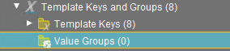

- Right click on the `Template Keys` folder and select `New Template Key` from the pop up menu 

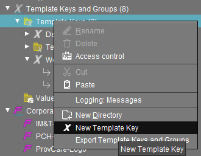

- Give the key a name and a description and click ‘Next 

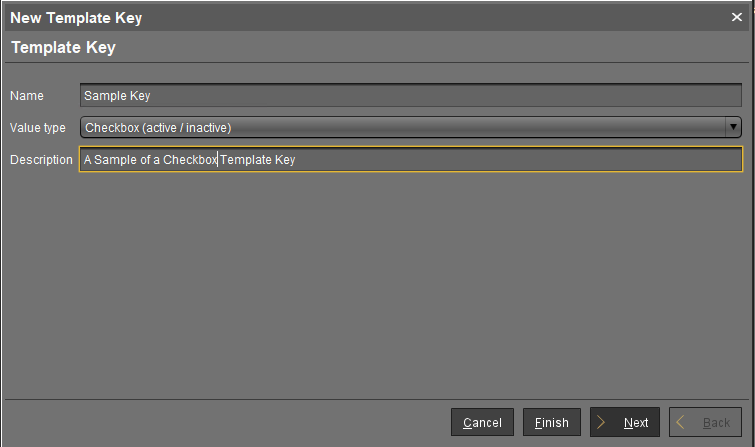

- You cannot add new values to this Template Key but you can give each value a description. It is recommended you do this so you know what Profile value this Key is controlling. 

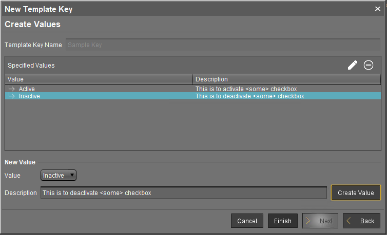

- Click `Finish` to complete the template Key setup
 
### Assigning Template Keys

Now that we have create the template Keys it is time to use them. To use the Template Keys we will be assigning the values of the Key to either, a folder (Directory) holding devices or directly to a device. In this example, we will be assigning the values at the folder level.

- (1) In the UMS Java Console, navigate to the folder you want to set a check box value to and click on it so that it is highlighted.

 
- (2) With the folder selected, on the right hand side in the `Assigned Objects` pane click on the `+` button to assigned the Template Key. 

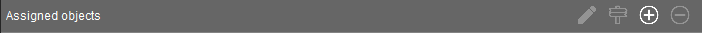

- (3) In the `Select assignable objects` pop-up, open the `Template Keys and Groups` option and navigate to the Template Key you created.

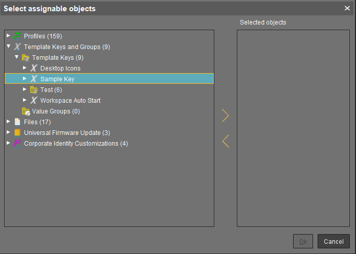
 
- (4) Expand your Template Key, we are using the `Sample Key` for this example 

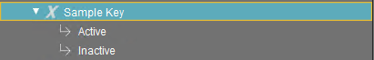

- (5) We want to assign the `Active` value to the `Testing` folder. Highlight the `Active` value  

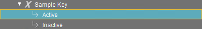

- (6) Next, you will click the right arrow to assign the value to the folder 

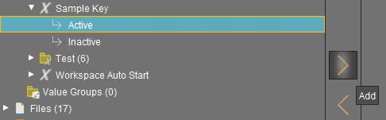

- (7) With the Active value in the Selected objects portion of the pop-up window click on the `OK` button to complete this step. 

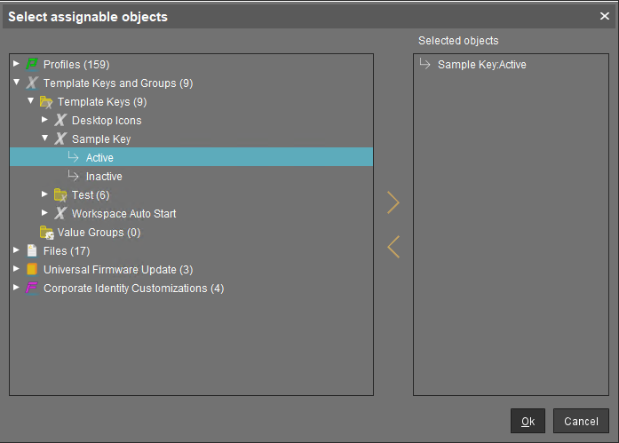

- (8) Now we need to assign the Inactive Value to our Sub-Level folder. Repeat the steps above but select `Sub-Folder` in step (1), and `Inactive` in step (5)

Now in the UMS under `Assigned objects` you will have ‘Sample Key:Active’ listed when the Testing folder is selected 

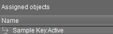
 
and `sample Key:Inactive` when the Sub-Level folder is selected

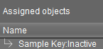
 
### Using Template Key Values in a Profile

Since we are using IGEL OS 12 we will now need to switch to the Web based UMS to continue.

For this next section, I am going to assume you know how Profiles work, how to create them, and how to assign them.

In this example we will be using the Template Key values we created earlier to control whether Web Browser shortcuts appear on the IGEL desktop or not.

The first step is to open your profile so you can edit it. We will be using a Profile called `Browser Icon on Desktop` for this example. This profile will place a Chromium icon on the desktop if the computer is in the Testing folder. If the computer is located in the Sub-Level folder the Chromium icon will not appear on the desktop.

- In Apps expand the Chromium Browser option, followed by the ‘Sessions’ option. 

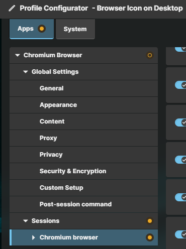

- With the Sessions section expanded select your session, in this case our session is called `Chromium browser` 

- On the right side scroll down until you find the `Desktop` option. 

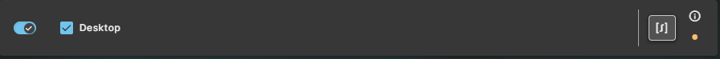

- On the right side, there is what looks like an expression button  

- Click on the `expression` button which will bring up a new ‘Template Keys’ window 

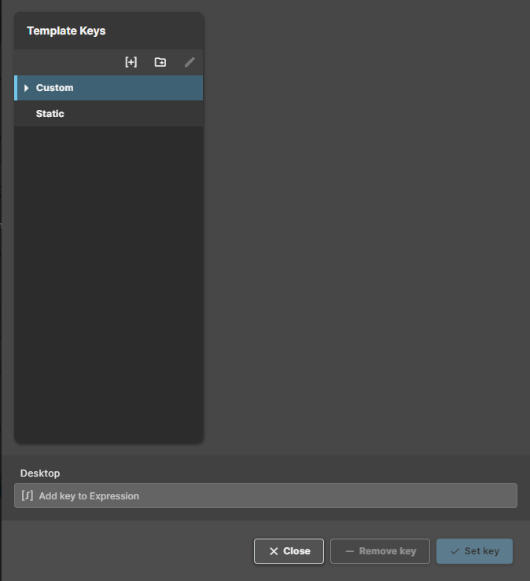

- Expand the `Custom` option and select our `Sample Key` option 

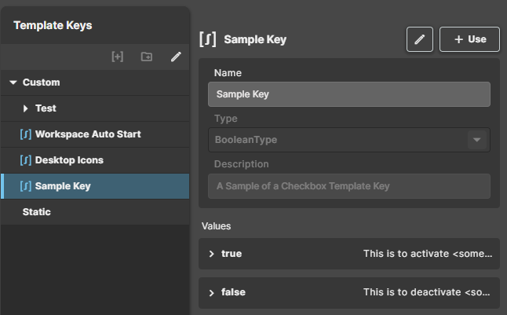

- With the Key Selected, the right side of this window will allow you to review the Key. We can see the name of the key, that it is a Checkbox, and has the values of True, and False. The Values can be expanded to read the full description if needed.

- Since this is the template Key that we want to use we will click the `+ Use` button in the top right. Once this is clicked the `Set Key` button in the bottom right will become active 

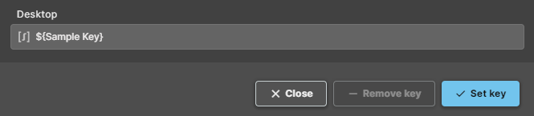

- Click on the `Set Key` button. This will close the window and return you to the Profile Configuration.

- Now the `Desktop` entry will be greyed out and the `expression` button will now have they Template Key listed. 

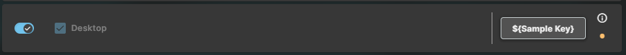

- Click `Save and Close` to complete the process.

Now when a computer is placed in the `Testing` folder the Chromium Browser icon will appear on the Desktop, and when a computer is placed in the `Sub-Level` folder the Chromium Browser icon will not appear on the Desktop.

Here is a flow chart to show the logic flow.

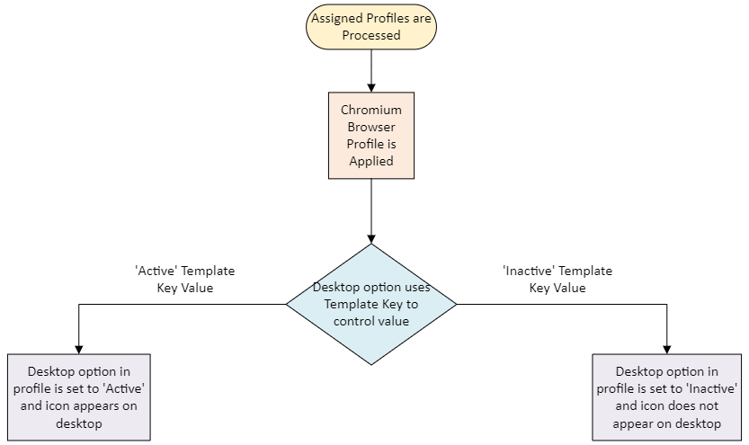
 