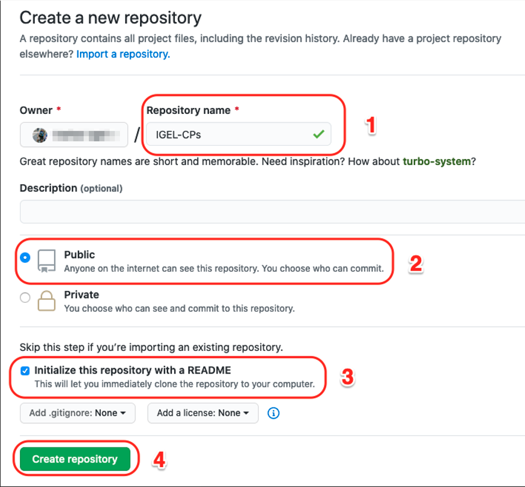
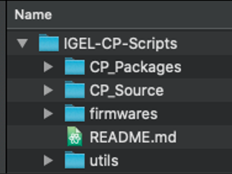
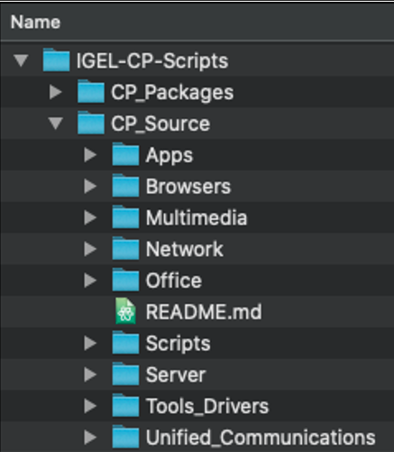
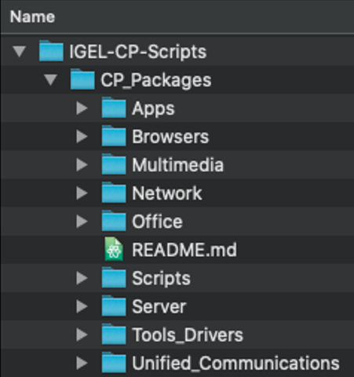
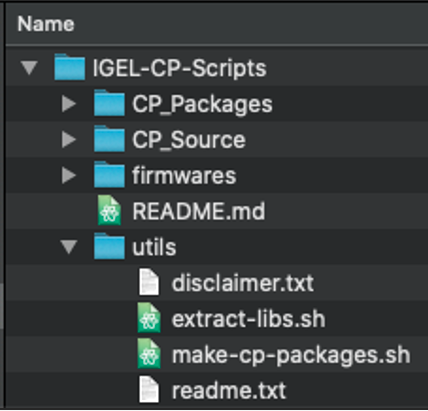
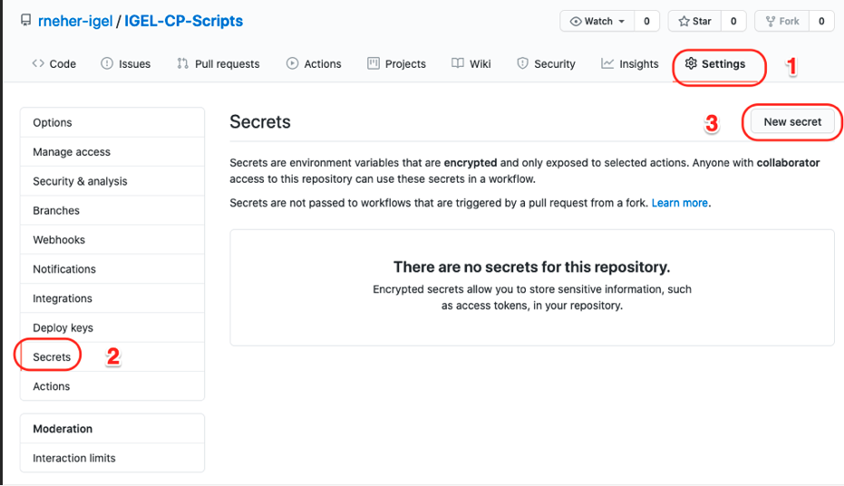
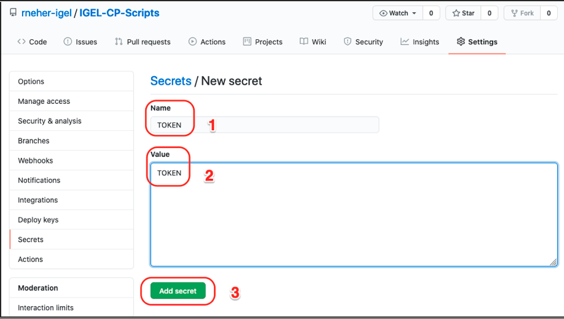

# HOWTO Tools Used for GitHub Custom Partition (CP)

-----

## Create GitHub Repository

- Repositories > New


- Respository name
- Public
- Initialized with README
- Create repository



-----

## Setup Files in GitHub Repository

- Top level layout



- CP_Source hold the files used to be packaged into CP zip file



- CP_Packages hold the CP zip files



- utils hold the files used in packages (disclaimer, readme)



-----

## Create Repository GitHub Personal Access Token

- Settings
- Secrets
- New secret



- Name > `TOKEN`
- Value > `TOKEN`
- Add secret



-----

## Create GitHub Action to Create Custom Partition Zip Package

- Use GitHub Actions to start a virtual machine (VM), use git to pull the repository files into the VM, run script to create Custom Partition (CP) zip files and then update the repository with the zip files.
- The script will create CP zip files if they do not exist or if the files used in the zip file have changed.
- Copy and edit the following code and place into file:  `<Repository-home>/.github/workflows/main.yml`

```bash linenums="1"
name: MainDeployCP
on:
  push:
    branches:
      - main
jobs:
  build:
    runs-on: ubuntu-latest
    steps:
    - uses: actions/checkout@v1
    - name: Create CP packages
      run: bash utils/make-cp-packages.sh
    - name: git push
      run: |
        git config --global user.name "My-GitHub-User-Name"
        git config --global user.email "My Email Address"
        git remote set-url origin https://x-access-token:${{ secrets.GITHUB_TOKEN }}@github.com/$GITHUB_REPOSITORY
        git add --all
        git commit -m "Updated CP Packages"
        git push origin HEAD:main
      env:
        GITHUB_TOKEN: ${{ secrets.TOKEN }}
        REPO_OWNER: My-GitHub-User-Name
```

- Copy the following code and place into file:  `<Repository-home>/utils/make-cp-packages.sh`

```bash linenums="1"
#!/bin/bash
shopt -s extglob
# uncomment set and trap to trace execution
set -x
#trap read debug

# Files that have changed in most recent commit
git diff --name-only HEAD HEAD~1
CHANGEDFILES=`git diff --name-only HEAD HEAD~1`

BASEDIR=`pwd`
SRCLOC="$BASEDIR/CP_Source"
ZIPLOCATION="$BASEDIR/CP_Packages"
COMMONREADME="$BASEDIR/utils/readme.txt"
COMMONDISCLAIMER="$BASEDIR/utils/disclaimer.txt"
CATEGORIES="Apps Browsers Multimedia Network Office Scripts Server Tools_Drivers Unified_Communications"

for category in $CATEGORIES; do
    cd $SRCLOC/$category;

    #  look at every folder under the category
    for cp in *; do

      if [ -d $cp ]; then
        zip_needed=false
        zip_file="$ZIPLOCATION/$category/$cp.zip";

        if [ ! -f  $zip_file ]; then
          zip_needed=true;
        fi

        #  if the common readme and disclaimer files are newer than the zip file, re-create the zip
        if [ "$COMMONREADME" -nt $zip_file ]  || [ "$COMMONDISCLAIMER" -nt $zip_file ]; then
            zip_needed=true;
        fi

        echo "category/cp  = $category/$cp"
        #  check the list of changed files in this commit to see if this Custom Partition has changed
        if [[ "$CHANGEDFILES" == *"$category/$cp"* ]] ; then
            zip_needed=true;
        fi

        #  create the structure needed, then zip the file to the correct location
        if $zip_needed; then
          echo "Zip needed for cp: $cp"
          cd $cp
          foldername=`grep -i "cp=" *.sh`
          foldername=${foldername/*\//}
          foldername=${foldername/\"/}
          echo "Folder name: $foldername"
          echo "Zip file: $zip_file"
          cpt="tmp"
          rm -rf $cpt
          mkdir $cpt
          mkdir "$cpt/igel"
          mkdir "$cpt/target"
          cp *.xml "$cpt/igel"
          cp *.inf "$cpt/target"
          cp *.sh "$cpt/target"
          cp *.md "$cpt/target"
          cp !(*.xml|*.inf|*.sh|*.md|$cpt) "$cpt/target"
          cp $COMMONREADME "$cpt"
          cp $COMMONDISCLAIMER "$cpt"
          cd $cpt
          zip -r $zip_file .
          cd ..
          rm -rf $cpt
          cd ..
        fi

      fi

    done

    cd ../..

done
```