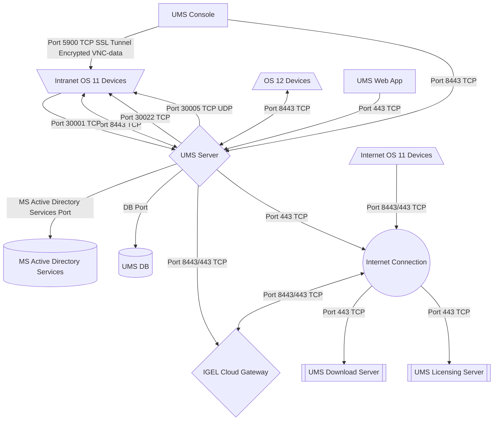

# HOWTO Tools Used for this Site

-----

## Background

The following is used for the creation of this site:

- **GitHub:** Used to hold the files, GitHub action to automate the building of the `html` files, and serving of the `html` files.

- **Mermaid:** [Mermaid](https://mermaid.js.org/) is a markdown diagramming and charting tool to create and modify diagram dynamically.

- **MkDocs:** [MkDocs](https://www.mkdocs.org/) is a fast, simple and downright gorgeous static site generator that's geared towards building project documentation. Documentation source files are written in Markdown, and configured with a single YAML configuration file.

- **Material for MKDocs:** [Material](https://squidfunk.github.io/mkdocs-material/) is the theme used with MkDocs.

-----

## GitHub Location

- GitHub Location: [https://github.com/IGEL-Community/IGEL-Docs-v02](https://github.com/IGEL-Community/IGEL-Docs-v02)

-----

## Mermaid

The following Mermaid example will generate diagram of IGEL architecture:

```bash linenums="1"
mermaid
flowchart TD
  A[UMS Console]-- Port 5900 TCP SSL Tunnel Encrypted VNC-data --> B[\Intranet OS 11 Devices/]
  A[UMS Console]-- Port 8443 TCP --> C{UMS Server}
  C{UMS Server}<-- Port 8443 TCP --> B[\Intranet OS 11 Devices/]
  C{UMS Server}-- MS Active Directory Services Port --> D[(MS Active Directory Services)]
  C{UMS Server}-- DB Port--> E[(UMS DB)]
  C{UMS Server}-- Port 30022 TCP --> B[\Intranet OS 11 Devices/]
  C{UMS Server}-- Port 30005 TCP UDP --> B[\Intranet OS 11 Devices/]
  C{UMS Server}-- Port 8443/443 TCP --> F{IGEL Cloud Gateway}
  B[\Intranet OS 11 Devices/]-- Port 30001 TCP --> C{UMS Server}
  G[/Internet OS 11 Devices\]-- Port 8443/443 TCP --> H((Internet Connection))
  H((Internet Connection))<-- Port 8443/443 TCP --> F{IGEL Cloud Gateway}
  C{UMS Server}-- Port 443 TCP --> H((Internet Connection))
  H((Internet Connection))-- Port 443 TCP --> I[[UMS Download Server]]
  H((Internet Connection))-- Port 443 TCP --> J[[UMS Licensing Server]]
  K[/OS 12 Devices\]<-- Port 8443 TCP --> C{UMS Server}
  L[UMS Web App]-- Port 443 TCP --> C{UMS Server}
```



-----

## MkDocs YAML file

- File Location: `mkdocs.yml`

```yaml linenums="1"
site_name: IGEL Community Docs
theme:
  name: material
  features:
    - navigation.tabs
    - navigation.sections
    - toc.integrate
    - navigation.top
    - search.suggest
    - search.highlight
    - content.tabs.link
    - content.code.annotation
    - content.code.copy
  language: en
  palette:
    - scheme: default
      toggle:
        icon: material/toggle-switch-off-outline 
        name: Switch to dark mode
      primary: teal
      accent: purple 
    - scheme: slate 
      toggle:
        icon: material/toggle-switch
        name: Switch to light mode    
      primary: teal
      accent: lime

markdown_extensions:
  - pymdownx.critic
  - pymdownx.caret
  - pymdownx.keys
  - pymdownx.mark
  - pymdownx.tilde
  - def_list
  - pymdownx.tasklist:
      custom_checkbox: true
  - attr_list
  - pymdownx.emoji:
      emoji_index: !!python/name:materialx.emoji.twemoji
      emoji_generator: !!python/name:materialx.emoji.to_svg
  - pymdownx.tasklist:
      custom_checkbox: true
  - pymdownx.superfences:
      custom_fences:
        - name: mermaid
          class: mermaid
          format: !!python/name:pymdownx.superfences.fence_code_format

```

-----

## GitHub Action Automation

- File Location: `.github/workflows/ci.yml`

```yaml linenums="1"
name: ci 
on:
  push:
    branches:
      - master 
      - main
permissions:
  contents: write
jobs:
  deploy:
    runs-on: ubuntu-latest
    steps:
      - uses: actions/checkout@v3
      - uses: actions/setup-python@v4
        with:
          python-version: 3.x
      - uses: actions/cache@v2
        with:
          key: ${{ github.ref }}
          path: .cache
      - run: pip install mkdocs-material 
      - run: mkdocs gh-deploy --force
```

-----

## GitHub Pages

- Location: `Settings > Pages`

- Build and deployment Source: `Deploy from a branch`

- Branch: `gh-pages` `/(root)`

- Site Location: [https://igel-community.github.io/IGEL-Docs-v02/](https://igel-community.github.io/IGEL-Docs-v02/)

**NOTE:** Created a tinyurl short cut of [https://tinyurl.com/igel-docs](https://tinyurl.com/igel-docs)
