# HOWTO UCC Guide

<!--
UPDATE
-->
- IGEL UMS Version Base: [12.06.100](https://igel-community.github.io/IGEL-Docs-v02/Docs/ReleaseNotes/02-UMS/Readme-12.06.100.txt)

- IGEL OS Firmware Base: [11.10.210](https://github.com/IGEL-Community/IGEL-Docs-v02/blob/main/docs/Docs/ReleaseNotes/01-OS11/readme11.10.210.txt)

- IGEL OS Firmware Base: [11.10.195](https://github.com/IGEL-Community/IGEL-Docs-v02/blob/main/docs/Docs/ReleaseNotes/01-OS11/readme11.10.195.txt)

- IGEL OS Firmware Base: [11.10.190](https://github.com/IGEL-Community/IGEL-Docs-v02/blob/main/docs/Docs/ReleaseNotes/01-OS11/readme11.10.190.txt)

- IGEL OS Firmware Base: [11.10.100](https://github.com/IGEL-Community/IGEL-Docs-v02/blob/main/docs/Docs/ReleaseNotes/01-OS11/readme11.10.100.txt)

- IGEL OS Firmware Base: [11.09.313](https://github.com/IGEL-Community/IGEL-Docs-v02/blob/main/docs/Docs/ReleaseNotes/01-OS11/readme11.09.313.txt)

- IGEL OS Firmware Base: [11.09.310](https://github.com/IGEL-Community/IGEL-Docs-v02/blob/main/docs/Docs/ReleaseNotes/01-OS11/readme11.09.310.txt)

- IGEL OS Firmware Base: [11.09.260](https://github.com/IGEL-Community/IGEL-Docs-v02/blob/main/docs/Docs/ReleaseNotes/01-OS11/readme11.09.260.txt)

- IGEL OS Firmware Base: [11.09.261](https://github.com/IGEL-Community/IGEL-Docs-v02/blob/main/docs/Docs/ReleaseNotes/01-OS11/readme11.09.261.txt)

- IGEL OS Firmware Base: [11.09.269](https://github.com/IGEL-Community/IGEL-Docs-v02/blob/main/docs/Docs/ReleaseNotes/01-OS11/readme11.09.269.txt)

- IGEL OS Firmware Base: [11.09.160](https://github.com/IGEL-Community/IGEL-Docs-v02/blob/main/docs/Docs/ReleaseNotes/01-OS11/readme11.09.160.txt)

- IGEL OS Firmware Base: [11.09.163](https://github.com/IGEL-Community/IGEL-Docs-v02/blob/main/docs/Docs/ReleaseNotes/01-OS11/readme11.09.163.txt)

- IGEL OS Firmware Base: [11.09.164](https://github.com/IGEL-Community/IGEL-Docs-v02/blob/main/docs/Docs/ReleaseNotes/01-OS11/readme11.09.164.txt)


| Clients                          | 11.10.100            | 11.10.190              | 11.10.195              | 11.10.210              |
|----------------------------------|----------------------|------------------------|------------------------|------------------------|
| Cisco JVDI Client                | 14.3.0               | 14.3.0                 | 14.3.0                 | 15.0.0                 |
| Cisco Webex Meetings VDI plugin  | 42.10.8.14           | 42.10.8.14             | 42.10.8.14             | 42.10.8.14             |
| Cisco Webex Meetings VDI plugin  | 42.6.11.6            | 42.6.11.6              | 43.6.8.4               | 43.6.8.4               |
| Cisco Webex Meetings VDI plugin  | 43.6.8.4             | 43.6.8.4               | 44.6.5.1               | 44.6.5.1               |
| Cisco Webex VDI plugin           | 44.2.0.28744         | 44.4.0.29960           | 44.6.0.30048           | 44.8.1.30603           |
| Citrix HDX Realtime Media Engine | 2.9.600              | 2.9.600                | 2.9.600                | 2.9.600                |
| Citrix Workspace App             | 20.10.0.6            | 20.10.0.6              | 20.10.0.6              | 20.10.0.6              |
| Citrix Workspace App             | 23.11.0.82           | 23.11.0.82             | 24.05.0.76             | 24.02.0.65             |
| Citrix Workspace App             | 24.02.0.65           | 24.02.0.65             | 24.08.0.98             | 24.05.0.76             |
| IGEL AVD Client                  | 1.1.40igel1708088233 | 1.2.0igel1718803791    | 1.2.0igel1718803791    | 1.2.0igel1729086829    |
| IGEL RDP Client                  | 2.2igel1707744600    | 2.2igel1717589021      | 2.2igel1717589021      | 2.2igel1730799204      |
| VMware Horizon client            | 2312-8.12.0-23149323 | 2312.1-8.12.1-23543969 | 2312.1-8.12.1-23543969 | 2406-8.13.0-9995429239 |
| Zoom Media Plugin                | 5.16.10.24420        | 5.16.10.24420          | 5.14.10.23670          | 5.17.13.25060          |
| Zoom Media Plugin                | 5.17.5.24630         | 5.17.5.24630           | 5.17.13.25060          | 5.17.6.24660           |
| Zoom Media Plugin                | 5.17.6.24660         | 5.17.6.24660           | 6.1.12.25370           | 6.1.12.25370           |


| Clients                          | 11.09.260            | 11.09.261            | 11.09.269            | 11.09.310            | 11.09.313            |
|----------------------------------|----------------------|----------------------|----------------------|----------------------|----------------------|
| Cisco JVDI Client                | 14.3.0               | 14.3.0               | 14.3.0               | 14.3.0               | 14.3.0               |
| Cisco Webex Meetings VDI plugin  | 42.10.8.14           | 42.10.8.14           | 42.10.8.14           | 42.10.8.14           | 42.10.8.14           |
| Cisco Webex Meetings VDI plugin  | 42.6.11.6            | 42.6.11.6            | 42.6.11.6            | 42.6.11.6            | 42.6.11.6            |
| Cisco Webex Meetings VDI plugin  | 43.6.8.4             | 43.6.8.4             | 43.6.8.4             | 43.6.8.4             | 43.6.8.4             |
| Cisco Webex VDI plugin           | 43.12.0.28141        | 43.12.0.28141        | 43.12.0.28141        | 44.2.0.28744         | 44.2.0.28744         |
| Citrix HDX Realtime Media Engine | 2.9.600              | 2.9.600              | 2.9.600              | 2.9.600              | 2.9.600              |
| Citrix Workspace App             | 20.10.0.6            | 20.10.0.6            | 20.10.0.6            | 20.10.0.6            | 23.09.0.24           |
| Citrix Workspace App             | 23.09.0.24           | 23.09.0.24           | 23.11.0.82           | 23.09.0.24           | 23.11.0.82           |
| Citrix Workspace App             | 23.11.0.82           | 23.11.0.82           | 24.02.0.65           | 23.11.0.82           | 24.02.0.65           |
| IGEL AVD Client                  | 1.1.40igel1708088233 | 1.1.84igel1698999015 | 1.1.84igel1698999015 | 1.1.40igel1708088233 | 1.1.40igel1708088233 |
| IGEL RDP Client                  | 2.2igel1707744600    | 2.2igel1707744600    | 2.2igel1707744600    | 2.2igel1707744600    | 2.2igel1707744600    |
| VMware Horizon client            | 2312-8.12.0-23149323 | 2312-8.12.0-23149323 | 2312-8.12.0-23149323 | 2312-8.12.0-23149323 | 2312-8.12.0-23149323 |
| Zoom Media Plugin                | 5.15.2.23760         | 5.15.2.23760         | 5.15.2.23760         | 5.16.10.24420        | 5.15.2.23760         |
| Zoom Media Plugin                | 5.16.10.24420        | 5.16.10.24420        | 5.16.10.24420        | 5.17.5.24630         | 5.16.10.24420        |
| Zoom Media Plugin                | 5.17.5.24630         | 5.17.5.24630         | 5.17.5.24630         | 5.17.6.24660         | 5.17.5.24630         |


| Clients                          | 11.09.160            | 11.09.163            | 11.09.164            |
|----------------------------------|----------------------|----------------------|----------------------|
| Cisco JVDI Client                | 14.2.1               | 14.3.0               | 14.3.0               |
| Cisco Webex Meetings VDI plugin  | 42.10.8.14           | 42.10.8.14           | 42.10.8.14           |
| Cisco Webex Meetings VDI plugin  | 42.6.11.6            | 42.6.11.6            | 42.6.11.6            |
| Cisco Webex Meetings VDI plugin  | 43.6.0.158           | 43.6.8.4             | 43.6.8.4             |
| Cisco Webex VDI plugin           | 43.10.0.27853        | 43.12.0.28141        | 43.12.0.28141        |
| Citrix HDX Realtime Media Engine | 2.9.600              | 2.9.600              | 2.9.600              |
| Citrix Workspace App             | 20.10.0.6            | 20.10.0.6            | 20.10.0.6            |
| Citrix Workspace App             | 23.07.0.17           | 23.09.0.24           | 23.09.0.24           |
| Citrix Workspace App             | 23.09.0.24           | 23.11.0.82           | 23.11.0.82           |
| IGEL AVD Client                  | 1.1.35igel1700067194 | 1.1.35igel1700067194 | 1.1.92igel1704204466 |
| IGEL RDP Client                  | 2.2igel1700473865    | 2.2igel1700473865    | 2.2igel1700473865    |
| VMware Horizon client            | 2306-8.10.0-21964631 | 2309-8.11.0-22660930 | 2306-8.10.0-21964631 |
| Zoom Media Plugin                | 5.13.10.23090        | 5.14.10.23670        | 5.14.10.23670        |
| Zoom Media Plugin                | 5.14.10.23670        | 5.15.2.23760         | 5.15.2.23760         |
| Zoom Media Plugin                | 5.15.2.23760         | 5.16.10.24420        | 5.16.10.24420        |


- [Zoom VDI 64bit releases and downloads](https://support.zoom.com/hc/en/article?id=zm_kb&sysparm_article=KB0063810)

- [Cisco Webex download 42.6.11.6](https://akamaicdn.webex.com/client/WBXclient-42.6.11-6/webexapp.msi)

- [Cisco Webex download 42.10.8.14](https://akamaicdn.webex.com/client/WBXclient-42.10.8-14/webexapp.msi)

- [IGEL Addendum to UCC Guide](HOWTO-UCC.md)

**NOTES:**

- For Cisco Webex testing, you need an Webex account. Testing Webex in guest mode may cause issues with validating optimization.

-----

-----

## Introduction 

### Purpose of this Document

The purpose of this document is to explain the configuration of Unified Communication (UC) solutions which are included in IGEL OS – in short term: UCC Guide. 

Every section of the document contains the configuration for the endpoint with IGEL OS (Configuration with use of the IGEL Universal Management Suite - UMS) and the configuration for the VDI infrastructure. 

At the end of some of the sections you will find also results from tests.

The use of the document will be done on your own risks and without support from IGEL Technology. 

The guide will cover the last public IGEL OS build and in addition to appropriate private build that may address key item not available in current public build.

If you need additional help, you can contact [IGEL Community](https://www.igelcommunity.com) on slack.

### Software Base of this Document

IGEL OS:

<!--
UPDATE
-->
- IGEL OS 11.10.190 - publicly available (download directly inside UMS or [IGEL Download site](https://www.igel.com/software-downloads/workspace-edition/))
- IGEL OS 11.10.100 - publicly available (download directly inside UMS or [IGEL Download site](https://www.igel.com/software-downloads/workspace-edition/))
- IGEL OS 11.09.313 - [steps to request private build](https://igel-community.github.io/IGEL-Docs-v02/Docs/ReleaseNotes/01-OS11/#steps-to-request-a-private-build)
- IGEL OS 11.09.310 - publicly available (download directly inside UMS or [IGEL Download site](https://www.igel.com/software-downloads/workspace-edition/))
- IGEL OS 11.09.260 - publicly available (download directly inside UMS or [IGEL Download site](https://www.igel.com/software-downloads/workspace-edition/))
- IGEL OS 11.09.261 - [steps to request private build](https://igel-community.github.io/IGEL-Docs-v02/Docs/ReleaseNotes/01-OS11/#steps-to-request-a-private-build)
- IGEL OS 11.09.269 - [steps to request private build](https://igel-community.github.io/IGEL-Docs-v02/Docs/ReleaseNotes/01-OS11/#steps-to-request-a-private-build)
- IGEL OS 11.09.160 - publicly available (download directly inside UMS or [IGEL Download site](https://www.igel.com/software-downloads/workspace-edition/))
- IGEL OS 11.09.163 - [steps to request private build](https://igel-community.github.io/IGEL-Docs-v02/Docs/ReleaseNotes/01-OS11/#steps-to-request-a-private-build)
- IGEL OS 11.09.164 - [steps to request private build](https://igel-community.github.io/IGEL-Docs-v02/Docs/ReleaseNotes/01-OS11/#steps-to-request-a-private-build)

IGEL UMS:

- IGEL UMS 12.06.100 - [IGEL download site](https://www.igel.com/software-downloads/)

-----

-----

## General Configuration for Unified Communications IGEL OS 11.07.x and later

### Webcam Audio and PCI Audio features

If you need to use your webcam in different applications, there is a special registry key available which disables the audio stream from the webcam:

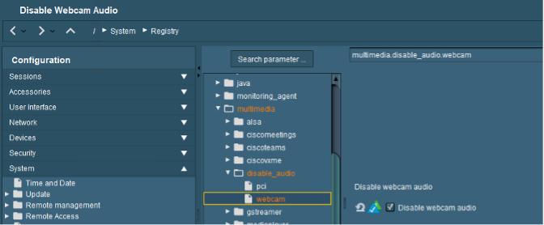

The new function to disable pci audio is also available:

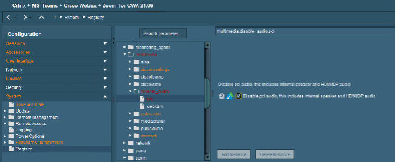

### Zoom Virtual Background workaround for IGEL OS

[ZOOM Support: Enabling Smart Virtual Backgrounds for Linux](https://support.zoom.com/hc/en/article?id=zm_kb&sysparm_article=KB0065298)

**Workaround for IGEL OS:**

- Modify the `/etc/zoomvdi/ZoomMedia.ini` for your VDI type

**NOTE:** The other ones are only there when the Zoom Plugin is enabled in the section of the solution for Citrix, VMware Horizon and AVD (WVD)

- Create a profile with `Final Desktop Command`

```bash linenums="1"
sed -i "s/SMARTVB=.*/SMARTVB=1/g" /etc/zoomvdi/ZoomMedia.ini
sed -i "s/SMARTVB=.*/SMARTVB=1/g" /etc/zoomvdi/citrix/ZoomMedia.ini
sed -i "s/SMARTVB=.*/SMARTVB=1/g" /etc/zoomvdi/vmware/ZoomMediaVmware.ini
sed -i "s/SMARTVB=.*/SMARTVB=1/g" /etc/zoomvdi/wvd/ 
```

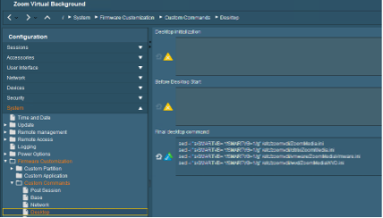

- Starting with IGEL OS 11.08.230 this feature is now integrated into the IGEL OS:

| Item | Details | 
|------|---------|
| IGEL Setup | Sessions > Unified Communication > Zoom Client Selection |
| Parameter | Smart Virtual Background Support |
| Registry | multimedia.zoomvdi.smartvb |
| Type | string |
|Value | [Off] [Auto][Always] |

### Virtual Background (Blurring or Background Picture) for IGEL OS

The new great function is now available for everyone – here are the steps to integrate it:

- Activate it into the features

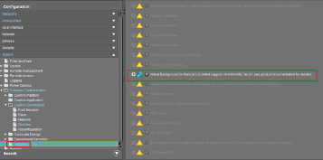

- Choose full or part segmentation (recommend the option segm_full)

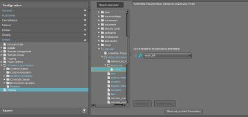

- If you choose Blurring, set to at least 70%

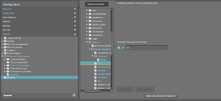

- You have the choice which webcam you want to use

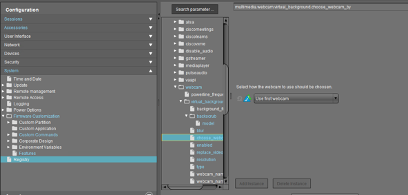

- You need to activate the function with this option, otherwise it will not work at all

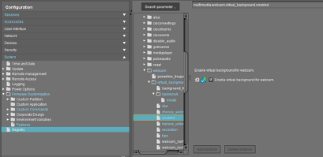

- To make the virtual webcam work in the Webcam info tool you need to enable this function too

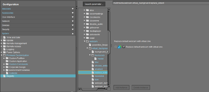

- Choose the resolution which should be used for the feature

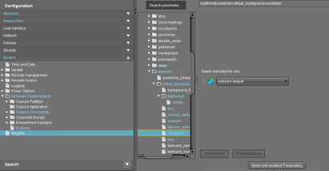

- You can change between Blurring and Background Picture

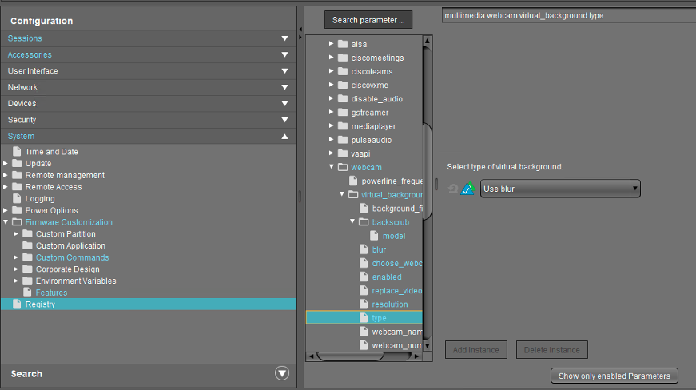
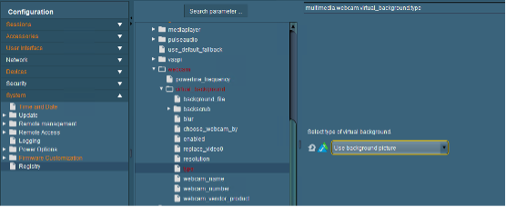

- For Background Picture you need also to define the place where the picture is saved:

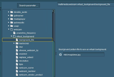

- Recommend assigning the picture with the files section from UMS

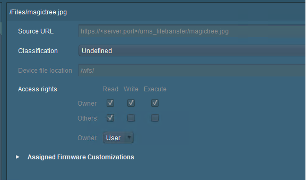

- After the configuration it should look like this:

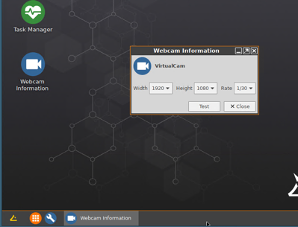
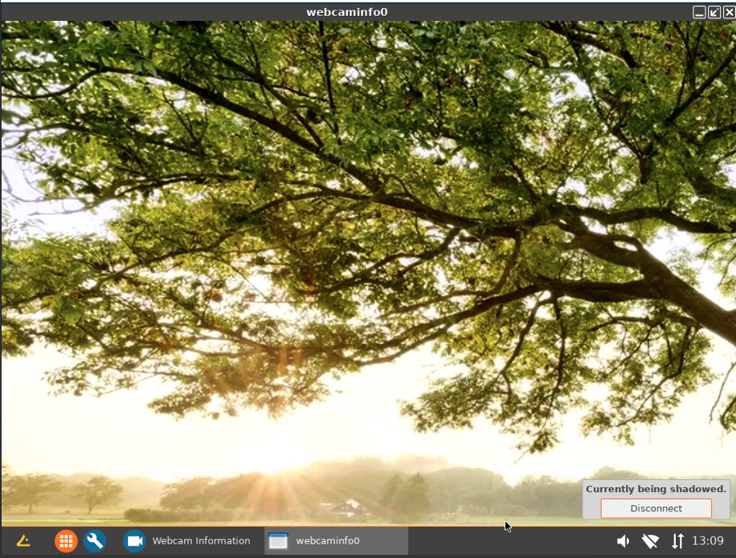

- **NOTE:** If the Printing (Internet printing protocol CUPS) feature is disabled, then a dependent GTK Webkit will not work, and the Virtual Webcam feature will not work. 

-----

-----

## Citrix on IGEL OS 11

<!--
UPDATE
-->
### Citrix Base configuration (HDX optimized) for CWA 23.11

- [Citrix Workspace App for Linux 23.11](https://docs.citrix.com/en-us/citrix-workspace-app-for-linux/whats-new.html#2311)

<!--
UPDATE
-->
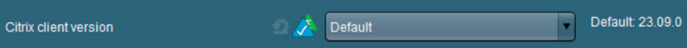

- Make sure to configure the right version `Based on Firmware`:

<!--
UPDATE
-->
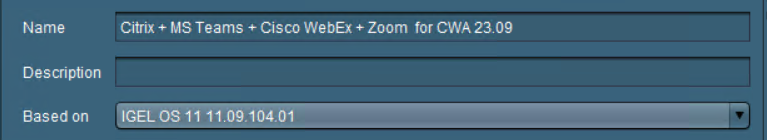

- If you choose UDP on Citrix, you need to enable UDP Audio on IGEL OS too:

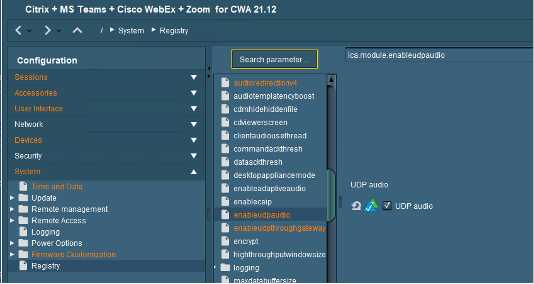

- and you can use UDP audio through Citrix Gateway:

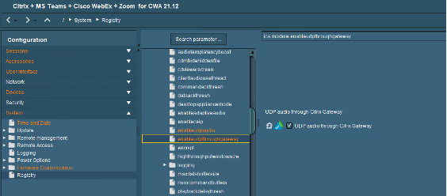

- Here is current recommend configuration for graphics:

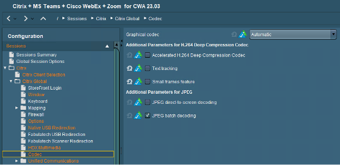

- Now you can use the new Multi Monitor Feature which is great for docking devices for example

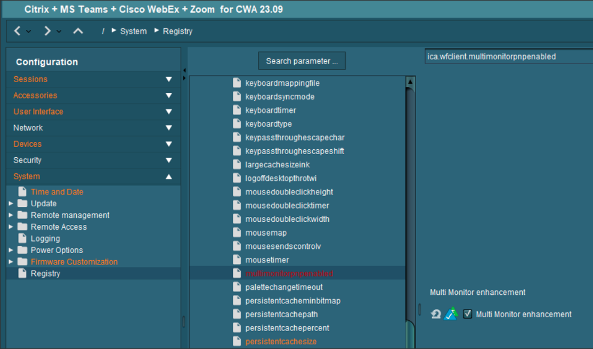

- You should enable the Multiple Audio Device support: 

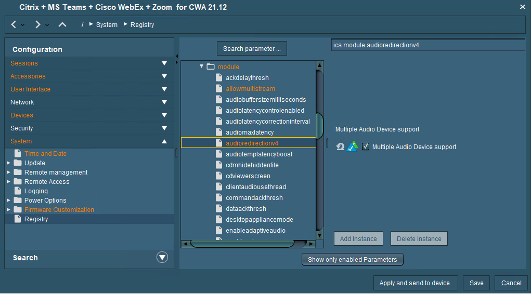

- If you want to use the HDX webcam feature, there is an automatic configuration available: 

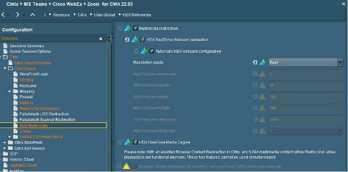

- There is also a new feature for H264 codec support for webcam redirection:

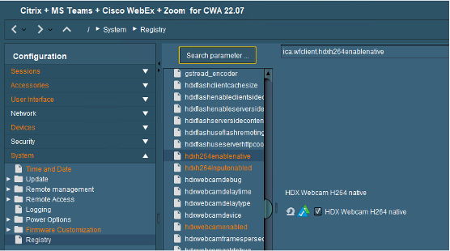

- and you should add these parameters to allow the use of Webcams in 64-bit applications too:

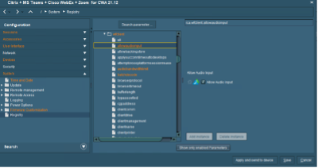
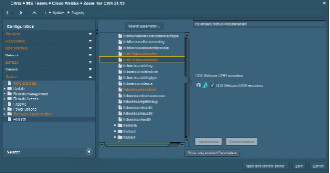

- Starting CWA 22.07 there are some new audio enhancements:

**NOTE:** [1] When the audio throughput undergoes a sudden spike or is not enough for an unstable network, this value increases the output buffering value. This increase in the output buffering value provides smooth audio. However, the audio might be slightly delayed. This parameter is only valid when `AudioRedirectionV4`, and `AudioLatencyControlEnabled` is set to True.

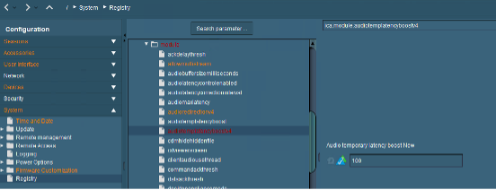

**NOTE:** [2] Improved audio echo cancellation support

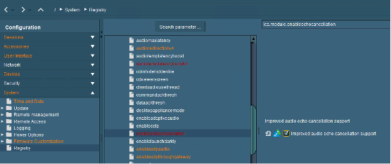

**NOTE:** [3] With this enhancement, the maximum output buffering value is decreased from 200 ms to 50 ms in Citrix Workspace app. As a result, the user experience of the interactive audio application is improved. Also, the round-trip time (RTT) is decreased by 150 ms. This parameter is valid only when `AudioRedirectionV4` is set to `True`

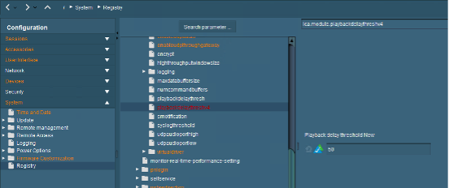

### Important Citrix Configuration Topics

Starting with Citrix VDA 2109, the default `virtual channel allow list` policy changed from `disabled` to `enabled`. This occurs even if you are upgrading an existing installation where you did not change the policy. Additional steps are required to allow Zoom, WebEx, and other tools to open a virtual channel.

Required steps:

Changing the virtual channel allow list policy to `disabled`:

The easiest way to ensure that Zoom, WebEx, and other tools can create and open a virtual channel to connect to the VDI plugin, is to set the policy for the virtual channel allow list to `disabled`. 

If the policy state was changed to `enabled` after updating to VDA release 2109, you can edit the policy to return the status to `disabled`.

You will need to open Citrix Studio and navigate to the ICA policies section. The following dialog shows the virtual channel allow list policy configured for `disabled`.

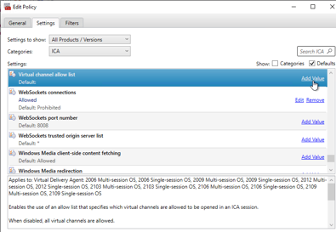

Change it to disabled:

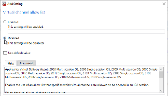

- Enable the Citrix connection bar for Citrix sessions and you can save the monitor layout within the session (it will be stored into User profile):

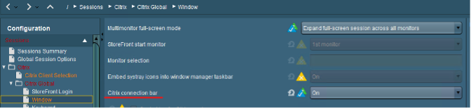
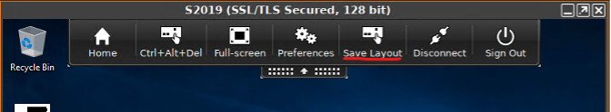

- There was a long running Citrix ERROR - it ends mostly with the message: Cannot add store (cannot validate certificate) `ERROR adding store 65147`.

The root cause is, that Microsoft changed in 2021 the PKI provider to SHA2 - if you use Windows Server 2019 or Windows Server 2022 you need to migrate your Root CA from SHA to SHA2: 

[Certificate Services - Migrate form SHA1 to SHA2 (SHA256) | PeteNetLive](https://www.petenetlive.com/KB/Article/0001243)

- With Citrix 1912 LTSR CU5 and 2203 LTSR CU1 some screen artifacts are occurring if you don’t use the right configuration. The problem is now fixed with IGEL OS 11.08.230 or greater but also this workaround helps to solve that:

On Citrix you need to configure these 5 policies like this:

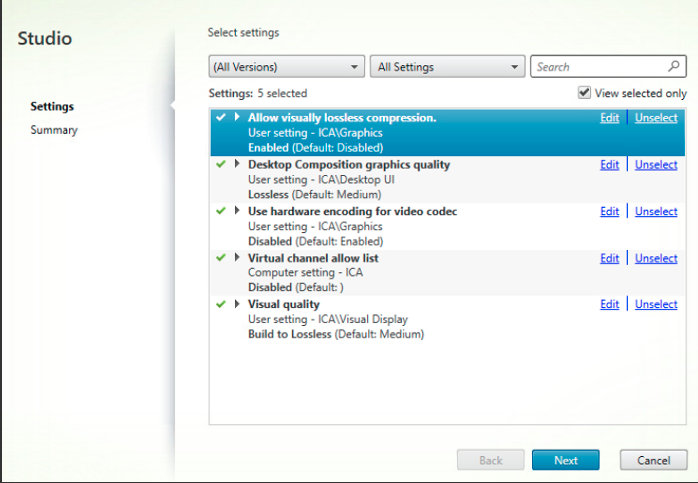

### Citrix Configuration for HDX Webcam redirection without plugins

- If you want to use applications on Citrix which do not have any plugins inside IGEL OS, it is also possible to use Citrix Webcam Redirection. You need to follow this section to proceed an optimal configuration.

Use this configuration on IGEL OS:

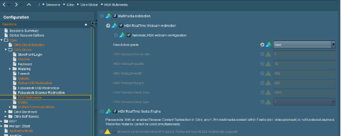

**Dependencies**

- Webcam redirection works with and without RTME.

- Webcam redirection works for 32-bit applications. For example, Skype, GoToMeeting. Use a 32-bit browser to verify webcam redirection online. For example, www.webcamtests.com 

- Webcam usage is exclusive to applications. For example, when Skype is running with a webcam and you launch GoToMeeting, exit Skype to use the webcam with GoToMeeting.

-  with CWA 21.12 Webcam redirection also works for 64-bit applications! *experimental*

**Dependencies for 64-bit Webcam redirection support**

Here are some additional topics which needs to be considered that the 64-bit redirection is working:

- Check GStreamer is working: Please check, that you have enabled the Fluendo codecs in the IGEL OS features enabled:

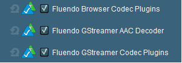

- If CWA 21.09 or greater is used, you should use GStreamer 1.0 (it is mandatory if you want to use 64bit apps for Webcam redirection) check if IGEL OS is right configured:

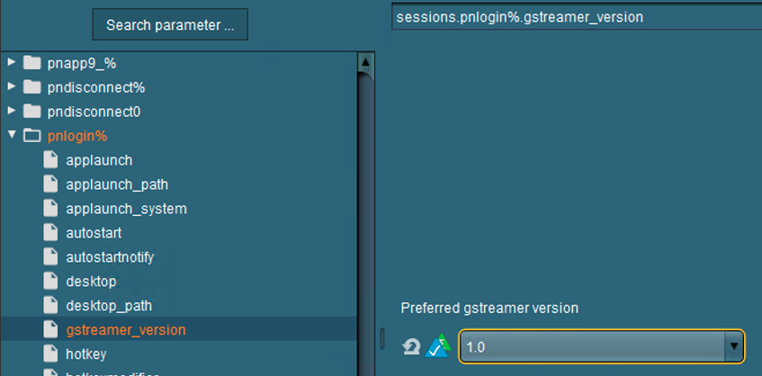

- Check if you have the right CVAD version in place: If CWA 21.12 or greater is used, you need to use at least Windows Client oder Server VDA 21.09 or 1912 LTSR CU4 or 2203 LTSR, unfortunately, 7.15 LTSR will not work at all.

**Supported and working video conferencing applications**

- Adobe Connect
- GoToMeeting
- Google Hangouts and Hangouts Meet
- IBM Sametime
- BlueJeans*
- BigBlueButton*
- Jitsi*
- Microsoft Skype for Business 2015
- Microsoft Lync 2010 and 2013
- Microsoft Skype 7 or higher
- Media Foundation-based video applications on Windows 8.x or higher / Windows Server 2012 R2 or higher

**NOTE:** * Not officially supported by Citrix

### Citrix Configuration for HDX -> Windows GPOs

- Applied Audio settings via GPO:

Computer Config > Admin Templates > Windows Components > Remote Desktop Services > Remote Desktop Session Host> Device and Resource Redirection

Changed `Allow audio and video playback redirection` from `Not Configured` to `Enabled`

Changed `Allow audio recording redirection` from `Not Configured` to `Enabled`

Computer Config > Admin Templates > Windows Components > App Privacy

- Changed `Let Windows apps access the microphone` from `Not Configured` to `Enabled`.  Options > Default for all apps changed from `User is in control` to `Force Allow`.

Changed `Let Windows apps access the camera` from `Not Configured` to `Enabled`.  Options > Default for all apps changed from `User is in control` to `Force Allow`.

Computer Config > Admin Templates > Windows Components > Camera changed `Let Allow use of Camera` from `Not Configured` to `Enabled`.

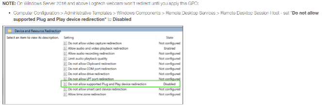
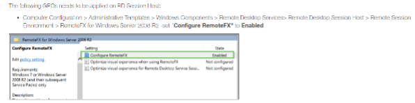

### Cisco WebEx Meetings

- IGEL OS Configuration (UMS based)

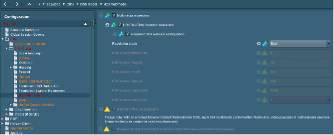
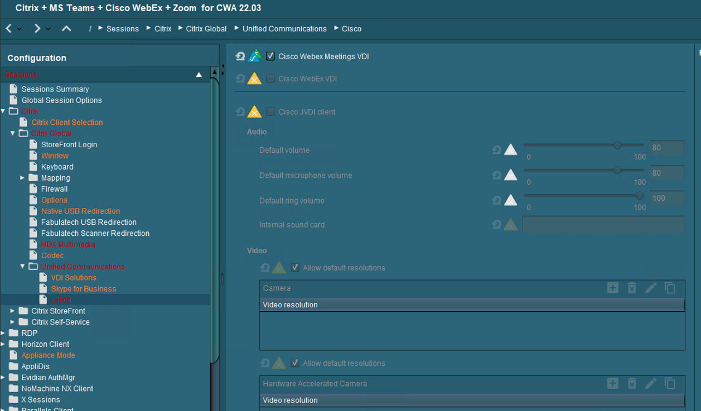


You need to choose the version you want to use (now in the GUI under Unified Communications):

<!--
UPDATE
-->
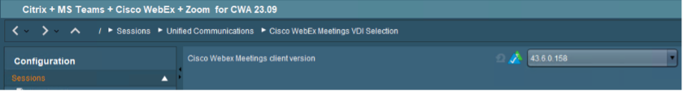

- Citrix Desktop Configuration (XenApp and XenDesktop)

Install the right software at the backend infrastructure:

**NOTE:** All VDI downloads are at the top of this guide

[Cisco Webex Meetings Virtual Desktop Software](https://help.webex.com/en-us/nfjsqzbb/Cisco-Webex-Meetings-Virtual-Desktop-Software) to check all what is needed for the installation.

- Citrix XenDesktop and Citrix XenApp are supported (no published app support) 

add the following values under HKEY_USERS\.DEFAULT:

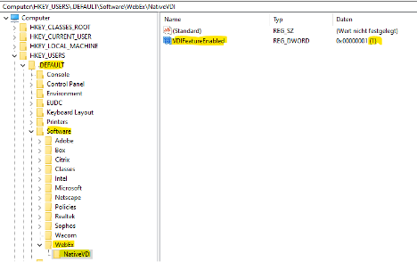

When you start Webex, it is only working with the redirection, if you can see the “VDI” sign here:


Check if you have the right Connection configuration:

[Test your WebEx Connection Configuration](https://mediatest.webex.com/)

[Further known issues and solved bugs](https://help.webex.com/en-us/c3r7uf/Open-and-Resolved-Bugs-for-the-Latest-Webex-Meetings-Updates)

[Check the release notes for further information](https://help.webex.com/en-us/article/glj57y/Release-Notes-for-Cisco-Webex-Meetings-Virtual-Desktop-Software-Release-42.x)

### Cisco WebEx

- IGEL OS Configuration (UMS based)

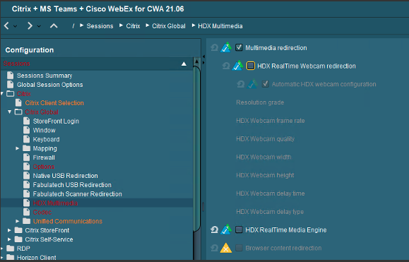
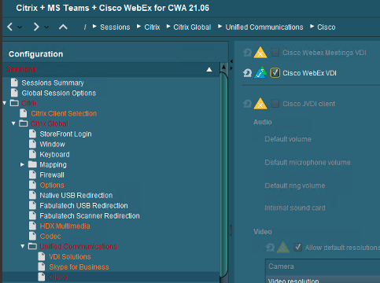

- Citrix Desktop Configuration (XenApp and XenDesktop)

Install the right software at the backend infrastructure: 

Cisco WebEx

[Only 64-bit installer](https://binaries.webex.com/Webex-Desktop-Windows-x64-Combined-VDI-Gold/20230711062013/WebexBundle.msi)

Next, install the Host Installer package, Webex.msi, in the VDI image. 
You can use the following commands to do this:

```bash linenums="1"
Persistent VDI: msiexec /i Webex.msi ALLUSERS=1 ENABLEVDI=2 AUTOUPGRADEENABLED=0 /quiet /norestart
Non-persistent VDI: msiexec /i Webex.msi ALLUSERS=1 ENABLEVDI=2 AUTOUPGRADEENABLED=0 ROAMINGENABLED=1 /quiet /norestart
```

**NOTE:** The most important setting is `ENABLEVDI=1`. If you just simply double-click the MSI this option is not used, and redirection will not work.

The other important setting is `ROAMINGENABLED=1` for non-persistent VDI. If this argument is specified, then the roaming database (the “spark_roaming_store.db” file) is stored in the end-user’s roaming directory (AppData\Roaming). Otherwise, the roaming database is stored in AppData\Local. This argument must be accompanied by `ALLUSERS=1`, otherwise the `ROAMINGENABLED` argument is ignored.

Users may be in a Citrix environment and not have the thin client installed or the virtual channel is disconnected. We support this scenario with fallback to a non-virtual Webex App installation. In this mode, the app shows a warning that the quality of video may be affected. Once the virtual channel is connected, the app can change to VDI mode. 

Use this table to understand the different installation combinations and how they affect media optimization for 
Unified CM, Webex Calling, and calls on Webex App.

|HVD VDI argument | Thin client plugin | Call service-enabled User | Calls on Webex App |
|-----------------|--------------------|---------------------------|---------------|
| ENABLEDVDI=0 | Not installed | Media is not optimized | Media is not optimized |
| ENABLEDVDI=0 | Installed | Media is not optimized | Media is not optimized |
| ENABLEDVDI=1 * | Installed | Supported deployment; Media is optimized | Supported deployment; Media is optimized |
| ENABLEDVDI=2 ** | Installed | Supported deployment; Media is optimized | Supported deployment; Media is optimized |
| ENABLEDVDI=1 * | Not installed | Fallback to non-optimized media | Fallback to non-optimized media |

* This argument does not detect the VDI environment automatically.

** This argument detects the VDI environment automatically.

- Testing the solution

You can verify if the redirection is working by checking the Health Checker option in the Help menu. This option must show a connected status for the Virtual Channel. If you are missing a requirement, the Virtual Channel does not have connected status, or is not there at all.

[Deployment Guide for Cisco Webex for Virtual Desktop Infrastructure (VDI) - Deploy Webex for VDI [Support] - Cisco](https://www.cisco.com/c/en/us/td/docs/voice_ip_comm/cloudCollaboration/wbxt/vdi/wbx-teams-vdi-deployment-guide/wbx-teams-vdi-deployment_chapter_010.html)

- Management and troubleshooting around Cisco WebEx: 

[Deployment Guide for Cisco Webex for Virtual Desktop Infrastructure (VDI) - Manage and Troubleshoot Webex for VDI [Support] - Cisco](https://www.cisco.com/c/en/us/td/docs/voice_ip_comm/cloudCollaboration/wbxt/vdi/wbx-teams-vdi-deployment-guide/manage-teams-vdi.html)

- Attention:

In Citrix and Windows Virtual Desktop vGPU environments, Webex is not detected as working in a VDI environment.

These Windows registry entries on the HVDs are used to detect Webex in a VDI environment:

```bash linenums="1"
[HKEY_CURRENT_USER\Software\Cisco Systems, Inc.\CiscoVDI] "isVDIEnv" = "true", datatype:REG_EXPAND_SZ

[HKEY_LOCAL_MACHINE\SOFTWARE\Cisco Spark Native] "isVDIEnv" = "true", datatype:REG_EXPAND_SZ
```

WebEx only support one Webex VDI client working together with one instance of Webex. Users can start multiple Citrix or VMWare sessions, but only one connection instance works, and the other instances fall back to non-VDI mode.

- Important hint:

You want to use Cisco WebEx and Cisco Jabber in parallel? 

Unfortunately, it is not possible to use Cisco Jabber and Cisco WebEx in parallel with the same headset and / or webcam. But this does not mean, that you cannot use both apps for meetings. There is an easy to fulfill possibility directly mentioned by Cisco how your users can use Cisco Jabber at all (for Cisco WebEx conferences and for direct calls).

On this page you will find how you need to configure that: 

[CALLING - Webex with Jabber Cross Launch - Application Note](https://www.cisco.com/c/dam/en/us/td/docs/solutions/PA/mcp/APPLICATION_CALLING-Webex_with_Jabber_Cross_Launch.pdf)

### Microsoft Teams (and Skype for Business)

- IGEL Configuration (UMS based)

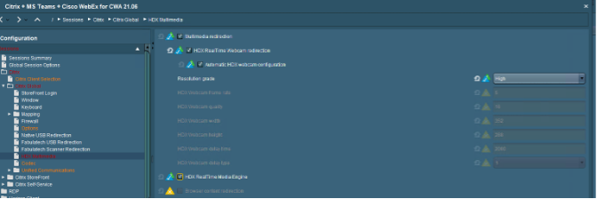

Microsoft Teams and Skype for Business optimization are enabled by default. HDX webcam parameters are listed in the Citrix general section. No further configuration is needed.

- Citrix Desktop Configuration (XenApp and XenDesktop)

The Citrix Workspace App (formerly Receiver) has an optimization that does not even exist in Windows 10 below Build 1909 and then falls back on the standard transmission, which has high performance impacts.

[What's new in Windows 10, version 1909 for IT Pros](https://docs.microsoft.com/en-us/windows/whats-new/whats-new-windows-10-version-1909)
 
Please install at least Version 20H2, you can get it here: [Windows 10, version 20H2](https://docs.microsoft.com/en-us/windows/release-health/status-windows-10-20h2)

HDX Realtime Optimization Pack: [HDX RealTime Optimization Pack 2.9 LTSR ](https://docs.citrix.com/en-us/hdx-optimization/current-release.html) that is only needed, if you want to use Skype for business 
 
Now you must start with installation of the right components:
 
Optimization for Microsoft Teams requires a minimum of Microsoft Teams version 1.3.00.28778. [Optimization for Microsoft Teams](https://docs.citrix.com/en-us/citrix-virtual-apps-desktops/multimedia/opt-ms-teams.html)

You need to open a lot of firewall ports to allow MS Teams to communicate with its cloud service: [Office 365 URLs and IP address ranges](https://learn.microsoft.com/en-us/microsoft-365/enterprise/urls-and-ip-address-ranges?view=o365-worldwide#skype-for-business-online-and-microsoft-teams)

Use the Office 365 online test to check if your network fulfills all the requirements to support Skype and/or Teams: [Microsoft 365 network connectivity test](https://connectivity.office.com/)

If you need help, here are the best list on open or known problems:
 
[Troubleshooting HDX Optimization for Microsoft Teams](https://support.citrix.com/article/CTX253754)

Check the Citrix Channel Allow List (with VDA 21.09 and higher) and activate this:

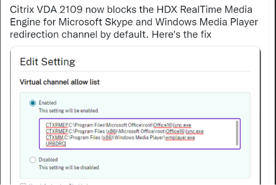

How you can check if the Teams Optimization is working?

1.	Select your user profile image, then select About.
2.	Select Version.

If the media optimization is loaded correctly, you will see this banner: 

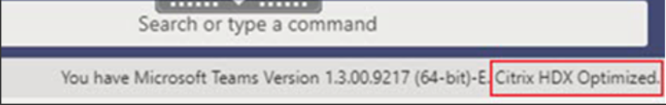

Sometimes it is also helpful to do a connection check on the endpoint. Execute these lines inside a local terminal and you can check if the needed addresses and ports can be reached:

```bash linenums="1"
nc -u -v -z 13.107.64.21 3478-3481
nc -u -v -z 52.112.0.31 3478-3481
nc -u -v -z 52.120.0.41 3478-3481
nc -v -z teams.microsoft.com 80
nc -v -z teams.microsoft.com 443
nc -v -z compass-ssl.microsoft.com 443
nc -v -z mlccdnprod.azureedge.net 443
nc -v -z aka.ms 443
```

EPOS headset configuration for Skype for Business

Configuration needed for the standard function (= pick up softphone = connect):

```bash linenums="1"
DW Pro 1 / DW Pro 2 = DIP 4 Autolink ON 
SDW 5035 / 5065 = DIP 5 = up = Audio Quality Best
SDW 5035 / 5065 = DIP 2 = down = Autolink ON
```

Teams Call seems to crash after 20 seconds without connection

It may appear that calls are crashing after 20 seconds. But this is not the case.
In the general Teams configuration after 20 seconds a call will be forwarded to voicemail. So, it seems that the call was crashed before the connection was established. Sometimes if you use firewall and/or proxy configuration it is possible that the connection need more than 20 seconds. You can check this with a configuration change on the Teams App configuration:


Change `Calls ring me` --> if unanswered --> Voicemail --> after 20 Seconds to `Do nothing`

### Zoom

- IGEL Configuration (UMS based)

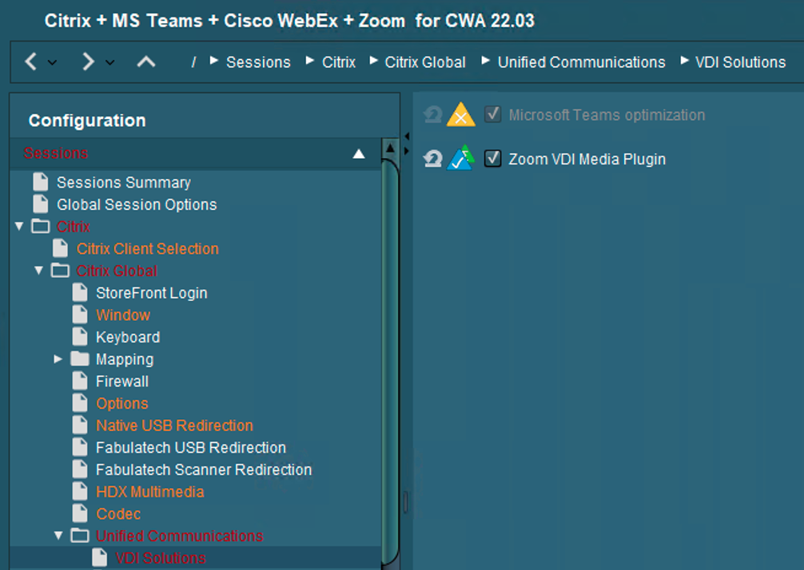

You need to choose the version you want to use, and you can select the use of Smart Virtual Background Support:

<!--
UPDATE
-->
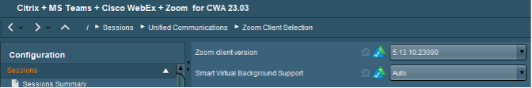

- Citrix Desktop Configuration (XenApp and XenDesktop)

You need at least Citrix Desktops and App 7.15 CU4 or 1912 LTSR CU2 (CU4 for virtual backgrounds).

If you want to use a perfect Zoom experience on Citrix Desktop, you need the corresponding Zoom VDI build which fits to the plugin you have chosen in the UMS:

To be compatible, the plugin version must be equal to or less than the Zoom VDI application version. Installing a plugin with a version greater than the Zoom VDI application is not supported. Zoom always recommends updating the Zoom Plugin after updating the Zoom VDI application as many new features require an updated plugin.
 [VDI backwards compatibility](https://support.zoom.us/hc/en-us/articles/360041602711-VDI-backwards-compatibility)

**NOTE:** All VDI downloads are at the top of this guide

For Citrix XenDesktop or Citrix XenApp installation you should use at least these parameters:

msiexec /i ZoomInstallerVDI.msi ZNoDesktopShortCut="true" ZConfig="nogoogle=1" ZRecommend="AudioAutoAdjust=1" /norestart ALLUsers=1

[Mass-deploying with preconfigured settings for Windows] (https://support.zoom.us/hc/en-us/articles/201362163-Mass-Installation-and-Configuration-for-Windows)

**Note:** Zoom VDI is supported on Citrix XenDesktop and Citrix XenApp published desktop (not with published apps)

Troubleshooting:

[Microphone and video not working for Zoom meetings inside HDX session](https://support.citrix.com/article/CTX275259)

Zoom has a list of Registry Settings that can help you troubleshoot or control the client. Here is a list of all available registry keys: [VDI client registry settings](https://support.zoom.us/hc/en-us/articles/360032343371)

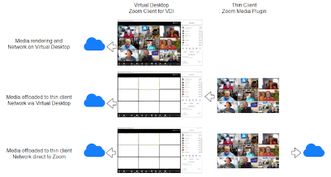

### Citrix Browser Content Redirection for MS Teams, GoToMeeting

- IGEL OS Configuration (UMS based)

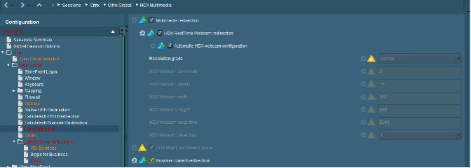
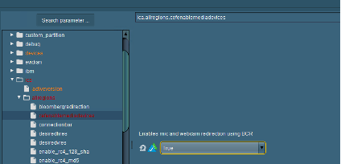

If you need to use Browser Content Redirection with Proxy (on the VDA), you need to activate this option too:

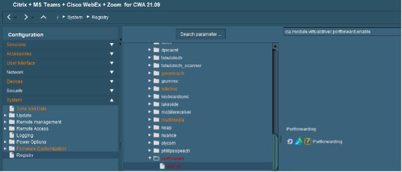

Client-side proxy configuration (and BCR is also possible), please follow the document below: 

[IGEL KB: Proxy Configuration](https://kb.igel.com/en/igel-os/11.10/proxy-2)

-  Citrix Desktop Configuration (XenApp and XenDesktop)

[Learn all what is needed on Citrix for BCR](https://docs.citrix.com/en-us/citrix-virtual-apps-desktops-service/multimedia/browser-content-redirection.html)

[Browser Content Redirection: whitelisting websites](https://support.citrix.com/article/CTX238236)

[Browser content redirection policy settings](https://docs.citrix.com/en-us/citrix-virtual-apps-desktops/policies/reference/ica-policy-settings/browser-content-redirection-policy-settings.html)

[How to Troubleshoot Browser Content Redirection](https://support.citrix.com/article/CTX230052)

[Browser content redirection not working consistently - unable to redirect Teams and YouTube, GoToMeeting redirects occasionally](https://support.citrix.com/article/CTX275227)

[Please install Browser Redirection Extension v6.1](https://chrome.google.com/webstore/detail/browser-redirection-exten/hdppkjifljbdpckfajcmlblbchhledln?hl=en)

Product Documentation: 

[Browser content redirection policy settings](https://docs.citrix.com/en-us/citrix-virtual-apps-desktops/policies/reference/ica-policy-settings/browser-content-redirection-policy-settings.html)

[Browser content redirection](https://docs.citrix.com/en-us/citrix-virtual-apps-desktops/multimedia/browser-content-redirection.html)

What’s new in version 6.1

1) Revert to Chrome Extensions manifest v2 to circumvent a Chromium bug with manifest v3 extensions that causes high CPU utilization.

2) Supports redirection in inactive Chrome tabs (Requires CVAD 2112 or higher)

3) Supports migrating redirected tabs from one Chrome window to another (Requires CVAD 2112 or higher)
 
What’s new in version 5.1 (The following features require CVAD 2109 or higher)

1) Introduces an improved redirection mechanism that uses a page in the chrome extension to begin the redirection process and solves script injection timing issues 

2) Solves issues with redirection of websites enforcing a Content Security Policy (CSP) policy 

3) Solves issues with redirection of websites that perform JavaScript redirects to authentication page in their Single Sign On (SSO) mechanisms

4) Solves issues with redirection of websites that perform 302 redirects

5) Solves issues with acquisition of multimedia devices on the BCR overlay after webpage is redirected
 
What’s new in version 5.0 

1) Fixes high DPI and scaling issues on overlay and VDA

2) Fixes some issues with redirected Angular websites


Important information for Audio inside the Browser:

Here is a quick tip on how to correct sound issues occurring in a Citrix session running Google Chrome / Chromium or Microsoft Edge. Often when the user went to a website that had media (i.e., YouTube), the sound would be broken. No audio sound would play on the endpoint via ICA.

It seems that this is an issue with Google Chrome version 79 or later. The newest versions of Chrome have an Audio Sandbox feature enabled by default which breaks sound on Citrix Apps and Desktops. 

To resolve this issue, you can do one of three workarounds:

Edit the registry on the XenApp server (or XenDesktop Desktop):

```bash linenums="1"
HKEY_LOCAL_MACHINE\SOFTWARE\Policies\Google\Chrome
reg:dword AudioSandboxEnabled = 0
```
For Chromium based Microsoft Edge users:

The same DWORD can be added to HKEY_LOCAL_MACHINE\Software\Policies\Microsoft\Edge
or editing the shortcut that launches Google Chrome to add the following arguments: `–disable-features=AudioServiceSandbox` or disable the feature using Group Policy. You can [download the Google Chrome ADMX templates](https://chromeenterprise.google/browser/download/#windows-tab). 

Then navigate to Google -> Google Chrome -> Allow the audio sandbox to run setting. `Set the option to Disabled`.

These workarounds will effectively disable the Audio Sandbox for Google Chrome on the Citrix VDI or Desktops Server.

[Citrix Browser Content Redirection](https://www.jgspiers.com/citrix-browser-content-redirection/)

- Configuration: YouTube with Citrix BCR

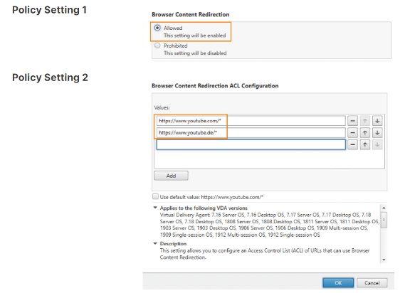
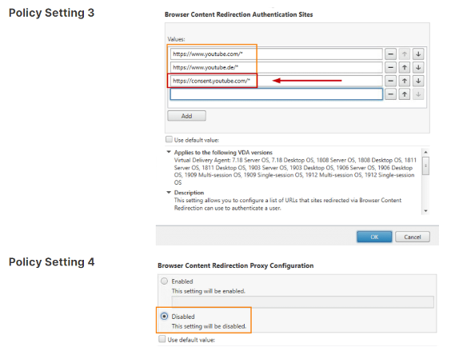

### Cisco JVDI on Citrix

- IGEL OS Configuration (UMS based)

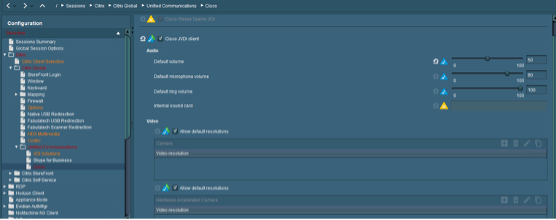

- Citrix Desktop Configuration (XenApp and XenDesktop)

Install the right software at the backend infrastructure: [Jabber Softphone for VDI - Windows](https://software.cisco.com/download/home/286304684/type/283802941/release/15.0(0))

[Deployment and Installation Guide for Cisco Jabber Softphone for VDI](https://www.cisco.com/c/en/us/td/docs/voice_ip_comm/jvdi/14_1/jvdi_b_deploy-install-jvdi-141.html)

Clients are available on this page: [Cisco Jabber VDI](https://www.webex.com/downloads/jabber/jabber-vdi.html)

**Note:** Only published desktops are supported (no published app support) 

Find out which Collaboration Accessories are recommended: [Unified Communications Endpoint and Client Accessories - Cisco](https://www.cisco.com/c/en/us/products/unified-communications/uc_endpoints_accessories.html)

**Important hint:** You want to use Cisco WebEx and Cisco Jabber in parallel? 

Unfortunately, it is not possible to use Cisco Jabber and Cisco WebEx in parallel with the same headset and / or webcam. But this does not mean, that you cannot use both apps for meetings. There is an easy to fulfill possibility directly mentioned by Cisco how your users can use Cisco Jabber at all (for Cisco WebEx conferences and for direct calls).

On this page you will find how you need to configure that: 
[Webex with Jabber Cross Launch Application Note](https://www.cisco.com/c/dam/en/us/td/docs/solutions/PA/mcp/APPLICATION_CALLING-Webex_with_Jabber_Cross_Launch.pdf)
 
**Important note**

Cisco is merging Jabber into WebEx 

[Transitioning from Jabber to Webex Deployment Guide](https://www.cisco.com/c/dam/en/us/td/docs/solutions/PA/mcp/DEPLOYMENT_CLIENTS_Jabber_to_Webex.pdf)

[Configure Users to Move Jabber Contacts and Common Settings to Webex App](https://help.webex.com/en-us/article/nyxlcde/Configure-Users-to-Move-Jabber-Contacts-and-Common-Settings-to-Webex-App)

- Additional information and Links for Troubleshooting on Citrix

[Information on Webcams in Citrix Virtual Apps and Desktops:](https://support.citrix.com/article/CTX132764)

[Microphone not working in session on Server 2019 VDA](https://support.citrix.com/article/CTX272452)

[Delivering Softphones with Virtual Apps and Desktops](https://support.citrix.com/article/CTX133024)

[Citrix Webcam x64 is not supported with Citrix 7.16 or older](https://support.citrix.com/article/CTX223199)

[Troubleshooting DTLS and EDT on Citrix Gateway](https://support.citrix.com/article/CTX226385)

[PoC Guide: Microsoft Teams optimization in Citrix Virtual Apps and Desktops environments](https://docs.citrix.com/en-us/tech-zone/learn/poc-guides/microsoft-teams-optimizations.html)

[How to Enable H.264 Hardware Encoding on 7.15 LTSR](https://support.citrix.com/article/CTX220731/how-to-enable-h264-hardware-encoding-with-intel-iris-pro-gpu-on-715-ltsr)

[How to Enable H.264 Hardware Encoding with Intel Iris Pro GPU on 7.15 LTSR (citrix.com)]()

[Troubleshooting Citrix Workspace App for Linux](https://docs.citrix.com/en-us/citrix-workspace-app-for-linux/troubleshooting.html)

[Tech Paper: Communications Ports Used by Citrix Technologies](https://docs.citrix.com/en-us/tech-zone/build/tech-papers/citrix-communication-ports.html)

[Reference Architecture: Optimizing Unified Communications Solutions](https://docs.citrix.com/en-us/tech-zone/design/reference-architectures/optimizing-unified-communications-solutions.html)

-----

-----

## VMware Horizon on IGEL OS 11

- VMware Base configuration (RTAV optimized)

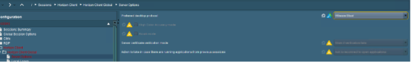

if you need USB Redirection, please make sure, it is right configured:

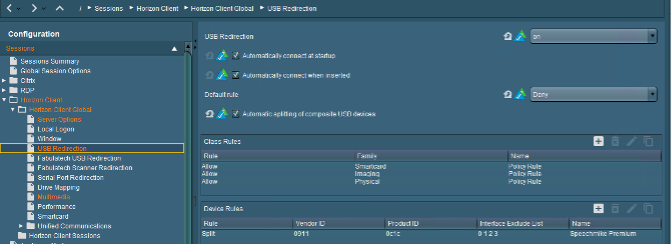
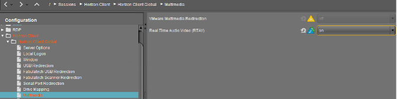

### Cisco WebEx Meetings

- IGEL OS Configuration (UMS based)

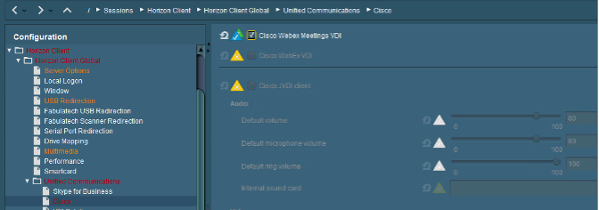

You need to choose the version you want to use:

<!--
UPDATE
-->
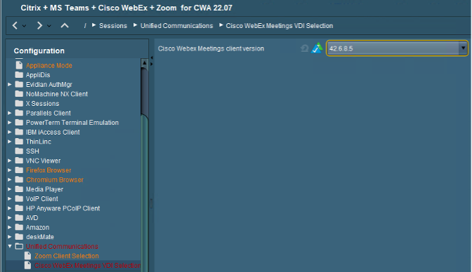

- VMware VDI Configuration (Horizon 8.x)

Install the right software at the backend infrastructure:

**NOTE:** All VDI downloads are at the top of this guide

Installation notes for [Cisco Webex Meetings Virtual Desktop Software](https://help.webex.com/en-us/nfjsqzbb/Cisco-Webex-Meetings-Virtual-Desktop-Software)

**Note:** Citrix XenDesktop and Citrix XenApp are supported (no published app support) 

Add the following values under HKEY_USERS\.DEFAULT:

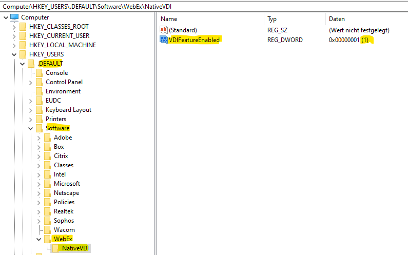

When you start Webex, it is only working with the redirection, if you can see the “VDI” sign here:


Check if your site administrator allows to use [Cisco WebEx for VDI](https://help.webex.com/en-us/pyham7/Enable-Webex-Meetings-Virtual-Desktop-Software)

Check if you have the right Connection configuration:

[Test your WebEx Connection Configuration](https://mediatest.webex.com/)

[Open and Resolved Bugs for the Latest Webex Meetings Updates](https://help.webex.com/en-us/c3r7uf/Open-and-Resolved-Bugs-for-the-Latest-Webex-Meetings-Updates)

### Cisco WebEx

- IGEL OS Configuration (UMS based)

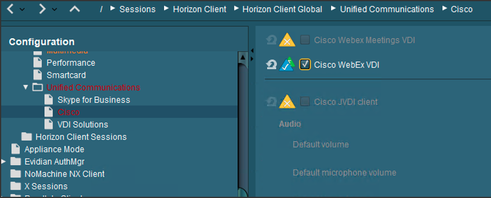

- VMware VDI Configuration (Horizon 8.x)

Install the right software at the backend infrastructure: 

[Only 64-bit installer](https://binaries.webex.com/Webex-Desktop-Windows-x64-Combined-VDI-Gold/20230711062013/WebexBundle.msi)

Next, install the Host Installer package, Webex.msi, in the VDI image. 
You can use the following commands to do this:

Persistent VDI: `msiexec /i Webex.msi ALLUSERS=1 ENABLEVDI=2 AUTOUPGRADEENABLED=0 /quiet /norestart`

Non-persistent VDI: `msiexec /i Webex.msi ALLUSERS=1 ENABLEVDI=2 AUTOUPGRADEENABLED=0 ROAMINGENABLED=1 /quiet /norestart`

**Note:** The most important setting is ENABLEVDI=2. If you just simply double-click the MSI this option is not used, and redirection will not work.

**Note:** Use this table to understand the different installation combinations and how they affect media optimization for Unified CM, Webex Calling, and calls on Webex App. 

|HVD VDI argument | Thin client plugin | Call service-enabled User | Calls on Webex App |
|-----------------|--------------------|---------------------------|---------------|
| ENABLEDVDI=0 | Not installed | Media is not optimized | Media is not optimized |
| ENABLEDVDI=0 | Installed | Media is not optimized | Media is not optimized |
| ENABLEDVDI=1 * | Installed | Supported deployment; Media is optimized | Supported deployment; Media is optimized |
| ENABLEDVDI=2 ** | Installed | Supported deployment; Media is optimized | Supported deployment; Media is optimized |
| ENABLEDVDI=1 * | Not installed | Fallback to non-optimized media | Fallback to non-optimized media |

* This argument does not detect the VDI environment automatically.

** This argument detects the VDI environment automatically.

The other important setting is `ROAMINGENABLED=1` for non-persistent VDI. If this argument is specified, then the roaming database (the “spark_roaming_store.db” file) is stored in the end-user’s roaming directory (AppData\Roaming). Otherwise, the roaming database is stored in AppData\Local. This argument must be accompanied by `ALLUSERS=1i`, otherwise the `ROAMINGENABLED` argument is ignored.

Testing the solution

You can verify if the redirection is working by checking the Health Checker option in the Help menu. This option must show a connected status for the Virtual Channel. If you are missing a requirement, the Virtual Channel does not have connected status, or is not there at all.

**Note:** Tests were done using a 2vCPU, 4GB memory Windows 10 virtual desktop with one other colleague in the WebEx Teams session. 

With VDI redirection enabled, we noticed the video was presented in a higher resolution and the sound was much clearer as opposed to not using redirection. 

Also noticed the CPU and memory usage dropped by 10% and 200MB when using redirection, this was of course because the video content was offloaded/redirected to the endpoint device.

[Deployment Guide for Cisco Webex for Virtual Desktop Infrastructure (VDI) - Deploy Webex for VDI](https://www.cisco.com/c/en/us/td/docs/voice_ip_comm/cloudCollaboration/wbxt/vdi/wbx-teams-vdi-deployment-guide/wbx-teams-vdi-deployment_chapter_010.html)

**Attention:**

In VMware and Windows Virtual Desktop vGPU environments, Webex is not detected as working in a VDI environment.

These Windows registry entries on the HVDs are used to detect Webex in a VDI environment:

```bash linenums="1"
[HKEY_CURRENT_USER\Software\Cisco Systems, Inc.\CiscoVDI] “isVDIEnv” = “true”, datatype:REG_EXPAND_SZ

[HKEY_LOCAL_MACHINE\SOFTWARE\Cisco Spark Native] “isVDIEnv” = “true”, datatype:REG_EXPAND_SZ
```

WebEx only support one Webex VDI client working together with one instance of Webex. Users can start multiple Citrix or VMWare sessions, but only one connection instance works, and the other instances fall back to non-VDI mode.

Webex VDI detects Citrix at first and then VMware in the HVD environment. If you want to use VMware, make sure no Citrix Agent is installed. 

You can check if the connection is configured right:

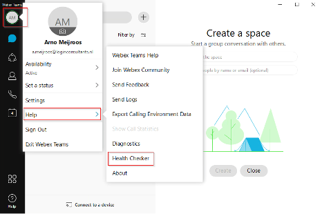
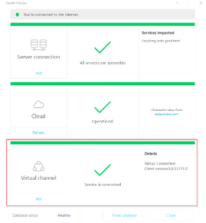

### Microsoft Teams

- IGEL OS Configuration (UMS based)

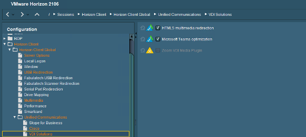

IGEL OS 11 includes the right client software.

<!--
UPDATE
-->
[Media Optimization for Microsoft Teams](https://docs.vmware.com/en/VMware-Horizon/2309/horizon-remote-desktop-features/GUID-F68FA7BB-B08F-4EFF-9BB1-1F9FC71F8214.html)

- VMware VDI Configuration (Horizon 8.x)

For the Horizon 8 release, Horizon Client for Linux 2106 supports Microsoft Teams Optimization when used with Horizon Agent version 2106 and later.

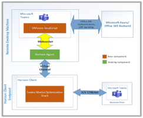

Please follow these steps to install Microsoft Teams for VMware Horizon:

The Optimization for Microsoft Teams configuration requires:

Microsoft Azure / 365 in backend: where the client would connect to establish the connection

Microsoft Teams Client (Optimized) x32 or x64 bit

Virtual desktop and client machine (where horizon client installed) operating system should be windows 10 x64

Enough resource in virtual desktop: Minimum requirement is 2 vCPU

Network with IPv4, reachability of vDesktops and Horizon client to Microsoft 365

For Microsoft Teams offloading you need at least an advanced Horizon license

**The installation**

To make it work it require to do configuration in 2 locations:

In vDesktops Master Image

In AD Group Policy

**In vDesktops Master Image:**

Install Horizon Agent before you install Microsoft Teams 

The Media Optimization for Microsoft Teams group policy setting must be enabled to use the feature

[Download the Teams MSI package](https://teams.microsoft.com/downloads/desktopurl?env=production&plat=windows&arch=x64&managedInstaller=true&download=true)

Install the MSI to the VDI VM by running the following commands (for floating desktops)

```bash linenums="1"
msiexec /i <path_to_msi> /l*v <install_logfile_name> ALLUSER=1 ALLUSERS=1
```

[Install Media Feature Pack](https://www.microsoft.com/en-us/download/details.aspx?id=48231)

**In Active Directory**

Download Horizon GPO template bundle

Import the bundle to AD

Create a GPO and map it to vDesktops OU

Go to Computer Configuration -> Policies -> Administrative Templates -> VMware View Agent Configuration -> VMware HTML5 Features -> VMware WebRTC Redirection Features

Enable the Media Optimization for Microsoft Teams setting

<!--
UPDATE
-->
Additional information you will find here: [Configuring Media Optimization for Microsoft Teams](https://docs.vmware.com/en/VMware-Horizon/2309/horizon-remote-desktop-features/GUID-F68FA7BB-B08F-4EFF-9BB1-1F9FC71F8214.html)

**Troubleshooting**

[All VMware articles for Troubleshooting MS Teams Optimization](https://kb.vmware.com/s/global-search/%40uri#q=HorizonTeamsOptimization&t=MoreContent&sort=relevancy)

Sometimes it is also helpful to do a connection check on the endpoint. Execute these lines inside a local terminal and you can check if the needed addresses and ports can be reached:

```bash linenums="1"
nc -u -v -z 13.107.64.21 3478-3481
nc -u -v -z 52.112.0.31 3478-3481
nc -u -v -z 52.120.0.41 3478-3481
nc -v -z teams.microsoft.com 80
nc -v -z teams.microsoft.com 443
nc -v -z compass-ssl.microsoft.com 443
nc -v -z mlccdnprod.azureedge.net 443
nc -v -z aka.ms 443
```

How you can check if the Teams Optimization is working?

1.	Select your user profile image, then select About.
2.	Select Version.

If the media optimization is loaded correctly, you will see this banner: 

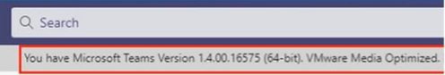

**EPOS headset configuration for Teams and Skype for Business:**

Configuration needed for the standard function (= pick up softphone = connect):

```bash linenums="1"
DW Pro 1 / DW Pro 2 = DIP 4 Autolink ON 
SDW 5035 / 5065 = DIP 5 = up = Audio Quality Best
SDW 5035 / 5065 = DIP 2 = down = Autolink ON
```

**Teams Call seems to crash after 20 seconds without connection**

It may appear that calls are crashing after 20 seconds. But this is not the case.
In the general Teams configuration after 20 seconds a call will be forwarded to voicemail. So, it seems that the call was crashed before the connection was established. Sometimes if you use firewall and/or proxy configuration it is possible that the connection need more than 20 seconds. You can check this with a configuration change on the Teams App configuration:

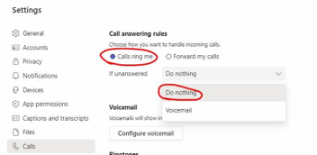

Change `Calls ring me` --> if unanswered --> Voicemail --> after 20 Seconds to `Do nothing`

### Zoom

- IGEL OS Configuration (UMS based)

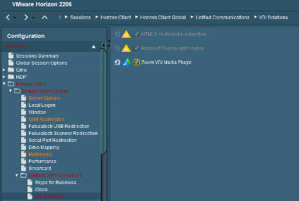

You need to choose the version you want to use, and you can select the use of Smart Virtual Background Support:

<!--
UPDATE
-->
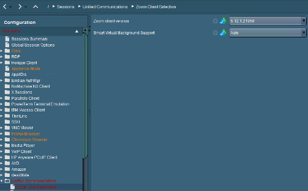

- VMware VDI Configuration (Horizon 8.x)

If you want to use a perfect Zoom experience on VMware Horizon, you need the corresponding Zoom VDI build which fits to the plugin you have chosen in the UMS:

**Note:** To be compatible, the plugin version must be equal to or less than the Zoom VDI application version. Installing a plugin with a version greater than the Zoom VDI application is not supported. Zoom always recommends updating the Zoom Plugin after updating the Zoom VDI application as many new features require an updated plugin. [VDI backwards compatibility](https://support.zoom.us/hc/en-us/articles/360041602711-VDI-backwards-compatibility)

All VDI Downloads are located here: [VDI releases and downloads – Zoom Support](https://support.zoom.com/hc/en/article?id=zm_kb&sysparm_article=KB0063810)

**NOTE:** All VDI downloads are at the top of this guide

For VMware Horizon 7.x and 8.x installation you should use these parameters:

```bash linenums="1"
msiexec /i C:\yourfolder\ZoomInstallerVDI.msi ZNoDesktopShortCut="true" ZConfig="nogoogle=1" ZRecommend="AudioAutoAdjust=1" /quiet /qn /norestart ALLUsers=1
```

[Mass-deploying with preconfigured settings for Windows](https://support.zoom.us/hc/en-us/articles/201362163-Mass-Installation-and-Configuration-for-Windows)

If you have an audio problem with Zoom on VMware Horizon, [Audio distortion when using Zoom meeting in Horizon remote desktop session (78481)](https://kb.vmware.com/s/article/78481)

### VMware Horizon Browser Content Redirection with HTML5

- IGEL OS Configuration (UMS based)

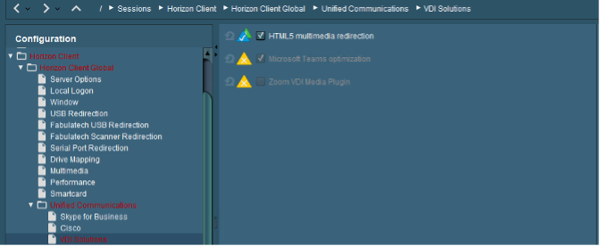

- VMware VDI Configuration (Horizon 7.x and 8.x)

VDI or RDSH images must have at least the Horizon Agent 7.10 with HTML5 option. This option is included by default.

The HTML5 Multimedia Redirection GPO settings must be configured on the Active Directory server.

The Chrome or Edge browser must be installed in the VDI or RDSH image.

The VMware Horizon HTML5 Multimedia Redirection extension must be installed in the Chrome or Edge browser.

The BLAST (Extreme) or PCoIP protocols must be used.

Redirecting HTML5 multimedia content from a VDI or RDSH session to the local client system requires installing the HTML5 Multimedia Redirection feature and the Chrome or Edge browser within the VDI or RDSH image, enabling the HTML5 Multimedia Redirection plug-in, and specifying which websites will use this feature.

<!--
UPDATE
-->
Assuming you already copied the `vdm_agent.admx` file (which is part of the [VMware Horizon GPO bundle](https://customerconnect.vmware.com/downloads/details?downloadGroup=HZ-2309-STD&productId=1474&rPId=114074) in the SYSVOL folder of your Active Directory server, you can go ahead and configure the required VMware Horizon settings.

When creating the GPO, navigate to `Computer Configuration > Policies > Administrative Templates > VMware View Agent Configuration > VMware HTML5 Features`

Enable the following settings:

1) Enable VMware HTML5 Multimedia Redirection

2) Enable Chrome and/or Edge Browser HTML5 Multimedia Redirection

3) Enable the URL list and fill in the value name, for example: `https://www.youtube.com/*` and do not fill in any value (leave this empty). It is important to include the http:// or https:// prefix in the URLs. You can use wildcards.

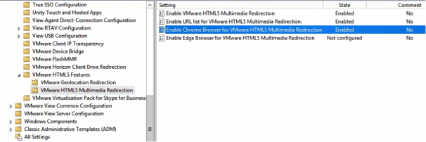
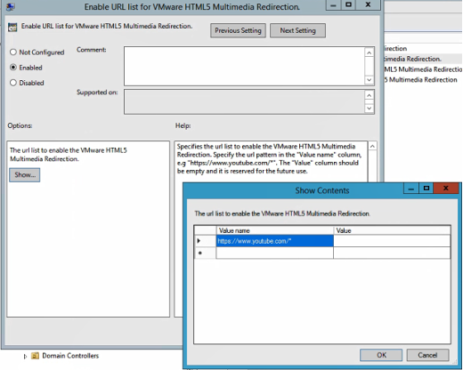

For the Chrome and Edge browsers, you can opt to automatically manage and activate the HTML5 Multimedia Redirection plug-in for the end-users by configuring the following GPO settings. For Chrome, download the Chrome .admx file and copy this to the SYSVOL folder of the Active Directory server.

When creating the GPO, go to `User or Computer Configuration > Policies > Administrative Templates > Google > Google Chrome > Extensions`

Enable the setting “Configure the list of force-installed apps and extensions” and fill in the following line:

`ljmaegmnepbgjekghdfkgegbckolmcok;https://clients2.google.com/service/update2/crx`

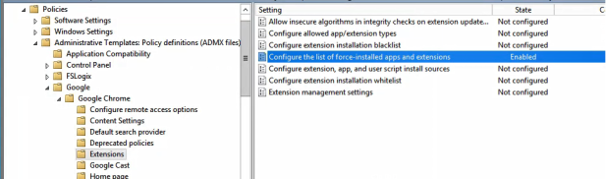
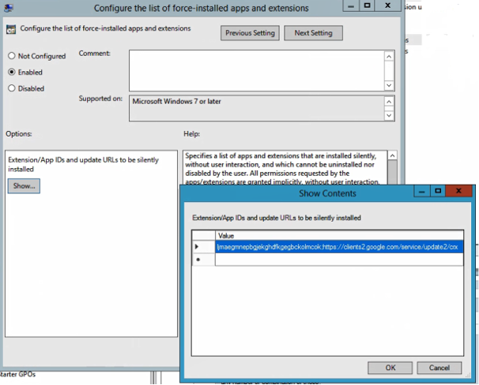

**Note:** Since this can also be set on the user level, this setting can of course also be done with a User Environment Manager tool, such as VMware Dynamic Environment Manager.

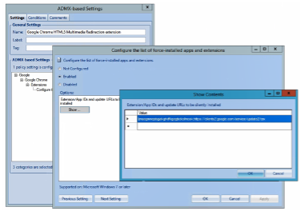

To automatically enable the Edge browser plugin, please follow [Horizon Release Notes](https://docs.vmware.com/en/VMware-Horizon/index.html)

If you have met all the requirements, it is time to test if the configuration is working! Within the VDI or RDSH session, launch the Chrome or Edge browser, and look for the VMware Horizon HTML5 Redirection Extension icon in the right-upper corner.

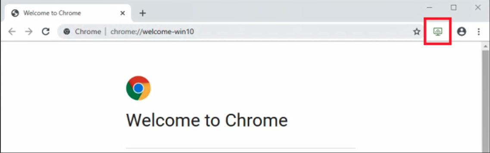
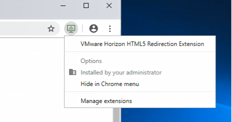

Note to the following:

1) The icon must be green. Only then the plug-in is active and ready for use.

2) If the icon is grey, then you have not met one of the requirements. For example, the Horizon Agent install parameter or Horizon Client version.

Here is a quick tip on how to correct sound issues occurring in a VMware Horizon session running Google Chrome / Chromium or Microsoft Edge. It is possible, that inside a virtual desktop that had Google Chrome in it, when a user went to a website that had media (i.e., YouTube), the sound would be broken. No audio sound would play on the endpoint.

It seems that this is an issue with Google Chrome version 79 or later. The newest versions of Chrome have an Audio Sandbox feature enabled by default which breaks sound on VMware Horizon. To resolve this issue, you can do one of three workarounds:

Edit the registry on Horizon Desktop:

```bash linenums="1"
HKEY_LOCAL_MACHINE\SOFTWARE\Policies\Google\Chrome
reg:dword AudioSandboxEnabled = 0
```

**For Chromium based Microsoft Edge users**

The same DWORD can be added to HKEY_LOCAL_MACHINE\Software\Policies\Microsoft\Edge or editing the shortcut that launches Google Chrome to add the following arguments:

```bash linenums="1"
"–disable-features=AudioServiceSandbox"
```

or disable the feature using Group Policy. You can [download the Google Chrome ADMX templates](https://cloud.google.com/chrome-enterprise/browser/download/). 

Then navigate to Google -> Google Chrome -> Allow the audio sandbox to run setting. `Set the option to Disabled`.

These workarounds will effectively disable the Audio Sandbox for Google Chrome in the VDI.

**VIDEO TEST**

For this test following VM was used:

1) Windows 10, build 1803 VDI

2) Horizon Agent 7.10

3) Specs: 2vCPU, 4GB Memory

Let us first play a FULL HD (1080p) video without HTLM5 Redirection. We immediately see the CPU spiking to 100%. Furthermore, the image and audio quality are quite poor. Bandwidth consumption is around 200Kbps and 8Mbps, using BLAST Extreme.


Let us launch the same demo video (also in 1080p) with HTLM5 Redirection. We immediately notice the plugin icon changing with the addition of the blue “REDR” letters. This means redirection is fully operational. We notice the image and quality levels are excellent!

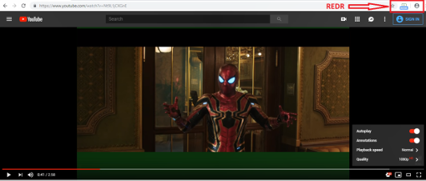

When you look at the CPU resources, the CPU will stay around 20-40%.

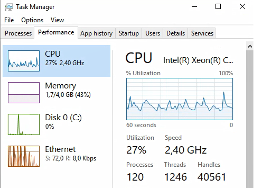

The bandwidth consumption is the same as playing the video without HTML5 Redirection, around 200Kbps and 8Mbps using Blast Extreme.

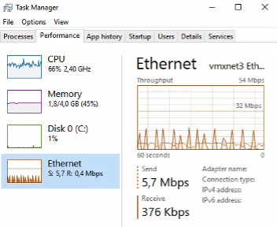

Even when using a 1vCPU, 2GB Memory Windows 7 VDI, we notice a great multimedia experience!! With only about 40-60% CPU consumption.

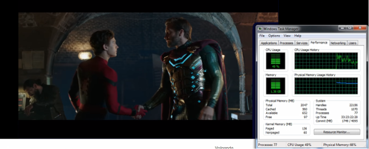

### Cisco JVDI on VMware Horizon

- IGEL OS Configuration (UMS based)

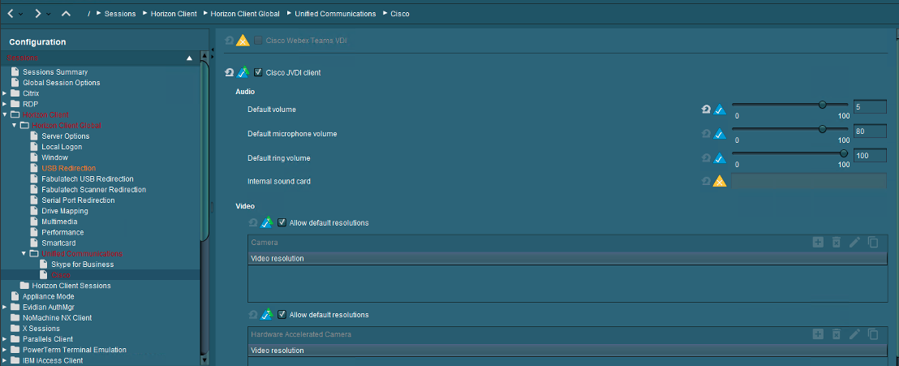

- VMware Horizon 8.x

Install the right software at the backend infrastructure [Jabber Softphone for VDI - Windows](https://software.cisco.com/download/home/286304684/type/283802941/release/15.0(0))

How to install: [Deployment and Installation Guide for Cisco Jabber Softphone for VDI Release](https://www.cisco.com/c/en/us/td/docs/voice_ip_comm/jvdi/14_1/jvdi_b_deploy-install-jvdi-141.pdf)

all clients are available on this page [Cisco Jabber VDI](https://www.webex.com/downloads/jabber/jabber-vdi.html)

Find out which Collaboration Accessories are recommended: [Unified Communications Endpoint and Client Accessories - Cisco](https://www.cisco.com/c/en/us/products/unified-communications/uc_endpoints_accessories.html)

**Important hint:**

You want to use Cisco WebEx and Cisco Jabber in parallel? 

Unfortunately, it is not possible to use Cisco Jabber and Cisco WebEx in parallel with the same headset and / or webcam. But this does not mean, that you cannot use both apps for meetings. There is an easy to fulfill possibility directly mentioned by Cisco how your users can use Cisco Jabber at all (for Cisco WebEx conferences and for direct calls).

On this page you will find how you need to configure that: [Webex with Jabber Cross Launch Application Note](https://www.cisco.com/c/dam/en/us/td/docs/solutions/PA/mcp/APPLICATION_CALLING-Webex_with_Jabber_Cross_Launch.pdf)

 **Important note** Cisco is merging Jabber into WebEx 

Deployment Guide for this merge: [Transitioning from Jabber to Webex Deployment Guide](https://www.cisco.com/c/dam/en/us/td/docs/solutions/PA/mcp/DEPLOYMENT_CLIENTS_Jabber_to_Webex.pdf)

There is also another document which describes how you merge all your contacts and configurations from Jabber to WebEx: [Configure Users to Move Jabber Contacts and Common Settings to Webex App](https://help.webex.com/en-us/article/nyxlcde/Configure-Users-to-Move-Jabber-Contacts-and-Common-Settings-to-Webex-App)

-----

-----

## Azure Virtual Desktop (AVD) on IGEL OS 11

There is a good feature included in the AVD registry:

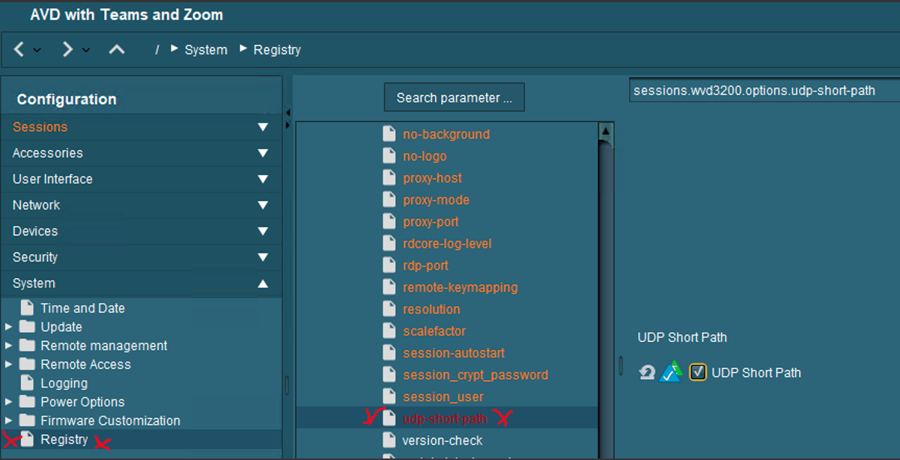

Learn more about that on Microsoft Learn: [RDP Shortpath for Azure Virtual Desktop](https://learn.microsoft.com/en-us/azure/virtual-desktop/rdp-shortpath?tabs=managed-networks)

### Cisco WebEx Meetings

Unfortunately, currently no Client Plugin for IGEL OS is available

### Cisco WebEx Teams

Unfortunately, currently no Client Plugin for IGEL OS is available

### Microsoft Teams

- IGEL OS Configuration (UMS based)

Teams Optimization is included. Just use a profile with AVD activated – there is no need to activate Teams optimization, it is still activated at all.

- AVD Configuration

Before you can use Microsoft Teams on Azure Virtual Desktop, you'll need to do these things:

1) Prepare your network for Microsoft Teams.

2) Connect to a Windows 10 or 11 Multi-session or Windows 10 or 11 Enterprise virtual machine (VM).

**Install the Teams desktop app**

This section will show you how to install the Teams desktop app on your Windows 10 or 11 Multi-session or Windows 10 or 11 Enterprise VM image. To learn more, check out Install or update the Teams desktop app on VDI.

**Prepare your image for Teams**

To enable media optimization for Teams, set the following registry key on the host VM:

1) From the start menu, run RegEdit as an administrator. Navigate to HKEY_LOCAL_MACHINE\SOFTWARE\Microsoft\Teams. Create the Teams key if it doesn't already exist.

2) Create the following value for the Teams key:

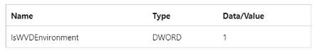

**Install the Teams WebSocket Service**

Install the latest version of the [Remote Desktop WebRTC Redirector Service](https://query.prod.cms.rt.microsoft.com/cms/api/am/binary/RE4YM8L) on your VM image. If you encounter an installation error, install the latest [Microsoft Visual C++ Redistributable](https://support.microsoft.com/help/2977003/the-latest-supported-visual-c-downloads) and try again.

**Latest WebSocket Service versions**

The following table lists the latest versions of the WebSocket Service:

| Version | Release date |
|---------|--------------|
| 1.17.2205.23001 | 06/20/2022 |
| 1.4.2111.18001 | 12/02/2021 |
| 1.1.2110.16001 | 10/15/2021 |
| 1.0.2106.14001 | 07/29/2021 |
| 1.0.2006.11001 | 07/28/2020 |
| 0.11.0	05/29/2020 |

**Install Microsoft Teams**

You can deploy the Teams desktop app using a per-machine or per-user installation. To install Microsoft Teams in your Azure Virtual Desktop environment:

1) Download the [Teams MSI](https://docs.microsoft.com/en-us/microsoftteams/teams-for-vdi#deploy-the-teams-desktop-app-to-the-vm) package that matches your environment. We recommend using the 64-bit installer on a 64-bit operating system.

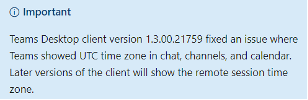

2) Run one of the following commands to install the MSI to the host VM:

**Per-user installation**

```bash linenums="1"
PowerShellCopy
msiexec /i <path_to_msi> /l*v <install_logfile_name>
```

This process is the default installation, which installs Teams to the %AppData% user folder. Teams won't work properly with per-user installation on a non-persistent setup.

**Per-machine installation**

```bash linenums="1"
PowerShellCopy
msiexec /i <path_to_msi> /l*v <install_logfile_name> ALLUSER=1
```

This installs Teams to the Program Files (x86) folder on a 32-bit operating system and to the Program Files folder on a 64-bit operating system. At this point, the golden image setup is complete. Installing Teams per-machine is required for non-persistent setups.

There are two flags that may be set when installing teams, `ALLUSER=1` and `ALLUSERS=1`. It is important to understand the difference between these parameters. The `ALLUSER=1` parameter is used only in VDI environments to specify a per-machine installation. The `ALLUSERS=1` parameter can be used in non-VDI and VDI environments. When you set this parameter, Teams Machine-Wide Installer appears in Program and Features in Control Panel as well as Apps & features in Windows Settings. All users with admin credentials on the machine can uninstall Teams.

**Verify media optimizations loaded**

After installing the WebSocket Service and the Teams desktop app, follow these steps to verify that Teams media optimizations loaded:

1. Quit and restart the Teams application.
2. Select your user profile image, then select About.
3. Select Version.

If the media optimization is loaded correctly, you will see this banner:


### Zoom

- IGEL OS Configuration (UMS based)

the Zoom plugins are included in IGEL OS 11

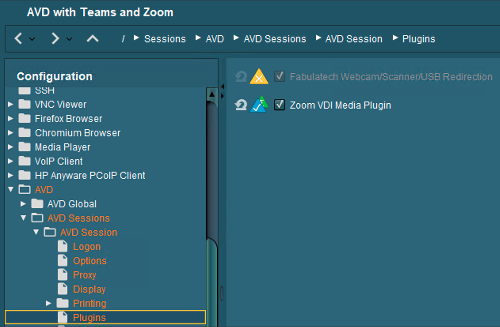

You need to choose the version you want to use:

<!--
UPDATE
-->
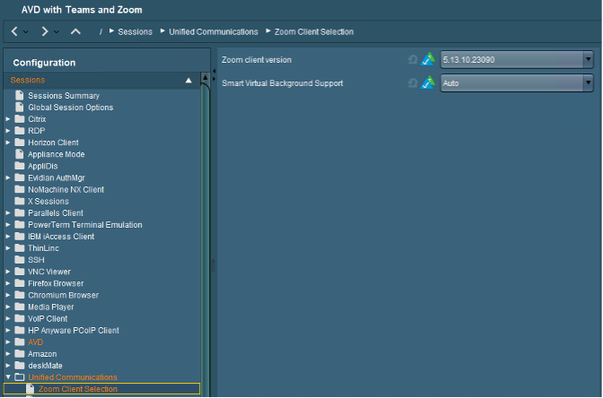

- AVD Configuration


If you want to use a perfect Zoom experience on Azure Virtual Desktop, you need the corresponding Zoom VDI build which fits to the plugin you have chosen in the UMS:

To be compatible, the plugin version must be equal to or less than the Zoom VDI application version. Installing a plugin with a version greater than the Zoom VDI application is not supported. Zoom always recommends updating the Zoom Plugin after updating the Zoom VDI application as many new features require an updated plugin. [VDI backwards compatibility](https://support.zoom.us/hc/en-us/articles/360041602711-VDI-backwards-compatibility)

All VDI Downloads are located here: VDI releases and downloads – Zoom Support 

**NOTE:** All VDI downloads are at the top of this guide

For AVD installation you should use these parameters:

```bash linenums="1"
msiexec /i C:\yourfolder\ZoomInstallerVDI.msi ZNoDesktopShortCut="true" ZConfig="nogoogle=1" ZRecommend="AudioAutoAdjust=1" /quiet /qn /norestart ALLUsers=1
```

[Mass-deploying with preconfigured settings for Windows](https://support.zoom.us/hc/en-us/articles/201362163-Mass-Installation-and-Configuration-for-Windows)

After installation you should be able to start the Zoom VDI app:

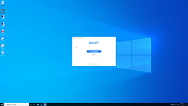

**Results**

Looking at the processes running on the AVD Desktop, we can see that Zoom is using pretty much zero resources:

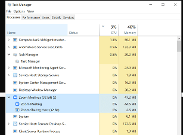

-----

-----

## Microsoft Remote Desktop (RDSH, RDP) on IGEL OS 11 

- IGEL OS Configuration (UMS based)

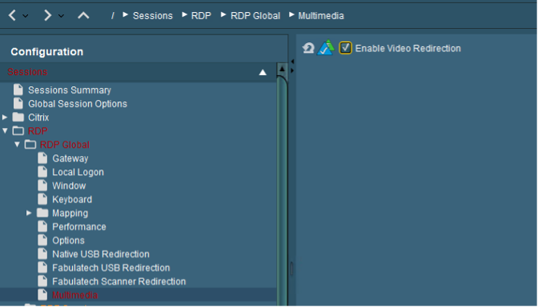

Make UDP package transport possible:

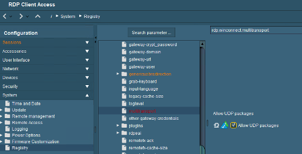

Configure sound channels for better quality:

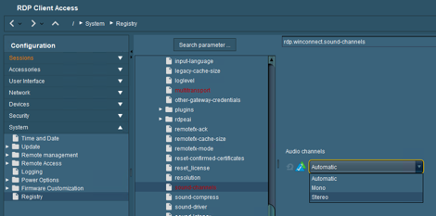

Sometimes it is better to prefer GStreamer sound over PulseAudio – you can change that here:

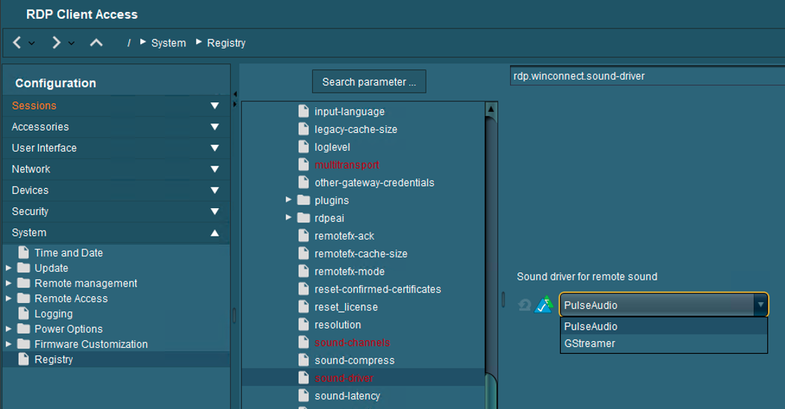

Sound latency can be configured too – recommend 200 ms for RDS environments:

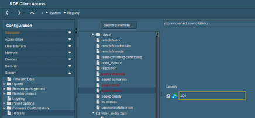

If the webcam is listed in the Audio In section and you do not want to use the Audio portion of the Webcam, there is a special registry key available which disables the audio portion from the webcam:

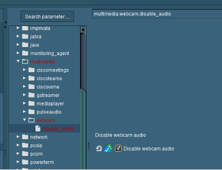

- 6.1.2.	Windows 10, Windows Server 2016, 2019 and 2022 Base Configuration

**Applied Audio settings via GPO:**

`Computer Config > Admin Templates > Windows Components > Remote Desktop Services > Remote Desktop Session Host> Device and Resource Redirection`

Changed `Allow audio and video playback redirectioni` from `Not Configured`` to `Enabled`

Changed `Allow audio recording redirection` from `Not Configured` to `Enabled`

**Computer Config > Admin Templates > Windows Components > App Privacy**

Changed `Let Windows apps access the microphone` from `Not Configured` to `Enabled``

`Options > Default for all apps` changed from `User is in control1cl` to `Force Allow`

Changed `Let Windows apps access the camera` from `Not Configured` to `Enabled`

`Options > Default for all apps` changed from `User is in control` to `Force Allow`

**Computer Config > Admin Templates > Windows Components > Camera**

Changed `Let Allow use of Camera` from `Not Configured` to `Enabled`


- Cisco WebEx Meetings

Unfortunately, currently no Client Plugin for IGEL OS is available

- Cisco WebEx Teams

Unfortunately, currently no Client Plugin for IGEL OS is available

- Microsoft Teams

Unfortunately, currently no Client Plugin for IGEL OS is available

- Zoom

Unfortunately, currently no Client Plugin for IGEL OS is available
