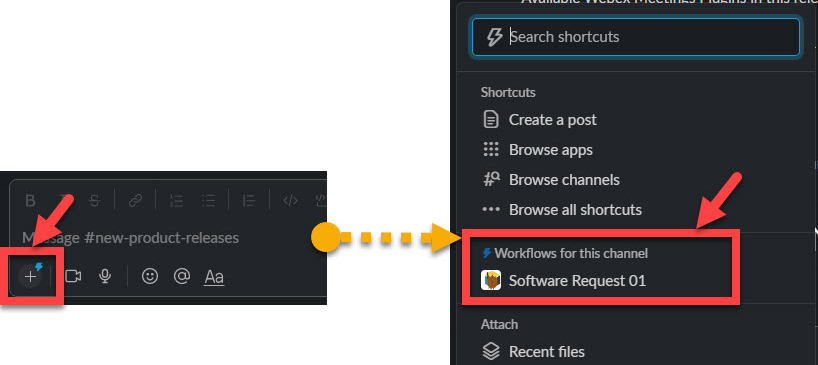
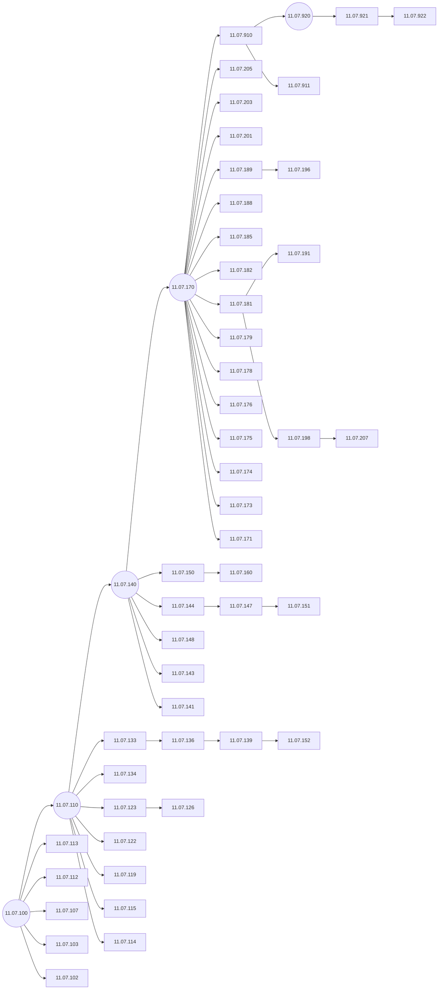
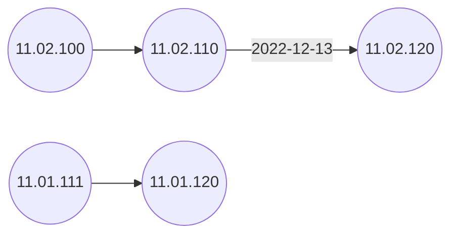

# IGEL OS Branches

Shows the branches of IGEL OS.

[What is the Meaning of IGEL Release Names?](https://kb.igel.com/licensesmore-igelos11/en/what-is-the-meaning-of-igel-release-names-10325217.html).

-----

## [IGEL News: Builds](IGEL-News-Builds.md)

Lists what changes are in the build.

-----

## Legend


### Steps to request a Private Build

- Log onto [IGEL Community on Slack](https://www.igelcommunity.com/)
- Select channel [#new-product-releases](https://igelcommunity.slack.com/archives/C8EQWAPAP)
- The release is available by using the `Workflow Feature`. Click on `+`, then select `Software Request 01` and fill out the data needed.



-----

## IGEL OS 11.10

**NOTE:** 11.10.XXX uses Ubuntu 22.04 libraries.

```mermaid
flowchart LR
    11.10.228-- 2025-03-03 -->11.10.232
    11.10.218-- 2025-02-21 -->11.10.231
    11.10.225-- 2025-02-20 -->11.10.229
    11.10.219-- 2025-02-14 -->11.10.228
    11.10.190-- 2025-02-12 -->11.10.199
    11.10.210-- 2025-02-04 -->11.10.227.DER>11.10.227.DER]
    11.10.222-- 2025-01-22 -->11.10.225
    11.10.210-- 2024-12-20 -->11.10.224
    11.10.210-- 2024-12-19 -->11.10.223
    11.10.210-- 2024-12-18 -->11.10.222
    11.10.210-- 2024-12-16 -->11.10.219
    11.10.210-- 2024-12-12 -->11.10.218
    11.10.210-- 2024-12-10 -->11.10.217
    11.10.210-- 2024-12-10 -->11.10.216
    11.10.210-- 2024-12-05 -->11.10.215
    11.10.210-- 2024-12-03 -->11.10.213
    11.10.150-- 2024-11-27 -->11.10.210((11.10.210))
    11.10.190-- 2024-11-20 -->11.10.195
    11.10.190-- 2024-11-15 -->11.10.194
    11.10.190-- 2024-10-28 -->11.10.192
    11.10.150-- 2024-10-24 -->11.10.190((11.10.190))
    11.10.120-- 2024-10-16 -->11.10.121
    11.10.175-- 2024-10-14 -->11.10.182
    11.10.150-- 2024-10-08 -->11.10.181
    11.10.172-- 2024-10-04 -->11.10.179
    11.10.154-- 2024-09-28 -->11.10.177
    11.10.150-- 2024-09-26 -->11.10.175
    11.10.150-- 2024-09-19 -->11.10.174
    11.10.150-- 2024-09-10 -->11.10.172
    11.10.150-- 2024-09-05 -->11.10.169
    11.10.150-- 2024-09-04 -->11.10.167
    11.10.100-- 2024-09-03 -->11.10.168
    11.10.100-- 2024-08-22 -->11.10.166
    11.10.154-- 2024-08-19 -->11.10.165
    11.10.150-- 2024-08-07 -->11.10.164
    11.10.150-- 2024-08-01 -->11.10.162
    11.10.151-- 2024-08-01 -->11.10.161
    11.10.150-- 2024-08-01 -->11.10.159
    11.10.150-- 2024-08-01 -->11.10.157
    11.10.150-- 2024-07-31 -->11.10.158.DER>11.10.158.DER]
    11.10.150-- 2024-07-30 -->11.10.156
    11.10.150-- 2024-07-29 -->11.10.155
    11.10.151-- 2024-07-26 -->11.10.154
    11.10.150-- 2024-07-23 -->11.10.153
    11.10.150-- 2024-07-16 -->11.10.151
    11.10.150-- 2024-07-15 -->11.10.152
    11.10.100-- 2024-07-11 -->11.10.150((11.10.150))
    11.10.100-- 2024-07-11 -->11.10.111
    11.10.106-- 2024-06-20 -->11.10.108
    11.10.100-- 2024-06-18 -->11.10.109
    11.10.100-- 2024-06-18 -->11.10.120((11.10.120))
    11.10.100-- 2024-06-06 -->11.10.106
    11.10.103-- 2024-06-05 -->11.10.105
    11.10.100-- 2024-06-03 -->11.10.104
    11.10.100-- 2024-05-28 -->11.10.103
    11.10.100((11.10.100))
    click 11.10.232 "https://github.com/IGEL-Community/IGEL-Docs-v02/tree/main/docs/Docs/ReleaseNotes/01-OS11/readme11.10.232.txt" _blank
    click 11.10.231 "https://github.com/IGEL-Community/IGEL-Docs-v02/tree/main/docs/Docs/ReleaseNotes/01-OS11/readme11.10.231.txt" _blank
    click 11.10.229 "https://github.com/IGEL-Community/IGEL-Docs-v02/tree/main/docs/Docs/ReleaseNotes/01-OS11/readme11.10.229.txt" _blank
    click 11.10.228 "https://github.com/IGEL-Community/IGEL-Docs-v02/tree/main/docs/Docs/ReleaseNotes/01-OS11/readme11.10.228.txt" _blank
    click 11.10.199 "https://github.com/IGEL-Community/IGEL-Docs-v02/tree/main/docs/Docs/ReleaseNotes/01-OS11/readme11.10.199.txt" _blank
    click 11.10.227.DER "https://github.com/IGEL-Community/IGEL-Docs-v02/tree/main/docs/Docs/ReleaseNotes/01-OS11/readme11.10.227.DER.txt" _blank
    click 11.10.225 "https://github.com/IGEL-Community/IGEL-Docs-v02/tree/main/docs/Docs/ReleaseNotes/01-OS11/readme11.10.225.txt" _blank
    click 11.10.224 "https://github.com/IGEL-Community/IGEL-Docs-v02/tree/main/docs/Docs/ReleaseNotes/01-OS11/readme11.10.224.txt" _blank
    click 11.10.223 "https://github.com/IGEL-Community/IGEL-Docs-v02/tree/main/docs/Docs/ReleaseNotes/01-OS11/readme11.10.223.txt" _blank
    click 11.10.222 "https://github.com/IGEL-Community/IGEL-Docs-v02/tree/main/docs/Docs/ReleaseNotes/01-OS11/readme11.10.222.txt" _blank
    click 11.10.219 "https://github.com/IGEL-Community/IGEL-Docs-v02/tree/main/docs/Docs/ReleaseNotes/01-OS11/readme11.10.219.txt" _blank
    click 11.10.218 "https://github.com/IGEL-Community/IGEL-Docs-v02/tree/main/docs/Docs/ReleaseNotes/01-OS11/readme11.10.218.txt" _blank
    click 11.10.217 "https://github.com/IGEL-Community/IGEL-Docs-v02/tree/main/docs/Docs/ReleaseNotes/01-OS11/readme11.10.217.txt" _blank
    click 11.10.216 "https://github.com/IGEL-Community/IGEL-Docs-v02/tree/main/docs/Docs/ReleaseNotes/01-OS11/readme11.10.216.txt" _blank
    click 11.10.215 "https://github.com/IGEL-Community/IGEL-Docs-v02/tree/main/docs/Docs/ReleaseNotes/01-OS11/readme11.10.215.txt" _blank
    click 11.10.213 "https://github.com/IGEL-Community/IGEL-Docs-v02/tree/main/docs/Docs/ReleaseNotes/01-OS11/readme11.10.213.txt" _blank
    click 11.10.210 "https://github.com/IGEL-Community/IGEL-Docs-v02/tree/main/docs/Docs/ReleaseNotes/01-OS11/readme11.10.210.txt" _blank
    click 11.10.195 "https://github.com/IGEL-Community/IGEL-Docs-v02/tree/main/docs/Docs/ReleaseNotes/01-OS11/readme11.10.195.txt" _blank
    click 11.10.194 "https://github.com/IGEL-Community/IGEL-Docs-v02/tree/main/docs/Docs/ReleaseNotes/01-OS11/readme11.10.194.txt" _blank
    click 11.10.192 "https://github.com/IGEL-Community/IGEL-Docs-v02/tree/main/docs/Docs/ReleaseNotes/01-OS11/readme11.10.192.txt" _blank
    click 11.10.190 "https://github.com/IGEL-Community/IGEL-Docs-v02/tree/main/docs/Docs/ReleaseNotes/01-OS11/readme11.10.190.txt" _blank
    click 11.10.121 "https://github.com/IGEL-Community/IGEL-Docs-v02/tree/main/docs/Docs/ReleaseNotes/01-OS11/readme11.10.121.txt" _blank
    click 11.10.182 "https://github.com/IGEL-Community/IGEL-Docs-v02/tree/main/docs/Docs/ReleaseNotes/01-OS11/readme11.10.182.txt" _blank
    click 11.10.181 "https://github.com/IGEL-Community/IGEL-Docs-v02/tree/main/docs/Docs/ReleaseNotes/01-OS11/readme11.10.181.txt" _blank
    click 11.10.179 "https://github.com/IGEL-Community/IGEL-Docs-v02/tree/main/docs/Docs/ReleaseNotes/01-OS11/readme11.10.179.txt" _blank
    click 11.10.177 "https://github.com/IGEL-Community/IGEL-Docs-v02/tree/main/docs/Docs/ReleaseNotes/01-OS11/readme11.10.177.txt" _blank
    click 11.10.175 "https://github.com/IGEL-Community/IGEL-Docs-v02/tree/main/docs/Docs/ReleaseNotes/01-OS11/readme11.10.175.txt" _blank
    click 11.10.174 "https://github.com/IGEL-Community/IGEL-Docs-v02/tree/main/docs/Docs/ReleaseNotes/01-OS11/readme11.10.174.txt" _blank
    click 11.10.172 "https://github.com/IGEL-Community/IGEL-Docs-v02/tree/main/docs/Docs/ReleaseNotes/01-OS11/readme11.10.172.txt" _blank
    click 11.10.169 "https://github.com/IGEL-Community/IGEL-Docs-v02/tree/main/docs/Docs/ReleaseNotes/01-OS11/readme11.10.169.txt" _blank
    click 11.10.167 "https://github.com/IGEL-Community/IGEL-Docs-v02/tree/main/docs/Docs/ReleaseNotes/01-OS11/readme11.10.167.txt" _blank
    click 11.10.168 "https://github.com/IGEL-Community/IGEL-Docs-v02/tree/main/docs/Docs/ReleaseNotes/01-OS11/readme11.10.168.txt" _blank
    click 11.10.166 "https://github.com/IGEL-Community/IGEL-Docs-v02/tree/main/docs/Docs/ReleaseNotes/01-OS11/readme11.10.166.txt" _blank
    click 11.10.165 "https://github.com/IGEL-Community/IGEL-Docs-v02/tree/main/docs/Docs/ReleaseNotes/01-OS11/readme11.10.165.txt" _blank
    click 11.10.164 "https://github.com/IGEL-Community/IGEL-Docs-v02/tree/main/docs/Docs/ReleaseNotes/01-OS11/readme11.10.164.txt" _blank
    click 11.10.162 "https://github.com/IGEL-Community/IGEL-Docs-v02/tree/main/docs/Docs/ReleaseNotes/01-OS11/readme11.10.162.txt" _blank
    click 11.10.161 "https://github.com/IGEL-Community/IGEL-Docs-v02/tree/main/docs/Docs/ReleaseNotes/01-OS11/readme11.10.161.txt" _blank
    click 11.10.159 "https://github.com/IGEL-Community/IGEL-Docs-v02/tree/main/docs/Docs/ReleaseNotes/01-OS11/readme11.10.159.txt" _blank
    click 11.10.157 "https://github.com/IGEL-Community/IGEL-Docs-v02/tree/main/docs/Docs/ReleaseNotes/01-OS11/readme11.10.157.txt" _blank
    click 11.10.158.DER "https://github.com/IGEL-Community/IGEL-Docs-v02/tree/main/docs/Docs/ReleaseNotes/01-OS11/readme11.10.158.DER.txt" _blank
    click 11.10.156 "https://github.com/IGEL-Community/IGEL-Docs-v02/tree/main/docs/Docs/ReleaseNotes/01-OS11/readme11.10.156.txt" _blank
    click 11.10.155 "https://github.com/IGEL-Community/IGEL-Docs-v02/tree/main/docs/Docs/ReleaseNotes/01-OS11/readme11.10.155.txt" _blank
    click 11.10.154 "https://github.com/IGEL-Community/IGEL-Docs-v02/tree/main/docs/Docs/ReleaseNotes/01-OS11/readme11.10.154.txt" _blank
    click 11.10.153 "https://github.com/IGEL-Community/IGEL-Docs-v02/tree/main/docs/Docs/ReleaseNotes/01-OS11/readme11.10.153.txt" _blank
    click 11.10.151 "https://github.com/IGEL-Community/IGEL-Docs-v02/tree/main/docs/Docs/ReleaseNotes/01-OS11/readme11.10.151.txt" _blank
    click 11.10.152 "https://github.com/IGEL-Community/IGEL-Docs-v02/tree/main/docs/Docs/ReleaseNotes/01-OS11/readme11.10.152.txt" _blank
    click 11.10.111 "https://github.com/IGEL-Community/IGEL-Docs-v02/tree/main/docs/Docs/ReleaseNotes/01-OS11/readme11.10.111.txt" _blank
    click 11.10.150 "https://github.com/IGEL-Community/IGEL-Docs-v02/tree/main/docs/Docs/ReleaseNotes/01-OS11/readme11.10.150.txt" _blank
    click 11.10.108 "https://github.com/IGEL-Community/IGEL-Docs-v02/tree/main/docs/Docs/ReleaseNotes/01-OS11/readme11.10.108.txt" _blank
    click 11.10.109 "https://github.com/IGEL-Community/IGEL-Docs-v02/tree/main/docs/Docs/ReleaseNotes/01-OS11/readme11.10.109.txt" _blank
    click 11.10.120 "https://github.com/IGEL-Community/IGEL-Docs-v02/tree/main/docs/Docs/ReleaseNotes/01-OS11/readme11.10.120.txt" _blank
    click 11.10.106 "https://github.com/IGEL-Community/IGEL-Docs-v02/tree/main/docs/Docs/ReleaseNotes/01-OS11/readme11.10.106.txt" _blank
    click 11.10.105 "https://github.com/IGEL-Community/IGEL-Docs-v02/tree/main/docs/Docs/ReleaseNotes/01-OS11/readme11.10.105.txt" _blank
    click 11.10.104 "https://github.com/IGEL-Community/IGEL-Docs-v02/tree/main/docs/Docs/ReleaseNotes/01-OS11/readme11.10.104.txt" _blank
    click 11.10.103 "https://github.com/IGEL-Community/IGEL-Docs-v02/tree/main/docs/Docs/ReleaseNotes/01-OS11/readme11.10.103.txt" _blank
    click 11.10.100 "https://github.com/IGEL-Community/IGEL-Docs-v02/tree/main/docs/Docs/ReleaseNotes/01-OS11/readme11.10.100.txt" _blank
```



-----

## IGEL OS 11.09

**NOTE:** 11.09.XXX uses Ubuntu 22.04 libraries.

```mermaid
flowchart LR
    11.09.156-- 2025-02-26 -->11.09.157
    11.09.150-- 2024-11-14 -->11.09.156
    11.09.260-- 2024-09-25 -->11.09.273
    11.09.260-- 2024-08-01 -->11.09.272
    11.09.321-- 2024-07-03 -->11.09.323
    11.09.310-- 2024-06-20 -->11.09.321
    11.09.160-- 2024-06-14 -->11.09.169
    11.09.112-- 2024-06-14 -->11.09.132
    11.09.160-- 2024-05-15 -->11.09.168
    11.09.310-- 2024-05-14 -->11.09.318
    11.09.310-- 2024-05-14 -->11.09.317
    11.09.310-- 2024-04-26 -->11.09.315
    11.09.218-- 2024-04-26 -->11.09.219
    11.09.310-- 2024-04-26 -->11.09.320
    11.09.311-- 2024-04-23 -->11.09.314
    11.09.311-- 2024-04-17 -->11.09.313
    11.09.263-- 2024-04-12 -->11.09.269
    11.09.311-- 2024-04-10 -->11.09.312
    11.09.310-- 2024-04-09 -->11.09.311
    11.09.263-- 2024-04-08 -->11.09.268
    11.09.260-- 2024-04-03 -->11.09.310((11.09.310))
    11.09.129.DER-- 2024-04-02 -->11.09.131.DER>11.09.131.DER]
    11.09.261-- 2024-03-28 -->11.09.263
    11.09.261-- 2024-03-28 -->11.09.265
    11.09.260-- 2024-03-27 -->11.09.264
    11.09.260-- 2024-03-08 -->11.09.261
    11.09.210-- 2024-03-07 -->11.09.260((11.09.260))
    11.09.210-- 2024-02-26 -->11.09.218
    11.09.210-- 2024-02-19 -->11.09.129.DER>11.09.129.DER]
    11.09.211-- 2024-02-19 -->11.09.217
    11.09.117-- 2024-02-19 -->11.09.128
    11.09.210-- 2024-02-16 -->11.09.216
    11.09.160-- 2024-02-01 -->11.09.167
    11.09.210-- 2024-01-31 -->11.09.211
    11.09.150-- 2024-01-25 -->11.09.210((11.09.210))
    11.09.162-- 2024-01-10 -->11.09.163
    11.09.160-- 2024-01-12 -->11.09.164
    11.09.160-- 2024-01-10 -->11.09.162
    11.09.150-- 2023-12-20 -->11.09.160((11.09.160))
    11.09.150-- 2023-12-20 -->11.09.154
    11.09.151-- 2023-12-14 -->11.09.153
    11.09.150-- 2023-12-11 -->11.09.151
    11.09.110-- 2023-12-06 -->11.09.150((11.09.150))
    11.09.116-- 2023-11-22 -->11.09.123
    11.09.117-- 2023-11-17 -->11.09.122
    11.09.114-- 2023-11-14 -->11.09.119
    11.09.117-- 2023-11-10 -->11.09.118
    11.09.114-- 2023-11-09 -->11.09.117
    11.09.114-- 2023-11-08 -->11.09.116
    11.09.110-- 2023-11-07 -->11.09.115
    11.09.110-- 2023-11-06 -->11.09.112
    11.09.110-- 2023-10-31 -->11.09.114
    11.08.360-- 2023-10-25 -->11.09.108
    11.09.110-- 2023-10-25 -->11.09.111
    11.09.100-- 2023-10-24 -->11.09.110((11.09.110))
    11.09.100-- 2023-10-20 -->11.09.103
    11.09.100-- 2023-10-19 -->11.09.104
    11.09.100-- 2023-10-18 -->11.09.105
    11.09.100((11.09.100))
    click 11.09.157 "https://github.com/IGEL-Community/IGEL-Docs-v02/tree/main/docs/Docs/ReleaseNotes/01-OS11/readme11.09.157.txt" _blank
    click 11.09.156 "https://github.com/IGEL-Community/IGEL-Docs-v02/tree/main/docs/Docs/ReleaseNotes/01-OS11/readme11.09.156.txt" _blank
    click 11.09.273 "https://github.com/IGEL-Community/IGEL-Docs-v02/tree/main/docs/Docs/ReleaseNotes/01-OS11/readme11.09.273.txt" _blank
    click 11.09.272 "https://github.com/IGEL-Community/IGEL-Docs-v02/tree/main/docs/Docs/ReleaseNotes/01-OS11/readme11.09.272.txt" _blank
    click 11.09.323 "https://github.com/IGEL-Community/IGEL-Docs-v02/tree/main/docs/Docs/ReleaseNotes/01-OS11/readme11.09.323.txt" _blank
    click 11.09.321 "https://github.com/IGEL-Community/IGEL-Docs-v02/tree/main/docs/Docs/ReleaseNotes/01-OS11/readme11.09.321.txt" _blank
    click 11.09.169 "https://github.com/IGEL-Community/IGEL-Docs-v02/tree/main/docs/Docs/ReleaseNotes/01-OS11/readme11.09.169.txt" _blank
    click 11.09.132 "https://github.com/IGEL-Community/IGEL-Docs-v02/tree/main/docs/Docs/ReleaseNotes/01-OS11/readme11.09.132.txt" _blank
    click 11.09.168 "https://github.com/IGEL-Community/IGEL-Docs-v02/tree/main/docs/Docs/ReleaseNotes/01-OS11/readme11.09.168.txt" _blank
    click 11.09.318 "https://github.com/IGEL-Community/IGEL-Docs-v02/tree/main/docs/Docs/ReleaseNotes/01-OS11/readme11.09.318.txt" _blank
    click 11.09.317 "https://github.com/IGEL-Community/IGEL-Docs-v02/tree/main/docs/Docs/ReleaseNotes/01-OS11/readme11.09.317.txt" _blank
    click 11.09.315 "https://github.com/IGEL-Community/IGEL-Docs-v02/tree/main/docs/Docs/ReleaseNotes/01-OS11/readme11.09.315.txt" _blank
    click 11.09.219 "https://github.com/IGEL-Community/IGEL-Docs-v02/tree/main/docs/Docs/ReleaseNotes/01-OS11/readme11.09.219.txt" _blank
    click 11.09.320 "https://github.com/IGEL-Community/IGEL-Docs-v02/tree/main/docs/Docs/ReleaseNotes/01-OS11/readme11.09.320.txt" _blank
    click 11.09.314 "https://github.com/IGEL-Community/IGEL-Docs-v02/tree/main/docs/Docs/ReleaseNotes/01-OS11/readme11.09.314.txt" _blank
    click 11.09.313 "https://github.com/IGEL-Community/IGEL-Docs-v02/tree/main/docs/Docs/ReleaseNotes/01-OS11/readme11.09.313.txt" _blank
    click 11.09.269 "https://github.com/IGEL-Community/IGEL-Docs-v02/tree/main/docs/Docs/ReleaseNotes/01-OS11/readme11.09.269.txt" _blank
    click 11.09.312 "https://github.com/IGEL-Community/IGEL-Docs-v02/tree/main/docs/Docs/ReleaseNotes/01-OS11/readme11.09.312.txt" _blank
    click 11.09.311 "https://github.com/IGEL-Community/IGEL-Docs-v02/tree/main/docs/Docs/ReleaseNotes/01-OS11/readme11.09.311.txt" _blank
    click 11.09.268 "https://github.com/IGEL-Community/IGEL-Docs-v02/tree/main/docs/Docs/ReleaseNotes/01-OS11/readme11.09.268.txt" _blank
    click 11.09.310 "https://github.com/IGEL-Community/IGEL-Docs-v02/tree/main/docs/Docs/ReleaseNotes/01-OS11/readme11.09.310.txt" _blank
    click 11.09.131.DER "https://github.com/IGEL-Community/IGEL-Docs-v02/tree/main/docs/Docs/ReleaseNotes/01-OS11/readme11.09.131.DER.txt" _blank
    click 11.09.263 "https://github.com/IGEL-Community/IGEL-Docs-v02/tree/main/docs/Docs/ReleaseNotes/01-OS11/readme11.09.263.txt" _blank
    click 11.09.265 "https://github.com/IGEL-Community/IGEL-Docs-v02/tree/main/docs/Docs/ReleaseNotes/01-OS11/readme11.09.265.txt" _blank
    click 11.09.264 "https://github.com/IGEL-Community/IGEL-Docs-v02/tree/main/docs/Docs/ReleaseNotes/01-OS11/readme11.09.264.txt" _blank
    click 11.09.261 "https://github.com/IGEL-Community/IGEL-Docs-v02/tree/main/docs/Docs/ReleaseNotes/01-OS11/readme11.09.261.txt" _blank
    click 11.09.260 "https://github.com/IGEL-Community/IGEL-Docs-v02/tree/main/docs/Docs/ReleaseNotes/01-OS11/readme11.09.260.txt" _blank
    click 11.09.218 "https://github.com/IGEL-Community/IGEL-Docs-v02/tree/main/docs/Docs/ReleaseNotes/01-OS11/readme11.09.218.txt" _blank
    click 11.09.129.DER "https://github.com/IGEL-Community/IGEL-Docs-v02/tree/main/docs/Docs/ReleaseNotes/01-OS11/readme11.09.129.DER.txt" _blank
    click 11.09.217 "https://github.com/IGEL-Community/IGEL-Docs-v02/tree/main/docs/Docs/ReleaseNotes/01-OS11/readme11.09.217.txt" _blank
    click 11.09.128 "https://github.com/IGEL-Community/IGEL-Docs-v02/tree/main/docs/Docs/ReleaseNotes/01-OS11/readme11.09.128.txt" _blank
    click 11.09.216 "https://github.com/IGEL-Community/IGEL-Docs-v02/tree/main/docs/Docs/ReleaseNotes/01-OS11/readme11.09.216.txt" _blank
    click 11.09.167 "https://github.com/IGEL-Community/IGEL-Docs-v02/tree/main/docs/Docs/ReleaseNotes/01-OS11/readme11.09.167.txt" _blank
    click 11.09.211 "https://github.com/IGEL-Community/IGEL-Docs-v02/tree/main/docs/Docs/ReleaseNotes/01-OS11/readme11.09.211.txt" _blank
    click 11.09.210 "https://github.com/IGEL-Community/IGEL-Docs-v02/tree/main/docs/Docs/ReleaseNotes/01-OS11/readme11.09.210.txt" _blank
    click 11.09.163 "https://github.com/IGEL-Community/IGEL-Docs-v02/tree/main/docs/Docs/ReleaseNotes/01-OS11/readme11.09.163.txt" _blank
    click 11.09.164 "https://github.com/IGEL-Community/IGEL-Docs-v02/tree/main/docs/Docs/ReleaseNotes/01-OS11/readme11.09.164.txt" _blank
    click 11.09.162 "https://github.com/IGEL-Community/IGEL-Docs-v02/tree/main/docs/Docs/ReleaseNotes/01-OS11/readme11.09.162.txt" _blank
    click 11.09.160 "https://github.com/IGEL-Community/IGEL-Docs-v02/tree/main/docs/Docs/ReleaseNotes/01-OS11/readme11.09.160.txt" _blank
    click 11.09.154 "https://github.com/IGEL-Community/IGEL-Docs-v02/tree/main/docs/Docs/ReleaseNotes/01-OS11/readme11.09.154.txt" _blank
    click 11.09.153 "https://github.com/IGEL-Community/IGEL-Docs-v02/tree/main/docs/Docs/ReleaseNotes/01-OS11/readme11.09.153.txt" _blank
    click 11.09.151 "https://github.com/IGEL-Community/IGEL-Docs-v02/tree/main/docs/Docs/ReleaseNotes/01-OS11/readme11.09.151.txt" _blank
    click 11.09.150 "https://github.com/IGEL-Community/IGEL-Docs-v02/tree/main/docs/Docs/ReleaseNotes/01-OS11/readme11.09.150.txt" _blank
    click 11.09.123 "https://github.com/IGEL-Community/IGEL-Docs-v02/tree/main/docs/Docs/ReleaseNotes/01-OS11/readme11.09.123.txt" _blank
    click 11.09.122 "https://github.com/IGEL-Community/IGEL-Docs-v02/tree/main/docs/Docs/ReleaseNotes/01-OS11/readme11.09.122.txt" _blank
    click 11.09.119 "https://github.com/IGEL-Community/IGEL-Docs-v02/tree/main/docs/Docs/ReleaseNotes/01-OS11/readme11.09.119.txt" _blank
    click 11.09.118 "https://github.com/IGEL-Community/IGEL-Docs-v02/tree/main/docs/Docs/ReleaseNotes/01-OS11/readme11.09.118.txt" _blank
    click 11.09.117 "https://github.com/IGEL-Community/IGEL-Docs-v02/tree/main/docs/Docs/ReleaseNotes/01-OS11/readme11.09.117.txt" _blank
    click 11.09.116 "https://github.com/IGEL-Community/IGEL-Docs-v02/tree/main/docs/Docs/ReleaseNotes/01-OS11/readme11.09.116.txt" _blank
    click 11.09.115 "https://github.com/IGEL-Community/IGEL-Docs-v02/tree/main/docs/Docs/ReleaseNotes/01-OS11/readme11.09.115.txt" _blank
    click 11.09.112 "https://github.com/IGEL-Community/IGEL-Docs-v02/tree/main/docs/Docs/ReleaseNotes/01-OS11/readme11.09.112.txt" _blank
    click 11.09.114 "https://github.com/IGEL-Community/IGEL-Docs-v02/tree/main/docs/Docs/ReleaseNotes/01-OS11/readme11.09.114.txt" _blank
    click 11.09.108 "https://github.com/IGEL-Community/IGEL-Docs-v02/tree/main/docs/Docs/ReleaseNotes/01-OS11/readme11.09.108.txt" _blank
    click 11.09.111 "https://github.com/IGEL-Community/IGEL-Docs-v02/tree/main/docs/Docs/ReleaseNotes/01-OS11/readme11.09.111.txt" _blank
    click 11.09.110 "https://github.com/IGEL-Community/IGEL-Docs-v02/tree/main/docs/Docs/ReleaseNotes/01-OS11/readme11.09.110.txt" _blank
    click 11.09.103 "https://github.com/IGEL-Community/IGEL-Docs-v02/tree/main/docs/Docs/ReleaseNotes/01-OS11/readme11.09.103.txt" _blank
    click 11.09.104 "https://github.com/IGEL-Community/IGEL-Docs-v02/tree/main/docs/Docs/ReleaseNotes/01-OS11/readme11.09.104.txt" _blank
    click 11.09.105 "https://github.com/IGEL-Community/IGEL-Docs-v02/tree/main/docs/Docs/ReleaseNotes/01-OS11/readme11.09.105.txt" _blank
    click 11.09.100 "https://github.com/IGEL-Community/IGEL-Docs-v02/tree/main/docs/Docs/ReleaseNotes/01-OS11/readme11.09.100.txt" _blank
```



-----

## IGEL OS 11.08

**NOTE:** 11.08.XXX uses Ubuntu 18.04 libraries.

```mermaid
flowchart LR
    11.08.360-- 2024-04-26 -->11.99.997
    11.08.440-- 2024-04-02 -->11.08.472
    11.08.440-- 2024-03-16 -->11.08.471
    11.08.458-- 2023-12-26 -->11.08.459
    11.08.468.DER-- 2023-12-05 -->11.08.469.DER>11.08.469.DER]
    11.08.466.DER-- 2023-11-28 -->11.08.468.DER>11.08.468.DER]
    11.08.351-- 2023-11-22 -->11.08.352
    11.08.440-- 2023-11-22 -->11.08.448
    11.08.330-- 2023-10-27 -->11.08.351
    11.08.460-- 2023-10-26 -->11.08.470
    11.08.118.DER-- 2023-10-25 -->11.08.121
    11.08.440-- 2023-10-17 -->11.08.460
    11.08.454-- 2023-10-12 -->11.08.466.DER>11.08.466.DER]
    11.08.454-- 2023-10-11 -->11.08.465
    11.08.440-- 2023-09-21 -->11.08.441
    11.08.440-- 2023-09-21 -->11.08.463
    11.08.230-- 2023-09-20 -->11.08.279
    11.08.440-- 2023-09-20 -->11.08.461
    11.08.360-- 2023-09-18 -->11.08.388
    11.08.457-- 2023-09-13 -->11.08.458
    11.08.455-- 2023-09-11 -->11.08.457
    11.08.440-- 2023-09-08 -->11.08.455
    11.08.440-- 2023-09-08 -->11.08.454
    11.08.440-- 2023-09-07 -->11.08.453
    11.08.440-- 2023-09-06 -->11.08.451
    11.08.440-- 2023-09-04 -->11.08.449
    11.08.384-- 2023-08-29 -->11.08.387
    11.08.330-- 2023-08-24 -->11.08.348
    11.08.440-- 2023-08-21 -->11.08.445
    11.08.440-- 2023-08-21 -->11.08.443
    11.08.440-- 2023-08-21 -->11.08.442
    11.08.360-- 2023-08-16 -->11.08.440((11.08.440))
    11.08.381-- 2023-08-14 -->11.08.385
    11.08.382-- 2023-08-14 -->11.08.384
    11.08.330-- 2023-08-04 -->11.08.347
    11.08.360-- 2023-08-04 -->11.08.382
    11.08.360-- 2023-08-02 -->11.08.381
    11.08.360-- 2023-07-31 -->11.08.377
    11.08.360-- 2023-06-26 -->11.08.364-- 2023-07-28 -->11.08.371
    11.08.360-- 2023-07-26 -->11.08.378
    11.08.361-- 2023-07-24 -->11.08.376
    11.08.360-- 2023-07-18 -->11.08.374
    11.08.345-- 2023-07-14 -->11.08.346
    11.08.361-- 2023-07-10 -->11.08.373
    11.08.360-- 2023-07-04 -->11.08.372
    11.08.299-- 2023-06-30 -->11.08.309
    11.08.360-- 2023-06-30 -->11.08.368
    11.08.360-- 2023-06-29 -->11.08.367
    11.08.344-- 2023-06-28 -->11.08.345
    11.08.338-- 2023-06-23 -->11.08.344
    11.08.338-- 2023-06-22 -->11.08.343
    11.08.360-- 2023-06-22 -->11.08.365
    11.08.360-- 2023-06-20 -->11.08.361
    11.08.264-- 2023-06-19 -->11.08.277
    11.08.330-- 2023-06-13 -->11.08.360((11.08.360))
    11.08.330-- 2023-06-10 -->11.08.338
    11.08.330-- 2023-06-06 -->11.08.337
    11.08.330-- 2023-05-31 -->11.08.335
    11.08.330-- 2023-05-30 -->11.08.336.DER>11.08.336.DER]
    11.08.290-- 2023-05-27 -->11.08.333
    11.08.330-- 2023-05-26 -->11.08.334
    11.08.330-- 2023-05-24 -->11.08.331
    11.08.110-- 2023-05-23 -->11.08.118.DER>11.08.118.DER]
    11.08.290-- 2023-05-17 -->11.08.330((11.08.330))
    11.08.256-- 2023-05-12 -->11.08.307
    11.08.290-- 2023-05-04 -->11.08.305
    11.08.290-- 2023-04-27 -->11.08.303
    11.08.236-- 2023-04-25 -->11.08.301
    11.08.290-- 2023-04-19 -->11.08.299
    11.08.292-- 2023-04-18 -->11.08.296
    11.08.290-- 2023-04-18 -->11.08.298
    11.08.290-- 2023-04-18 -->11.08.297
    11.08.290-- 2023-04-13 -->11.08.295
    11.08.290-- 2023-04-12 -->11.08.294
    11.08.290-- 2023-03-31 -->11.08.292
    11.08.230-- 2023-03-30 -->11.08.290((11.08.290))
    11.08.230-- 2023-03-20 -->11.08.274
    11.08.236-->11.08.256[[11.08.256]]-- 2023-03-07 -->11.08.267
    11.08.240-- 2023-03-01 -->11.08.265 
    11.08.252-- 2023-02-26 -->11.08.264-- 2023-03-15 -->11.08.268-- 2023-03-16 -->11.08.273
    11.08.200-- 2023-02-24 -->11.08.262
    11.08.243-- 2023-02-10 -->11.08.251-- 2023-03-01 -->11.08.266
    11.08.230-- 2023-02-06 -->11.08.247
    11.08.230-- 2023-02-02 -->11.08.244
    11.08.240-- 2023-02-24 -->11.08.263
    11.08.240-- 2023-02-22 -->11.08.257
    11.08.240-- 2023-02-20 -->11.08.255-- 2023-02-22 -->11.08.261
    11.08.230-- 2023-02-10 -->11.08.240
    11.08.230((11.08.230))-->11.08.232[[11.08.232]]-- 2023-02-14 -->11.08.252
    11.08.200-- 2022-12-13 -->11.08.230-- 2022-12-20 -->11.08.235-- 2022-12-28 -->11.08.236-- 2023-01-20 -->11.08.243-->11.08.245-- 2023-02-06 -->11.08.248
    11.08.200-- 2022-11-28 -->11.08.218
    11.08.200-- 2022-11-18 -->11.08.212
    11.08.200-- 2022-11-17 -->11.08.211
    11.08.200-- 2022-10-24 -->11.08.207
    11.08.200-- 2022-10-27 -->11.08.205
    11.08.200-- 2022-10-25 -->11.08.204
    11.08.200((11.08.200))-- 2022-10-19 -->11.08.202-- 2022-11-23 -->11.08.215-- 2022-11-24 -->11.08.216-- 2022-11-28 -->11.08.219
    11.08.110-- 2022-10-04 -->11.08.113-- 2022-10-13 -->11.08.114
    11.08.110((11.08.110))-- 2022-09-22 -->11.08.112.DER>11.08.112.DER]
    11.08.100-- 2022-09-15 -->11.08.110-- 2022-09-20 -->11.08.111
    11.08.100((11.08.100))-- 2022-09-07 -->11.08.101
    click 11.99.997 "https://github.com/IGEL-Community/IGEL-Docs-v02/tree/main/docs/Docs/ReleaseNotes/01-OS11/readme11.99.997.txt" _blank
    click 11.08.472 "https://github.com/IGEL-Community/IGEL-Docs-v02/tree/main/docs/Docs/ReleaseNotes/01-OS11/readme11.08.472.txt" _blank
    click 11.08.471 "https://github.com/IGEL-Community/IGEL-Docs-v02/tree/main/docs/Docs/ReleaseNotes/01-OS11/readme11.08.471.txt" _blank
    click 11.08.459 "https://github.com/IGEL-Community/IGEL-Docs-v02/tree/main/docs/Docs/ReleaseNotes/01-OS11/readme11.08.459.txt" _blank
    click 11.08.469.DER "https://github.com/IGEL-Community/IGEL-Docs-v02/tree/main/docs/Docs/ReleaseNotes/01-OS11/readme11.08.469.DER.txt" _blank
    click 11.08.468.DER "https://github.com/IGEL-Community/IGEL-Docs-v02/tree/main/docs/Docs/ReleaseNotes/01-OS11/readme11.08.468.DER.txt" _blank
    click 11.08.352 "https://github.com/IGEL-Community/IGEL-Docs-v02/tree/main/docs/Docs/ReleaseNotes/01-OS11/readme11.08.352.txt" _blank
    click 11.08.448 "https://github.com/IGEL-Community/IGEL-Docs-v02/tree/main/docs/Docs/ReleaseNotes/01-OS11/readme11.08.448.txt" _blank
    click 11.08.351 "https://github.com/IGEL-Community/IGEL-Docs-v02/tree/main/docs/Docs/ReleaseNotes/01-OS11/readme11.08.351.txt" _blank
    click 11.08.470 "https://github.com/IGEL-Community/IGEL-Docs-v02/tree/main/docs/Docs/ReleaseNotes/01-OS11/readme11.08.470.txt" _blank
    click 11.08.121 "https://github.com/IGEL-Community/IGEL-Docs-v02/tree/main/docs/Docs/ReleaseNotes/01-OS11/readme11.08.121.txt" _blank
    click 11.08.460 "https://github.com/IGEL-Community/IGEL-Docs-v02/tree/main/docs/Docs/ReleaseNotes/01-OS11/readme11.08.460.txt" _blank
    click 11.08.466.DER "https://github.com/IGEL-Community/IGEL-Docs-v02/tree/main/docs/Docs/ReleaseNotes/01-OS11/readme11.08.466.DER.txt" _blank
    click 11.08.465 "https://github.com/IGEL-Community/IGEL-Docs-v02/tree/main/docs/Docs/ReleaseNotes/01-OS11/readme11.08.465.txt" _blank
    click 11.08.441 "https://github.com/IGEL-Community/IGEL-Docs-v02/tree/main/docs/Docs/ReleaseNotes/01-OS11/readme11.08.441.txt" _blank
    click 11.08.463 "https://github.com/IGEL-Community/IGEL-Docs-v02/tree/main/docs/Docs/ReleaseNotes/01-OS11/readme11.08.463.txt" _blank
    click 11.08.279 "https://github.com/IGEL-Community/IGEL-Docs-v02/tree/main/docs/Docs/ReleaseNotes/01-OS11/readme11.08.279.txt" _blank
    click 11.08.461 "https://github.com/IGEL-Community/IGEL-Docs-v02/tree/main/docs/Docs/ReleaseNotes/01-OS11/readme11.08.461.txt" _blank
    click 11.08.388 "https://github.com/IGEL-Community/IGEL-Docs-v02/tree/main/docs/Docs/ReleaseNotes/01-OS11/readme11.08.388.txt" _blank
    click 11.08.458 "https://github.com/IGEL-Community/IGEL-Docs-v02/tree/main/docs/Docs/ReleaseNotes/01-OS11/readme11.08.458.txt" _blank
    click 11.08.457 "https://github.com/IGEL-Community/IGEL-Docs-v02/tree/main/docs/Docs/ReleaseNotes/01-OS11/readme11.08.457.txt" _blank
    click 11.08.455 "https://github.com/IGEL-Community/IGEL-Docs-v02/tree/main/docs/Docs/ReleaseNotes/01-OS11/readme11.08.455.txt" _blank
    click 11.08.454 "https://github.com/IGEL-Community/IGEL-Docs-v02/tree/main/docs/Docs/ReleaseNotes/01-OS11/readme11.08.454.txt" _blank
    click 11.08.453 "https://github.com/IGEL-Community/IGEL-Docs-v02/tree/main/docs/Docs/ReleaseNotes/01-OS11/readme11.08.453.txt" _blank
    click 11.08.451 "https://github.com/IGEL-Community/IGEL-Docs-v02/tree/main/docs/Docs/ReleaseNotes/01-OS11/readme11.08.451.txt" _blank
    click 11.08.449 "https://github.com/IGEL-Community/IGEL-Docs-v02/tree/main/docs/Docs/ReleaseNotes/01-OS11/readme11.08.449.txt" _blank
    click 11.08.387 "https://github.com/IGEL-Community/IGEL-Docs-v02/tree/main/docs/Docs/ReleaseNotes/01-OS11/readme11.08.387.txt" _blank
    click 11.08.348 "https://github.com/IGEL-Community/IGEL-Docs-v02/tree/main/docs/Docs/ReleaseNotes/01-OS11/readme11.08.348.txt" _blank
    click 11.08.445 "https://github.com/IGEL-Community/IGEL-Docs-v02/tree/main/docs/Docs/ReleaseNotes/01-OS11/readme11.08.445.txt" _blank
    click 11.08.443 "https://github.com/IGEL-Community/IGEL-Docs-v02/tree/main/docs/Docs/ReleaseNotes/01-OS11/readme11.08.443.txt" _blank
    click 11.08.442 "https://github.com/IGEL-Community/IGEL-Docs-v02/tree/main/docs/Docs/ReleaseNotes/01-OS11/readme11.08.442.txt" _blank
    click 11.08.440 "https://github.com/IGEL-Community/IGEL-Docs-v02/tree/main/docs/Docs/ReleaseNotes/01-OS11/readme11.08.440.txt" _blank
    click 11.08.385 "https://github.com/IGEL-Community/IGEL-Docs-v02/tree/main/docs/Docs/ReleaseNotes/01-OS11/readme11.08.385.txt" _blank
    click 11.08.384 "https://github.com/IGEL-Community/IGEL-Docs-v02/tree/main/docs/Docs/ReleaseNotes/01-OS11/readme11.08.384.txt" _blank
    click 11.08.347 "https://github.com/IGEL-Community/IGEL-Docs-v02/tree/main/docs/Docs/ReleaseNotes/01-OS11/readme11.08.347.txt" _blank
    click 11.08.382 "https://github.com/IGEL-Community/IGEL-Docs-v02/tree/main/docs/Docs/ReleaseNotes/01-OS11/readme11.08.382.txt" _blank
    click 11.08.381 "https://github.com/IGEL-Community/IGEL-Docs-v02/tree/main/docs/Docs/ReleaseNotes/01-OS11/readme11.08.381.txt" _blank
    click 11.08.377 "https://github.com/IGEL-Community/IGEL-Docs-v02/tree/main/docs/Docs/ReleaseNotes/01-OS11/readme11.08.377.txt" _blank
    click 11.08.371 "https://github.com/IGEL-Community/IGEL-Docs-v02/tree/main/docs/Docs/ReleaseNotes/01-OS11/readme11.08.371.txt" _blank
    click 11.08.378 "https://github.com/IGEL-Community/IGEL-Docs-v02/tree/main/docs/Docs/ReleaseNotes/01-OS11/readme11.08.378.txt" _blank
    click 11.08.376 "https://github.com/IGEL-Community/IGEL-Docs-v02/tree/main/docs/Docs/ReleaseNotes/01-OS11/readme11.08.376.txt" _blank
    click 11.08.374 "https://github.com/IGEL-Community/IGEL-Docs-v02/tree/main/docs/Docs/ReleaseNotes/01-OS11/readme11.08.374.txt" _blank
    click 11.08.346 "https://github.com/IGEL-Community/IGEL-Docs-v02/tree/main/docs/Docs/ReleaseNotes/01-OS11/readme11.08.346.txt" _blank
    click 11.08.373 "https://github.com/IGEL-Community/IGEL-Docs-v02/tree/main/docs/Docs/ReleaseNotes/01-OS11/readme11.08.373.txt" _blank
    click 11.08.372 "https://github.com/IGEL-Community/IGEL-Docs-v02/tree/main/docs/Docs/ReleaseNotes/01-OS11/readme11.08.372.txt" _blank
    click 11.08.309 "https://github.com/IGEL-Community/IGEL-Docs-v02/tree/main/docs/Docs/ReleaseNotes/01-OS11/readme11.08.309.txt" _blank
    click 11.08.368 "https://github.com/IGEL-Community/IGEL-Docs-v02/tree/main/docs/Docs/ReleaseNotes/01-OS11/readme11.08.368.txt" _blank
    click 11.08.367 "https://github.com/IGEL-Community/IGEL-Docs-v02/tree/main/docs/Docs/ReleaseNotes/01-OS11/readme11.08.367.txt" _blank
    click 11.08.345 "https://github.com/IGEL-Community/IGEL-Docs-v02/tree/main/docs/Docs/ReleaseNotes/01-OS11/readme11.08.345.txt" _blank
    click 11.08.344 "https://github.com/IGEL-Community/IGEL-Docs-v02/tree/main/docs/Docs/ReleaseNotes/01-OS11/readme11.08.344.txt" _blank
    click 11.08.343 "https://github.com/IGEL-Community/IGEL-Docs-v02/tree/main/docs/Docs/ReleaseNotes/01-OS11/readme11.08.343.txt" _blank
    click 11.08.365 "https://github.com/IGEL-Community/IGEL-Docs-v02/tree/main/docs/Docs/ReleaseNotes/01-OS11/readme11.08.365.txt" _blank
    click 11.08.364 "https://github.com/IGEL-Community/IGEL-Docs-v02/tree/main/docs/Docs/ReleaseNotes/01-OS11/readme11.08.364.txt" _blank
    click 11.08.361 "https://github.com/IGEL-Community/IGEL-Docs-v02/tree/main/docs/Docs/ReleaseNotes/01-OS11/readme11.08.361.txt" _blank
    click 11.08.277 "https://github.com/IGEL-Community/IGEL-Docs-v02/tree/main/docs/Docs/ReleaseNotes/01-OS11/readme11.08.277.txt" _blank
    click 11.08.360 "https://github.com/IGEL-Community/IGEL-Docs-v02/tree/main/docs/Docs/ReleaseNotes/01-OS11/readme11.08.360.txt" _blank
    click 11.08.338 "https://github.com/IGEL-Community/IGEL-Docs-v02/tree/main/docs/Docs/ReleaseNotes/01-OS11/readme11.08.338.txt" _blank
    click 11.08.337 "https://github.com/IGEL-Community/IGEL-Docs-v02/tree/main/docs/Docs/ReleaseNotes/01-OS11/readme11.08.337.txt" _blank
    click 11.08.335 "https://github.com/IGEL-Community/IGEL-Docs-v02/tree/main/docs/Docs/ReleaseNotes/01-OS11/readme11.08.335.txt" _blank
    click 11.08.336.DER "https://github.com/IGEL-Community/IGEL-Docs-v02/tree/main/docs/Docs/ReleaseNotes/01-OS11/readme11.08.336.DER.txt" _blank
    click 11.08.333 "https://github.com/IGEL-Community/IGEL-Docs-v02/tree/main/docs/Docs/ReleaseNotes/01-OS11/readme11.08.333.txt" _blank
    click 11.08.334 "https://github.com/IGEL-Community/IGEL-Docs-v02/tree/main/docs/Docs/ReleaseNotes/01-OS11/readme11.08.334.txt" _blank
    click 11.08.331 "https://github.com/IGEL-Community/IGEL-Docs-v02/tree/main/docs/Docs/ReleaseNotes/01-OS11/readme11.08.331.txt" _blank
    click 11.08.118.DER "https://github.com/IGEL-Community/IGEL-Docs-v02/tree/main/docs/Docs/ReleaseNotes/01-OS11/readme11.08.118.DER.txt" _blank
    click 11.08.330 "https://github.com/IGEL-Community/IGEL-Docs-v02/tree/main/docs/Docs/ReleaseNotes/01-OS11/readme11.08.330.txt" _blank
    click 11.08.307 "https://github.com/IGEL-Community/IGEL-Docs-v02/tree/main/docs/Docs/ReleaseNotes/01-OS11/readme11.08.307.txt" _blank
    click 11.08.305 "https://github.com/IGEL-Community/IGEL-Docs-v02/tree/main/docs/Docs/ReleaseNotes/01-OS11/readme11.08.305.txt" _blank
    click 11.08.303 "https://github.com/IGEL-Community/IGEL-Docs-v02/tree/main/docs/Docs/ReleaseNotes/01-OS11/readme11.08.303.txt" _blank
    click 11.08.301 "https://github.com/IGEL-Community/IGEL-Docs-v02/tree/main/docs/Docs/ReleaseNotes/01-OS11/readme11.08.301.txt" _blank
    click 11.08.299 "https://github.com/IGEL-Community/IGEL-Docs-v02/tree/main/docs/Docs/ReleaseNotes/01-OS11/readme11.08.299.txt" _blank
    click 11.08.296 "https://github.com/IGEL-Community/IGEL-Docs-v02/tree/main/docs/Docs/ReleaseNotes/01-OS11/readme11.08.296.txt" _blank
    click 11.08.298 "https://github.com/IGEL-Community/IGEL-Docs-v02/tree/main/docs/Docs/ReleaseNotes/01-OS11/readme11.08.298.txt" _blank
    click 11.08.297 "https://github.com/IGEL-Community/IGEL-Docs-v02/tree/main/docs/Docs/ReleaseNotes/01-OS11/readme11.08.297.txt" _blank
    click 11.08.295 "https://github.com/IGEL-Community/IGEL-Docs-v02/tree/main/docs/Docs/ReleaseNotes/01-OS11/readme11.08.295.txt" _blank
    click 11.08.294 "https://github.com/IGEL-Community/IGEL-Docs-v02/tree/main/docs/Docs/ReleaseNotes/01-OS11/readme11.08.294.txt" _blank
    click 11.08.292 "https://github.com/IGEL-Community/IGEL-Docs-v02/tree/main/docs/Docs/ReleaseNotes/01-OS11/readme11.08.292.txt" _blank
    click 11.08.292 "https://github.com/IGEL-Community/IGEL-Docs-v02/tree/main/docs/Docs/ReleaseNotes/01-OS11/readme11.08.292.txt" _blank
    click 11.08.290 "https://github.com/IGEL-Community/IGEL-Docs-v02/tree/main/docs/Docs/ReleaseNotes/01-OS11/readme11.08.290.txt" _blank
    click 11.08.274 "https://github.com/IGEL-Community/IGEL-Docs-v02/tree/main/docs/Docs/ReleaseNotes/01-OS11/readme11.08.274.txt" _blank
    click 11.08.273 "https://github.com/IGEL-Community/IGEL-Docs-v02/tree/main/docs/Docs/ReleaseNotes/01-OS11/readme11.08.273.txt" _blank
    click 11.08.268 "https://github.com/IGEL-Community/IGEL-Docs-v02/tree/main/docs/Docs/ReleaseNotes/01-OS11/readme11.08.268.txt" _blank
    click 11.08.267 "https://github.com/IGEL-Community/IGEL-Docs-v02/tree/main/docs/Docs/ReleaseNotes/01-OS11/readme11.08.267.txt" _blank
    click 11.08.266 "https://github.com/IGEL-Community/IGEL-Docs-v02/tree/main/docs/Docs/ReleaseNotes/01-OS11/readme11.08.266.txt" _blank
    click 11.08.265 "https://github.com/IGEL-Community/IGEL-Docs-v02/tree/main/docs/Docs/ReleaseNotes/01-OS11/readme11.08.265.txt" _blank
    click 11.08.264 "https://github.com/IGEL-Community/IGEL-Docs-v02/tree/main/docs/Docs/ReleaseNotes/01-OS11/readme11.08.264.txt" _blank
    click 11.08.263 "https://github.com/IGEL-Community/IGEL-Docs-v02/tree/main/docs/Docs/ReleaseNotes/01-OS11/readme11.08.263.txt" _blank
    click 11.08.262 "https://github.com/IGEL-Community/IGEL-Docs-v02/tree/main/docs/Docs/ReleaseNotes/01-OS11/readme11.08.262.txt" _blank
    click 11.08.261 "https://github.com/IGEL-Community/IGEL-Docs-v02/tree/main/docs/Docs/ReleaseNotes/01-OS11/readme11.08.261.txt" _blank
    click 11.08.257 "https://github.com/IGEL-Community/IGEL-Docs-v02/tree/main/docs/Docs/ReleaseNotes/01-OS11/readme11.08.257.txt" _blank
    click 11.08.255 "https://github.com/IGEL-Community/IGEL-Docs-v02/tree/main/docs/Docs/ReleaseNotes/01-OS11/readme11.08.255.txt" _blank
    click 11.08.252 "https://github.com/IGEL-Community/IGEL-Docs-v02/tree/main/docs/Docs/ReleaseNotes/01-OS11/readme11.08.252.txt" _blank
    click 11.08.251 "https://github.com/IGEL-Community/IGEL-Docs-v02/tree/main/docs/Docs/ReleaseNotes/01-OS11/readme11.08.251.txt" _blank
    click 11.08.248 "https://github.com/IGEL-Community/IGEL-Docs-v02/tree/main/docs/Docs/ReleaseNotes/01-OS11/readme11.08.248.txt" _blank
    click 11.08.247 "https://github.com/IGEL-Community/IGEL-Docs-v02/tree/main/docs/Docs/ReleaseNotes/01-OS11/readme11.08.247.txt" _blank
    click 11.08.244 "https://github.com/IGEL-Community/IGEL-Docs-v02/tree/main/docs/Docs/ReleaseNotes/01-OS11/readme11.08.244.txt" _blank
    click 11.08.243 "https://github.com/IGEL-Community/IGEL-Docs-v02/tree/main/docs/Docs/ReleaseNotes/01-OS11/readme11.08.243.txt" _blank
    click 11.08.240 "https://github.com/IGEL-Community/IGEL-Docs-v02/tree/main/docs/Docs/ReleaseNotes/01-OS11/readme11.08.240.txt" _blank
    click 11.08.236 "https://github.com/IGEL-Community/IGEL-Docs-v02/tree/main/docs/Docs/ReleaseNotes/01-OS11/readme11.08.236.txt" _blank
    click 11.08.235 "https://github.com/IGEL-Community/IGEL-Docs-v02/tree/main/docs/Docs/ReleaseNotes/01-OS11/readme11.08.235.txt" _blank
    click 11.08.230 "https://github.com/IGEL-Community/IGEL-Docs-v02/tree/main/docs/Docs/ReleaseNotes/01-OS11/readme11.08.230.txt" _blank
    click 11.08.219 "https://github.com/IGEL-Community/IGEL-Docs-v02/tree/main/docs/Docs/ReleaseNotes/01-OS11/readme11.08.219.txt" _blank
    click 11.08.218 "https://github.com/IGEL-Community/IGEL-Docs-v02/tree/main/docs/Docs/ReleaseNotes/01-OS11/readme11.08.218.txt" _blank
    click 11.08.216 "https://github.com/IGEL-Community/IGEL-Docs-v02/tree/main/docs/Docs/ReleaseNotes/01-OS11/readme11.08.216.txt" _blank
    click 11.08.215 "https://github.com/IGEL-Community/IGEL-Docs-v02/tree/main/docs/Docs/ReleaseNotes/01-OS11/readme11.08.215.txt" _blank
    click 11.08.212 "https://github.com/IGEL-Community/IGEL-Docs-v02/tree/main/docs/Docs/ReleaseNotes/01-OS11/readme11.08.212.txt" _blank
    click 11.08.211 "https://github.com/IGEL-Community/IGEL-Docs-v02/tree/main/docs/Docs/ReleaseNotes/01-OS11/readme11.08.211.txt" _blank
    click 11.08.207 "https://github.com/IGEL-Community/IGEL-Docs-v02/tree/main/docs/Docs/ReleaseNotes/01-OS11/readme11.08.207.txt" _blank
    click 11.08.205 "https://github.com/IGEL-Community/IGEL-Docs-v02/tree/main/docs/Docs/ReleaseNotes/01-OS11/readme11.08.205.txt" _blank
    click 11.08.204 "https://github.com/IGEL-Community/IGEL-Docs-v02/tree/main/docs/Docs/ReleaseNotes/01-OS11/readme11.08.204.txt" _blank
    click 11.08.202 "https://github.com/IGEL-Community/IGEL-Docs-v02/tree/main/docs/Docs/ReleaseNotes/01-OS11/readme11.08.202.txt" _blank
    click 11.08.200 "https://github.com/IGEL-Community/IGEL-Docs-v02/tree/main/docs/Docs/ReleaseNotes/01-OS11/readme11.08.200.txt" _blank
```

----

## IGEL OS 11.07



----

## IGEL OS(RPI4)  


