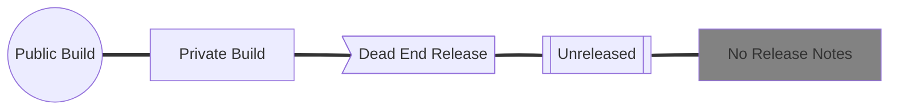

# IGEL OS 12 Branches

Shows the branches of IGEL OS 12.

- [Installing the Base System via IGEL OS Creator (OSC)](https://kb.igel.com/howtocosmos/en/installing-the-base-system-via-igel-os-creator-osc-77865870.html)

- [OS 12 App Portal](https://kb.igel.com/howtocosmos/en/igel-app-portal-77865794.html)

-----

## [IGEL News: Builds](IGEL-News-Builds.md)

Lists what changes are in the build.

-----

## Legend

-----

## IGEL OS 12

```mermaid
flowchart LR
    12.3.0-- 2024-02-06 -->12.3.1((12.3.1))
    12.2.2-- 2023-12-19 -->12.3.0((12.3.0))
    12.2.1-- 2023-11-20 -->12.2.2((12.2.2))
    12.2.0-- 2023-10-31 -->12.2.1((12.2.1))
    12.01.140-- 2023-09-12 -->12.2.0((12.2.0))
    12.01.120-- 2023-07-20 -->12.01.140((12.01.140))
    12.01.110((12.01.110))-- 2023-06-12 -->12.01.120((12.01.120))
    click 12.3.1 "https://github.com/IGEL-Community/IGEL-Docs-v02/tree/main/docs/Docs/ReleaseNotes/04-OS12/readme12.3.1.txt" _blank
    click 12.3.0 "https://github.com/IGEL-Community/IGEL-Docs-v02/tree/main/docs/Docs/ReleaseNotes/04-OS12/readme12.3.0.txt" _blank
    click 12.2.2 "https://github.com/IGEL-Community/IGEL-Docs-v02/tree/main/docs/Docs/ReleaseNotes/04-OS12/readme12.2.2.txt" _blank
    click 12.2.1 "https://github.com/IGEL-Community/IGEL-Docs-v02/tree/main/docs/Docs/ReleaseNotes/04-OS12/readme12.2.1.txt" _blank
    click 12.2.0 "https://github.com/IGEL-Community/IGEL-Docs-v02/tree/main/docs/Docs/ReleaseNotes/04-OS12/readme12.2.0.txt" _blank
    click 12.01.140 "https://github.com/IGEL-Community/IGEL-Docs-v02/tree/main/docs/Docs/ReleaseNotes/04-OS12/readme12.01.140.1.txt" _blank
    click 12.01.120 "https://github.com/IGEL-Community/IGEL-Docs-v02/tree/main/docs/Docs/ReleaseNotes/04-OS12/readme12.01.120.1.txt" _blank
    click 12.01.110 "https://github.com/IGEL-Community/IGEL-Docs-v02/tree/main/docs/Docs/ReleaseNotes/04-OS12/readme12.01.110.1.txt" _blank
```

-----

## IGEL OS 12 App Portal

The latest release notes for IGEL OS 12 Apps can be found on the [IGEL App Portal](https://app.igel.com).